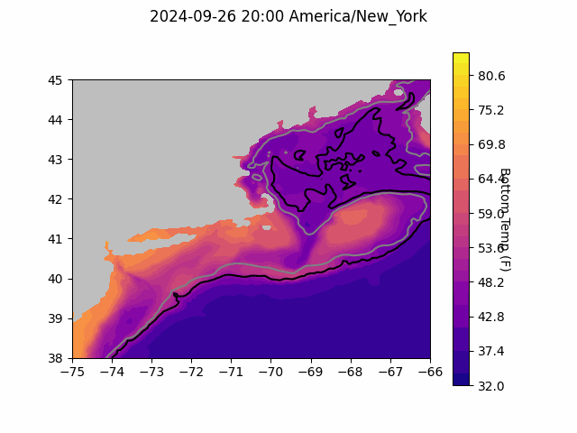
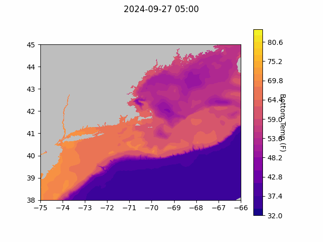
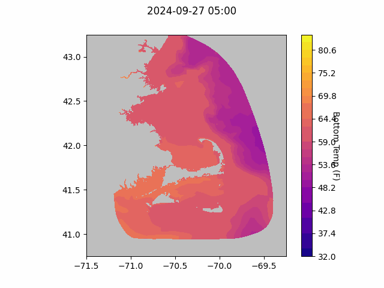

```{r setup, include=FALSE}
knitr::opts_chunk$set(echo = TRUE)
library(marmap)
library(rstudioapi)
if(Sys.info()["sysname"]=="Windows"){
  source("C:/Users/george.maynard/Documents/GitHubRepos/emolt_project_management/WeeklyUpdates/forecast_check/R/emolt_download.R")
} else {
  source("/home/george/Documents/emolt_project_management/WeeklyUpdates/forecast_check/R/emolt_download.R")
}

data=emolt_download(days=7)
start_date=Sys.Date()-lubridate::days(7)
## Use the dates from above to create a URL for grabbing the data
full_data=read.csv(
    paste0(
      "https://erddap.emolt.net/erddap/tabledap/eMOLT_RT.csvp?tow_id%2Csegment_type%2Ctime%2Clatitude%2Clongitude%2Cdepth%2Ctemperature%2Csensor_type&segment_type=%22Fishing%22&time%3E=",
      lubridate::year(start_date),
      "-",
      lubridate::month(start_date),
      "-",
      lubridate::day(start_date),
      "T00%3A00%3A00Z&time%3C=",
      lubridate::year(Sys.Date()),
      "-",
      lubridate::month(Sys.Date()),
      "-",
      lubridate::day(Sys.Date()),
      "T12%3A02%3A43Z"
    )
  )
sensor_time=0
for(tow in unique(full_data$tow_id)){
  x=subset(full_data,full_data$tow_id==tow)
  sensor_time=sensor_time+difftime(max(x$time..UTC.),units='hours',min(x$time..UTC.))
}
```

<center> 

<font size="5"> *eMOLT Update `r Sys.Date()` * </font>

</center>

## Weekly Recap 

This week, the eMOLT fleet recorded `r length(unique(full_data$tow_id))` tows of sensorized fishing gear totaling `r as.numeric(sensor_time)` sensor hours underwater. The warmest recorded bottom temperature was `r round(max(full_data$temperature..degree_C.)*9/5+32,1)` in Nantucket Sound in approximately `r round(full_data[which(full_data$temperature..degree_C.==max(full_data$temperature..degree_C.)),"depth..m."]*0.546807,0)` fathoms (red profile) and the coldest recorded bottom temperature was `r round(min(full_data$temperature..degree_C.)*9/5+32,1)` on southeastern Georges Bank in approximately `r round(full_data[which(full_data$temperature..degree_C.==min(full_data$temperature..degree_C.)),"depth..m."]*0.546807,0)[1]` fathoms (blue profile). Below, you can see these profiles plus a few other temperature profiles of interest across the region from the last week. 


> *Figure 1 -- Temperature profiles collected by eMOLT participants over the last week. The blue profile is where the coldest bottom temperature was measured and the red profile is where the warmest bottom temperature was measured. All other colors are assigned randomly. Colored points on the map indicate where profiles of the same color were collected.*


Last week's connectivity issues aboard the F/V Lightning Bay and F/V Cody seems to be related to a problem with the SIM cards. Replacing those cards fixed the problem, so we'll be adding inactive SIMs to our tool bags to hedge against future issues. Thanks again to the captains aboard both vessels for their patience. We'll try to get back down to Point Judith next week to take care of reinstallation.

## Register Now for the Northeast Cooperative Research Summit

We have officially booked [The Westin Portland Harborview](https://maps.app.goo.gl/TRsvzYP6AogdDMXW9) for the 2025 Northeast Cooperative Research Summit, which will be held on January 28th, 2025! Please mark your calendars. The web pages are live and information about registering and presenting at the summit is available [here](https://www.fisheries.noaa.gov/event/2025-northeast-cooperative-research-summit). Please reach out to [Thomas Swiader](https://www.fisheries.noaa.gov/contact/thomas-swiader) with any questions. Registration closes on November 8, 2024. Around 19 of the commercial fishing stipends have been spoken for, so sign up soon!

### System Hardware Upgrade List

The following vessels remain on our list for hardware upgrades. If you aren't on the list and think you should be, please reach out. *Note that this list is different from our new install queue.*

>
 - F/V Brooke C *
 - F/V Excalibur
 - F/V Kaitlyn Victoria
 - F/V Kyler C
 - F/V Linda Marie
 - F/V Nathaniel Lee *
 - F/V Noella C
 - F/V Sao Paulo
 - F/V Sea Watcher I
 - F/V Virginia Marise

### [Dissolved Oxygen in Cape Cod Bay](https://experience.arcgis.com/experience/0d553dfc6c60487cb1f4d20b5366ee0b/page/Map-Page/)
#### Courtesy of the Massachusetts Division of Marine Fisheries and the Massachusetts Lobstermen's Association


> *Figure 2 -- Dissolved oxygen observations from Cape Cod Bay collected by participants in the eMOLT program and the Cape Cod Bay Study Fleet program operated by Massachusetts Division of Marine Fisheries and the Massachusetts Lobstermen's Association. Green dots indicate dissolved oxygen values in the normal range (> 6 mg/L), yellow dots indicate low dissolved oxygen values (4-6 mg/L), orange dots indicate very low dissolved oxygen values (2-4 mg/L), and red dots indicate critically low values (< 2 mg/L).*

### Bottom Temperature Forecasts

#### Doppio 


> *Figure 3 -- Performance of the Doppio forecast's bottom temperature layer over the last week relative to observations collected by eMOLT participants. Red dots indicate areas where bottom temperature observations were warmer that predicted. Blue dots indicate areas where bottom temperature observations were cooler than predicted. Bottom temperature observations are compared with the most recent forecast run available before the observation was made.* 



> *Figure 4 -- The most recent Doppio bottom temperature forecast. The gray line is the 50 fathom line and the black line is the hundred fathom line. Purple shades indicate cooler water.*

#### Northeast Coastal Ocean Forecast System



> *Figure 5 -- The most recent bottom temperature forecast from the Northeast Coastal Ocean Forecast System GOM7 model. Purple shades indicate cooler water.*



> *Figure 6 -- The most recent bottom temperature forecast from the Northeast Coastal Ocean Forecast System MassBay model. Purple shades indicate cooler water.*

## Cooperative Research Opportunity -- FREE Airmar Weather Stations

Our partners at Ocean Data Network, based out of Portland, Maine are looking for fishing vessels operating in the Gulf of Maine that are interested in receiving a **FREE Airmar weather station** installation this fall. The weather data stream will integrate with the wheelhouse electronics to give captains real time weather data on their navigation software while recording and sending the data to the National Weather Service to improve offshore weather forecasting for everyone operating in the region!
In order to qualify, a vessel must have a NMEA 2000 vessel electronics system and relatively modern navigation software, such as Time Zero, if they want to be able to visualize the data in the wheelhouse. The system will provide air temperature, barometric pressure, wind speed, and wind direction in real time. This is a pilot project looking for ten vessels to participate. Vessels need to fish close to year-round. If you’re fishing hard, have these electronics on board, and want to help improve offshore forecasting accuracy, please reach out to: 

Jack Carroll
jack@oceandata.net

## Jordan Basin Buoy (M01) Out of Commission

This is likely old news now for many of you, but the Jordan Basin Buoy (M01) was damaged by a ship strike in late August. Although no in-situ data will be available at that site until the buoy is rebuilt, forecast products are available for the area through the [NERACOOS Mariners Dashboard](https://neracoos.us6.list-manage.com/track/click?u=8dcea9cdf5&id=93730fc67e&e=d78516aed4).

## LOCNESS Fishing Community Event

The WHOI team behind the LOCNESS Project invites interested stakeholders to join them for an informational discussion session about LOCNESS at the [Magnolia Library and Community Center (1 Lexington Ave. Gloucester, MA 01930)](https://maps.app.goo.gl/qFt5G6xRoLcvta146) on October 10, 2024 from 3-6 PM. 

>*When meeting with RI fishing community members in August, the WHOI team heard requests for more baseline data, more studies on larval species relevant to the region, and increased engagement with the fishing community. In response to this valuable input, they are proposing to conduct a set of laboratory experiments on copepods and larval fish species, and they adjusted our siting plan to avoid overlap with areas of high fish larval abundance. They welcome your input on the selection of species to study, and on our proposed site location in the Gulf of Maine, through this [survey](https://forms.gle/v9vxP2vhvEqH2QfX6)*.  

## Fishing Partnership Releases New Training Schedule

Fishing Partnership Support Services released their latest schedule of training sessions, beginning October 10 and 11th in New Bedford. For more information and to register for trainings on Safety at Sea, CPR and First Aid, Vessel Stability, and more, please check out their [calendar](https://fishingpartnership.org/calendar/).


All the best,

-George and JiM
