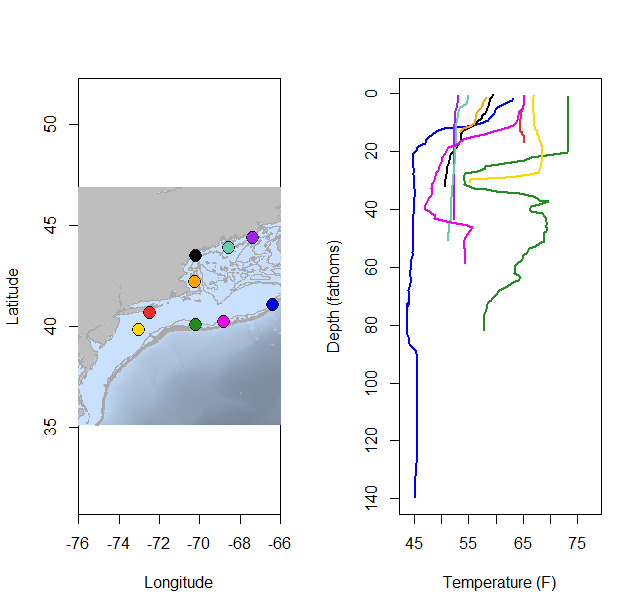
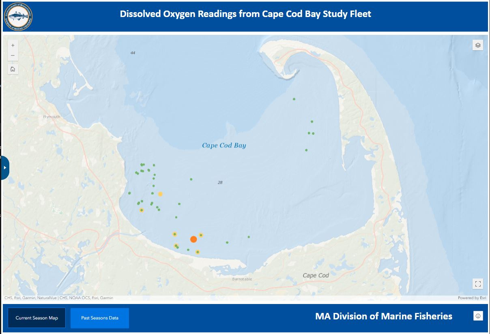
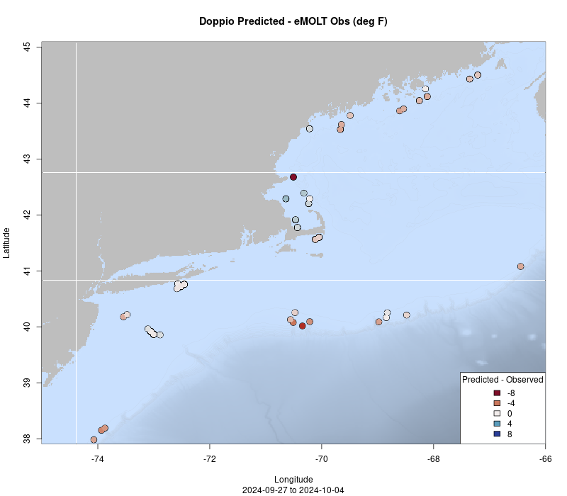
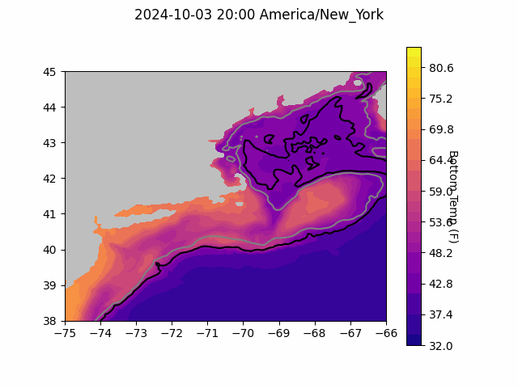
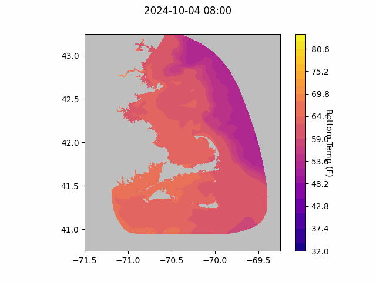
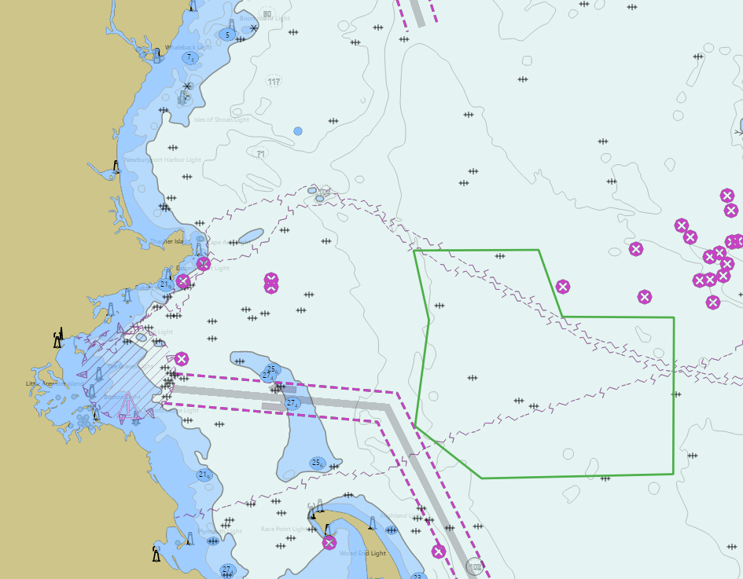

```{r setup, include=FALSE}
knitr::opts_chunk$set(echo = TRUE)
library(marmap)
library(rstudioapi)
if(Sys.info()["sysname"]=="Windows"){
  source("C:/Users/george.maynard/Documents/GitHubRepos/emolt_project_management/WeeklyUpdates/forecast_check/R/emolt_download.R")
} else {
  source("/home/george/Documents/emolt_project_management/WeeklyUpdates/forecast_check/R/emolt_download.R")
}

data=emolt_download(days=7)
start_date=Sys.Date()-lubridate::days(7)
## Use the dates from above to create a URL for grabbing the data
full_data=read.csv(
    paste0(
      "https://erddap.emolt.net/erddap/tabledap/eMOLT_RT.csvp?tow_id%2Csegment_type%2Ctime%2Clatitude%2Clongitude%2Cdepth%2Ctemperature%2Csensor_type&segment_type=%22Fishing%22&time%3E=",
      lubridate::year(start_date),
      "-",
      lubridate::month(start_date),
      "-",
      lubridate::day(start_date),
      "T00%3A00%3A00Z&time%3C=",
      lubridate::year(Sys.Date()),
      "-",
      lubridate::month(Sys.Date()),
      "-",
      lubridate::day(Sys.Date()),
      "T12%3A02%3A43Z"
    )
  )
sensor_time=0
for(tow in unique(full_data$tow_id)){
  x=subset(full_data,full_data$tow_id==tow)
  sensor_time=sensor_time+difftime(max(x$time..UTC.),units='hours',min(x$time..UTC.))
}
```

<center> 

<font size="5"> *eMOLT Update `r Sys.Date()` * </font>

</center>

## Weekly Recap 

Seasonal mixing is well underway in the Mid-Atlantic, with the upper mixed layer now reaching 10-15 fathoms further down into the water column (yellow profile). Along the coast of Downeast Maine, the water column is already well mixed, with temps in the low 50s throughout the water column (purple and teal profiles). A warm core ring is visible on the surface near Atlantis Canyon (green profile and SST map). 

This week, the eMOLT fleet recorded `r length(unique(full_data$tow_id))` tows of sensorized fishing gear totaling `r as.numeric(sensor_time)` sensor hours underwater. The warmest recorded bottom temperature was `r round(max(full_data$temperature..degree_C.)*9/5+32,1)` F south of Long Island in approximately `r round(full_data[which(full_data$temperature..degree_C.==max(full_data$temperature..degree_C.)),"depth..m."]*0.546807,0)` fathoms (red profile) and the coldest recorded bottom temperature was `r round(min(full_data$temperature..degree_C.)*9/5+32,1)` F on the eastern edge of Georges Bank in approximately `r round(full_data[which(full_data$temperature..degree_C.==min(full_data$temperature..degree_C.)),"depth..m."]*0.546807,0)[1]` fathoms (blue profile). Below, you can see these profiles plus a few other temperature profiles of interest across the region from the last week. 



> *Figure 1 -- Temperature profiles collected by eMOLT participants over the last week. The blue profile is where the coldest bottom temperature was measured and the red profile is where the warmest bottom temperature was measured. All other colors are assigned randomly. Colored points on the map indicate where profiles of the same color were collected.*


> *Figure 2 -- Sea surface temperatures from [NASA's Group for High Resolution Sea Surface Temperature](https://podaac.jpl.nasa.gov/dataset/MUR-JPL-L4-GLOB-v4.1) on October 2, 2024. The approximate location of a profile collected by an eMOLT partner vessel showing the vertical structure of the ring is represented with a red pin.*


Congratulations to our collaborators at Massachusetts Maritime Academy for their first successful deployment and retrieval of a dissolved oxygen logger in Buzzards Bay. Cadets in an environmental monitoring class at the Academy are using an eMOLT system as part of their monitoring at an eelgrass restoration site southeast of the Hog Island Channel. They're also providing us with a more realistic test system to push software updates out to before we run updates on all of your vessels. 

This week, Nick and George spent some time down in Point Judith to reinstall systems on the F/V Lightning Bay and F/V Cody. Thanks to Dave and Capt. Jay for their help discussing antenna and sensor placement on those vessels. We've also been chasing down some issues in our data pipeline with individual vessels. These problems seem to have mostly been caused by misplaced special characters in vessel names. Finally, we've been working with other scientists within NOAA to make the eMOLT data more useful in the broader oceanographic enterprise. Thanks to Dr. Jiangtao Xu at the National Ocean Service for her feedback on our data products. Thanks also to the team at Ocean Data Network for their persistence in building a pipeline from eMOLT and other Fishing Vessel Ocean Observing Network programs into the [World Meteorological Organization's Global Telecommunications System (GTS)](https://community.wmo.int/en/activity-areas/global-telecommunication-system-gts). The GTS disseminates data in near-real-time to operational weather and ocean forecasting centers around the world and enables global distribution of real-time data.  

## Register Now for the Northeast Cooperative Research Summit

We have officially booked [The Westin Portland Harborview](https://maps.app.goo.gl/TRsvzYP6AogdDMXW9) for the 2025 Northeast Cooperative Research Summit, which will be held on January 28th, 2025! Please mark your calendars. The web pages are live and information about registering and presenting at the summit is available [here](https://www.fisheries.noaa.gov/event/2025-northeast-cooperative-research-summit). Please reach out to [Thomas Swiader](https://www.fisheries.noaa.gov/contact/thomas-swiader) with any questions. Registration closes on November 8, 2024. *THERE ARE ONLY TWO STIPENDS LEFT FOR COMMERCIAL FISHERMEN, SO REGISTER NOW IF YOU WANT ONE!* This year, in addition to the Summit itself, we're working with partners offer tours of some facilities down on the waterfront in Portland the day before. Currently, the plan is to visit the Portland Fish Exchange, Ready Seafood, and the Gulf of Maine Research Institute. We'll have more information about how to register for the tours in the coming weeks. 

### System Hardware Upgrade List

The following vessels remain on our list for hardware upgrades. If you aren't on the list and think you should be, please reach out. *Note that this list is different from our new install queue.*

>
 - F/V Brooke C *
 - F/V Excalibur
 - F/V Kaitlyn Victoria
 - F/V Kyler C
 - F/V Linda Marie
 - F/V Nathaniel Lee *
 - F/V Noella C
 - F/V Sao Paulo
 - F/V Sea Watcher I
 - F/V Virginia Marise

### [Dissolved Oxygen in Cape Cod Bay](https://experience.arcgis.com/experience/0d553dfc6c60487cb1f4d20b5366ee0b/page/Map-Page/)
#### Courtesy of the Massachusetts Division of Marine Fisheries and the Massachusetts Lobstermen's Association

Some sensors around Scorton Creek continue to show low levels of Dissolved Oxygen with one sensor reading Very Low late last week.  In eastern Cape Cod Bay, DO levels are back to normal. 



> *Figure 3 -- Dissolved oxygen observations from Cape Cod Bay collected by participants in the eMOLT program and the Cape Cod Bay Study Fleet program operated by Massachusetts Division of Marine Fisheries and the Massachusetts Lobstermen's Association. Green dots indicate dissolved oxygen values in the normal range (> 6 mg/L), yellow dots indicate low dissolved oxygen values (4-6 mg/L), orange dots indicate very low dissolved oxygen values (2-4 mg/L), and red dots indicate critically low values (< 2 mg/L).*

### Bottom Temperature Forecasts

#### Doppio 

This week, ~80% of bottom temperature observations were within 2 degrees (F) of the Doppio forecasted value at those points. The forecast performed best in the Mid-Atlantic. Bottom temperature observations in coastal Maine and along the edge of the continental shelf were warmer than the forecast, and observations in Cape Cod Bay and on Stellwagen were slightly cooler than the forecast.



> *Figure 4 -- Performance of the Doppio forecast's bottom temperature layer over the last week relative to observations collected by eMOLT participants. Red dots indicate areas where bottom temperature observations were warmer that predicted. Blue dots indicate areas where bottom temperature observations were cooler than predicted. Bottom temperature observations are compared with the most recent forecast run available before the observation was made.* 



> *Figure 5 -- The most recent Doppio bottom temperature forecast. The gray line is the 50 fathom line and the black line is the hundred fathom line. Purple shades indicate cooler water.*

#### Northeast Coastal Ocean Forecast System


> *Figure 6 -- The most recent bottom temperature forecast from the Northeast Coastal Ocean Forecast System GOM7 model. Purple shades indicate cooler water.*



> *Figure 7 -- The most recent bottom temperature forecast from the Northeast Coastal Ocean Forecast System MassBay model. Purple shades indicate cooler water.*

## Cooperative Research Opportunity -- FREE Airmar Weather Stations

Our partners at Ocean Data Network, based out of Portland, Maine are looking for fishing vessels operating in the Gulf of Maine that are interested in receiving a **FREE Airmar weather station** installation this fall. The weather data stream will integrate with the wheelhouse electronics to give captains real time weather data on their navigation software while recording and sending the data to the National Weather Service to improve offshore weather forecasting for everyone operating in the region!
In order to qualify, a vessel must have a NMEA 2000 vessel electronics system and relatively modern navigation software, such as Time Zero, if they want to be able to visualize the data in the wheelhouse. The system will provide air temperature, barometric pressure, wind speed, and wind direction in real time. This is a pilot project looking for ten vessels to participate. Vessels need to fish close to year-round. If you’re fishing hard, have these electronics on board, and want to help improve offshore forecasting accuracy, please reach out to: 

Jack Carroll
jack@oceandata.net

## LOCNESS Fishing Community Events

The WHOI team behind the LOCNESS Project invites interested stakeholders to ask questions and voice concerns about LOCNESS at the  the [Magnolia Library and Community Center (1 Lexington Ave. Gloucester, MA 01930)](https://maps.app.goo.gl/qFt5G6xRoLcvta146) on October 10, 2024 from 3-6 PM. 

>*When meeting with RI fishing community members in August, the WHOI team heard requests for more baseline data, more studies on larval species relevant to the region, and increased engagement with the fishing community. In response to this valuable input, they are proposing to conduct a set of laboratory experiments on copepods and larval fish species, and they adjusted our siting plan to avoid overlap with areas of high fish larval abundance. They welcome your input on the selection of species to study, and on our proposed site location in the Gulf of Maine, through this [survey](https://forms.gle/v9vxP2vhvEqH2QfX6)*.  

## NOAA and UNH Launch Seafloor Mapping Project Northeast of Cape Cod

In October 2024, a team of government, academic, and industry partners will undertake an effort to expand the capabilities of uncrewed systems to support NOAA missions to map, characterize, and explore the submerged waters of the United States. This month-long seafloor mapping mission will test the use of two NOAA-owned DriX uncrewed surface vehicles (USVs) operated from a shorebased operations center. For project updates, check out [this website](https://oceanexplorer.noaa.gov/explorations/24drix/welcome.html). A map of the planned operation area can be found below. 



> *Figure 8 -- The planned DriX operations area east of Boston.*


All the best,

-George and JiM
