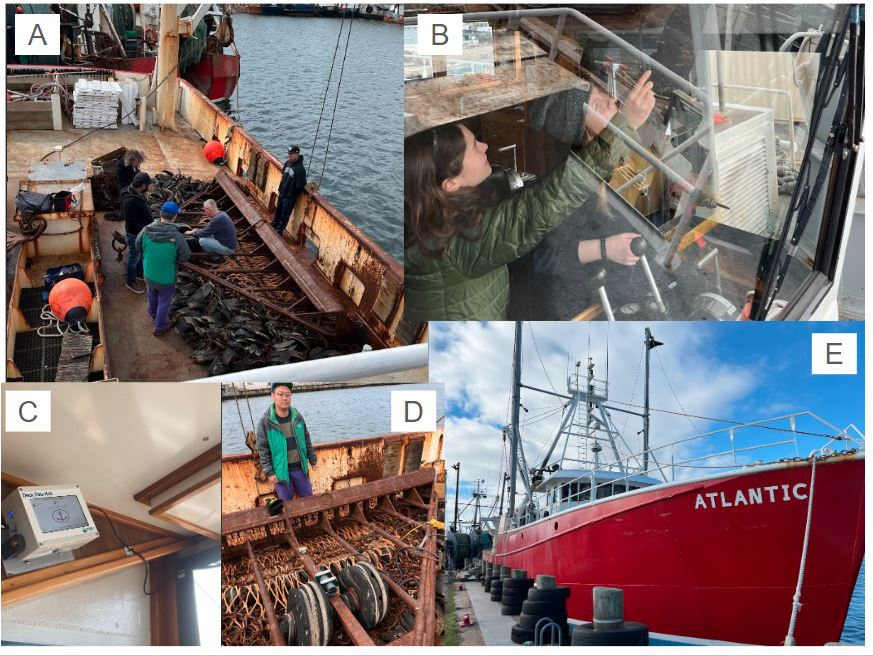
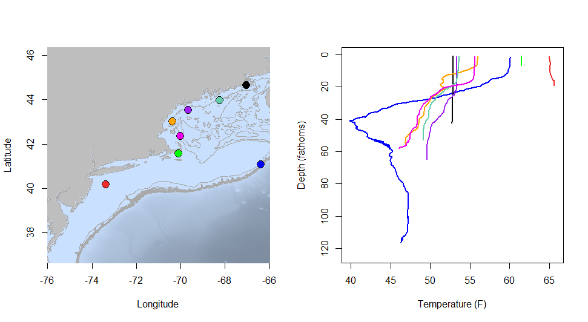
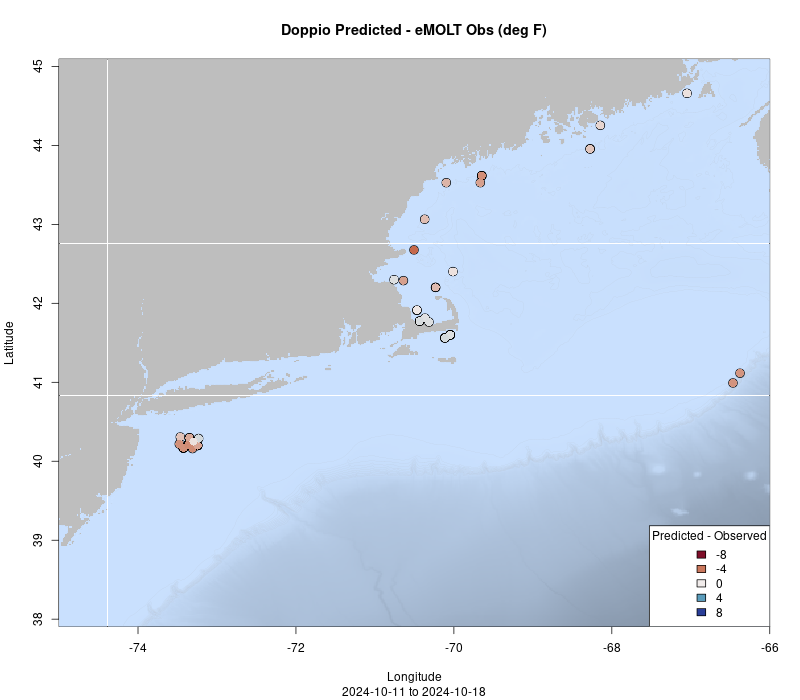
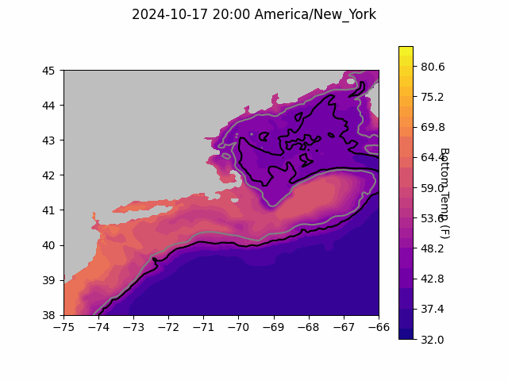
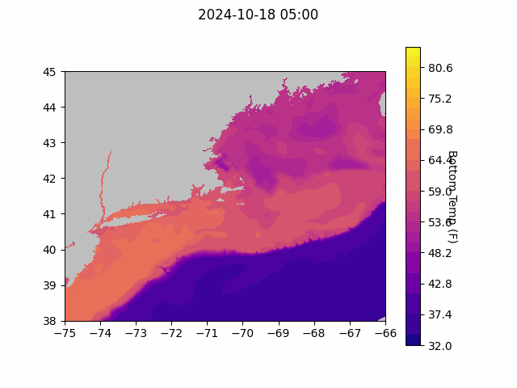
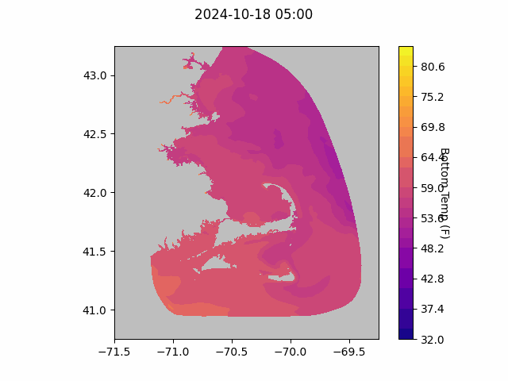

```{r setup, include=FALSE}
knitr::opts_chunk$set(echo = TRUE)
library(marmap)
library(rstudioapi)
if(Sys.info()["sysname"]=="Windows"){
  source("C:/Users/george.maynard/Documents/GitHubRepos/emolt_project_management/WeeklyUpdates/forecast_check/R/emolt_download.R")
} else {
  source("/home/george/Documents/emolt_project_management/WeeklyUpdates/forecast_check/R/emolt_download.R")
}

data=emolt_download(days=7)
start_date=Sys.Date()-lubridate::days(7)
## Use the dates from above to create a URL for grabbing the data
full_data=read.csv(
    paste0(
      "https://erddap.emolt.net/erddap/tabledap/eMOLT_RT.csvp?tow_id%2Csegment_type%2Ctime%2Clatitude%2Clongitude%2Cdepth%2Ctemperature%2Csensor_type&segment_type=%22Fishing%22&time%3E=",
      lubridate::year(start_date),
      "-",
      lubridate::month(start_date),
      "-",
      lubridate::day(start_date),
      "T00%3A00%3A00Z&time%3C=",
      lubridate::year(Sys.Date()),
      "-",
      lubridate::month(Sys.Date()),
      "-",
      lubridate::day(Sys.Date()),
      "T12%3A02%3A43Z"
    )
  )
sensor_time=0
for(tow in unique(full_data$tow_id)){
  x=subset(full_data,full_data$tow_id==tow)
  sensor_time=sensor_time+difftime(max(x$time..UTC.),units='hours',min(x$time..UTC.))
}
```

<center> 

<font size="5"> *eMOLT Update `r Sys.Date()` * </font>

</center>

## Weekly Recap 

Despite the shortened week, it's been a productive one for the eMOLT team. First off, a big thanks to Huanxin for dropping everything to run up to the F/V Gladys Elaine in New Hampshire on Wednesday. The deckbox wasn't connecting to the Gulf of Maine Lobster Foundation's remote support system and the vessel was scheduled to leave for a trip on Wednesday around noon, so Huanxin drove up and got everything running again. Thanks to Erin and Captain Pete for coordinating all of that. 

Thanks also to everyone up in Maine for your communication and patience as we work through upgrading the last few deckboxes that still have the old software and iron out kinks with the new Lowell TD loggers. Captain Curt on the F/V Lil' More Tail, Captain Sherm on the F/V Freedom, Captain Joe Sr. on the F/V Joseph and Peter, Captain Joey Jr. on the F/V Jasmine Marie, and Dr. Goode from the University of Maine have all been in touch this week to make sure their systems are up and running. We really appreciate your efforts!

Finally, thanks to Captain Peter, his crew, and the team from Coonamessett Farm Foundation for your work yesterday rigging up an eMOLT system aboard the F/V Atlantic. The deckbox install was less complicated than we feared, but we definitely all learned some valuable lessons figuring out how to install the sensor and housing. Captain Peter's welding gave us a few mounting options we wouldn't have had otherwise. This is the CFF team's first install, and we look forward to partnering with them on many more!



> *Figure 1 -- Installation of an eMOLT system aboard the F/V Atlantic. A) Farrell, Samir, and Huanxin consult with the captain and crew about sensor placement. B) Cassie and Tori installing the deckbox and bluetooth extension antenna in the wheelhouse. C) The finished deckbox install. D) Huanxin with the newly installed sensor. E) The F/V Atlantic tied up in New Bedford.* 

This week, the eMOLT fleet recorded `r length(unique(full_data$tow_id))` tows of sensorized fishing gear totaling `r as.numeric(sensor_time)` sensor hours underwater. The warmest recorded bottom temperature was `r round(max(full_data$temperature..degree_C.)*9/5+32,1)` F south of Fire Island in approximately `r round(full_data[which(full_data$temperature..degree_C.==max(full_data$temperature..degree_C.)),"depth..m."]*0.546807,0)` fathoms (red profile) and the coldest recorded bottom temperature was `r round(min(full_data$temperature..degree_C.)*9/5+32,1)` F out by the Hague Line on southeast Georges in approximately `r round(full_data[which(full_data$temperature..degree_C.==min(full_data$temperature..degree_C.)),"depth..m."]*0.546807,0)[1]` fathoms (blue profile). Below, you can see these profiles plus a few other temperature profiles of interest across the region from the last week. 

Seasonal stratification is still evident on Stellwagen Bank (pink) and off the New Hampshire Seacoast (yellow), but is breaking down along the Maine coast (purple and aqua).  



> *Figure 2 -- Temperature profiles collected by eMOLT participants over the last week. The blue profile is where the coldest bottom temperature was measured and the red profile is where the warmest bottom temperature was measured. All other colors are assigned randomly. Colored points on the map indicate where profiles of the same color were collected.*


## Northeast Cooperative Research Summit Registration Waitlist Open

We are at capacity for the 2025 Northeast Cooperative Research Summit. Any new registrants will be added to the waitlist for this event. 

We have officially booked [The Westin Portland Harborview](https://maps.app.goo.gl/TRsvzYP6AogdDMXW9) for the 2025 Northeast Cooperative Research Summit, which will be held on January 28th, 2025! Please mark your calendars. The web pages are live and information about registering and presenting at the summit is available [here](https://www.fisheries.noaa.gov/event/2025-northeast-cooperative-research-summit). Please reach out to [Thomas Swiader](https://www.fisheries.noaa.gov/contact/thomas-swiader) with any questions. Registration closes on November 8, 2024. This year, in addition to the Summit itself, we're working with partners offer tours of some facilities down on the waterfront in Portland the day before. Currently, the plan is to visit the Portland Fish Exchange, Ready Seafood, and the Gulf of Maine Research Institute. We'll have more information about how to register for the tours in the coming weeks. 

### System Hardware Upgrade List

The following vessels remain on our list for hardware upgrades. If you aren't on the list and think you should be, please reach out. *Note that this list is different from our new install queue.*

>
 - F/V Brooke C *
 - F/V Excalibur
 - F/V Kaitlyn Victoria
 - F/V Kyler C
 - F/V Linda Marie
 - F/V Nathaniel Lee *
 - F/V Noella C
 - F/V Sao Paulo
 - F/V Sea Watcher I
 - F/V Virginia Marise

### [Dissolved Oxygen in Cape Cod Bay](https://experience.arcgis.com/experience/0d553dfc6c60487cb1f4d20b5366ee0b/page/Map-Page/)
#### Courtesy of the Massachusetts Division of Marine Fisheries and the Massachusetts Lobstermen's Association

The "very low" oxygen conditions shown here in orange are mostly from earlier this week. More recent readings from the later half of the week are "low" (yellow) or "normal" (green). 


> *Figure 3 -- Dissolved oxygen observations from Cape Cod Bay collected by participants in the eMOLT program and the Cape Cod Bay Study Fleet program operated by Massachusetts Division of Marine Fisheries and the Massachusetts Lobstermen's Association over tthe past week. Green dots indicate dissolved oxygen values in the normal range (> 6 mg/L), yellow dots indicate low dissolved oxygen values (4-6 mg/L), orange dots indicate very low dissolved oxygen values (2-4 mg/L), and red dots indicate critically low values (< 2 mg/L).*

### Bottom Temperature Forecasts

#### Doppio 

This week, ~49% of bottom temperature observations were within 2 degrees (F) of the Doppio forecasted value at those points. The bottom temperature forecast performed best around Cape Cod. Observed temperatures were warmer than expected east of New Jersey, along the Maine Coast, and on southeastern Georges Bank. 



> *Figure 4 -- Performance of the Doppio forecast's bottom temperature layer over the last week relative to observations collected by eMOLT participants. Red dots indicate areas where bottom temperature observations were warmer that predicted. Blue dots indicate areas where bottom temperature observations were cooler than predicted. Bottom temperature observations are compared with the most recent forecast run available before the observation was made.* 



> *Figure 5 -- The most recent Doppio bottom temperature forecast. The gray line is the 50 fathom line and the black line is the hundred fathom line. Purple shades indicate cooler water.*

#### Northeast Coastal Ocean Forecast System



> *Figure 6 -- The most recent bottom temperature forecast from the Northeast Coastal Ocean Forecast System GOM7 model. Purple shades indicate cooler water.*



> *Figure 7 -- The most recent bottom temperature forecast from the Northeast Coastal Ocean Forecast System MassBay model. Purple shades indicate cooler water.*

## Bycatch Reduction Engineering Program Pre-Proposals Due Dec. 13

The [Bycatch Reduction Engineering Program](https://www.fisheries.noaa.gov/national/bycatch/bycatch-reduction-engineering-program) provides funding to support applied management projects and activities to reduce bycatch. Bycatch reduction is a top priority for NOAA Fisheries, as outlined in our [National Bycatch Reduction Strategy](https://www.fisheries.noaa.gov/national/bycatch/national-bycatch-reduction-strategy).

For more information about program priorities and how to apply, please visit the [BREP Funding Website](https://www.fisheries.noaa.gov/grant/bycatch-reduction-engineering-program-funding).

## Cooperative Research Opportunity -- FREE Airmar Weather Stations

Our partners at Ocean Data Network, based out of Portland, Maine are looking for fishing vessels operating in the Gulf of Maine that are interested in receiving a **FREE Airmar weather station** installation this fall. The weather data stream will integrate with the wheelhouse electronics to give captains real time weather data on their navigation software while recording and sending the data to the National Weather Service to improve offshore weather forecasting for everyone operating in the region!
In order to qualify, a vessel must have a NMEA 2000 vessel electronics system and relatively modern navigation software, such as Time Zero, if they want to be able to visualize the data in the wheelhouse. The system will provide air temperature, barometric pressure, wind speed, and wind direction in real time. This is a pilot project looking for ten vessels to participate. Vessels need to fish close to year-round. If you’re fishing hard, have these electronics on board, and want to help improve offshore forecasting accuracy, please reach out to: 

Jack Carroll
jack@oceandata.net


All the best,

-George and JiM
