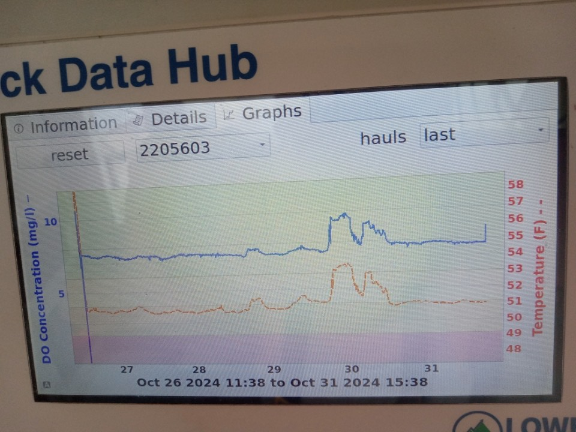
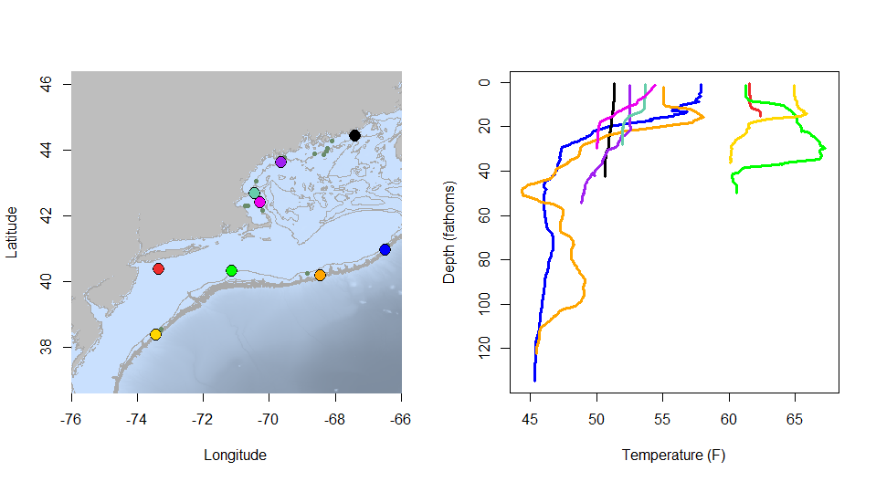
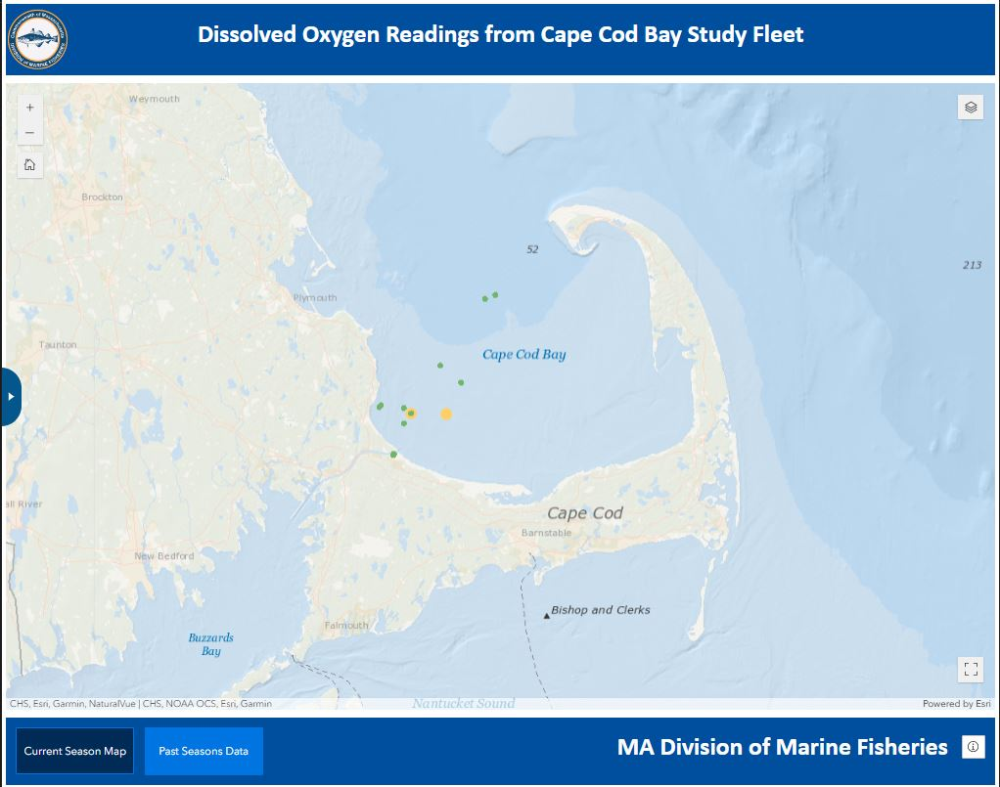
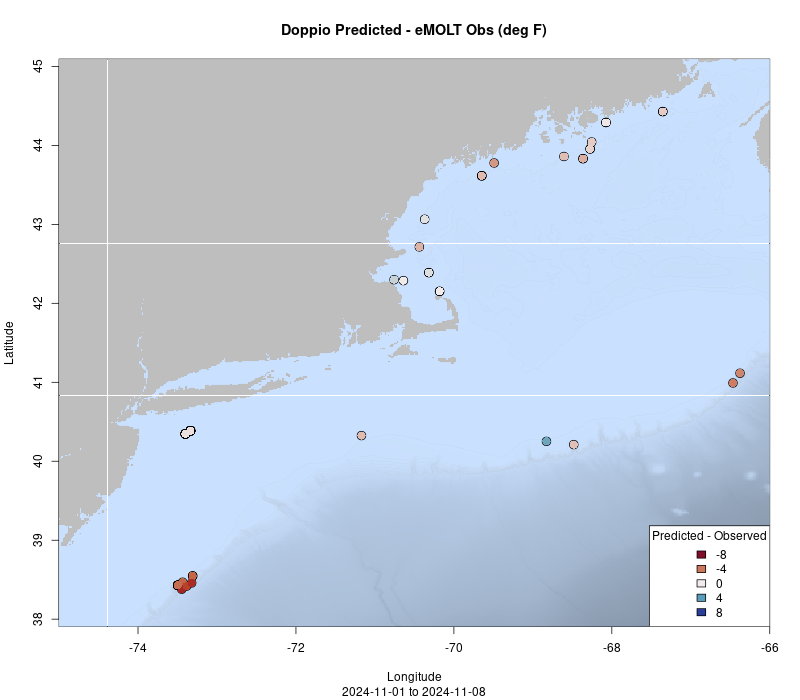
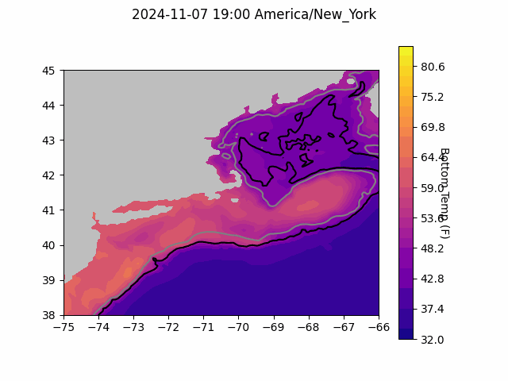
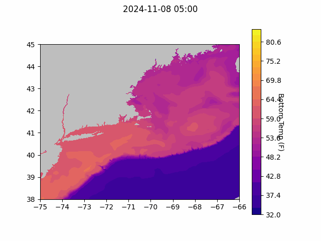

```{r setup, include=FALSE}
knitr::opts_chunk$set(echo = TRUE)
library(marmap)
library(rstudioapi)
if(Sys.info()["sysname"]=="Windows"){
  source("C:/Users/george.maynard/Documents/GitHubRepos/emolt_project_management/WeeklyUpdates/forecast_check/R/emolt_download.R")
} else {
  source("/home/george/Documents/emolt_project_management/WeeklyUpdates/forecast_check/R/emolt_download.R")
}

data=emolt_download(days=7)
start_date=Sys.Date()-lubridate::days(7)
## Use the dates from above to create a URL for grabbing the data
full_data=read.csv(
    paste0(
      "https://erddap.emolt.net/erddap/tabledap/eMOLT_RT.csvp?tow_id%2Csegment_type%2Ctime%2Clatitude%2Clongitude%2Cdepth%2Ctemperature%2Csensor_type&segment_type=%22Fishing%22&time%3E=",
      lubridate::year(start_date),
      "-",
      lubridate::month(start_date),
      "-",
      lubridate::day(start_date),
      "T00%3A00%3A00Z&time%3C=",
      lubridate::year(Sys.Date()),
      "-",
      lubridate::month(Sys.Date()),
      "-",
      lubridate::day(Sys.Date()),
      "T23%3A59%3A59Z"
    )
  )
sensor_time=0
for(tow in unique(full_data$tow_id)){
  x=subset(full_data,full_data$tow_id==tow)
  sensor_time=sensor_time+difftime(max(x$time..UTC.),units='hours',min(x$time..UTC.))
}
```

<center> 

<font size="5"> *eMOLT Update `r Sys.Date()` * </font>

</center>

## Weekly Recap 
News of our major expansion that's ramping up made the [Cape Cod Times](https://www.capecodtimes.com/story/news/2024/11/08/commercial-fishermen-scientists-ma-emolt-massachusetts-technology-collaborative-grant/75941410007/), [CapeCod.com](https://www.capecod.com/newscenter/state-provides-millions-for-cape-coastal-resilience/), and the [Cape Cod Chronicle](https://capecodchronicle.com/articles/1860/view/grant-will-help-fishermen-gather-ocean-data). The team at Lowell Instruments has been cranking away on prepping and shipping gear for a slew of installs later this month. We've got a lot of time on the docks coming up in the near future, and are looking forward to seeing many of you in the coming weeks. 

Of all the fisheries we work with, the offshore lobster fishery continues to present some of the more challenging conditions for our systems. The combination of long soak times, relatively quick processing of gear on deck, deep sets, long trips, and all of the steel panels on these vessels present challenges for the loggers, wireless communications, tech support and data processing. Thanks to the captains and crews of the F/V Virginia Marie and F/V Gladys Elaine as we work to iron out issues with your systems. Huanxin is aboard the F/V Virginia Marie as I write this, rigging up a new bluetooth extension antenna. With patience and perseverance, we'll get things working.

Thanks also to Captain Joe on the F/V Ryan Joseph for reaching out about an interesting observation from one of his dissolved oxygen and temperature sensors deployed north of the Boston Harbor inbound lane on Stellwagen Bank. Last week, he noticed an increase in temperature and dissolved oxygen. Coincidentally, another fishing vessel participating in the Outer Cape Coastal Current Research Fleet (a collaboration between WHOI, Commercial Fisheries Research Foundation, and the Cape Cod Commercial Fishermen's Alliance) collected a temperature and salinity profile a few miles southeast around that time, showing surface temperature similar to the observations from Joe's gear. Also around the same time, National Data Buoy Center Buoy 44013 (Boston Approach Lighted Buoy) recorded a shift in wind speed and direction to where the wind was blowing ~25 knots out of the Southeast. Looking at these observations, it seems the spikes in Joe's data resulted from wind driven mixing, pushing warmer surface water down to the bottom. Thanks to Linus from CFRF and Glen from WHOI for helping put the pieces together!



> *Figure 1 -- Picture of the Lowell DDH screen aboard the F/V Ryan Joseph showing a noticeable increase in temperature (red) and dissolved oxygen (blue) late on October 29th.*

As mentioned last week, a remnant Gulf Stream ring is affecting shelf edge conditions.  As depicted by one of the green worms in the animation below, it took one of the drifters (prepared by CSCR & Scituate High School students) for a wild ride. You can also see one of Cassie’s miniboats (red worm) enter the scene on Halloween morning and eMOLT bottom temps (white #s) pop up here and there.


> *Figure 2 -- FVCOM modeled surface temps and currents plotted with drifter (green) and miniboat (red) tracks*

This week, the eMOLT fleet recorded `r length(unique(full_data$tow_id))` tows of sensorized fishing gear totaling `r as.numeric(sensor_time)` sensor hours underwater. The warmest recorded bottom temperature was `r round(max(full_data$temperature..degree_C.)*9/5+32,1)` F south of Fire Island in approximately `r round(full_data[which(full_data$temperature..degree_C.==max(full_data$temperature..degree_C.)),"depth..m."]*0.546807,0)` fathoms (red profile) and the coldest recorded bottom temperature was `r round(min(full_data$temperature..degree_C.)*9/5+32,1)` F northeast of Nygren Canyon in approximately `r round(full_data[which(full_data$temperature..degree_C.==min(full_data$temperature..degree_C.)),"depth..m."]*0.546807,0)[1]` fathoms (blue profile). Below, you can see these profiles plus a few other temperature profiles of interest across the region from the last week. 

Cold water (likely from the Scotian Shelf) is visible in the orange profile. This area is also in the middle of a large phytoplankton bloom visible in [satellite imagery here](https://raw.githubusercontent.com/NEFSC/NEFSC-illex_indicator_viewer/refs/heads/main/IDL_OUTPUTS/V2023/PNGS/CHLOR_A/STACKED_ANOMS/W_202445-WEEK_00_1997_2023-GLOBCOLOUR-R2019-NES-NWA_SUBSET-PXY_1_302970-CHLOR_A-GSM-ANOM.PNG). The disintegrating warm core ring we've seen over the last few weeks is still visible below the surface in the green profile.



> *Figure 3 -- Temperature profiles collected by eMOLT participants over the last week. The blue profile is where the coldest bottom temperature was measured and the red profile is where the warmest bottom temperature was measured. All other colors are assigned randomly. Colored points on the map indicate where profiles of the same color were collected. The small dark green dots represent other profiles collected this week, but not highlighted in the plot. Note that the warmest / coldest bottom temperatures measured could have occurred during gear soaks, which are not represented on this profile plot.*

## Northeast Cooperative Research Summit Registration Waitlist Open

We are at capacity for the 2025 Northeast Cooperative Research Summit. Any new registrants will be added to the waitlist for this event. 

We have officially booked [The Westin Portland Harborview](https://maps.app.goo.gl/TRsvzYP6AogdDMXW9) for the 2025 Northeast Cooperative Research Summit, which will be held on January 28th, 2025! Please mark your calendars. The web pages are live and information about registering and presenting at the summit is available [here](https://www.fisheries.noaa.gov/event/2025-northeast-cooperative-research-summit). Please reach out to [Thomas Swiader](https://www.fisheries.noaa.gov/contact/thomas-swiader) with any questions. Registration closes on November 8, 2024. This year, in addition to the Summit itself, we're working with partners offer tours of some facilities down on the waterfront in Portland the day before. Currently, the plan is to visit the Portland Fish Exchange, Ready Seafood, and the Gulf of Maine Research Institute. We'll have more information about how to register for the tours in the coming weeks. 

### System Hardware Upgrade List

The following vessels remain on our list for hardware upgrades. If you aren't on the list and think you should be, please reach out. *Note that this list is different from our new install queue.*

>
 - F/V Brooke C *
 - F/V Excalibur
 - F/V Kaitlyn Victoria
 - F/V Kyler C
 - F/V Linda Marie
 - F/V Nathaniel Lee *
 - F/V Noella C
 - F/V Sao Paulo
 - F/V Sea Watcher I
 - F/V Virginia Marise

### [Dissolved Oxygen in Cape Cod Bay](https://experience.arcgis.com/experience/0d553dfc6c60487cb1f4d20b5366ee0b/page/Map-Page/)

#### Courtesy of the Massachusetts Division of Marine Fisheries and the Massachusetts Lobstermen's Association

Most oxygen concentrations throughout the bay have been in the "Normal" range this week although there were some "Low" readings earlier this week. 



> *Figure 4 -- Dissolved oxygen observations from Cape Cod Bay collected by participants in the eMOLT program and the Cape Cod Bay Study Fleet program operated by Massachusetts Division of Marine Fisheries and the Massachusetts Lobstermen's Association over the past week. Green dots indicate dissolved oxygen values in the normal range (> 6 mg/L), yellow dots indicate low dissolved oxygen values (4-6 mg/L), orange dots indicate very low dissolved oxygen values (2-4 mg/L), and red dots indicate critically low values (< 2 mg/L).*

### Bottom Temperature Forecasts

#### Doppio 

This week, only 56% of bottom temperature observations were within 2 degrees (F) of the Doppio forecasted value at those points. Across the board, observed bottom temperatures were warmer than expected, but especially down in the Mid-Atlantic east-southeast of Cape May.



> *Figure 5 -- Performance of the Doppio forecast's bottom temperature layer over the last week relative to observations collected by eMOLT participants. Red dots indicate areas where bottom temperature observations were warmer that predicted. Blue dots indicate areas where bottom temperature observations were cooler than predicted. Bottom temperature observations are compared with the most recent forecast run available before the observation was made.* 



> *Figure 6 -- The most recent Doppio bottom temperature forecast. The gray line is the 50 fathom line and the black line is the hundred fathom line. Purple shades indicate cooler water.*

#### Northeast Coastal Ocean Forecast System



> *Figure 7 -- The most recent bottom temperature forecast from the Northeast Coastal Ocean Forecast System GOM7 model. Purple shades indicate cooler water.*


> *Figure 8 -- The most recent bottom temperature forecast from the Northeast Coastal Ocean Forecast System MassBay model. Purple shades indicate cooler water.*

## Announcements

### NOAA Accepting Applications for 2025 Atlantic Shark Research Fishery

NOAA Fisheries is accepting applications from commercial fishermen with Atlantic shark Directed or Incidental permits for participation in the 2025 shark research fishery. Applicants must submit a completed application and required vessel information by December 9, 2024 for consideration. For more information or to apply, please visit the Highly Migratory Species permitting website [here](https://www.fisheries.noaa.gov/atlantic-highly-migratory-species/atlantic-highly-migratory-species-exempted-fishing-permits?utm_medium=email&utm_source=govdelivery#shark-research-fishery). 

### Bycatch Reduction Engineering Program Pre-Proposals Due Dec. 13

The [Bycatch Reduction Engineering Program](https://www.fisheries.noaa.gov/national/bycatch/bycatch-reduction-engineering-program) provides funding to support applied management projects and activities to reduce bycatch. Bycatch reduction is a top priority for NOAA Fisheries, as outlined in our [National Bycatch Reduction Strategy](https://www.fisheries.noaa.gov/national/bycatch/national-bycatch-reduction-strategy).

For more information about program priorities and how to apply, please visit the [BREP Funding Website](https://www.fisheries.noaa.gov/grant/bycatch-reduction-engineering-program-funding).


All the best,

-George and JiM
