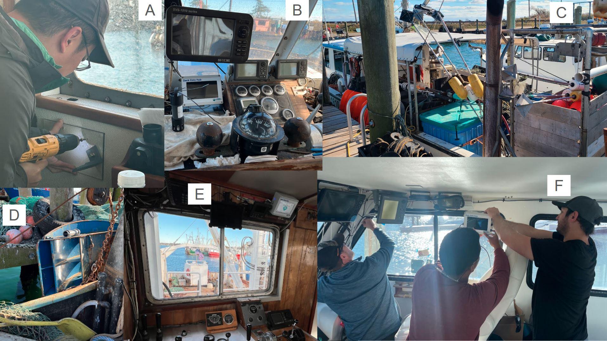
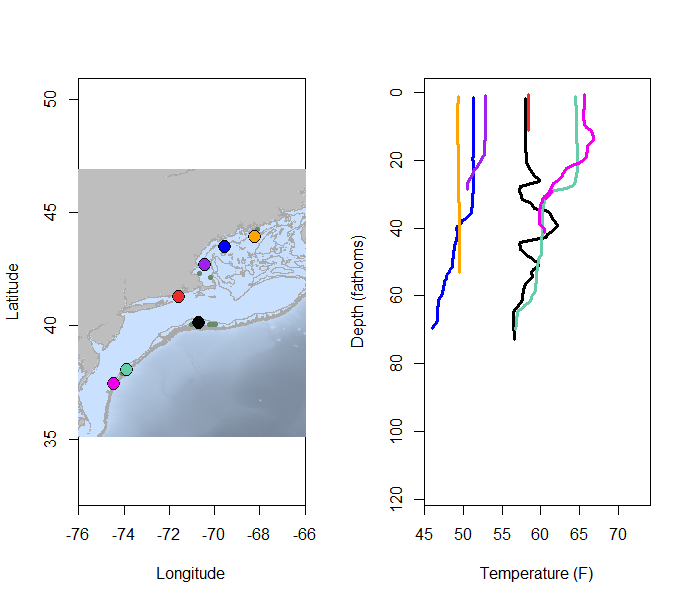
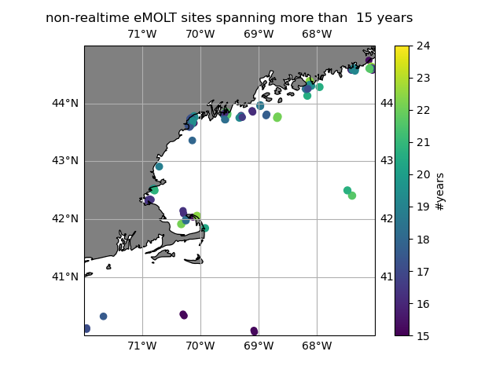
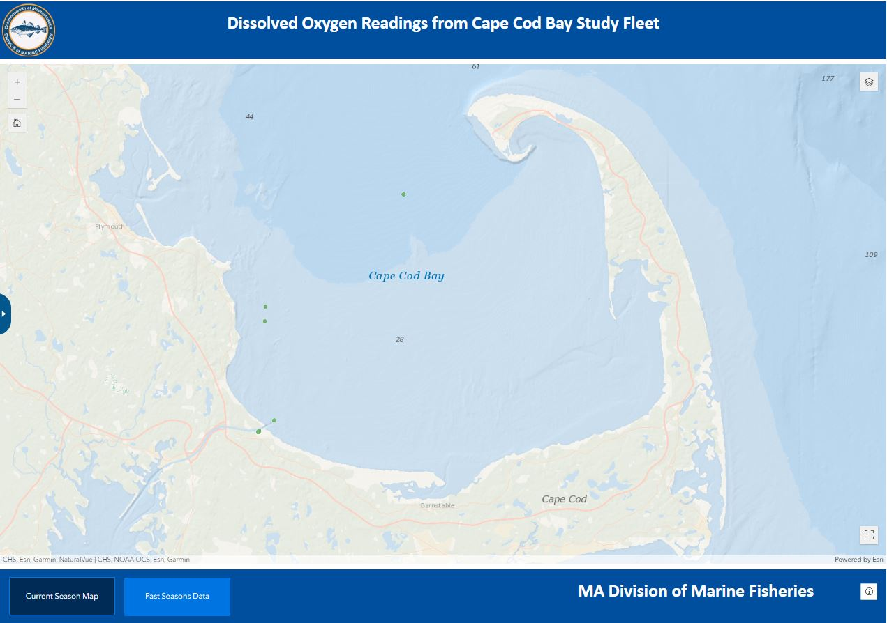
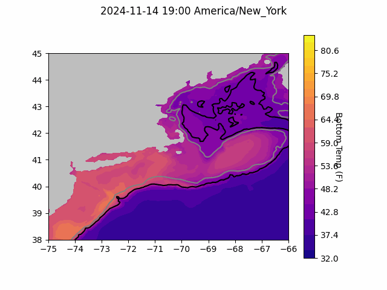

```{r setup, include=FALSE}
knitr::opts_chunk$set(echo = TRUE)
library(marmap)
library(rstudioapi)
if(Sys.info()["sysname"]=="Windows"){
  source("C:/Users/george.maynard/Documents/GitHubRepos/emolt_project_management/WeeklyUpdates/forecast_check/R/emolt_download.R")
} else {
  source("/home/george/Documents/emolt_project_management/WeeklyUpdates/forecast_check/R/emolt_download.R")
}

data=emolt_download(days=7)
start_date=Sys.Date()-lubridate::days(7)
## Use the dates from above to create a URL for grabbing the data
full_data=read.csv(
    paste0(
      "https://erddap.emolt.net/erddap/tabledap/eMOLT_RT.csvp?tow_id%2Csegment_type%2Ctime%2Clatitude%2Clongitude%2Cdepth%2Ctemperature%2Csensor_type&segment_type=%22Fishing%22&time%3E=",
      lubridate::year(start_date),
      "-",
      lubridate::month(start_date),
      "-",
      lubridate::day(start_date),
      "T00%3A00%3A00Z&time%3C=",
      lubridate::year(Sys.Date()),
      "-",
      lubridate::month(Sys.Date()),
      "-",
      lubridate::day(Sys.Date()),
      "T23%3A59%3A59Z"
    )
  )
sensor_time=0
for(tow in unique(full_data$tow_id)){
  x=subset(full_data,full_data$tow_id==tow)
  sensor_time=sensor_time+difftime(max(x$time..UTC.),units='hours',min(x$time..UTC.))
}
```

<center> 

<font size="5"> *eMOLT Update `r Sys.Date()` * </font>

</center>

## Weekly Recap 

This week, we kicked off our expansion installs in earnest, with eMOLT teams installing new systems on vessels in Cape May (NJ), Point Judith (RI), Fairhaven (MA), and Portsmouth (NH). Thanks to the field teams from Rutgers University, Commercial Fisheries Research Foundation, Coonamessett Farm Foundation, and the Gulf of Maine Lobster Foundation and the captains and crews from the F/Vs Salted, Edward and Joseph, Linda Marie, Brooke C, Saga, and Gladys Elaine.



> *Figure 1 -- A) Huanxin installs a mounting plate aboard the F/V Gladys Elaine, B) Completed installation and a new sensor with zip ties for tying into a lobster trap aboard the F/V Brooke C, C) F/V Edward and Joseph, D) new sensor mounted to the starboard door of the F/V Linda Marie, E) new DDH installed on the F/V Saga, F) Capt. Brady, Andre, and Joey work on running wires and mounting the deckbox aboard the F/V Salted.*

This week, the eMOLT fleet recorded `r length(unique(full_data$tow_id))` tows of sensorized fishing gear totaling `r as.numeric(sensor_time)` sensor hours underwater. The warmest recorded bottom temperature was `r round(max(full_data$temperature..degree_C.)*9/5+32,1)[1]` F southeast of Weekapaug, RI in approximately `r round(full_data[which(full_data$temperature..degree_C.==max(full_data$temperature..degree_C.)),"depth..m."]*0.546807,0)[1]` fathoms (red profile) and the coldest recorded bottom temperature was `r round(min(full_data$temperature..degree_C.)*9/5+32,1)[1]` F north of the Eastern Approach lane to Portland, ME in in approximately `r round(full_data[which(full_data$temperature..degree_C.==min(full_data$temperature..degree_C.)),"depth..m."]*0.546807,0)[1]` fathoms (blue profile). Below, you can see these profiles plus a few other temperature profiles of interest across the region from the last week. 

The disintegrating warm core ring we've seen over the last few weeks is still visible below the surface in the black profile, with warmer water from what's left of the ring interleaved with cooler shelf water. 



> *Figure 2 -- Temperature profiles collected by eMOLT participants over the last week. The blue profile is where the coldest bottom temperature was measured and the red profile is where the warmest bottom temperature was measured. All other colors are assigned randomly. Colored points on the map indicate where profiles of the same color were collected. The small dark green dots represent other profiles collected this week, but not highlighted in the plot. Note that the warmest / coldest bottom temperatures measured could have occurred during gear soaks, which are not represented on this profile plot.*


## Commercial Fisheries Research Foundation and F/V J-Mar monitoring low Dissolved Oxygen off New Jersey

*Contribution from Linus Stoltz (CFRF Data Manager)*

Since late September Capt. Frank on the F/V J-Mar, out of Pt. Pleasant NJ, has been [monitoring DO in 65 feet of water just a few miles from shore](https://erddap.ondeckdata.com/erddap/tabledap/seafloor_oceanography.graph?time%2Cdissolved_oxygen%2Ctemperature&longitude%3E=-75.45&longitude%3C=-73&latitude%3E=39.5&latitude%3C=41&.draw=markers&.marker=5%7C4&.color=0x000000&.colorBar=%7CC%7CLinear%7C%7C%7C&.bgColor=0xffccccff) with a Lowell Instruments DOT sensor and DDH. Low DO water, characteristic of warmer summer months, has persisted now through November. The DO has been declining steadily since mid October which is unusual for the time of year and as of November 12th even dipped into hypoxia (DO < 2mg/L). A CTD cast made by Capt. Frank shortly after hauling the trap with DO logger showed [a well-mixed water column](https://erddap.ondeckdata.com/erddap/tabledap/shelf_fleet_profiles_1m_binned.graph?absolute_salinity%2Csea_pressure%2Ctemperature&time%3E=2024-11-10T00%3A00%3A00Z&time%3C=2024-11-14T00%3A00%3A00Z&.draw=markers&.marker=5%7C5&.color=0xFFFFFF&.colorBar=%7C%7C%7C%7C%7C&.yRange=%7C%7Cfalse%7C&.bgColor=0xffccccff) which is atypical for observing hypoxia. The J-Mar will haul this trap again sometime next week which should provide more insight into this phenomenon. Thanks Capt. Frank!

## Non-realtime eMOLT

As we start winding down the non-realtime Vemco program at the end of this season and moving towards newer technology, we'll be presenting some summary statistics from the original eMOLT sites. This week's plot is a simple station plot with all the sites that span at least 15 years.



> *Figure 3 -- a plot of non-realtime eMOLT sites with more than 15 years of observations. Warmer colors indicate additional years of observations.*

### System Hardware Upgrade List

The following vessels remain on our list for hardware upgrades. If you aren't on the list and think you should be, please reach out. *Note that this list is different from our new install queue.*

>
 - F/V Excalibur
 - F/V Kaitlyn Victoria
 - F/V Kyler C
 - F/V Nathaniel Lee *
 - F/V Noella C
 - F/V Sao Paulo
 - F/V Sea Watcher I
 - F/V Virginia Marise

### [Dissolved Oxygen in Cape Cod Bay](https://experience.arcgis.com/experience/0d553dfc6c60487cb1f4d20b5366ee0b/page/Map-Page/)

#### Courtesy of the Massachusetts Division of Marine Fisheries and the Massachusetts Lobstermen's Association

Only a few oxygen readings were taken this week in Cape Cod Bay, and all were in the "Normal" range. As fishing pressure and the threat of hypoxia wind down for the season, this is likely the last DO update we will publish until next year. You can still access the Mass DMF portal at the link above. 



> *Figure 4 -- Dissolved oxygen observations from Cape Cod Bay collected by participants in the eMOLT program and the Cape Cod Bay Study Fleet program operated by Massachusetts Division of Marine Fisheries and the Massachusetts Lobstermen's Association over the past week. Green dots indicate dissolved oxygen values in the normal range (> 6 mg/L), yellow dots indicate low dissolved oxygen values (4-6 mg/L), orange dots indicate very low dissolved oxygen values (2-4 mg/L), and red dots indicate critically low values (< 2 mg/L).*

### Bottom Temperature Forecasts

#### Doppio 

This week, 62.5% of bottom temperature observations were within 2 degrees (F) of the Doppio forecasted value at those points. Across the board, observed bottom temperatures were warmer than expected, but especially along the shelf break from the Mid-Atlantic up to Southern New England.


> *Figure 5 -- Performance of the Doppio forecast's bottom temperature layer over the last week relative to observations collected by eMOLT participants. Red dots indicate areas where bottom temperature observations were warmer that predicted. Blue dots indicate areas where bottom temperature observations were cooler than predicted. Bottom temperature observations are compared with the most recent forecast run available before the observation was made.* 



> *Figure 6 -- The most recent Doppio bottom temperature forecast. The gray line is the 50 fathom line and the black line is the hundred fathom line. Purple shades indicate cooler water.*

#### Northeast Coastal Ocean Forecast System


> *Figure 7 -- The most recent bottom temperature forecast from the Northeast Coastal Ocean Forecast System GOM7 model. Purple shades indicate cooler water.*


> *Figure 8 -- The most recent bottom temperature forecast from the Northeast Coastal Ocean Forecast System MassBay model. Purple shades indicate cooler water.*

## Announcements

### NOAA Accepting Applications for 2025 Atlantic Shark Research Fishery

NOAA Fisheries is accepting applications from commercial fishermen with Atlantic shark Directed or Incidental permits for participation in the 2025 shark research fishery. Applicants must submit a completed application and required vessel information by December 9, 2024 for consideration. For more information or to apply, please visit the Highly Migratory Species permitting website [here](https://www.fisheries.noaa.gov/atlantic-highly-migratory-species/atlantic-highly-migratory-species-exempted-fishing-permits?utm_medium=email&utm_source=govdelivery#shark-research-fishery). 

### Bycatch Reduction Engineering Program Pre-Proposals Due Dec. 13

The [Bycatch Reduction Engineering Program](https://www.fisheries.noaa.gov/national/bycatch/bycatch-reduction-engineering-program) provides funding to support applied management projects and activities to reduce bycatch. Bycatch reduction is a top priority for NOAA Fisheries, as outlined in our [National Bycatch Reduction Strategy](https://www.fisheries.noaa.gov/national/bycatch/national-bycatch-reduction-strategy).

For more information about program priorities and how to apply, please visit the [BREP Funding Website](https://www.fisheries.noaa.gov/grant/bycatch-reduction-engineering-program-funding).


All the best,

-George and JiM
