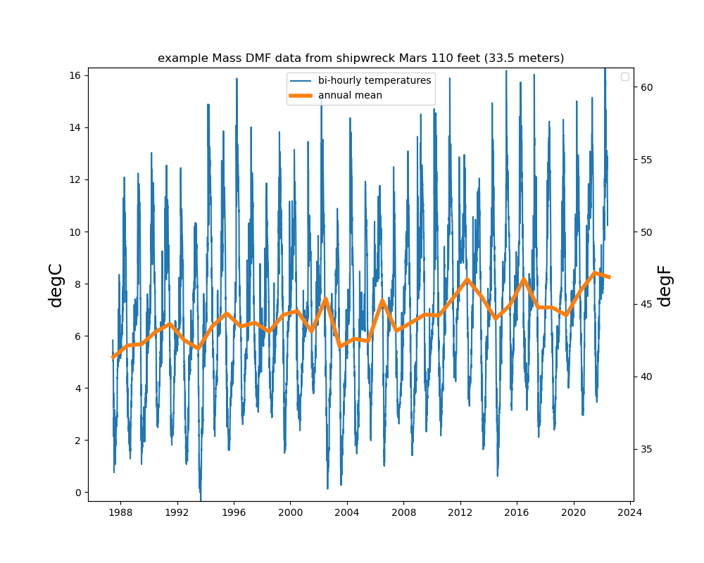

```{r setup, include=FALSE}
knitr::opts_chunk$set(echo = TRUE)
library(blastula)
library(marmap)
library(rstudioapi)
source("../../emolt_serverside/API/API_header.R")
today=Sys.Date()
lastWeek=today-days(7)
conn=dbConnector(db_config)
```

<center> 

<font size="5"> *eMOLT Update `r Sys.Date()` * </font>

</center>

### Weekly Recap 

### JiM's Notes
Massachusetts Division of Marine Fisheries have been deploying temperature probes with annual dives on several Buzzard and Mass Bay shipwreck sites for nearly 40 years.  Every few years over the past few decades, we have been working with the various data stewards at Mass DMF (beginning with Bruce Estrella, Bob Glenn, Derek Perry, Tracy Pugh, and, most recently, Jake Dorothy) to load their Excel spreadsheets into the web-accessible master database. They also now post the series [here](https://gis.data.mass.gov/maps/c9a6405efba44915810fa4e894102d35/about). The longest running bottom temperature time series off the New England coast (almost twice as long as the eMOLT series) provides a look at "climate" scale variability at these locations. In the example below, we see the ~20 degF seasonal cycle as well as the gradual rise in the annual average (orange line) recorded at the site of the tugboat Mars that went down off Manomet in 1942 in 120 feet of water.


One of the longest year-round eMOLT time series is from the deep Gulf of Maine collected by several Little Bay Lobster captains. Pete Begley mailed in their probes this past week documenting 2024 being relatively cool. As seen in the figure below, 2024 recorded temperatures like those 20 years ago.  Is this the end of the drastic warming trend? Will it bounce back up to be warm again in 2025? We shall see.
![Deep Gulf Temps][(JS02_annual.png)

### Realtime Summary (Vessels with Rockblock Satellite Transmitters)

This week, we received `r nrow(dbGetQuery(conn=conn,statement=paste0("SELECT * FROM VESSEL_STATUS WHERE TIMESTAMP >'", lastWeek, "' AND REPORT_TYPE = 'SUMMARY_DATA' AND VESSEL_ID != 23")))` haul-averaged reports from `r nrow(dbGetQuery(conn=conn, statement=paste0("SELECT DISTINCT VESSEL_ID FROM VESSEL_STATUS WHERE TIMESTAMP >'", lastWeek,"' AND REPORT_TYPE = 'SUMMARY_DATA' AND VESSEL_ID != 23")))` vessels. 

```{r statusPlot, dev='png',echo=FALSE, fig.width=8,fig.height=6,fig.show='hide',include=FALSE}
dbDisconnectAll()
conn=dbConnector(db_config)
lastweek=Sys.Date()-days(7)
data=dbGetQuery(
  conn=conn,
  statement=paste0(
    "SELECT * FROM VESSEL_STATUS WHERE TIMESTAMP > '",
    lastweek,
    "' AND VESSEL_ID != 23"
  )
)
data=select(data,REPORT_TYPE,LATITUDE,LONGITUDE,TIMESTAMP)
bath=getNOAA.bathy(
  lon1=min(data$LONGITUDE-0.5),
  lon2=max(data$LONGITUDE+0.5),
  lat1=min(data$LATITUDE-0.5),
  lat2=max(data$LATITUDE+0.5),
  resolution=1
)
## Create color ramp
blues=c(
  "lightsteelblue4", 
  "lightsteelblue3",
  "lightsteelblue2", 
  "lightsteelblue1"
)
## Plotting the bathymetry with different colors for land and sea
plot(
  bath,
  step=100,
  deepest.isobath=-1000,
  shallowest.isobath=0,
  col="darkgray",
  image = TRUE, 
  land = TRUE, 
  lwd = 0.1,
  bpal = list(
    c(0, max(bath), "gray"),
    c(min(bath),0,blues)
  ),
  main=paste0("ALL eMOLT VESSELS with Satellite Transmitters \nREPORTS FROM: ",lastweek," to ",Sys.Date())
)


## Plot the status report locations
x=subset(data,data$REPORT_TYPE=="SHORT_STATUS")
points(
  x$LATITUDE~x$LONGITUDE,
  pch=1,
  col='red',
  cex=2
)
## Plot data uploads
x=subset(data,data$REPORT_TYPE=="SUMMARY_DATA")
points(
  x$LATITUDE~x$LONGITUDE,
  pch=1,
  col='blue',
  cex=2
)
legend(
  'topleft',
  col=c('blue','red'),
  legend=c('Summary Data Upload','Status Report'),
  pch=c(1,1),
  bty='n',
  bg=NULL,
  border='black'
)
```

`)

In the figure above, you can see the approximate locations where we received "Status Reports" (a ping from your system letting us know that it's still working) and "Data Uploads" (actual temperature / depth data collected by your probes). The "Status Reports" come in every 12 hours or so when a system is powered up. "Data Uploads" only come in when you haul the probes. If you were out fishing and don't see your approximate locations on here, please reach out because there may be a problem with your system.

### Bottom Temperature Forecasts

*We plan to add more animations to this section with other models in the future*

#### Northeast Coastal Ocean Forecast System (NECOFS)


Above, please find the bottom temperature forecasts at one hour intervals from 
the Northeast Coastal Ocean Forecast System run by the 
[Chen Lab](http://fvcom.smast.umassd.edu/) at the University of Massachusetts 
School for Marine Science and Technology in New Bedford. 

### Announcements and Other News


All the best,

-George and JiM
