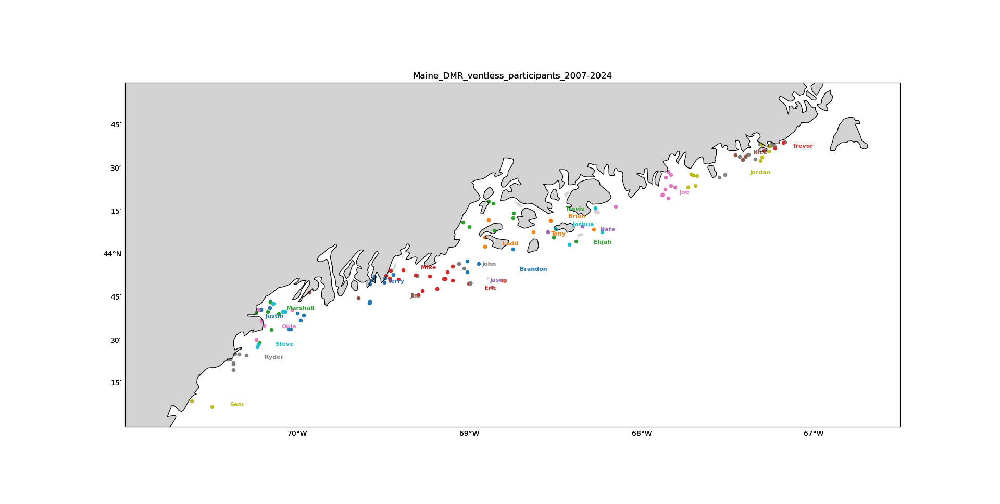
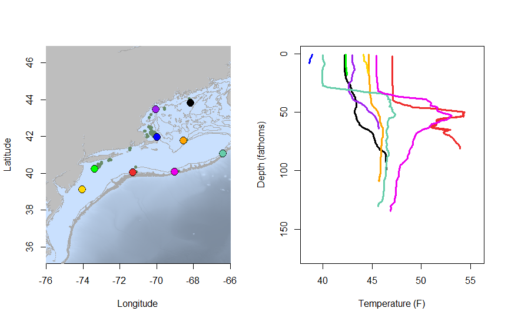
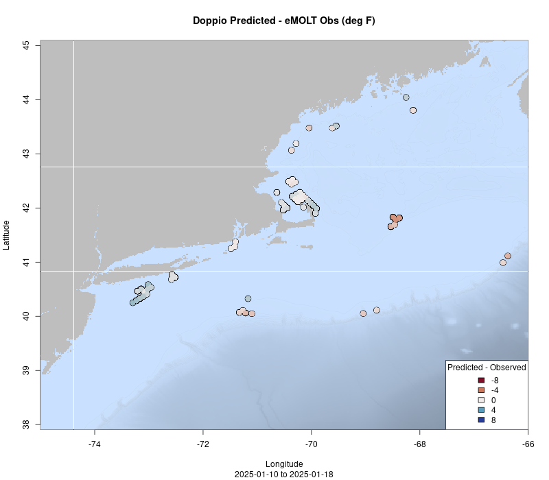
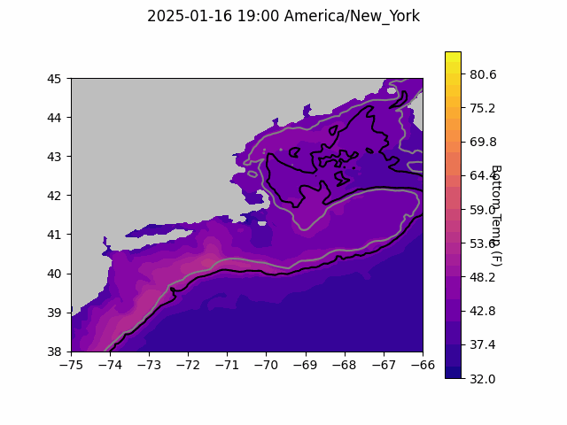

```{r setup, include=FALSE}
knitr::opts_chunk$set(echo = TRUE)
library(marmap)
library(rstudioapi)
if(Sys.info()["sysname"]=="Windows"){
  source("C:/Users/george.maynard/Documents/GitHubRepos/emolt_project_management/WeeklyUpdates/forecast_check/R/emolt_download.R")
} else {
  source("/home/george/Documents/emolt_project_management/WeeklyUpdates/forecast_check/R/emolt_download.R")
}

data=emolt_download(days=7)
start_date=Sys.Date()-lubridate::days(7)
## Use the dates from above to create a URL for grabbing the data
full_data=read.csv(
    paste0(
      "https://erddap.emolt.net/erddap/tabledap/eMOLT_RT.csvp?tow_id%2Csegment_type%2Ctime%2Clatitude%2Clongitude%2Cdepth%2Ctemperature%2Csensor_type&segment_type=%22Fishing%22&time%3E=",
      lubridate::year(start_date),
      "-",
      lubridate::month(start_date),
      "-",
      lubridate::day(start_date),
      "T00%3A00%3A00Z&time%3C=",
      lubridate::year(Sys.Date()),
      "-",
      lubridate::month(Sys.Date()),
      "-",
      lubridate::day(Sys.Date()),
      "T23%3A59%3A59Z"
    )
  )
sensor_time=0
for(tow in unique(full_data$tow_id)){
  x=subset(full_data,full_data$tow_id==tow)
  sensor_time=sensor_time+difftime(max(x$time..UTC.),units='hours',min(x$time..UTC.))
}
```

<center> 

<font size="5"> *eMOLT Update `r Sys.Date()` * </font>

</center>

## Weekly Recap 

We are up to 19 new vessels rigged up as part of the latest round of MassTech funding with several new systems on deck, just waiting to set up a time with the captains. Upcoming installs include 

- F/V Defiance (Cape May)
- F/V Eagle (New Bedford)
- F/V Emilia Rose (Point Judith)
- F/V Grace (Gloucester)
- F/V Mister G (Point Judith)
- F/V Nemesis (Cape Cod)
- F/V Resilient (Point Judith)
- F/V Stella (Cape Cod)
- F/V Susan L (Cape May)

Many of the install teams will be spending time away from the docks over the next few weeks at one or more of these upcoming meetings so we appreciate your patience with getting these installations scheduled.

- 1/21 Cape Cod Commercial Fishermen's Alliance Annual Membership Meeting (Chatham, MA)
- 1/28 Northeast Cooperative Research Summit (Portland, ME)
- 1/28-1/30 New England Fishery Management Council January Meeting (Portsmouth, NH)
- 1/29-1/30 US Canada Lobster Town Meeting (Bar Harbor, ME)
- 1/30-2/2 Massachusetts Lobstermen's Association Annual Trade Show (Hyannis, MA)

We have been collaborating with Maine DMR folks who install temperature probes on several ventless traps every summer. As seen in the map below, a few dozen Maine lobstermen have been involved with this project since it started in 2007. JiM continues to compile the time series data every few years, generates plots, and archives the information. We much appreciate this contribution to the regional database.



> *Figure 1. Map of Maine DMR ventless trap locations where each participating fishermen typically installs a temperature probe in two locations shallow (1-11m) and deep (22-32m).*


This week, the eMOLT fleet recorded `r length(unique(full_data$tow_id))` tows of sensorized fishing gear totaling `r as.numeric(sensor_time)` sensor hours underwater. The warmest recorded bottom temperature was `r round(max(full_data$temperature..degree_C.)*9/5+32,1)[1]` F near Block Canyon in approximately `r round(full_data[which(full_data$temperature..degree_C.==max(full_data$temperature..degree_C.)),"depth..m."]*0.546807,0)[1]` fathoms (red profile) and the coldest recorded bottom temperature was `r round(min(full_data$temperature..degree_C.)*9/5+32,1)[1]` F along the backside of Cape Cod in in approximately `r round(full_data[which(full_data$temperature..degree_C.==min(full_data$temperature..degree_C.)),"depth..m."]*0.546807,0)[1]` fathoms (blue profile). Below, you can see these profiles plus a few other temperature profiles of interest across the region from the last week. 




> *Figure 2 -- Temperature profiles collected by eMOLT participants over the last week. The blue profile is where the coldest bottom temperature was measured and the red profile is where the warmest bottom temperature was measured. All other colors are assigned randomly. Colored points on the map indicate where profiles of the same color were collected. The small dark green dots represent other profiles collected this week, but not highlighted in the plot. Note that the warmest / coldest bottom temperatures measured could have occurred during gear soaks, which are not represented on this profile plot.*

### System Hardware Upgrade List

The following vessels remain on our list for hardware upgrades. If you aren't on the list and think you should be, please reach out. *Note that this list is different from our new install queue.*

>
 - F/V Kaitlyn Victoria
 - F/V Kyler C
 - F/V Noella C
 - F/V Sea Watcher I
 - F/V Virginia Marise

### Bottom Temperature Forecasts

#### Doppio 

This week, 66% of bottom temperature observations were within 2 degrees (F) of the Doppio forecasted value at those points and 95% were within 5 degrees (F). The model performed best in Massachusetts Bay and south of Rhode Island. Observations were generally warmer than predicted along the shelf break and on the northern edge of Georges Bank. Temperatures were cooler than predicted south of Long Island and along the backside of Cape Cod. 



> *Figure 3 -- Performance of the Doppio forecast's bottom temperature layer over the last week relative to observations collected by eMOLT participants. Red dots indicate areas where bottom temperature observations were warmer that predicted. Blue dots indicate areas where bottom temperature observations were cooler than predicted. Bottom temperature observations are compared with the most recent forecast run available before the observation was made.* 



> *Figure 4 -- The most recent Doppio bottom temperature forecast. The gray line is the 50 fathom line and the black line is the hundred fathom line. Purple shades indicate cooler water.*

#### Northeast Coastal Ocean Forecast System

Due to maintenance on SMAST computer systems, no NECOFS forecast is available today.

## Announcements

### Massachusetts Applicants Sought for New England Fishery Management Council

The Commonwealth of Massachusetts is seeking qualified individuals for nomination to the New England Fishery Management Council. Candidates must be knowledgeable of and experienced in the fishery resources of New England, either through commercial fishing, recreational fishing, management and conservation of natural resources, as an educator or other broad categories of occupational or other experience. Qualified women, people of color, and individuals representative of historically underserved communities are encouraged to apply.

Two seats are open for nomination of Massachusetts candidates currently held by:

- Mr. Eric Hansen of Massachusetts (eligible for renomination); at-large seat
- Mr. Richard Bellavance of Rhode Island (eligible for renomination); at-large seat

Qualified individuals interested in being considered for nomination by the Governor should contact Kelly Whitmore (Kelly.Whitmore@mass.gov). Nominated individuals are then considered for appointment by the Secretary of Commerce. Nomination application kits will be made available upon request and are due to DMF by the end of the day on Friday, January 31, 2025. As part of the application process, the Commonwealth will conduct an initial background check and a review panel will evaluate each applicant’s relevant fisheries expertise.

All the best,

-George and JiM
