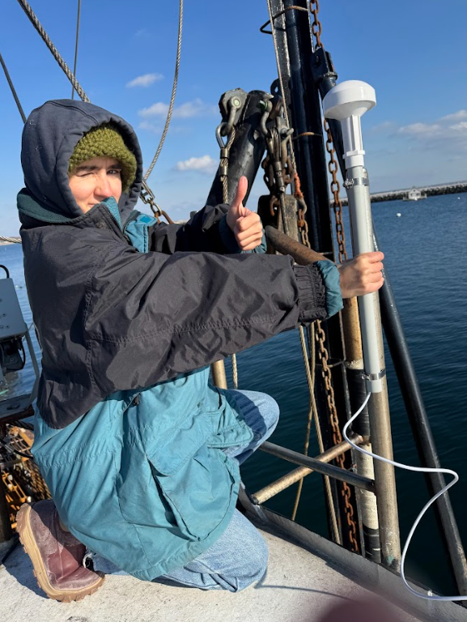
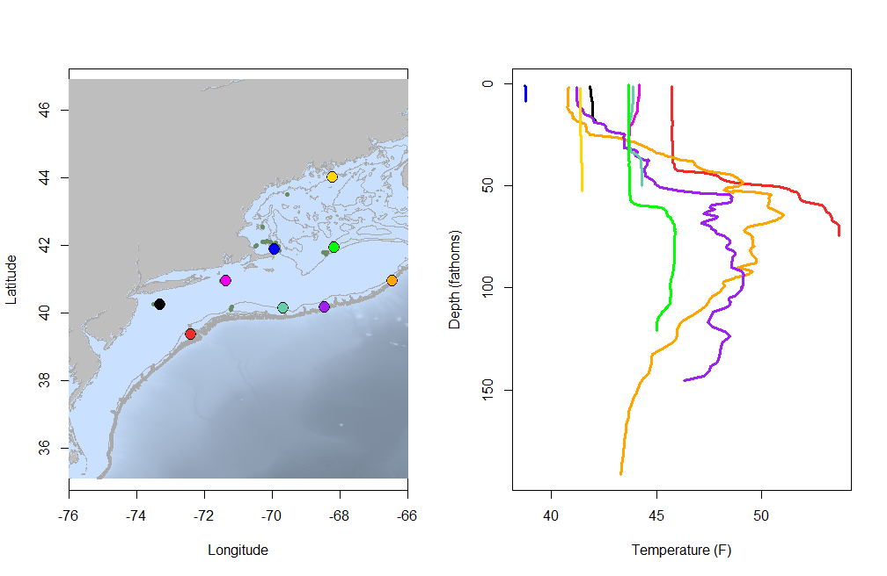
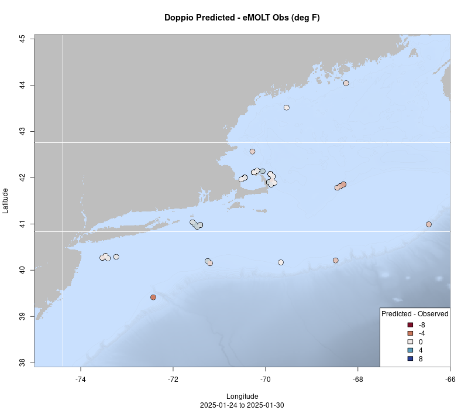
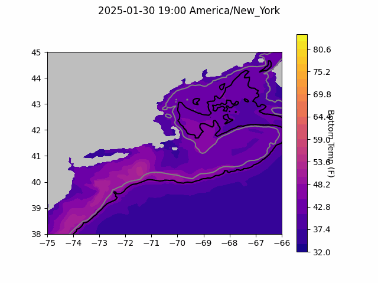
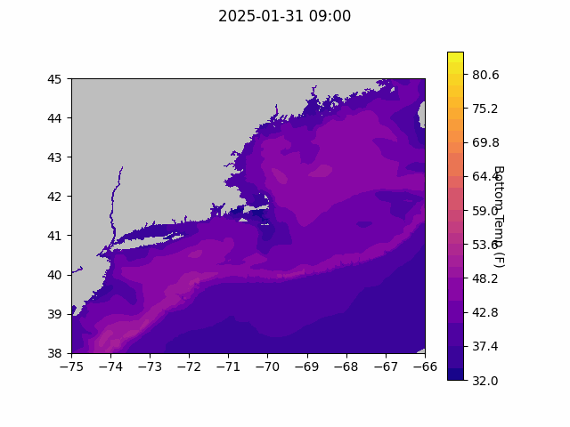
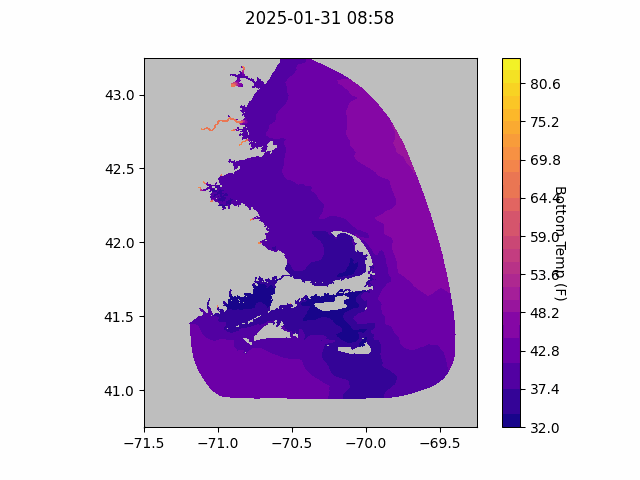

```{r setup, include=FALSE}
knitr::opts_chunk$set(echo = TRUE)
library(marmap)
library(rstudioapi)
if(Sys.info()["sysname"]=="Windows"){
  source("C:/Users/george.maynard/Documents/GitHubRepos/emolt_project_management/WeeklyUpdates/forecast_check/R/emolt_download.R")
} else {
  source("/home/george/Documents/emolt_project_management/WeeklyUpdates/forecast_check/R/emolt_download.R")
}

data=emolt_download(days=7)
start_date=Sys.Date()-lubridate::days(7)
## Use the dates from above to create a URL for grabbing the data
full_data=read.csv(
    paste0(
      "https://erddap.emolt.net/erddap/tabledap/eMOLT_RT.csvp?tow_id%2Csegment_type%2Ctime%2Clatitude%2Clongitude%2Cdepth%2Ctemperature%2Csensor_type&segment_type=%22Fishing%22&time%3E=",
      lubridate::year(start_date),
      "-",
      lubridate::month(start_date),
      "-",
      lubridate::day(start_date),
      "T00%3A00%3A00Z&time%3C=",
      lubridate::year(Sys.Date()),
      "-",
      lubridate::month(Sys.Date()),
      "-",
      lubridate::day(Sys.Date()),
      "T23%3A59%3A59Z"
    )
  )
sensor_time=0
for(tow in unique(full_data$tow_id)){
  x=subset(full_data,full_data$tow_id==tow)
  sensor_time=sensor_time+difftime(max(x$time..UTC.),units='hours',min(x$time..UTC.))
}
```

<center> 

<font size="5"> *eMOLT Update `r Sys.Date()` * </font>

</center>

## Weekly Recap 

A huge thanks to all of the fishermen and scientists who showed up to the Cooperative Research Summit in Portland, Maine earlier this week. It's inspirational to see the results of research projects and hear ideas from all of you about how cooperative research can be applied moving forward. Also many thanks to Tommy and Owen from the Center for Coastal Studies for their dedication and professionalism taking care of a particularly challenging installation on the F/V Nemesis.



> *Figure 1. Tommy with a newly installed external GPS on the roof of the F/V Nemesis*

After the Summit, Huanxin and George headed to New Bedford to install a new system on the F/V Eagle, and the Rutgers team set up on the F/V Susan L. Thanks to Captains George and Jake for your assistance on the installs, and welcome to the eMOLT fleet! 

This week, the eMOLT fleet recorded `r length(unique(full_data$tow_id))` tows of sensorized fishing gear totaling `r as.numeric(sensor_time)` sensor hours underwater. The warmest recorded bottom temperature was `r round(max(full_data$temperature..degree_C.)*9/5+32,1)[1]` F near Hudson Canyon in approximately `r round(full_data[which(full_data$temperature..degree_C.==max(full_data$temperature..degree_C.)),"depth..m."]*0.546807,0)[1]` fathoms (red profile) and the coldest recorded bottom temperature was `r round(min(full_data$temperature..degree_C.)*9/5+32,1)[1]` F along the backside of Cape Cod in in approximately `r round(full_data[which(full_data$temperature..degree_C.==min(full_data$temperature..degree_C.)),"depth..m."]*0.546807,0)[1]` fathoms (blue profile). Below, you can see these profiles plus a few other temperature profiles of interest across the region from the last week. 




> *Figure 2 -- Temperature profiles collected by eMOLT participants over the last week. The blue profile is where the coldest bottom temperature was measured and the red profile is where the warmest bottom temperature was measured. All other colors are assigned randomly. Colored points on the map indicate where profiles of the same color were collected. The small dark green dots represent other profiles collected this week, but not highlighted in the plot. Note that the warmest / coldest bottom temperatures measured could have occurred during gear soaks, which are not represented on this profile plot.*

### System Hardware Upgrade List

The following vessels remain on our list for hardware upgrades. If you aren't on the list and think you should be, please reach out. *Note that this list is different from our new install queue.*

>
 - F/V Kaitlyn Victoria
 - F/V Kyler C
 - F/V Noella C
 - F/V Sea Watcher I
 - F/V Virginia Marise

### Bottom Temperature Forecasts

#### Doppio 

This week, 68% of bottom temperature observations were within 2 degrees (F) of the Doppio forecasted value at those points and 98% were within 5 degrees (F). The model performed best near Cape Cod and South of Long Island. Observations were generally warmer than predicted along the shelf break and on the northern edge of Georges Bank. Temperatures were cooler than predicted south of Rhode Island. 



> *Figure 3 -- Performance of the Doppio forecast's bottom temperature layer over the last week relative to observations collected by eMOLT participants. Red dots indicate areas where bottom temperature observations were warmer that predicted. Blue dots indicate areas where bottom temperature observations were cooler than predicted. Bottom temperature observations are compared with the most recent forecast run available before the observation was made.* 



> *Figure 4 -- The most recent Doppio bottom temperature forecast. The gray line is the 50 fathom line and the black line is the hundred fathom line. Purple shades indicate cooler water.*

#### Northeast Coastal Ocean Forecast System



> *Figure 5 -- The most recent bottom temperature forecast from the Northeast Coastal Ocean Forecast System GOM7 model. Purple shades indicate cooler water.*



> *Figure 6 -- The most recent bottom temperature forecast from the Northeast Coastal Ocean Forecast System MassBay model. Purple shades indicate cooler water.*


## Announcements

### Fishing Partnership Offers Gift Cards to Fishing Families

Are you a commercial fisherman or an immediate family member of a commercial fisherman aged 18 or older? [Participate in Fishing Partnership Support Services’ online study on the health and behavioral health of fishermen and fishing families!](https://fishingpartnership.us3.list-manage.com/track/click?u=aaf15707606468e72ad68f731&id=ad7ce8b684&e=bf2c66600e) This information is vital to our work. You will receive a $75 gift card for your participation, which is expected to take around 30-45 minutes.


### Come Visit Us!

If you're at the Mass Lobstermen's Trade Show in Hyannis on Saturday 2/1, come by the GOMLF / eMOLT booth and say hello! Also, bring your friends if you think they'd be interested in a box! We are actively recruiting vessels for the MassTech funded expansion. 

All the best,

-George and JiM
