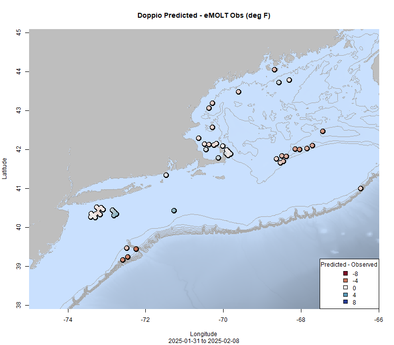
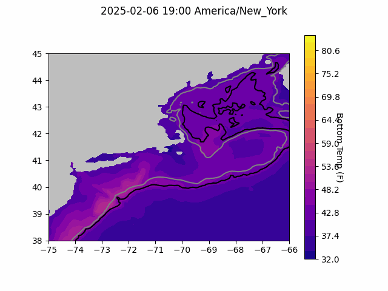
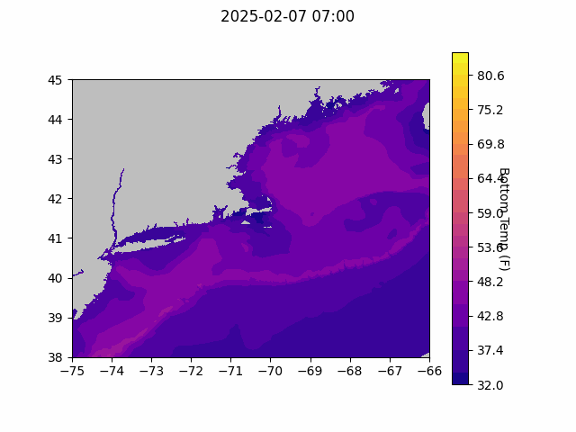
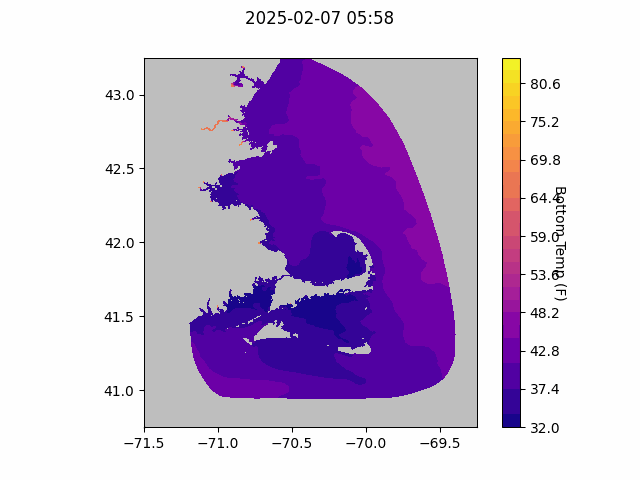
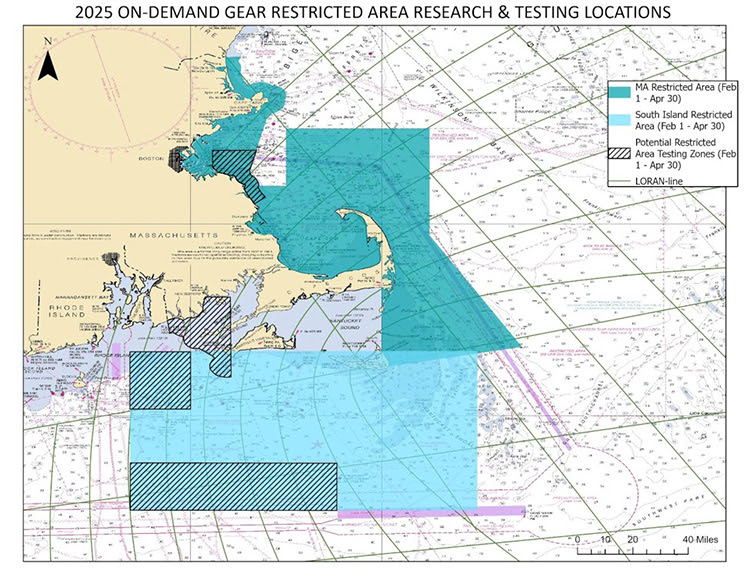

```{r setup, include=FALSE}
knitr::opts_chunk$set(echo = TRUE)
library(marmap)
library(rstudioapi)
if(Sys.info()["sysname"]=="Windows"){
  source("C:/Users/george.maynard/Documents/GitHubRepos/emolt_project_management/WeeklyUpdates/forecast_check/R/emolt_download.R")
} else {
  source("/home/george/Documents/emolt_project_management/WeeklyUpdates/forecast_check/R/emolt_download.R")
}

data=emolt_download(days=7)
start_date=Sys.Date()-lubridate::days(7)
## Use the dates from above to create a URL for grabbing the data
full_data=read.csv(
    paste0(
      "https://erddap.emolt.net/erddap/tabledap/eMOLT_RT.csvp?tow_id%2Csegment_type%2Ctime%2Clatitude%2Clongitude%2Cdepth%2Ctemperature%2Csensor_type&segment_type=%22Fishing%22&time%3E=",
      lubridate::year(start_date),
      "-",
      lubridate::month(start_date),
      "-",
      lubridate::day(start_date),
      "T00%3A00%3A00Z&time%3C=",
      lubridate::year(Sys.Date()),
      "-",
      lubridate::month(Sys.Date()),
      "-",
      lubridate::day(Sys.Date()),
      "T23%3A59%3A59Z"
    )
  )
sensor_time=0
for(tow in unique(full_data$tow_id)){
  x=subset(full_data,full_data$tow_id==tow)
  sensor_time=sensor_time+difftime(max(x$time..UTC.),units='hours',min(x$time..UTC.))
}
```

<center> 

<font size="5"> *eMOLT Update `r Sys.Date()` * </font>

</center>

## Weekly Recap 


> *Figure 1 -- Picture of the Lowell DDH screen aboard the F/V Ryan Joseph showing a noticeable increase in temperature (red) and dissolved oxygen (blue) late on October 29th.*

> *Figure 2 -- FVCOM modeled surface temps and currents plotted with drifter (green) and miniboat (red) tracks*

This week, the eMOLT fleet recorded `r length(unique(full_data$tow_id))` tows of sensorized fishing gear totaling `r as.numeric(sensor_time)` sensor hours underwater. The warmest recorded bottom temperature was `r round(max(full_data$temperature..degree_C.)*9/5+32,1)` F inside Cape Cod Bay in approximately `r round(full_data[which(full_data$temperature..degree_C.==max(full_data$temperature..degree_C.)),"depth..m."]*0.546807,0)` fathoms (red profile) and the coldest recorded bottom temperature was `r round(min(full_data$temperature..degree_C.)*9/5+32,1)` F near Hudson Canyon in approximately `r round(full_data[which(full_data$temperature..degree_C.==min(full_data$temperature..degree_C.)),"depth..m."]*0.546807,0)[1]` fathoms (blue profile). Below, you can see these profiles plus a few other temperature profiles of interest across the region from the last week. 


> *Figure 3 -- Temperature profiles collected by eMOLT participants over the last week. The blue profile is where the coldest bottom temperature was measured and the red profile is where the warmest bottom temperature was measured. All other colors are assigned randomly. Colored points on the map indicate where profiles of the same color were collected. The small dark green dots represent other profiles collected this week, but not highlighted in the plot. Note that the warmest / coldest bottom temperatures measured could have occurred during gear soaks, which are not represented on this profile plot.*

### System Hardware Upgrade List

The following vessels remain on our list for hardware upgrades. If you aren't on the list and think you should be, please reach out. *Note that this list is different from our new install queue.*

>
 - F/V Kaitlyn Victoria
 - F/V Kyler C
 - F/V Noella C
 - F/V Sea Watcher I
 - F/V Virginia Marise

### Bottom Temperature Forecasts

#### Doppio 

This week, only 56% of bottom temperature observations were within 2 degrees (F) of the Doppio forecasted value at those points. Across the board, observed bottom temperatures were warmer than expected, but especially down in the Mid-Atlantic east-southeast of Cape May.



> *Figure 5 -- Performance of the Doppio forecast's bottom temperature layer over the last week relative to observations collected by eMOLT participants. Red dots indicate areas where bottom temperature observations were warmer that predicted. Blue dots indicate areas where bottom temperature observations were cooler than predicted. Bottom temperature observations are compared with the most recent forecast run available before the observation was made.* 



> *Figure 6 -- The most recent Doppio bottom temperature forecast. The gray line is the 50 fathom line and the black line is the hundred fathom line. Purple shades indicate cooler water.*

#### Northeast Coastal Ocean Forecast System



> *Figure 7 -- The most recent bottom temperature forecast from the Northeast Coastal Ocean Forecast System GOM7 model. Purple shades indicate cooler water.*



> *Figure 8 -- The most recent bottom temperature forecast from the Northeast Coastal Ocean Forecast System MassBay model. Purple shades indicate cooler water.*

## Announcements

### Northeast Experimental On-Demand Gear System Testing Underway

The 2025 testing season for On Demand Gear is underway in Southern New England (see map below). For more information, check out the [experimental fishery webpage here](https://www.fisheries.noaa.gov/new-england-mid-atlantic/marine-mammal-protection/2025-northeast-experimental-demand-gear-system?utm_medium=email&utm_source=govdelivery). 


### Northeast Cooperative Research Summit Feedback Requested

If you attended the Northeast Cooperative Research Summit, please fill out this five minute feedback form to let us know how we did. Your input will help determine the format and content of this event in the future. Thanks again for your participation and enthusiasm, and please don't hesitate to reach out for future conversations. 


All the best,

-George and JiM
