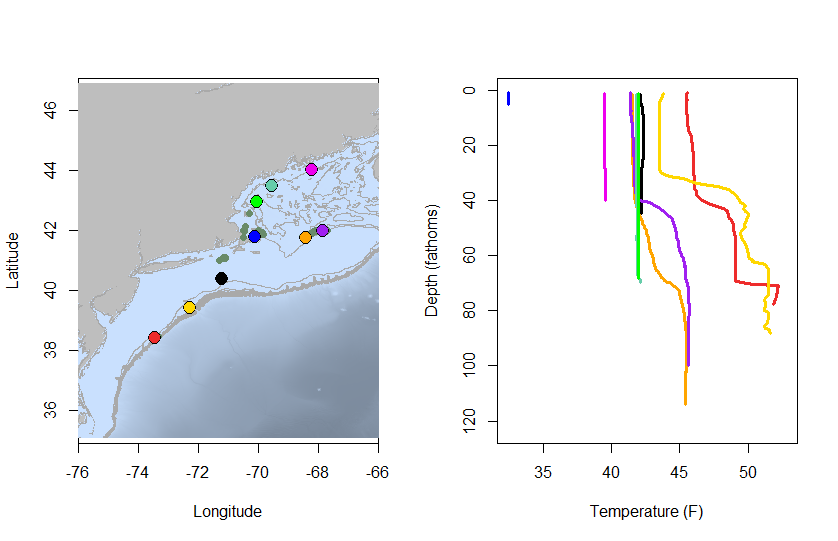
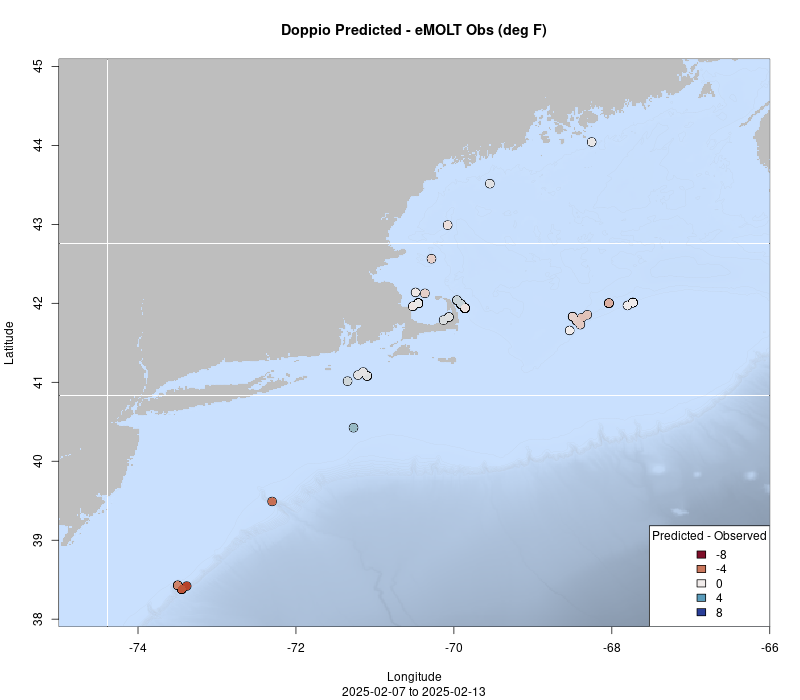
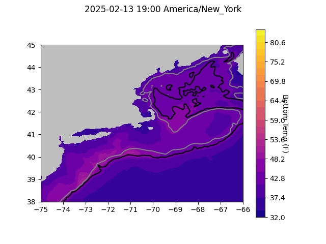
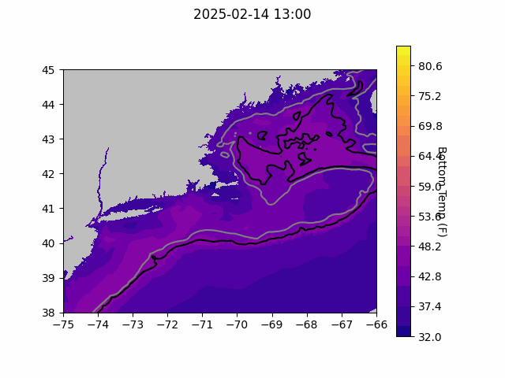
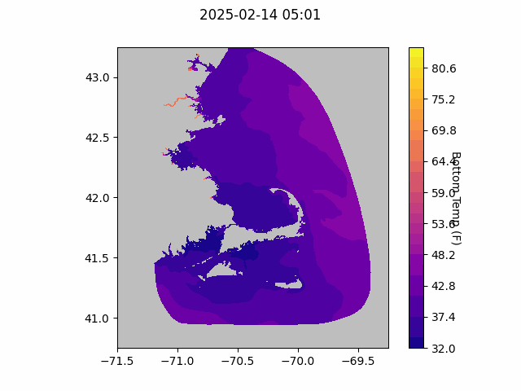

```{r setup, include=FALSE}
knitr::opts_chunk$set(echo = TRUE)
library(marmap)
library(rstudioapi)
if(Sys.info()["sysname"]=="Windows"){
  source("C:/Users/george.maynard/Documents/GitHubRepos/emolt_project_management/WeeklyUpdates/forecast_check/R/emolt_download.R")
} else {
  source("/home/george/Documents/emolt_project_management/WeeklyUpdates/forecast_check/R/emolt_download.R")
}

data=emolt_download(days=7)
start_date=Sys.Date()-lubridate::days(7)
## Use the dates from above to create a URL for grabbing the data
full_data=read.csv(
    paste0(
      "https://erddap.emolt.net/erddap/tabledap/eMOLT_RT.csvp?tow_id%2Csegment_type%2Ctime%2Clatitude%2Clongitude%2Cdepth%2Ctemperature%2Csensor_type&segment_type=%22Fishing%22&time%3E=",
      lubridate::year(start_date),
      "-",
      lubridate::month(start_date),
      "-",
      lubridate::day(start_date),
      "T00%3A00%3A00Z&time%3C=",
      lubridate::year(Sys.Date()),
      "-",
      lubridate::month(Sys.Date()),
      "-",
      lubridate::day(Sys.Date()),
      "T23%3A59%3A59Z"
    )
  )
sensor_time=0
for(tow in unique(full_data$tow_id)){
  x=subset(full_data,full_data$tow_id==tow)
  sensor_time=sensor_time+difftime(max(x$time..UTC.),units='hours',min(x$time..UTC.))
}
```

<center> 

<font size="5"> *eMOLT Update `r Sys.Date()` * </font>

</center>

## Weekly Recap 

This week all of the installer teams working on the MassTech grant came together for the first time since the project started to share tips, tricks, and feedback from install techs and fishermen alike. We heard from installers about the tools and consumables they wished they'd had for trickier installs, heard from the team at Lowell Instruments about some new software tools they were developing to aid in the install process, and got secondhand feedback from a number of captains about bugs with their systems and feature requests. 

One thing that's come through loud and clear from this conversation, break out discussions at the Cooperative Research Summit, Squid Squad meetings, and dockside chats with individual fishermen is that you all would like easier access to the range of data products produced by scientists around the region. We're hoping to work with scientists in other parts of the Northeast Fisheries Science Center and at some of our partner organizations like the Commercial Fisheries Research Foundation and Ocean Data Network to build out those tools in the coming months. 

We'd also encourage any participating captain who is interested to hop online and check out the password-protected [online dashboard](https://www.portal.emolt.net/register/) developed by Ocean Data Network and hosted by the Gulf of Maine Lobster Foundation. Here, you can see all the data collected on your boat in more detail than we can display on the deckboxes, and it's (at least in our opinions) easier to look back at your history. We appreciate the feedback about adding some other resources to that page and will be working to figure out what's possible in the coming weeks. 

This week, the eMOLT fleet recorded `r length(unique(full_data$tow_id))` tows of sensorized fishing gear totaling `r as.numeric(sensor_time)` sensor hours underwater. The warmest recorded bottom temperature was `r round(max(full_data$temperature..degree_C.)*9/5+32,1)` F near Wilmington Canyon in approximately `r round(full_data[which(full_data$temperature..degree_C.==max(full_data$temperature..degree_C.)),"depth..m."]*0.546807,0)` fathoms (red profile) and the coldest recorded bottom temperature was `r round(min(full_data$temperature..degree_C.)*9/5+32,1)` F off the backside of Cape Cod in approximately `r round(full_data[which(full_data$temperature..degree_C.==min(full_data$temperature..degree_C.)),"depth..m."]*0.546807,0)[1]` fathoms (blue profile). Below, you can see these profiles plus a few other temperature profiles of interest across the region from the last week. 



> *Figure 1 -- Temperature profiles collected by eMOLT participants over the last week. The blue profile is where the coldest bottom temperature was measured and the red profile is where the warmest bottom temperature was measured. All other colors are assigned randomly. Colored points on the map indicate where profiles of the same color were collected. The small dark green dots represent other profiles collected this week, but not highlighted in the plot. Note that the warmest / coldest bottom temperatures measured could have occurred during gear soaks, which are not represented on this profile plot.*

A big thanks this week to Joaquim Oller at Lowell Instruments for his help getting the 50 and 100 fathom contours onto the NECOFS forecasts. That update is visible in the plots below and will also be available on deckboxes in a future software update. This is a step towards getting to better displays that include more underwater features to spatially reference the water temperature forecasts.

### System Hardware Upgrade List

The following vessels remain on our list for hardware upgrades. If you aren't on the list and think you should be, please reach out. *Note that this list is different from our new install queue.*

>
 - F/V Kaitlyn Victoria
 - F/V Kyler C
 - F/V Noella C
 - F/V Sea Watcher I
 - F/V Virginia Marise

### Bottom Temperature Forecasts

#### Doppio 

This week, 74% of bottom temperature observations were within 2 degrees (F) of the Doppio forecasted value at those points. Temps were warmer than expected along the northern edge of Georges, and substantially warmer than expected by Wilmington and Hudson Canyons. The forecast performed well along the Maine coast, Cape Cod, and east of Long Island. 



> *Figure 2 -- Performance of the Doppio forecast's bottom temperature layer over the last week relative to observations collected by eMOLT participants. Red dots indicate areas where bottom temperature observations were warmer that predicted. Blue dots indicate areas where bottom temperature observations were cooler than predicted. Bottom temperature observations are compared with the most recent forecast run available before the observation was made.* 



> *Figure 3 -- The most recent Doppio bottom temperature forecast. The gray line is the 50 fathom line and the black line is the hundred fathom line. Purple shades indicate cooler water.*

#### Northeast Coastal Ocean Forecast System



> *Figure 4 -- The most recent bottom temperature forecast from the Northeast Coastal Ocean Forecast System GOM7 model. The gray line is the 50 fathom line and the black line is the hundred fathom line. Purple shades indicate cooler water.*



> *Figure 5 -- The most recent bottom temperature forecast from the Northeast Coastal Ocean Forecast System MassBay model. Purple shades indicate cooler water.*

## Announcements

### Northeast Cooperative Research Summit Feedback Requested

If you attended the Northeast Cooperative Research Summit, please fill out this [five minute feedback form](https://docs.google.com/forms/d/e/1FAIpQLSd-AUv-cPHotYr2ozjx2wYlzzNEDccTiy0BSfKWs_rfeslmEA/viewform) to let us know how we did. Your input will help determine the format and content of this event in the future. Thanks again for your participation and enthusiasm, and please don't hesitate to reach out for future conversations. 

### Low Carbon Fishing Fleet Fellowship Opportunity

Sarah Schumann, a commercial fisherman from RI and the Director of the [Fishery Friendly Climate Action Campaign](https://www.fisheryfriendlyclimateaction.org/) is seeking two Maine-based fishermen to join a cohort of fellows from across New England as part of the "Low Carbon Fishing Fleet Fellowship" program this year. This fellowship aims to develop your capacity in community-based peer leadership and fishing vessel energy innovation and policy. Fellows will take  the knowledge already compiled through the [Fishery Friendly Climate Action Campaign’s Transition to a Low Carbon Fishing Fleet initiative](https://www.fisheryfriendlyclimateaction.org/low-carbon-fleet) and turn it into forward movement by producing action agendas for advancing fishing community-led visions of a low carbon fishing fleet within their states and fleets.

For more details, please click [here](https://www.fisheryfriendlyclimateaction.org/low-carbon-fleet-fellowship ) or email Sarah directly at schumannsarah@gmail.com.  

### Contribute to the 2026 Management Track Fishery Stock Assessments

The Northeast Fisheries Science Center seeks input from our regional assessment partners, including the fishing industry (commercial and recreational), state agency scientists, academic researchers, and interested members of the public to help guide development of our next [Management Track Assessments](https://links-1.govdelivery.com/CL0/https:%2F%2Fwww.fisheries.noaa.gov%2Fnew-england-mid-atlantic%2Fpopulation-assessments%2Fmanagement-track-stock-assessments%3Futm_medium=email%26utm_source=govdelivery/1/01000194fef87a4b-77d6ccd3-5a1a-4eb1-b540-f77f545ba60e-000000/ZeMgO83aO-hzSXHaHdKeoVtkRJYCB7U8ddMVEkaJkm4=392). 

Specifically, the NEFSC is looking for on-the-water observations or data sets on topics such as distribution, stock health, fishing dynamics and management, and the role these stocks play in the ecosystem. There are two ways to participate. 

There are two ways to participate:

- Attend a [virtual meeting](https://links-1.govdelivery.com/CL0/https:%2F%2Fwww.fisheries.noaa.gov%2Fevent%2Fmanagement-track-community-input%3Futm_medium=email%26utm_source=govdelivery/1/01000194fef87a4b-77d6ccd3-5a1a-4eb1-b540-f77f545ba60e-000000/uRnJB_BlmpntvvZAGga4oBGo7UyCHs-AbFyVtROjqUQ=392) on February 26, 2025
- Submit your comments through the [community input form](https://links-1.govdelivery.com/CL0/https:%2F%2Fforms.gle%2FBrH28as6HhERVTnL6%3Futm_medium=email%26utm_source=govdelivery/1/01000194fef87a4b-77d6ccd3-5a1a-4eb1-b540-f77f545ba60e-000000/J3norb57-iYKlrXBQ74ItB9OMBBXv9ZUqcpxeZ10abg=392), which is open through April 30, 2025

June 2026 Management Track Stocks include

- Atlantic herring
- Butterfish
- Georges Bank Atlantic cod
- Georges Bank haddock
- Longfin inshore squid
- Ocean quahog

### Disclaimer

The eMOLT Update is NOT an official NOAA document. Mention of products or manufacturers does not constitute an endorsement by NOAA or Department of Commerce. The content of this update reflects only the personal views of the authors and does not necessarily represent the views of NOAA Fisheries, the Department of Commerce, or the United States.

All the best,

-George and JiM
