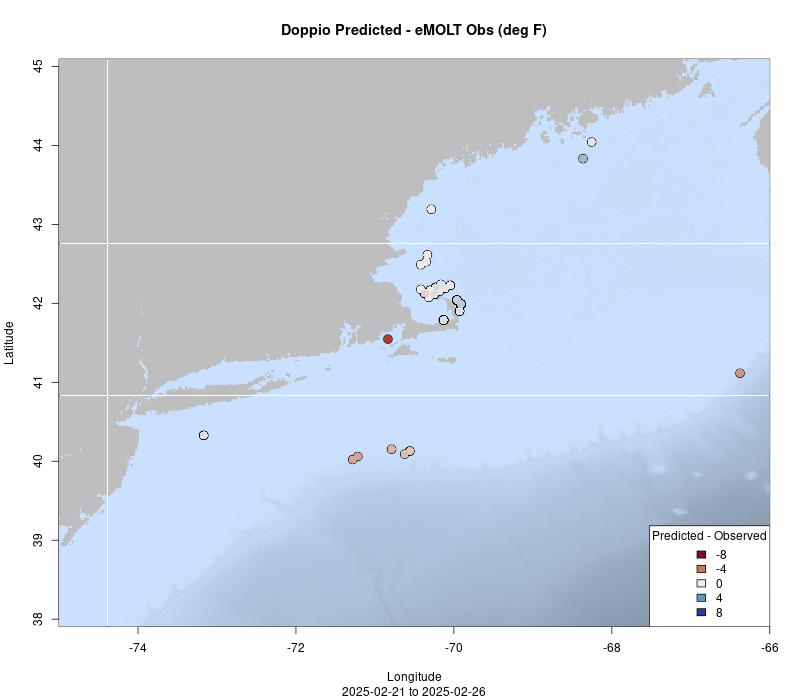

```{r setup, include=FALSE}
knitr::opts_chunk$set(echo = TRUE)
library(marmap)
library(rstudioapi)
if(Sys.info()["sysname"]=="Windows"){
  source("C:/Users/george.maynard/Documents/GitHubRepos/emolt_project_management/WeeklyUpdates/forecast_check/R/emolt_download.R")
} else {
  source("/home/george/Documents/emolt_project_management/WeeklyUpdates/forecast_check/R/emolt_download.R")
}

data=emolt_download(days=7)
start_date=Sys.Date()-lubridate::days(7)
## Use the dates from above to create a URL for grabbing the data
full_data=read.csv(
    paste0(
      "https://erddap.emolt.net/erddap/tabledap/eMOLT_RT.csvp?tow_id%2Csegment_type%2Ctime%2Clatitude%2Clongitude%2Cdepth%2Ctemperature%2Csensor_type&segment_type=%22Fishing%22&time%3E=",
      lubridate::year(start_date),
      "-",
      lubridate::month(start_date),
      "-",
      lubridate::day(start_date),
      "T00%3A00%3A00Z&time%3C=",
      lubridate::year(Sys.Date()),
      "-",
      lubridate::month(Sys.Date()),
      "-",
      lubridate::day(Sys.Date()),
      "T23%3A59%3A59Z"
    )
  )
sensor_time=0
for(tow in unique(full_data$tow_id)){
  x=subset(full_data,full_data$tow_id==tow)
  sensor_time=sensor_time+difftime(max(x$time..UTC.),units='hours',min(x$time..UTC.))
}
```

<center> 

<font size="5"> *eMOLT Update `r Sys.Date()` * </font>

</center>

## Weekly Recap 

This week, I'd been talking with several colleagues who work with the Modular Ocean Model (MOM6), a new ocean model developed by NOAA's Geophysical Fluid Dynamics Laboratory. We'd hoped to include a one year forecast of bottom temperatures in our region along with some notes from those scientists for all of you to check out either this week or next, but two scientists deeply involved in that effort were fired yesterday, so I'm not sure when or if we'll be able to put that together for all of you.

A big thanks to the team from the Gulf of Maine Lobster Foundation and the Lobster Institute for filling in for me at the Maine Fishermen's Forum in our seminar scheduled for later this afternoon. I'm driving back to Massachusetts shortly, but the seminar is still on, so please stop by and chat with the team if you're interested in the eMOLT program or other cooperative research that the Lobster Institute is working on. 

This week, the eMOLT fleet recorded `r length(unique(full_data$tow_id))` tows of sensorized fishing gear totaling `r as.numeric(sensor_time)` sensor hours underwater. The warmest recorded bottom temperature was `r round(max(full_data$temperature..degree_C.)*9/5+32,1)` F near Block Canyon in approximately `r round(full_data[which(full_data$temperature..degree_C.==max(full_data$temperature..degree_C.)),"depth..m."]*0.546807,0)` fathoms (red profile) and the coldest recorded bottom temperature was `r round(min(full_data$temperature..degree_C.)*9/5+32,1)` F off the backside of Cape Cod in approximately `r round(full_data[which(full_data$temperature..degree_C.==min(full_data$temperature..degree_C.)),"depth..m."]*0.546807,0)[1]` fathoms (blue profile). Below, you can see these profiles plus a few other temperature profiles of interest across the region from the last week. 


> *Figure 1 -- Temperature profiles collected by eMOLT participants over the last week. The blue profile is where the coldest bottom temperature was measured and the red profile is where the warmest bottom temperature was measured. All other colors are assigned randomly. Colored points on the map indicate where profiles of the same color were collected. The small dark green dots represent other profiles collected this week, but not highlighted in the plot. Note that the warmest / coldest bottom temperatures measured could have occurred during gear soaks, which are not represented on this profile plot.*

### System Hardware Upgrade List

The following vessels remain on our list for hardware upgrades. If you aren't on the list and think you should be, please reach out. *Note that this list is different from our new install queue.*

>
 - F/V Kaitlyn Victoria
 - F/V Kyler C
 - F/V Noella C
 - F/V Sea Watcher I

### Bottom Temperature Forecasts

#### Doppio 

This week, 69% of bottom temperature observations were within 2 degrees (F) of the Doppio forecasted value at those points.



> *Figure 2 -- Performance of the Doppio forecast's bottom temperature layer over the last week relative to observations collected by eMOLT participants. Red dots indicate areas where bottom temperature observations were warmer that predicted. Blue dots indicate areas where bottom temperature observations were cooler than predicted. Bottom temperature observations are compared with the most recent forecast run available before the observation was made.* 


> *Figure 3 -- The most recent Doppio bottom temperature forecast. The gray line is the 50 fathom line and the black line is the hundred fathom line. Purple shades indicate cooler water.*

#### Northeast Coastal Ocean Forecast System


> *Figure 4 -- The most recent bottom temperature forecast from the Northeast Coastal Ocean Forecast System GOM7 model. The gray line is the 50 fathom line and the black line is the hundred fathom line. Purple shades indicate cooler water.*


> *Figure 5 -- The most recent bottom temperature forecast from the Northeast Coastal Ocean Forecast System MassBay model. Purple shades indicate cooler water.*

## Announcements

### Contribute to the 2026 Management Track Fishery Stock Assessments

The Northeast Fisheries Science Center seeks input from our regional assessment partners, including the fishing industry (commercial and recreational), state agency scientists, academic researchers, and interested members of the public to help guide development of our next [Management Track Assessments](https://links-1.govdelivery.com/CL0/https:%2F%2Fwww.fisheries.noaa.gov%2Fnew-england-mid-atlantic%2Fpopulation-assessments%2Fmanagement-track-stock-assessments%3Futm_medium=email%26utm_source=govdelivery/1/01000194fef87a4b-77d6ccd3-5a1a-4eb1-b540-f77f545ba60e-000000/ZeMgO83aO-hzSXHaHdKeoVtkRJYCB7U8ddMVEkaJkm4=392). 

Specifically, the NEFSC is looking for on-the-water observations or data sets on topics such as distribution, stock health, fishing dynamics and management, and the role these stocks play in the ecosystem. There are two ways to participate. 

There are two ways to participate:

- Submit your comments through the [community input form](https://links-1.govdelivery.com/CL0/https:%2F%2Fforms.gle%2FBrH28as6HhERVTnL6%3Futm_medium=email%26utm_source=govdelivery/1/01000194fef87a4b-77d6ccd3-5a1a-4eb1-b540-f77f545ba60e-000000/J3norb57-iYKlrXBQ74ItB9OMBBXv9ZUqcpxeZ10abg=392), which is open through April 30, 2025

June 2026 Management Track Stocks include

- Atlantic herring
- Butterfish
- Georges Bank Atlantic cod
- Georges Bank haddock
- Longfin inshore squid
- Ocean quahog

### Disclaimer

The eMOLT Update is NOT an official NOAA document. Mention of products or manufacturers does not constitute an endorsement by NOAA or Department of Commerce. The content of this update reflects only the personal views of the authors and does not necessarily represent the views of NOAA Fisheries, the Department of Commerce, or the United States.

All the best,

-George and JiM
