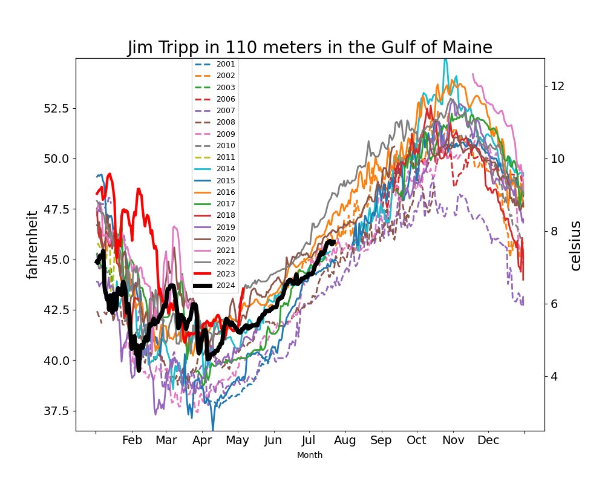

```{r setup, include=FALSE}
knitr::opts_chunk$set(echo = TRUE)
library(marmap)
library(rstudioapi)
if(Sys.info()["sysname"]=="Windows"){
  source("C:/Users/george.maynard/Documents/GitHubRepos/emolt_project_management/WeeklyUpdates/forecast_check/R/emolt_download.R")
} else {
  source("/home/george/Documents/emolt_project_management/WeeklyUpdates/forecast_check/R/emolt_download.R")
}

data=emolt_download(days=7)
start_date=Sys.Date()-lubridate::days(7)
## Use the dates from above to create a URL for grabbing the data
full_data=read.csv(
    paste0(
      "https://erddap.emolt.net/erddap/tabledap/eMOLT_RT.csvp?tow_id%2Csegment_type%2Ctime%2Clatitude%2Clongitude%2Cdepth%2Ctemperature%2Csensor_type&segment_type=%22Fishing%22&time%3E=",
      lubridate::year(start_date),
      "-",
      lubridate::month(start_date),
      "-",
      lubridate::day(start_date),
      "T00%3A00%3A00Z&time%3C=",
      lubridate::year(Sys.Date()),
      "-",
      lubridate::month(Sys.Date()),
      "-",
      lubridate::day(Sys.Date()),
      "T23%3A59%3A59Z"
    )
  )
sensor_time=0
for(tow in unique(full_data$tow_id)){
  x=subset(full_data,full_data$tow_id==tow)
  sensor_time=sensor_time+difftime(max(x$time..UTC.),units='hours',min(x$time..UTC.))
}
```

<center> 

<font size="5"> *eMOLT Update `r Sys.Date()` * </font>

</center>

## Weekly Recap 

This week, we welcome the F/V Evelyn and Isabel and the F/V Capt John to the eMOLT program. Thanks to Captain Robert, Captain Dane, and the teams from Ocean Data Network and Rutgers University for getting the systems installed. Owen from the Center for Coastal Studies is also down at the docks in New Bedford to wrap up installation aboard the F/V Stella Jane as I type this. 

A big thanks also to Linus at Commercial Fisheries Research Foundation, Capt. Mike on the F/V Mister G, Capt. Aaron on the F/V Tradition, Owen at the Center for Coastal Studies, and the whole team at Lowell Instruments for your work this week on identifying and developing solutions for what we thought were two different firmware bugs. These bugs manifest as loggers that are unable to be read by the deckbox or any other bluetooth sniffer, so if your logger suddenly stops communicating, please reach out. 

Thanks also to Carles at Ocean Data Network for his tireless work on maintaining and upgrading the eMOLT data pipeline. This cyber-infrastructure carries environmental data from your vessels back to our servers, anonymizes it, QAQCs it, and makes the data accessible to the forecasters and stock assessment scientists who use it.

Jim Tripp,  a longtime eMOLT participant out of Spruce Head Maine, mailed in his last Minilog probe this past week. He has been deploying them year round in the deep waters (~62 fathoms or 115 meters) for nearly a quarter century! See plot below. Fortunately, his son John is now interested in taking up the duty with a realtime system. 



> *Figure 1 -- 23 years of bottom temperature records courtesy of eMOLT participant Jim Tripp, captain of the F/V Outer Fall. Note that 2024 is much cooler than 2023 in the spring, but is not anomalously cold compared with the full spread of data.*

We continue to assess how recent actions by the administration will impact the eMOLT program moving forward. We expect to experience continued capacity issues, particularly around data product development and contracting as a result of last week's "***staffing changes***", so thank you for your patience. We're also waiting for further information about how changes to the contracting process as a result of [an executive order signed on February 26](https://www.whitehouse.gov/presidential-actions/2025/02/implementing-the-presidents-department-of-government-efficiency-cost-efficiency-initiative/) may affect the program. One of the strengths of the eMOLT Program is our network of external collaborators including non-profits, fishing industry organizations, and blue tech companies. However, many of those relationships are formalized through contracts, and this executive order introduces some uncertainty into what is normally a relatively straightforward -- if painfully bureaucratic -- process. 

This week, the eMOLT fleet recorded `r length(unique(full_data$tow_id))` tows of sensorized fishing gear totaling `r as.numeric(sensor_time)` sensor hours underwater. The warmest recorded bottom temperature was `r round(max(full_data$temperature..degree_C.)*9/5+32,1)` F near Atlantis Canyon in approximately `r round(full_data[which(full_data$temperature..degree_C.==max(full_data$temperature..degree_C.)),"depth..m."]*0.546807,0)` fathoms (red profile) and the coldest recorded bottom temperature was `r round(min(full_data$temperature..degree_C.)*9/5+32,1)` F in Cape Cod Bay in approximately `r round(full_data[which(full_data$temperature..degree_C.==min(full_data$temperature..degree_C.)),"depth..m."]*0.546807,0)[1]` fathoms (blue profile). Below, you can see these profiles plus a few other temperature profiles of interest across the region from the last week. 


> *Figure 2 -- Temperature profiles collected by eMOLT participants over the last week. The blue profile is where the coldest bottom temperature was measured and the red profile is where the warmest bottom temperature was measured. All other colors are assigned randomly. Colored points on the map indicate where profiles of the same color were collected. The small dark green dots represent other profiles collected this week, but not highlighted in the plot. Note that the warmest / coldest bottom temperatures measured could have occurred during gear soaks, which are not represented on this profile plot.*

## eMOLT in the News

- [Saving money and time with an EM Pilot Program in the U.S. sea scallop fishery](https://em4.fish/projects-in-the-field-saving-money-and-time-with-an-em-pilot-program-in-the-u-s-sea-scallop-fishery/) details efforts by our partners at the Coonamessett Farm Foundation to gain some efficiencies for scallopers (see picture below). They also touch on future applications of eMOLT data to scallop research.


> *Figure 3 -- Transits of a sea scallop fishing vessel that departs from Barnegat Light, NJ and heads for open area bottom (shown as an “X”) on Georges Bank. With the Vessell Monitoring System (VMS) Demarcation Line (black dashed line), U.S. Exclusive Economic Zone (EEZ; solid black line), and 2024 sea scallop rotational access areas (blue polygons) shown. In A), the vessel attempts to maximize its limited DAS allocation by declaring out of the fishery before transiting (yellow line) to the edge of the VMS Demarcation Line off Nantucket, before redeclaring a fishing trip and heading for the open area target (red line). B), an idealized scenario in which the vessel can head directly to the open area target (green line) without concern for maximizing DAS or avoiding transit through the New York Bight access area. Courtesy of Coonamessett Farm Foundation*

- ['Alarm bells.' After low oxygen scare in Cape waters, Falmouth company uses $2M to help](https://www.capecodtimes.com/story/business/manufacturing/2025/03/02/lowell-instruments-falmouth-ocean-sensors-water-temperature-oxygen-levels-bottom/78463218007/) A new article in the Cape Cod Times describes how sensors built in Massachusetts are helping better understand water temperature and dissolved oxygen measurements throughout the Northeastern United States to help improve ocean forecasting, stock assessment, and fishing businesses. 


> *Figure 4 -- Noah Van Horne works on a temperature, depth, and orientation profiling logger in the workshop area of Lowell Instruments in East Falmouth on February 19, 2025. Lowell Instruments has been hired to manufacture data loggers that will collect bottom water temperature and dissolved oxygen readings. The program gives fishermen and scientists a look at what's happening in the water, not just on top of it. Photo: Merrily Cassidy / Cape Cod Times*

- [Rhode Island’s ‘Squid Squad’ targeted in DOGE purge of NOAA](https://rhodeislandcurrent.com/2025/03/03/rhode-islands-squid-squad-targeted-in-doge-purge-of-noaa/) As I mentioned a few weeks ago, one of the most promising partnerships the eMOLT Program developed in the last few years was with the "Squid Squad" a group of NOAA scientists, academics, and fishermen who met weekly to share observations from satellites, oceanographic instruments, and fishing operations. In its short run, the Squid Squad successfully cleared a path for fishermen to participate in the stock assessment process and published peer-reviewed papers with fishermen as co-authors. This article from the Rhode Island Current describes impacts that program is experiencing from last week's "***staffing changes***". 

### System Hardware Upgrade List

The following vessels remain on our list for hardware upgrades. If you aren't on the list and think you should be, please reach out. *Note that this list is different from our new install queue.*

>
 - F/V Kaitlyn Victoria
 - F/V Kyler C
 - F/V Noella C
 - F/V Sea Watcher I

### Bottom Temperature Forecasts

#### Doppio 

This week, 87.5% of bottom temperature observations were within 2 degrees (F) of the Doppio forecasted value at those points, with strong agreement along the northern edge of Georges Bank and around Cape Cod.


> *Figure 5 -- Performance of the Doppio forecast's bottom temperature layer over the last week relative to observations collected by eMOLT participants. Red dots indicate areas where bottom temperature observations were warmer that predicted. Blue dots indicate areas where bottom temperature observations were cooler than predicted. Bottom temperature observations are compared with the most recent forecast run available before the observation was made.* 


> *Figure 6 -- The most recent Doppio bottom temperature forecast. The gray line is the 50 fathom line and the black line is the hundred fathom line. Purple shades indicate cooler water.*

#### Northeast Coastal Ocean Forecast System


> *Figure 7 -- The most recent bottom temperature forecast from the Northeast Coastal Ocean Forecast System GOM7 model. The gray line is the 50 fathom line and the black line is the hundred fathom line. Purple shades indicate cooler water.*


> *Figure 8 -- The most recent bottom temperature forecast from the Northeast Coastal Ocean Forecast System MassBay model. Purple shades indicate cooler water.*

## Other News from the Region

- [The American lobster's baby bust](https://www.nationalobserver.com/2025/02/24/news/american-lobster-baby-bust). An article from Canada's National Observer including an interview with Josh Carloni of the NH Fish and Game Dept. 

- [Gettin' Jiggy Developing a New Fisheries Survey](https://www.fisheries.noaa.gov/science-blog/gettin-jiggy-developing-new-fisheries-survey). In fisheries biologist Lindsey Nelson’s new blog, she shares what goes into creating a completely new cooperative research fisheries survey. Last year, she and others in our Cooperative Research Branch worked with fishermen in our region to develop and test a new survey to sample fish safely and effectively around heavily developed offshore areas where traditional survey gears can’t.

## Announcements

### Sea Scallop Industry Workshops Coming Up in March

NOAA scientists are collaborating with scallop fishermen, the Commercial Fisheries Research Foundation, and the University of Connecticut to understand changing oceanographic conditions, impacts on scallop fishing communities, and what we can do to adapt. This is a continuation of a series of stakeholder workshops that began in 2021. The 2025 workshops will be in late March in New Bedford MA (3/24), Gloucester Point VA (3/27) and Barnegat Light NJ (3/28). Please check out [this website](https://www.fisheries.noaa.gov/new-england-mid-atlantic/climate/understanding-atlantic-sea-scallops-and-ocean-acidification) for more info.

### Contribute to the 2026 Management Track Fishery Stock Assessments

The Northeast Fisheries Science Center seeks input from our regional assessment partners, including the fishing industry (commercial and recreational), state agency scientists, academic researchers, and interested members of the public to help guide development of our next [Management Track Assessments](https://links-1.govdelivery.com/CL0/https:%2F%2Fwww.fisheries.noaa.gov%2Fnew-england-mid-atlantic%2Fpopulation-assessments%2Fmanagement-track-stock-assessments%3Futm_medium=email%26utm_source=govdelivery/1/01000194fef87a4b-77d6ccd3-5a1a-4eb1-b540-f77f545ba60e-000000/ZeMgO83aO-hzSXHaHdKeoVtkRJYCB7U8ddMVEkaJkm4=392). 

Specifically, the NEFSC is looking for on-the-water observations or data sets on topics such as distribution, stock health, fishing dynamics and management, and the role these stocks play in the ecosystem. 

- Submit your comments through the [community input form](https://links-1.govdelivery.com/CL0/https:%2F%2Fforms.gle%2FBrH28as6HhERVTnL6%3Futm_medium=email%26utm_source=govdelivery/1/01000194fef87a4b-77d6ccd3-5a1a-4eb1-b540-f77f545ba60e-000000/J3norb57-iYKlrXBQ74ItB9OMBBXv9ZUqcpxeZ10abg=392), which is open through April 30, 2025

June 2026 Management Track Stocks include

- Atlantic herring
- Butterfish
- Georges Bank Atlantic cod
- Georges Bank haddock
- Longfin inshore squid
- Ocean quahog

### Disclaimer

The eMOLT Update is NOT an official NOAA document. Mention of products or manufacturers does not constitute an endorsement by NOAA or Department of Commerce. The content of this update reflects only the personal views of the authors and does not necessarily represent the views of NOAA Fisheries, the Department of Commerce, or the United States.


All the best,

-George and JiM
