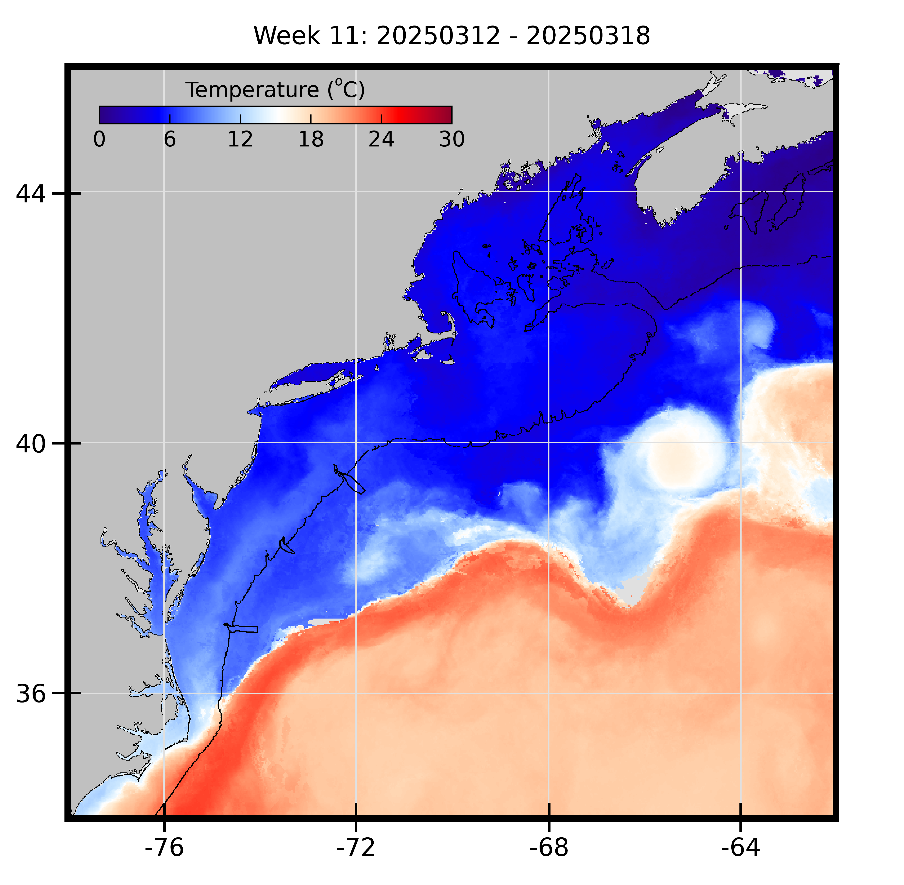
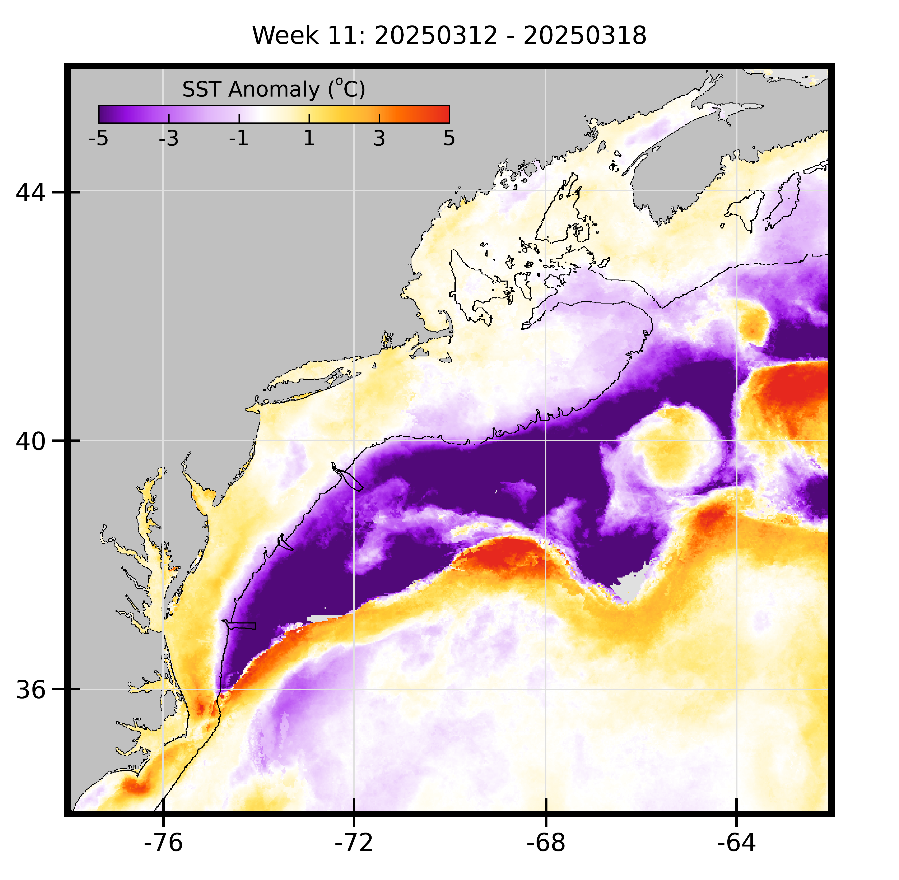
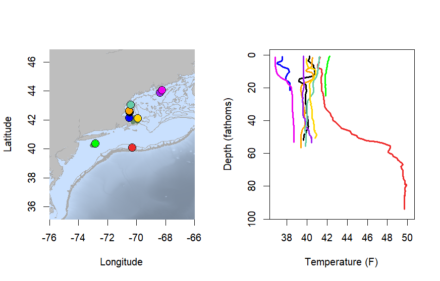
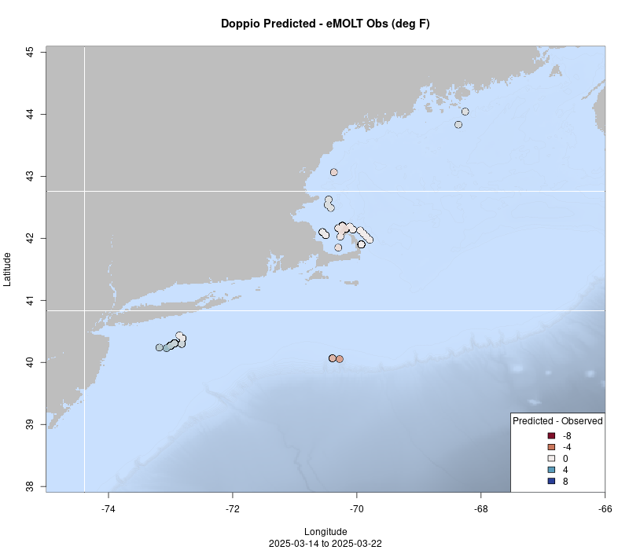
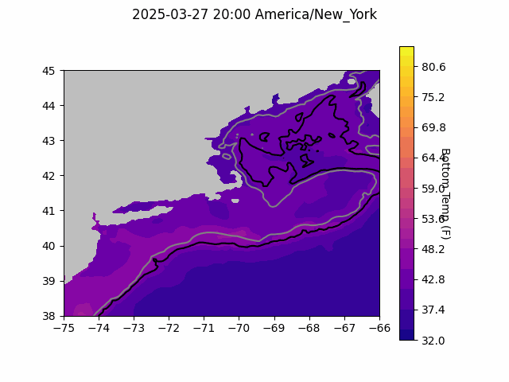
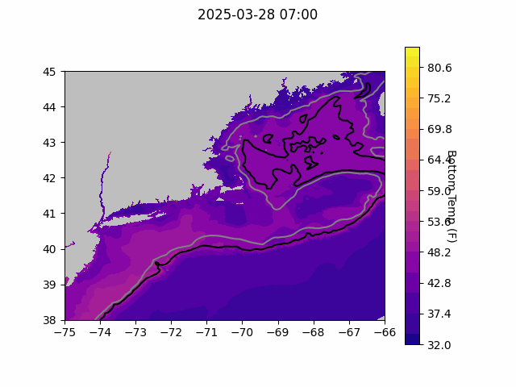
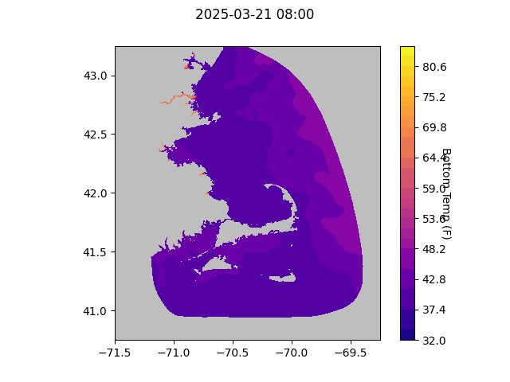

```{r setup, include=FALSE}
knitr::opts_chunk$set(echo = TRUE)
library(marmap)
library(rstudioapi)
if(Sys.info()["sysname"]=="Windows"){
  source("C:/Users/george.maynard/Documents/GitHubRepos/emolt_project_management/WeeklyUpdates/forecast_check/R/emolt_download.R")
} else {
  source("/home/george/Documents/emolt_project_management/WeeklyUpdates/forecast_check/R/emolt_download.R")
}

data=emolt_download(days=7)
start_date=Sys.Date()-lubridate::days(7)
## Use the dates from above to create a URL for grabbing the data
full_data=read.csv(
    paste0(
      "https://erddap.emolt.net/erddap/tabledap/eMOLT_RT.csvp?tow_id%2Csegment_type%2Ctime%2Clatitude%2Clongitude%2Cdepth%2Ctemperature%2Csensor_type&segment_type=%22Fishing%22&time%3E=",
      lubridate::year(start_date),
      "-",
      lubridate::month(start_date),
      "-",
      lubridate::day(start_date),
      "T00%3A00%3A00Z&time%3C=",
      lubridate::year(Sys.Date()),
      "-",
      lubridate::month(Sys.Date()),
      "-",
      lubridate::day(Sys.Date()),
      "T23%3A59%3A59Z"
    )
  )
sensor_time=0
for(tow in unique(full_data$tow_id)){
  x=subset(full_data,full_data$tow_id==tow)
  sensor_time=sensor_time+difftime(max(x$time..UTC.),units='hours',min(x$time..UTC.))
}
```

<center> 

<font size="5"> *eMOLT Update `r Sys.Date()` * </font>

</center>

## Weekly Recap 

With [new red tape created regarding Federal employee travel](https://www.whitehouse.gov/presidential-actions/2025/02/implementing-the-presidents-department-of-government-efficiency-cost-efficiency-initiative/), we're struggling a little to get to some ports. For example, getting out to Martha's Vineyard to engage with fishermen on the island is presenting a bit of a challenge because ferry tickets cost more than $1 ([our new, DOGE-implemented credit card limit](https://www.wired.com/story/doge-elon-musk-spending-cuts-federal-workers/)). Because the initial setup of deckboxes isn't always a smooth process -- just ask Captain Bill of the F/V Eleanor Kathryn -- we prefer to make sure someone from the eMOLT tech team is on site during the installation, which mean we may have to postpone installations in some locations temporarily unless we can get other partners to cover for us. 

Wind and weather earlier this week slowed down data collection at sea a bit this week, but we've been busy in the lab, working on data products and data requests to support multiple assessment teams here at NEFSC as well as collaborators outside the agency at Commercial Fisheries Research Foundation, New Hampshire Fish and Game Department, and several fishing businesses.  

Plots of sea surface temperatures for the region from Dr. Kim Hyde in the Ecosystem Dynamics and Assessment Branch show some interesting features this week, with a large warm core ring around -65 (W), 40 (N), cold water all along the shelf slope down to about 36 (N), and some warmer water pushing up along the shelf north of Cape Hatteras. 



>*Figure 1a -- Sea Surface Temps for the region (Celsius) over the last week*.

The anomaly plot is even more striking, with the cold water showing up as substantially colder than normal (purple). 



>*Figure 1b -- Sea surface temperature anomalies for the region over the last week*.

This week, the eMOLT fleet recorded `r length(unique(full_data$tow_id))` tows of sensorized fishing gear totaling `r as.numeric(sensor_time)` sensor hours underwater. The warmest recorded bottom temperature was `r round(max(full_data$temperature..degree_C.)*9/5+32,1)` F near Atlantis Canyon in approximately `r round(full_data[which(full_data$temperature..degree_C.==max(full_data$temperature..degree_C.)),"depth..m."]*0.546807,0)` fathoms (red profile) and the coldest recorded bottom temperature was `r round(min(full_data$temperature..degree_C.)*9/5+32,1)` F in Cape Cod Bay in approximately `r round(full_data[which(full_data$temperature..degree_C.==min(full_data$temperature..degree_C.)),"depth..m."]*0.546807,0)[1]` fathoms (blue profile). Below, you can see these profiles plus a few other temperature profiles of interest across the region from the last week. 



> *Figure 2 -- Temperature profiles collected by eMOLT participants over the last week. The blue profile is where the coldest bottom temperature was measured and the red profile is where the warmest bottom temperature was measured. All other colors are assigned randomly. Colored points on the map indicate where profiles of the same color were collected. The small dark green dots represent other profiles collected this week, but not highlighted in the plot. Note that the warmest / coldest bottom temperatures measured could have occurred during gear soaks, which are not represented on this profile plot.*

### System Hardware Upgrade List

The following vessels remain on our list for hardware upgrades. If you aren't on the list and think you should be, please reach out. *Note that this list is different from our new install queue.*

>
 - F/V Kaitlyn Victoria
 - F/V Kyler C
 - F/V Noella C
 - F/V Sea Watcher I

### Bottom Temperature Forecasts

#### Doppio 

This week, 76.6% of bottom temperature observations were within 2 degrees (F) of the Doppio forecasted value at those points, with strong agreement around Cape Cod north along the coast into Maine. Temps were warmer than expected out near Atlantis Canyon and cooler than expected south of Long Island. 



> *Figure 3 -- Performance of the Doppio forecast's bottom temperature layer over the last week relative to observations collected by eMOLT participants. Red dots indicate areas where bottom temperature observations were warmer that predicted. Blue dots indicate areas where bottom temperature observations were cooler than predicted. Bottom temperature observations are compared with the most recent forecast run available before the observation was made.* 



> *Figure 4 -- The most recent Doppio bottom temperature forecast. The gray line is the 50 fathom line and the black line is the hundred fathom line. Purple shades indicate cooler water.*

#### Northeast Coastal Ocean Forecast System



> *Figure 5 -- The most recent bottom temperature forecast from the Northeast Coastal Ocean Forecast System GOM7 model. The gray line is the 50 fathom line and the black line is the hundred fathom line. Purple shades indicate cooler water.*



> *Figure 6 -- The most recent bottom temperature forecast from the Northeast Coastal Ocean Forecast System MassBay model. Purple shades indicate cooler water.*

## Announcements

### NOAA Fisheries Opens Public Comment on Proposed Atlantic Scallop Rule

NOAA Fisheries is announcing a public comment period on a proposed rule to set specifications and management measures for the Atlantic Sea Scallop fishery for the 2025 fishing year (April 1, 2025 – March 31, 2026) that would result in projected landings of 18 million pounds. We will be accepting public comment on this proposed rule through April 2, 2025 through our [online portal](https://links-1.govdelivery.com/CL0/https:%2F%2Fwww.federalregister.gov%2Fdocuments%2F2025%2F03%2F18%2F2025-04276%2Ffisheries-of-the-northeastern-united-states-framework-adjustment-39-to-the-atlantic-sea-scallop). You can see the [full text of Framework 39 here](https://www.federalregister.gov/documents/2025/03/18/2025-04276/fisheries-of-the-northeastern-united-states-framework-adjustment-39-to-the-atlantic-sea-scallop).

### Join us for a "Sip o' Science" at Aquatic Brewing Company

Join us for a Sip o' Science on Wednesday 3/26 at 5:30 PM at [Aquatic Brewing Company in Falmouth, MA](https://maps.app.goo.gl/6oTA2rLBuLff2eyZ9) and learn how fishermen and scientists work together to monitor the ocean!

Center for Coastal Studies Marine Fisheries Research Director Owen Nichols and George Maynard, coordinator of the Environmental Monitors on Lobster Traps and Large Trawlers (eMOLT) program at the Northeast Fisheries Science Center, will be joining Captain Doug Feeney of the Chatham Harvesters Cooperative for Wednesday evening's Sip o' Science event at the Aquatic Brewing Company. Owen, George, and Captain Doug will talk about how they work together to deploy environmental sensors on fishing gear that measure ocean conditions and water quality while bringing fresh seafood to our plates!

### Sea Scallop Industry Workshops Coming Up in March

NOAA scientists are collaborating with scallop fishermen, the Commercial Fisheries Research Foundation, and the University of Connecticut to understand changing oceanographic conditions, impacts on scallop fishing communities, and what we can do to adapt. This is a continuation of a series of stakeholder workshops that began in 2021. The 2025 workshops will be in late March in New Bedford MA (3/24), Gloucester Point VA (3/27) and Barnegat Light NJ (3/28). Please check out [this website](https://www.fisheries.noaa.gov/new-england-mid-atlantic/climate/understanding-atlantic-sea-scallops-and-ocean-acidification) for more info.

### Contribute to the 2026 Management Track Fishery Stock Assessments

The Northeast Fisheries Science Center seeks input from our regional assessment partners, including the fishing industry (commercial and recreational), state agency scientists, academic researchers, and interested members of the public to help guide development of our next [Management Track Assessments](https://links-1.govdelivery.com/CL0/https:%2F%2Fwww.fisheries.noaa.gov%2Fnew-england-mid-atlantic%2Fpopulation-assessments%2Fmanagement-track-stock-assessments%3Futm_medium=email%26utm_source=govdelivery/1/01000194fef87a4b-77d6ccd3-5a1a-4eb1-b540-f77f545ba60e-000000/ZeMgO83aO-hzSXHaHdKeoVtkRJYCB7U8ddMVEkaJkm4=392). 

Specifically, the NEFSC is looking for on-the-water observations or data sets on topics such as distribution, stock health, fishing dynamics and management, and the role these stocks play in the ecosystem. 

- Submit your comments through the [community input form](https://links-1.govdelivery.com/CL0/https:%2F%2Fforms.gle%2FBrH28as6HhERVTnL6%3Futm_medium=email%26utm_source=govdelivery/1/01000194fef87a4b-77d6ccd3-5a1a-4eb1-b540-f77f545ba60e-000000/J3norb57-iYKlrXBQ74ItB9OMBBXv9ZUqcpxeZ10abg=392), which is open through April 30, 2025

June 2026 Management Track Stocks include

- Atlantic herring
- Butterfish
- Georges Bank Atlantic cod
- Georges Bank haddock
- Longfin inshore squid
- Ocean quahog

### Disclaimer

The eMOLT Update is NOT an official NOAA document. Mention of products or manufacturers does not constitute an endorsement by NOAA or Department of Commerce. The content of this update reflects only the personal views of the authors and does not necessarily represent the views of NOAA Fisheries, the Department of Commerce, or the United States.


All the best,

-George and JiM
