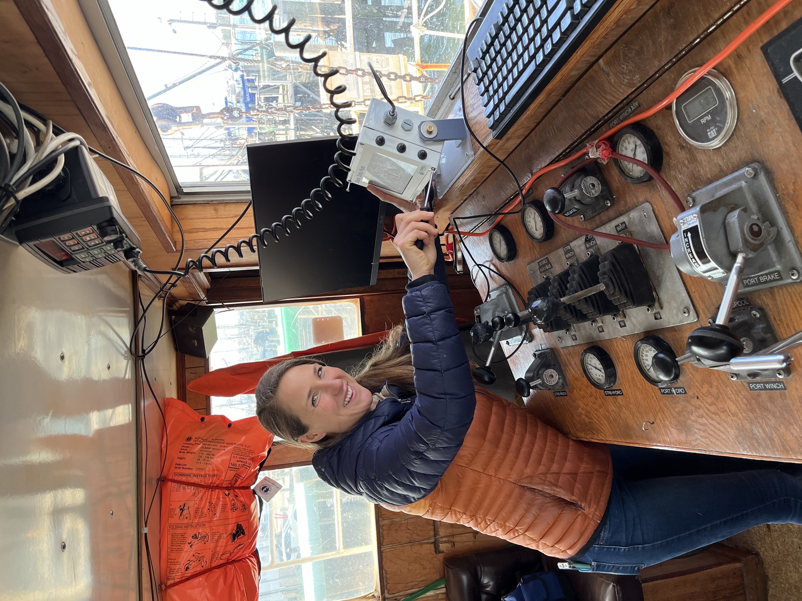

```{r setup, include=FALSE}
knitr::opts_chunk$set(echo = TRUE)
library(marmap)
library(rstudioapi)
if(Sys.info()["sysname"]=="Windows"){
  source("C:/Users/george.maynard/Documents/GitHubRepos/emolt_project_management/WeeklyUpdates/forecast_check/R/emolt_download.R")
} else {
  source("/home/george/Documents/emolt_project_management/WeeklyUpdates/forecast_check/R/emolt_download.R")
}

data=emolt_download(days=7)
start_date=Sys.Date()-lubridate::days(7)
## Use the dates from above to create a URL for grabbing the data
full_data=read.csv(
    paste0(
      "https://erddap.emolt.net/erddap/tabledap/eMOLT_RT.csvp?tow_id%2Csegment_type%2Ctime%2Clatitude%2Clongitude%2Cdepth%2Ctemperature%2Csensor_type&segment_type=%22Fishing%22&time%3E=",
      lubridate::year(start_date),
      "-",
      lubridate::month(start_date),
      "-",
      lubridate::day(start_date),
      "T00%3A00%3A00Z&time%3C=",
      lubridate::year(Sys.Date()),
      "-",
      lubridate::month(Sys.Date()),
      "-",
      lubridate::day(Sys.Date()),
      "T23%3A59%3A59Z"
    )
  )
sensor_time=0
for(tow in unique(full_data$tow_id)){
  x=subset(full_data,full_data$tow_id==tow)
  sensor_time=sensor_time+difftime(max(x$time..UTC.),units='hours',min(x$time..UTC.))
}
```

<center> 

<font size="5"> *eMOLT Update `r Sys.Date()` * </font>

</center>

## Weekly Recap 

We started our efforts to transfer all Study Fleet environmental data collection over to the eMOLT data pipeline this week down in Point Judith aboard the F/V Cody and F/V Lightning Bay. Thanks to Captains Jay and Robert for allowing us aboard on short notice while they were getting ready to head out. Thanks also to Cooperative Research Branch Chief Dr. Anna Mercer for coming along to lend a hand.



>*Figure -- Anna reassembles the deckbox aboard the F/V Lightning Bay after the upgrade.*

Travel continues to tighten up for those of us employed by the federal government. We are currently limited to locations within a 50 mile drive of a lab. This means that while Point Judith and Newport remain allowable, much of the South Shore (north of the North River) and the Outer Cape (north of Chatham) are now out of bounds for "local travel". Try not to think too hard about whether that makes sense. We'll continue to try to make the best of things. A big thanks to all of our field partners who are picking up the slack here.

- Dr. Andrew Goode at the University of Maine is filling in for George at a meeting with lobstermen in Ellsworth in a few weeks
- Erin Pelletier and Emma Weed installed a few systems on their way back north after the Seafood Expo and have plans to head Downeast to work on a few boats after the Ellsworth meeting
- Huanxin Xu will be heading up to Cohasset to meet with Captain Joe on the F/V Ryan Joseph and do a little hardware maintenance for him in the near future
- After a fortuitous meeting at the Massachusetts Lobstermen's Association trade show a few months back, Eric Hryniewicz from [Waterfront](https://info.waterfrontapp.com/) has been a huge help coordinating eMOLT installs with several scallop and clam boats 

I also need to give a shout out to Captain Bill on the F/V Eleanor Kathryn, who went above and beyond to get his eMOLT system running way Downeast earlier this week. Thanks to the ongoing travel issues, it was unlikely that anyone from the eMOLT program was going to be able to get out to service Bill's system until the middle of next month. With spotty cell reception on his mooring, Captain Bill uninstalled his eMOLT system and tossed it in his truck, drove to a spot where he knew the deckbox would have service, then wired it into his truck so that I could log in remotely and straighten out the software. The ingenuity and tenacity of our partners in the fishing industry is always an inspiration. Thanks for all your efforts, Bill!

This week, the eMOLT fleet recorded `r length(unique(full_data$tow_id))` tows of sensorized fishing gear totaling `r as.numeric(sensor_time)` sensor hours underwater. The warmest recorded bottom temperature was `r round(max(full_data$temperature..degree_C.)*9/5+32,1)` F near Welker Canyon in approximately `r round(full_data[which(full_data$temperature..degree_C.==max(full_data$temperature..degree_C.)),"depth..m."]*0.546807,0)` fathoms (red profile) and the coldest recorded bottom temperature was `r round(min(full_data$temperature..degree_C.)*9/5+32,1)` F off Provincetown in approximately `r round(full_data[which(full_data$temperature..degree_C.==min(full_data$temperature..degree_C.)),"depth..m."]*0.546807,0)[1]` fathoms (blue profile). Below, you can see these profiles plus a few other temperature profiles of interest across the region from the last week. 


> *Figure 2 -- Temperature profiles collected by eMOLT participants over the last week. The blue profile is where the coldest bottom temperature was measured and the red profile is where the warmest bottom temperature was measured. All other colors are assigned randomly. Colored points on the map indicate where profiles of the same color were collected. The small dark green dots represent other profiles collected this week, but not highlighted in the plot. Note that the warmest / coldest bottom temperatures measured could have occurred during gear soaks, which are not represented on this profile plot.*

### Multi-generation eMOLT Partnership Continues Collecting Data

A big thanks to the Souza family (F/V Crash, F/V Rachel Christine, and formerly F/V Raider III) for their efforts in support of the eMOLT program. Data from a sensor they've deployed in 15 fathoms off Cape Cod for 22 years shows that 2024 bottom temps were much colder than 2023 or average values in the summer, with a later turnover in the fall. 


>*Figure 3 -- range and average of bottom temperatures observed at the Souza family's site from 2002-2024 with 2023 (green) and 2024 (black) records highlighted.*

### New Publication on Black Sea Bass Catch Rates

*Guest write up from Dr. Andy Jones, a Cooperative Research Branch scientist at the NMFS Narragansett Lab*

[**Combining sources of high-resolution fishery-dependent data from the northeast United States to develop a catch rate time series**](https://academic.oup.com/icesjms/article/82/3/fsaf032/8090017)

This paper comes from the Cooperative Research Branch’s work on the black sea bass research track assessment and outlines a method for using commercial catches to build indices of species abundance (similar to a survey index).  We used bottom temperature information help standardize catches and develop the new catch-per-unit-effort (CPUE) indices. Having data collected by partners in the NEFSC Study Fleet and eMOLT program was vital for the study as it allowed for a comparison to modeled bottom temperatures, and including bottom temperature in the CPUE standardization helped to better estimate catch-rates! We hope to carry this work forward into the future assessments, and continue to use the bottom temperature data as a variable in index standardizations for other species.


> *Figure 4 -- Dr. Andy Jones aboard the F/V Darana R conducting research in support of the Northeast Trawl Advisory Panel.*

### Atlantic Surfclams' Response to a Changing Environment

Given the number of surfclammers currently engaged in the eMOLT program, we thought it was worth mentioning that the scientists from the [Resource Evaluation and Assessment Division](https://www.fisheries.noaa.gov/about/resource-evaluation-and-assessment-northeast) and the [Ecosystems and Aquaculture Division](https://www.fisheries.noaa.gov/about/ecosystems-and-aquaculture-northeast) at the Northeast Fisheries Science Center is working with several towns in Massachusetts, Massachusetts Maritime Academy, and the Massachusetts Department of Conservation and Recreation to better understand surfclam growth and survival under different environmental conditions. To learn more and get in touch with the scientists involved in the work, you can check out the project website [here](https://www.fisheries.noaa.gov/new-england-mid-atlantic/climate/atlantic-surfclams-response-changing-environment?utm_medium=email&utm_source=govdelivery#collaborators-and-partners).

### System Hardware Upgrade List

The following vessels remain on our list for hardware upgrades. If you aren't on the list and think you should be, please reach out. *Note that this list is different from our new install queue.*

>
 - F/V Kaitlyn Victoria
 - F/V Kyler C
 - F/V Noella C
 - F/V Sea Watcher I

### Bottom Temperature Forecasts

#### Doppio 

This week, 91.9% of bottom temperature observations were within 2 degrees (F) of the Doppio forecasted value at those points. This exceptionally high number was driven by the spatial clustering of observations in areas where the model performed well (off Provincetown, MA and south of Long Island). Bottom temps were warmer than expected along the shelf break, where fewer observations were collected.  


> *Figure 5 -- Performance of the Doppio forecast's bottom temperature layer over the last week relative to observations collected by eMOLT participants. Red dots indicate areas where bottom temperature observations were warmer that predicted. Blue dots indicate areas where bottom temperature observations were cooler than predicted. Bottom temperature observations are compared with the most recent forecast run available before the observation was made.* 


> *Figure 6 -- The most recent Doppio bottom temperature forecast. The gray line is the 50 fathom line and the black line is the hundred fathom line. Purple shades indicate cooler water.*

#### Northeast Coastal Ocean Forecast System


> *Figure 7 -- The most recent bottom temperature forecast from the Northeast Coastal Ocean Forecast System GOM7 model. The gray line is the 50 fathom line and the black line is the hundred fathom line. Purple shades indicate cooler water.*


> *Figure 8 -- The most recent bottom temperature forecast from the Northeast Coastal Ocean Forecast System MassBay model. Purple shades indicate cooler water.*

## Announcements

### CRB is Compiling a List of Vessels Interested in Cooperative Research

In an effort to expand partnerships between fishermen and scientists, we are ramping up a new initiative to create a list of fishing vessels interested in participating in cooperative research. We have created forms for vessels to sign up to participate in cooperative research, from environmental monitoring to biological sampling to industry based surveys to conservation gear engineering ... the opportunities are endless! Many scientists want to work with fishermen, but it is difficult to know who to contact or where to start. The intent of this effort is to make connections between scientists and fishing industry members.

- If you already participate in cooperative research and want to continue to do so, please fill out [this form](https://docs.google.com/forms/d/1Mi2Ya12T5eGRlqyhuHiB2452J37gYRr5dlzv4rl7G88/viewform?edit_requested=true)
- If you do not currently participate in cooperative research, but want to, please fill out [this form](https://docs.google.com/forms/d/1Mi2Ya12T5eGRlqyhuHiB2452J37gYRr5dlzv4rl7G88/viewform?edit_requested=true) 
- If you know other captains or owners who are interested in participating in cooperative research, please share this [form/link](https://docs.google.com/forms/d/1Mi2Ya12T5eGRlqyhuHiB2452J37gYRr5dlzv4rl7G88/viewform?edit_requested=true) with them
- If you don't want to deal with an online form but want to sign up, call Anna Mercer (774-392-7603)
 
None of the information provided through this form will be shared publicly. It will only be used to make connections between individual researchers and fishermen. We hope this effort will expand collaboration opportunities for the years to come!

### Ocean Data Tools Workshop -- Stipend Available for Fishermen

April 17, 2025 -- Ellsworth, ME

The Gulf of Maine Lobster Foundation and the Northeastern Regional Association of Coastal Ocean Observing Systems (NERACOOS) are excited to walk through various ocean data tools and hear feedback on how they could better support your fishing decisions. Your expertise and ideas are crucial in making these tools more useful and effective! What's in it for you?

- A $750 stipend, mileage reimbursement, and hotel reimbursement. We value your expertise and want the workshop to be worth your time. 
- Information! Learn about ocean data tools available in our region to support your on the water decisions
- Discussion Forum! Time to discuss environmental changes you are seeing on the water.

To learn more about the workshop or register, please click [here](https://docs.google.com/forms/d/e/1FAIpQLSekgg45sbuuqgs1OXb2niZp7vyN7HzF-cwLXKcklZO_RftLxA/viewform?usp=preview)

### Fishing Partnership Support Services Spring Trainings Underway

For more information or to register for any of the training sessions below, please visit [the FPSS website here](https://fishingpartnership.org/calendar/).


### NOAA Fisheries Opens Public Comment on Proposed Atlantic Scallop Rule

NOAA Fisheries is announcing a public comment period on a proposed rule to set specifications and management measures for the Atlantic Sea Scallop fishery for the 2025 fishing year (April 1, 2025 – March 31, 2026) that would result in projected landings of 18 million pounds. We will be accepting public comment on this proposed rule through April 2, 2025 through our [online portal](https://links-1.govdelivery.com/CL0/https:%2F%2Fwww.federalregister.gov%2Fdocuments%2F2025%2F03%2F18%2F2025-04276%2Ffisheries-of-the-northeastern-united-states-framework-adjustment-39-to-the-atlantic-sea-scallop). You can see the [full text of Framework 39 here](https://www.federalregister.gov/documents/2025/03/18/2025-04276/fisheries-of-the-northeastern-united-states-framework-adjustment-39-to-the-atlantic-sea-scallop).

### Contribute to the 2026 Management Track Fishery Stock Assessments

The Northeast Fisheries Science Center seeks input from our regional assessment partners, including the fishing industry (commercial and recreational), state agency scientists, academic researchers, and interested members of the public to help guide development of our next [Management Track Assessments](https://links-1.govdelivery.com/CL0/https:%2F%2Fwww.fisheries.noaa.gov%2Fnew-england-mid-atlantic%2Fpopulation-assessments%2Fmanagement-track-stock-assessments%3Futm_medium=email%26utm_source=govdelivery/1/01000194fef87a4b-77d6ccd3-5a1a-4eb1-b540-f77f545ba60e-000000/ZeMgO83aO-hzSXHaHdKeoVtkRJYCB7U8ddMVEkaJkm4=392). 

Specifically, the NEFSC is looking for on-the-water observations or data sets on topics such as distribution, stock health, fishing dynamics and management, and the role these stocks play in the ecosystem. 

- Submit your comments through the [community input form](https://links-1.govdelivery.com/CL0/https:%2F%2Fforms.gle%2FBrH28as6HhERVTnL6%3Futm_medium=email%26utm_source=govdelivery/1/01000194fef87a4b-77d6ccd3-5a1a-4eb1-b540-f77f545ba60e-000000/J3norb57-iYKlrXBQ74ItB9OMBBXv9ZUqcpxeZ10abg=392), which is open through April 30, 2025

June 2026 Management Track Stocks include

- Atlantic herring
- Butterfish
- Georges Bank Atlantic cod
- Georges Bank haddock
- Longfin inshore squid
- Ocean quahog

### Disclaimer

The eMOLT Update is NOT an official NOAA document. Mention of products or manufacturers does not constitute an endorsement by NOAA or Department of Commerce. The content of this update reflects only the personal views of the authors and does not necessarily represent the views of NOAA Fisheries, the Department of Commerce, or the United States.


All the best,

-George and JiM
