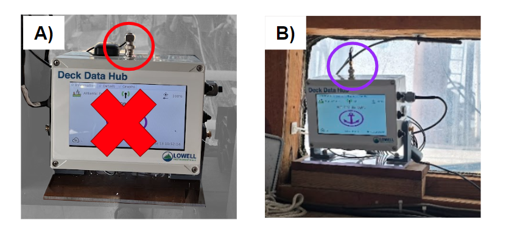
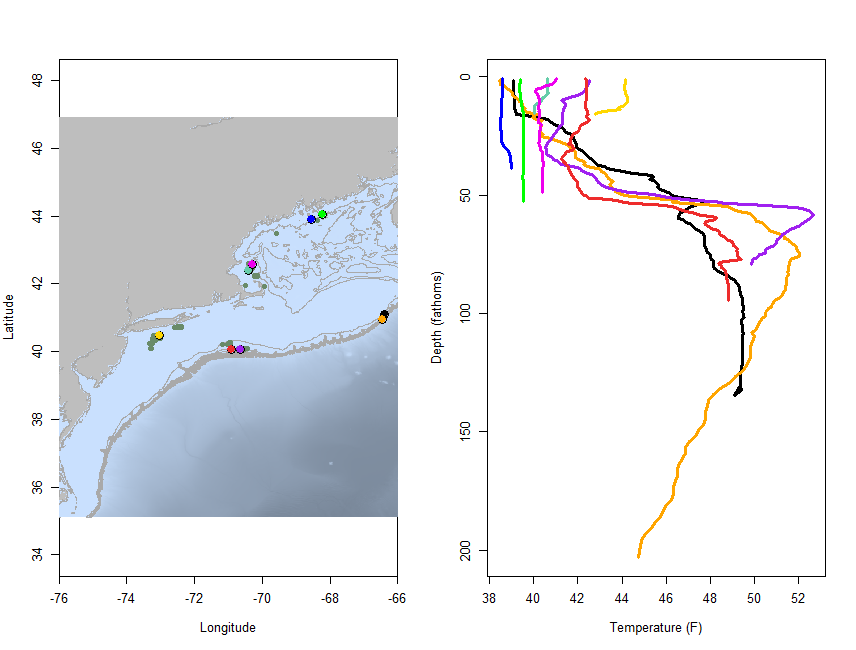
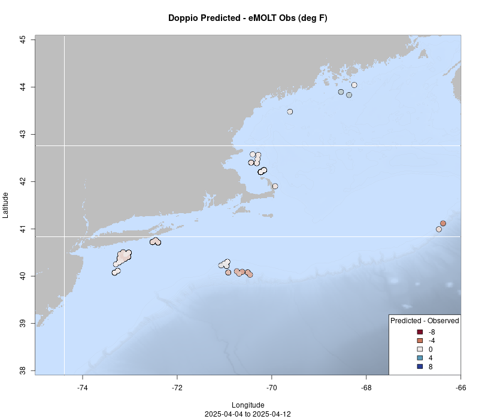
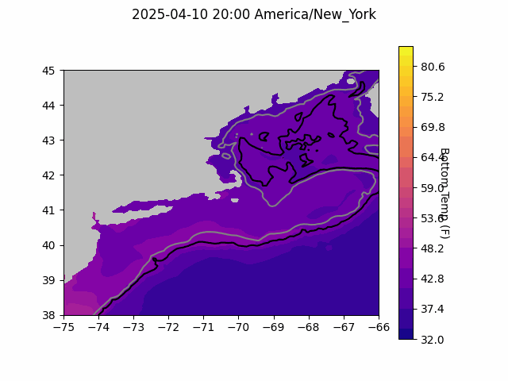
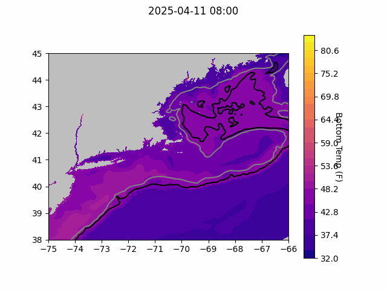
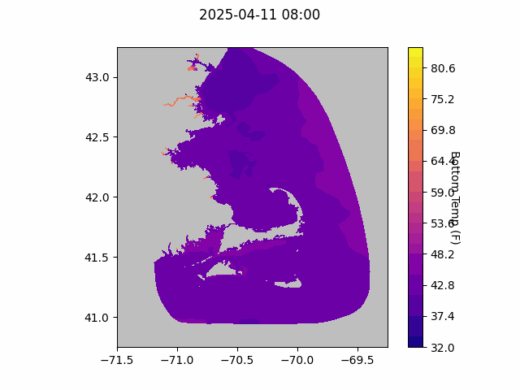

```{r setup, include=FALSE}
knitr::opts_chunk$set(echo = TRUE)
library(marmap)
library(rstudioapi)
if(Sys.info()["sysname"]=="Windows"){
  source("C:/Users/george.maynard/Documents/GitHubRepos/emolt_project_management/WeeklyUpdates/forecast_check/R/emolt_download.R")
} else {
  source("/home/george/Documents/emolt_project_management/WeeklyUpdates/forecast_check/R/emolt_download.R")
}

data=emolt_download(days=7)
start_date=Sys.Date()-lubridate::days(7)
## Use the dates from above to create a URL for grabbing the data
full_data=read.csv(
    paste0(
      "https://erddap.emolt.net/erddap/tabledap/eMOLT_RT.csvp?tow_id%2Csegment_type%2Ctime%2Clatitude%2Clongitude%2Cdepth%2Ctemperature%2Csensor_type&segment_type=%22Fishing%22&time%3E=",
      lubridate::year(start_date),
      "-",
      lubridate::month(start_date),
      "-",
      lubridate::day(start_date),
      "T00%3A00%3A00Z&time%3C=",
      lubridate::year(Sys.Date()),
      "-",
      lubridate::month(Sys.Date()),
      "-",
      lubridate::day(Sys.Date()),
      "T23%3A59%3A59Z"
    )
  )
sensor_time=0
for(tow in unique(full_data$tow_id)){
  x=subset(full_data,full_data$tow_id==tow)
  sensor_time=sensor_time+difftime(max(x$time..UTC.),units='hours',min(x$time..UTC.))
}
```

<center> 

<font size="5"> *eMOLT Update `r Sys.Date()` * </font>

</center>

## Weekly Recap 

A new process required for approving even virtual international engagements is currently holding up my work with the [Fishing Vessel Ocean observing Network (FVON)](https://fvon.org/), so apologies to our international colleagues waiting on movement there. This emergning network of the Global Ocean Observing System is working to help develop best practices for instrumenting fishing vessels with oceanographic sensors. There's a lot of cool tech out there around the world like ferryboxes deployed on Portuguese blue water trawlers, ADCPs on fishing boats in Japan, multiparameter sensors on pelagic trawlers and seiners in Italy, and Moana TD systems spanning the globe from Australia to the Bahamas. FVON has also been in communication with other Global Ocean Observing System networks like [Argo](https://argo.ucsd.edu/) about data best practices so that data collected by fishermen can be high quality and standardized enough to be complimentary to more expensive, traditional ocean observing programs. Participating in groups like this increases our efficiency because we have to spend less time spent solving problems or reinventing wheels that other programs have already figured out. It also increases both the hardware options and data visualizations that we're able to offer our industry partners by providing opportunities to learn from other regions, and with virtual meetings, there's no costs to participate. We hope to keep a seat at the table for eMOLT moving forward. 

While we didn't spend much time on boats this week, it was a busy time back in the office. Huanxin and I worked on some example data visualizations for the marine data products meeting hosted by NERACOOS in Ellsworth, ME next Thursday. If you're a fishermen up in Maine and have ideas about how we can make data more useful to you, or just want to learn what tools are available, you can [sign up here](https://docs.google.com/forms/d/e/1FAIpQLSekgg45sbuuqgs1OXb2niZp7vyN7HzF-cwLXKcklZO_RftLxA/viewform?usp=preview). Travel stipends, lodging, and food are provided for industry members. Huanxin and I will be joining remotely from Woods Hole because of the current restrictions on travel to meetings. 

Carles from Ocean Data Network finished upgrading the data pipeline from the realtime eMOLT database to the Gulf of Maine Lobster Foundation's [ERDDAP server](https://erddap.emolt.net/erddap/info/index.html?page=1&itemsPerPage=1000). Now, instead of pushing the anonymized, QAQC'd data out to ERDDAP as .csv files (comma-delimited text files), the data arrive as .nc (netCDF -- network common data form files). While this change is mostly invisible to people pulling data from the ERDDAP server, it results in substantial performance improvements, with download times decreasing by 30-40%. 

Over at the Commercial Fisheries Research Foundation, Linus has been working on improving the serverside routines for FIShBOT, a gridded, in-situ bottom temperature product for our region jointly developed by Linus, Sarah Salois, Mike Morin, and me. We're also plugging away on a NOAA Tech Memo to describe the data processing behind this product, so stay tuned for more info.

The teams at Lowell Instruments, Coonamessett Farm Foundation, and Rutgers University identified a hardware problem that may impact your deckbox if you have an external GPS receiver. Some of these systems were installed with a 90 degree BNC connector. Several of these connectors have failed unexpectedly, causing the box to display error messages and lose contact with GPS satellites. Luckily, the fix is easy, just remove the 90 degree adapter and connect the antenna directly to the box (see pictures below).



> *Figure 1 -- A) a 90 degree BNC connector means the antenna wire will point off to the side or back of the box. This connector can fail and should be removed. B) Once the connector is removed, the antenna wire will point straight up.*

Here at the NEFSC lab in Woods Hole, Hannah C. from the Bottom Longline Survey team has been lending a hand prepping all of the dissolved oxygen sensors for deployment in the next few months. This process involves cleaning biofouling off, replacing batteries and dessicant packs, greasing or replacing o-rings, and running calibration checks to see if the sensor heads need to be replaced. We also had our first Cooperative Research Branch survival suit races in preparation for the upcoming field season. Groundfish conversion project scientist Dan G. blew most of us out of the water, with a time of 32 seconds and Lizzie A. from the Hook and Line Survey team came in a close second. I finished last with a (barely) buzzer beater 60 second time. Guess I've got some practicing to do. 

This week, the eMOLT fleet recorded `r length(unique(full_data$tow_id))` tows of sensorized fishing gear totaling `r as.numeric(sensor_time)` sensor hours underwater. The warmest recorded bottom temperature was `r round(max(full_data$temperature..degree_C.)*9/5+32,1)` F east of Block Canyon in approximately `r round(full_data[which(full_data$temperature..degree_C.==max(full_data$temperature..degree_C.)),"depth..m."]*0.546807,0)` fathoms (red profile) and the coldest recorded bottom temperature was `r round(min(full_data$temperature..degree_C.)*9/5+32,1)` F east of Three Fathom Ledge in approximately `r round(full_data[which(full_data$temperature..degree_C.==min(full_data$temperature..degree_C.)),"depth..m."]*0.546807,0)[1]` fathoms (blue profile). Below, you can see these profiles plus a few other temperature profiles of interest across the region from the last week. 



> *Figure 2 -- Temperature profiles collected by eMOLT participants over the last week. The blue profile is where the coldest bottom temperature was measured and the red profile is where the warmest bottom temperature was measured. All other colors are assigned randomly. Colored points on the map indicate where profiles of the same color were collected. The small dark green dots represent other profiles collected this week, but not highlighted in the plot. Note that the warmest / coldest bottom temperatures measured could have occurred during gear soaks, which are not represented on this profile plot.*

### System Hardware Upgrade List

The following vessels remain on our list for hardware upgrades. If you aren't on the list and think you should be, please reach out. *Note that this list is different from our new install queue.*

>
 - F/V Kaitlyn Victoria
 - F/V Kyler C
 - F/V Noella C
 - F/V Sea Watcher I

### Bottom Temperature Forecasts

#### Doppio 

This week, 95.1% of bottom temperature observations were within 2 degrees (F) of the Doppio forecasted value at those points. Most of the tows this week took place in areas where the model has performed well previously (in Massachusetts Bay and south of Long Island). Temps off Isle Au Haut were cooler than expected, and temps along the shelf break south of New England were warmer than expected.  



> *Figure 3 -- Performance of the Doppio forecast's bottom temperature layer over the last week relative to observations collected by eMOLT participants. Red dots indicate areas where bottom temperature observations were warmer that predicted. Blue dots indicate areas where bottom temperature observations were cooler than predicted. Bottom temperature observations are compared with the most recent forecast run available before the observation was made.* 



> *Figure 4 -- The most recent Doppio bottom temperature forecast. The gray line is the 50 fathom line and the black line is the hundred fathom line. Purple shades indicate cooler water.*

#### Northeast Coastal Ocean Forecast System



> *Figure 5 -- The most recent bottom temperature forecast from the Northeast Coastal Ocean Forecast System GOM7 model. The gray line is the 50 fathom line and the black line is the hundred fathom line. Purple shades indicate cooler water.*



> *Figure 6 -- The most recent bottom temperature forecast from the Northeast Coastal Ocean Forecast System MassBay model. Purple shades indicate cooler water.*

## Announcements

### CRB is Compiling a List of Vessels Interested in Cooperative Research

In an effort to expand partnerships between fishermen and scientists, we are ramping up a new initiative to create a list of fishing vessels interested in participating in cooperative research. We have created forms for vessels to sign up to participate in cooperative research, from environmental monitoring to biological sampling to industry based surveys to conservation gear engineering ... the opportunities are endless! Many scientists want to work with fishermen, but it is difficult to know who to contact or where to start. The intent of this effort is to make connections between scientists and fishing industry members.

- If you already participate in cooperative research and want to continue to do so, please fill out [this form](https://docs.google.com/forms/d/1Mi2Ya12T5eGRlqyhuHiB2452J37gYRr5dlzv4rl7G88/viewform?edit_requested=true)
- If you do not currently participate in cooperative research, but want to, please fill out [this form](https://docs.google.com/forms/d/1Mi2Ya12T5eGRlqyhuHiB2452J37gYRr5dlzv4rl7G88/viewform?edit_requested=true) 
- If you know other captains or owners who are interested in participating in cooperative research, please share this [form/link](https://docs.google.com/forms/d/1Mi2Ya12T5eGRlqyhuHiB2452J37gYRr5dlzv4rl7G88/viewform?edit_requested=true) with them
- If you don't want to deal with an online form but want to sign up, call Anna Mercer (774-392-7603)
 
None of the information provided through this form will be shared publicly. It will only be used to make connections between individual researchers and fishermen. We hope this effort will expand collaboration opportunities for the years to come!

### Ocean Data Tools Workshop -- Stipend Available for Fishermen

April 17, 2025 -- Ellsworth, ME

The Gulf of Maine Lobster Foundation and the Northeastern Regional Association of Coastal Ocean Observing Systems (NERACOOS) are excited to walk through various ocean data tools and hear feedback on how they could better support your fishing decisions. Your expertise and ideas are crucial in making these tools more useful and effective! What's in it for you?

- A $750 stipend, mileage reimbursement, and hotel reimbursement. We value your expertise and want the workshop to be worth your time. 
- Information! Learn about ocean data tools available in our region to support your on the water decisions
- Discussion Forum! Time to discuss environmental changes you are seeing on the water.

To learn more about the workshop or register, please click [here](https://docs.google.com/forms/d/e/1FAIpQLSekgg45sbuuqgs1OXb2niZp7vyN7HzF-cwLXKcklZO_RftLxA/viewform?usp=preview)

### Contribute to the 2026 Management Track Fishery Stock Assessments

The Northeast Fisheries Science Center seeks input from our regional assessment partners, including the fishing industry (commercial and recreational), state agency scientists, academic researchers, and interested members of the public to help guide development of our next [Management Track Assessments](https://links-1.govdelivery.com/CL0/https:%2F%2Fwww.fisheries.noaa.gov%2Fnew-england-mid-atlantic%2Fpopulation-assessments%2Fmanagement-track-stock-assessments%3Futm_medium=email%26utm_source=govdelivery/1/01000194fef87a4b-77d6ccd3-5a1a-4eb1-b540-f77f545ba60e-000000/ZeMgO83aO-hzSXHaHdKeoVtkRJYCB7U8ddMVEkaJkm4=392). 

Specifically, the NEFSC is looking for on-the-water observations or data sets on topics such as distribution, stock health, fishing dynamics and management, and the role these stocks play in the ecosystem. 

- Submit your comments through the [community input form](https://links-1.govdelivery.com/CL0/https:%2F%2Fforms.gle%2FBrH28as6HhERVTnL6%3Futm_medium=email%26utm_source=govdelivery/1/01000194fef87a4b-77d6ccd3-5a1a-4eb1-b540-f77f545ba60e-000000/J3norb57-iYKlrXBQ74ItB9OMBBXv9ZUqcpxeZ10abg=392), which is open through April 30, 2025

June 2026 Management Track Stocks include

- Atlantic herring
- Butterfish
- Georges Bank Atlantic cod
- Georges Bank haddock
- Longfin inshore squid
- Ocean quahog

### Disclaimer

The eMOLT Update is NOT an official NOAA document. Mention of products or manufacturers does not constitute an endorsement by NOAA or Department of Commerce. The content of this update reflects only the personal views of the authors and does not necessarily represent the views of NOAA Fisheries, the Department of Commerce, or the United States.


All the best,

-George
