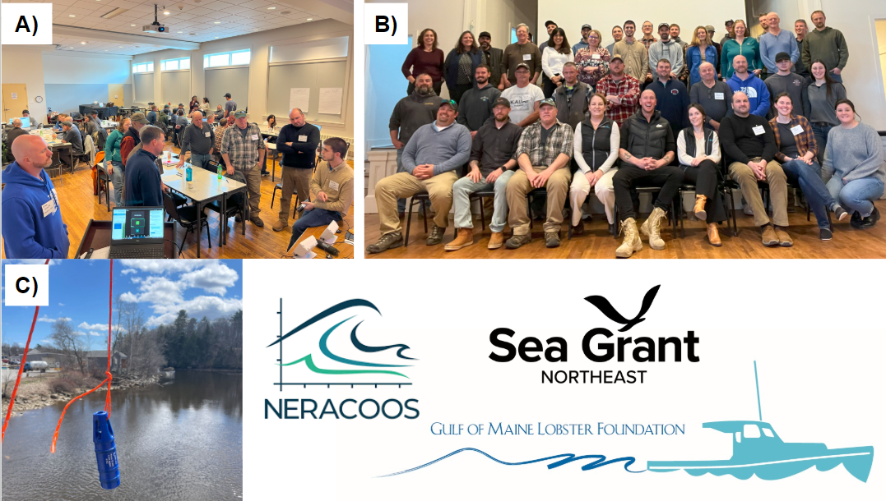
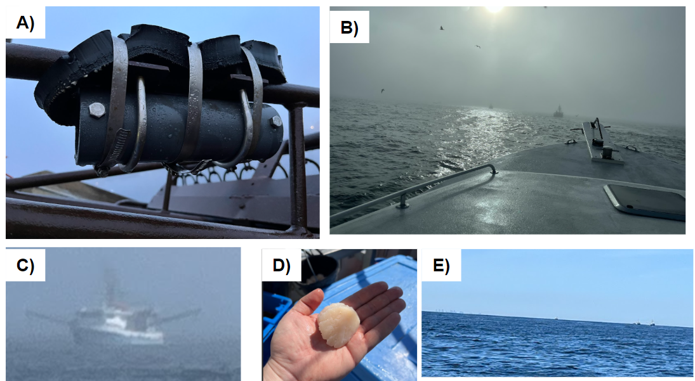
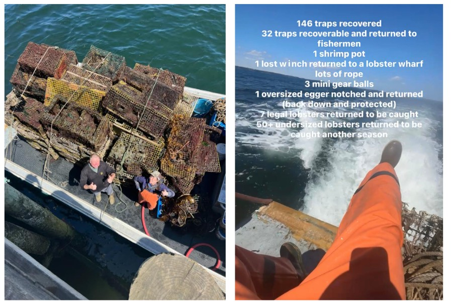
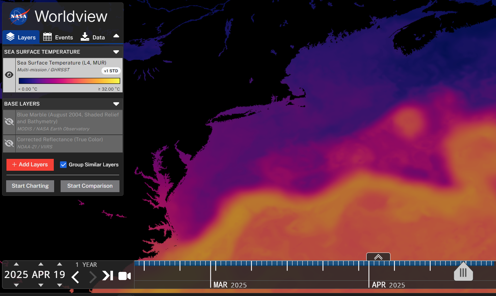
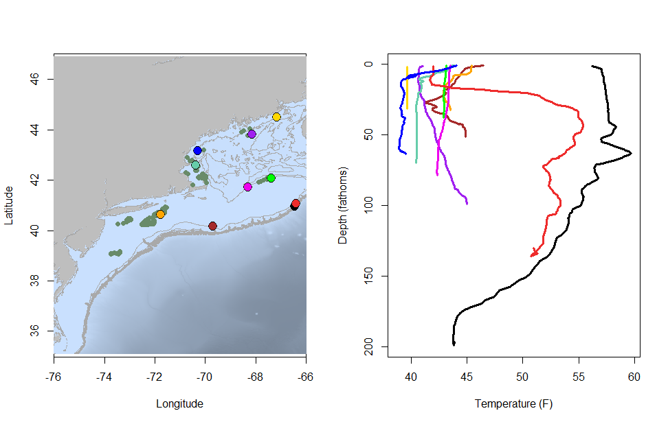
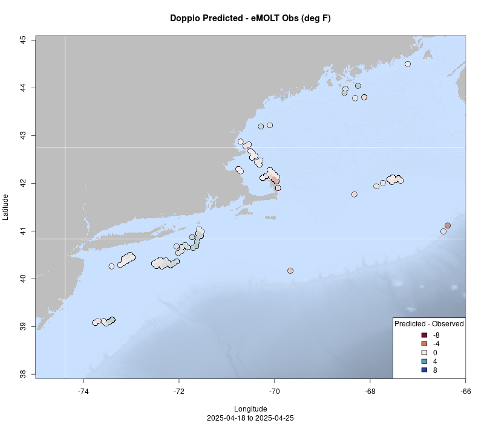
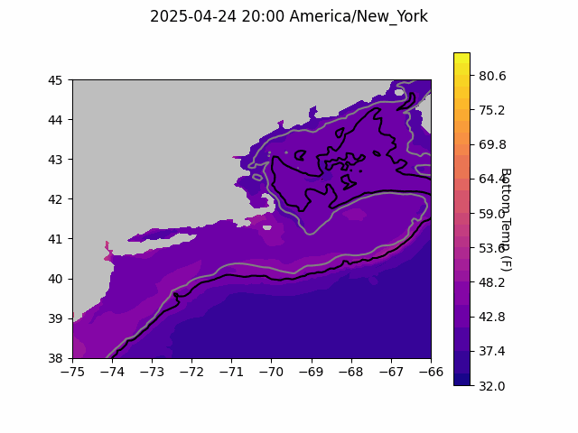

```{r setup, include=FALSE}
knitr::opts_chunk$set(echo = TRUE)
library(marmap)
library(rstudioapi)
if(Sys.info()["sysname"]=="Windows"){
  source("C:/Users/george.maynard/Documents/GitHubRepos/emolt_project_management/WeeklyUpdates/forecast_check/R/emolt_download.R")
} else {
  source("/home/george/Documents/emolt_project_management/WeeklyUpdates/forecast_check/R/emolt_download.R")
}

data=emolt_download(days=7)
start_date=Sys.Date()-lubridate::days(7)
## Use the dates from above to create a URL for grabbing the data
full_data=read.csv(
    paste0(
      "https://erddap.emolt.net/erddap/tabledap/eMOLT_RT.csvp?tow_id%2Csegment_type%2Ctime%2Clatitude%2Clongitude%2Cdepth%2Ctemperature%2Csensor_type&segment_type=%22Fishing%22&time%3E=",
      lubridate::year(start_date),
      "-",
      lubridate::month(start_date),
      "-",
      lubridate::day(start_date),
      "T00%3A00%3A00Z&time%3C=",
      lubridate::year(Sys.Date()),
      "-",
      lubridate::month(Sys.Date()),
      "-",
      lubridate::day(Sys.Date()),
      "T23%3A59%3A59Z"
    )
  )
sensor_time=0
for(tow in unique(full_data$tow_id)){
  x=subset(full_data,full_data$tow_id==tow)
  sensor_time=sensor_time+difftime(max(x$time..UTC.),units='hours',min(x$time..UTC.))
}
```

<center> 

<font size="5"> *eMOLT Update `r Sys.Date()` * </font>

</center>

## Weekly Recap 

Last week, with funding from Sea Grant's American Lobster Initiative, the Gulf of Maine Lobster Foundation (GOMLF) and the Northeast Regional Association of Ocean Observing Systems (NERACOOS) hosted a workshop for lobstermen in Ellsworth, ME. The goal of the workshop was to get feedback on what the scientific community could be doing better to collect data of interest to the fleet and make those data available and usable to all of you. You can read more about the workshop on New England Business Media's [MaineBiz](https://www.mainebiz.biz/article/lobstermen-say-modern-data-collection-essential-to-support-resource) site. A huge thanks to the 32 fishermen who showed up and participated in the discussions. Thanks also to Katy and the team at NERACOOS for organizing the meeting, Erin and Emma from the GOMLF for keeping things running smoothly, and all of the presenters, especially Andrew from UMaine who stepped up to fill in for me in the afternoon because Federal rules prohibit me from traveling that far. Finally, thanks to Cooper from Ocean Data Network for stepping out of the meeting to do some impromptu field testing of a sensor that was acting a little funny. We look forward to spending some time digging through all of the suggestions and feedback from the workshop and hopefully rolling out some exciting new data products in the coming months. 



>*Figure 1 -- A) Dr. Andrew Goode (UMaine) walks fishermen through the operation of deckboxes and sensors used in the eMOLT Program and what types of data fishermen can see in their wheelhouse. B) Maine fishermen met with scientists and data managers from around the region in Ellsworth to discuss priorities for environmental monitoring and ideas for new data products. C) Cooper from ODN took sensor ZT-0312 out for a test drive off a nearby bridge.*

### NGOM Scalloping

Thanks to Captain Brady and Travis aboard the F/V Salted for taking Anna and me out for a Northern Gulf of Maine scalloping trip earlier this week. It was awesome to see an eMOLT system in action in the field, talk through some ideas for better ways to look at the data, and pick through piles of scallops. It was also a humbling experience, as going to sea aboard commercial boats often is. Not only was I slow to shuck, I was also just bad at it. Brady suggested I stick to science for the time being. 



>*Figure 2 – A) The eMOLT sensor on the F/V Salted is U-bolted through small plates welded to the dredge. Hose clamps provide a belt and suspenders approach to attaching the sensor and hold some chafing gear in place as additional protection. B) It was a little foggy when we first got out to the grounds. C) We saw several other eMOLT participants out there including Capt. Phil on the F/V Charger. D) This is a beautiful scallop and definitely not one that I shucked. E) By the time we were on our way in, the fog had lifted enough that the Boston skyline was visible off in the distance.*

### Gear Grab

Emma from the GOMLF was out on the water this week too, working with lobstermen around Cundys Harbor, Harpswell, and Phippsburg to grapple derelict gear out of the water through the [Gear Grab](https://www.gomlf.org/gear-grab/) Program. Check out their totals for two days worth of work below!


This week, the eMOLT fleet recorded `r length(unique(full_data$tow_id))` tows of sensorized fishing gear totaling `r as.numeric(sensor_time)` sensor hours underwater. The warmest recorded bottom temperature was `r round(max(full_data$temperature..degree_C.)*9/5+32,1)` F east of Nygren Canyon in approximately `r round(full_data[which(full_data$temperature..degree_C.==max(full_data$temperature..degree_C.)),"depth..m."]*0.546807,0)` fathoms (red profile) and the coldest recorded bottom temperature was `r round(min(full_data$temperature..degree_C.)*9/5+32,1)` F off Ogunquit in approximately `r round(full_data[which(full_data$temperature..degree_C.==min(full_data$temperature..degree_C.)),"depth..m."]*0.546807,0)[1]` fathoms (blue profile). 

The warmest profile appears to be on the edge of a warm core ring off the eastern end of Georges Bank, and the black profile in the plot appears to actually be inside the ring. 



>*Figure 3 -- Sea Surface Temperatures from NASA Worldview showing a warm core ring off the eastern end of Georges Bank late last week*

Seasonal stratification appears to be setting up in the western Gulf of Maine, Massachusetts Bay, and south of Long Island (blue, teal, and orange profiles), while the waters off Downeast Maine and along the northern edge of Georges Bank remain well mixed for the time being. 



> *Figure 4 -- Temperature profiles collected by eMOLT participants over the last week. The blue profile is where the coldest bottom temperature was measured and the red profile is where the warmest bottom temperature was measured. All other colors are assigned randomly. Colored points on the map indicate where profiles of the same color were collected. The small dark green dots represent other profiles collected this week, but not highlighted in the plot. Note that the warmest / coldest bottom temperatures measured could have occurred during gear soaks, which are not represented on this profile plot.*

### 2025 State of the Ecosystem Reports Available Online

The Ecosystem Dynamics and Assessment Branch at the Northeast Fisheries Science Center works with many other parts of the NEFSC to build annual reports for the New England and Mid-Atlantic Fishery Management Councils about the current status of the Northeast Shelf marine ecosystems (Gulf of Maine, Georges Bank, and the Mid Atlantic Bight). NEFSC Director Dr. Jon Hare highlighted a few notable observations from the past year in a recent email:

- There were cooler average annual sea surface temperatures than recent years, but it was still warm compared to long-term averages
- There was a well-established Mid-Atlantic cold pool
- The spatial and timing patterns of several fisheries were very different compared with recent years

This year's "State of the Ecosystem" reports are available at the links below. 

- [New England](https://d23h0vhsm26o6d.cloudfront.net/2_SOE2025_NEFMC_SSC.pdf?utm_medium=email&utm_source=govdelivery)
- [Mid-Atlantic](https://static1.squarespace.com/static/511cdc7fe4b00307a2628ac6/t/67d1b8949183e4776e3ada08/1741797532907/c_SOE-MAFMC-2025-SSC.pdf?utm_medium=email&utm_source=govdelivery)


### System Hardware Upgrade List

The following vessels remain on our list for hardware upgrades. If you aren't on the list and think you should be, please reach out. *Note that this list is different from our new install queue.*

>
 - F/V Kaitlyn Victoria
 - F/V Kyler C
 - F/V Noella C
 - F/V Sea Watcher I

### Bottom Temperature Forecasts

#### Doppio 

This week, 89.6% of bottom temperature observations were within 2 degrees (F) of the Doppio forecasted value at those points. Most of the tows this week took place in areas where the model has performed well previously (in Massachusetts Bay and south of Long Island). The model also performed well along the northern edge of Georges Bank. Temps were a little cooler than expected east of Penobscot Bay and a few were warmer than expected along the shelf edge.  



> *Figure 5 -- Performance of the Doppio forecast's bottom temperature layer over the last week relative to observations collected by eMOLT participants. Red dots indicate areas where bottom temperature observations were warmer that predicted. Blue dots indicate areas where bottom temperature observations were cooler than predicted. Bottom temperature observations are compared with the most recent forecast run available before the observation was made.* 



> *Figure 6 -- The most recent Doppio bottom temperature forecast. The gray line is the 50 fathom line and the black line is the hundred fathom line. Purple shades indicate cooler water.*

## Announcements

### Massachusetts Lobstermen's Association Gear Distribution Day

- All MA Commercial Lobstermen Welcome!
- April 29th from 10 am - 2pm (rain date April 30)
- [8 Otis Place, Scituate, MA 02066](https://g.co/kgs/QAegdK6)

Thanks to a MA Seafood Marketing grant through the Lobster Foundation of Massachusetts and MADMF, the MLA is giving away free rope and bands. They will also have other weak contrivances such as South Shore sleeves and weak links. Ketcham is bringing marking materials such as red twine, green twine, red tape, red heat shrink, and white heat shrink. 

### Spring Cooperative Research Surveys on the Water

- The F/V Rudee Mariner steamed out of Virginia Beach, VA on Wednesday morning for the Hook and Line Survey's first leg of the season. 

- The F/V Tenacious II left Sandwich, MA and the F/V Mary Elizabeth left Scituate, MA on Thursday morning for the Gulf of Maine Bottom Longline Survey's first leg of the season. 

### Contribute to the 2026 Management Track Fishery Stock Assessments

The Northeast Fisheries Science Center seeks input from our regional assessment partners, including the fishing industry (commercial and recreational), state agency scientists, academic researchers, and interested members of the public to help guide development of our next [Management Track Assessments](https://links-1.govdelivery.com/CL0/https:%2F%2Fwww.fisheries.noaa.gov%2Fnew-england-mid-atlantic%2Fpopulation-assessments%2Fmanagement-track-stock-assessments%3Futm_medium=email%26utm_source=govdelivery/1/01000194fef87a4b-77d6ccd3-5a1a-4eb1-b540-f77f545ba60e-000000/ZeMgO83aO-hzSXHaHdKeoVtkRJYCB7U8ddMVEkaJkm4=392). 

Specifically, the NEFSC is looking for on-the-water observations or data sets on topics such as distribution, stock health, fishing dynamics and management, and the role these stocks play in the ecosystem. 

- Submit your comments through the [community input form](https://links-1.govdelivery.com/CL0/https:%2F%2Fforms.gle%2FBrH28as6HhERVTnL6%3Futm_medium=email%26utm_source=govdelivery/1/01000194fef87a4b-77d6ccd3-5a1a-4eb1-b540-f77f545ba60e-000000/J3norb57-iYKlrXBQ74ItB9OMBBXv9ZUqcpxeZ10abg=392), which is open through April 30, 2025

June 2026 Management Track Stocks include

- Atlantic herring
- Butterfish
- Georges Bank Atlantic cod
- Georges Bank haddock
- Longfin inshore squid
- Ocean quahog

### Update on LOC-NESS Project

The Environmental Protection Agency has granted a research permit for the LOC-NESS Project to run a field trial in the Gulf of Maine this summer. The project team provided a [press release](https://locness.whoi.edu/loc-ness-project-receives-epa-permit/) as well as a link to the [federal docket](https://www.regulations.gov/docket/EPA-HQ-OW-2024-0189/document?postedDateFrom=2025-04-21&postedDateTo=2025-04-23) that explains the EPA's decision making. For more information you can check out the project website [here](https://locness.whoi.edu/).

### Disclaimer

The eMOLT Update is NOT an official NOAA document. Mention of products or manufacturers does not constitute an endorsement by NOAA or Department of Commerce. The content of this update reflects only the personal views of the authors and does not necessarily represent the views of NOAA Fisheries, the Department of Commerce, or the United States.


All the best,

-George
