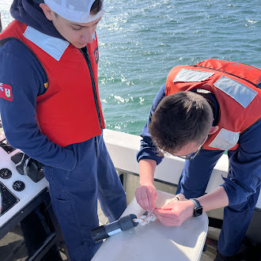
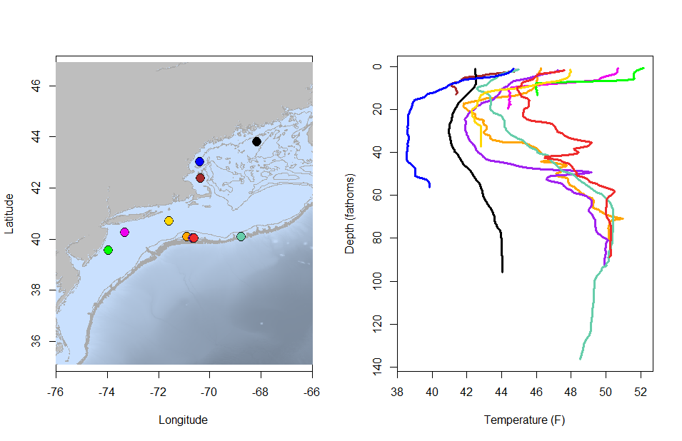
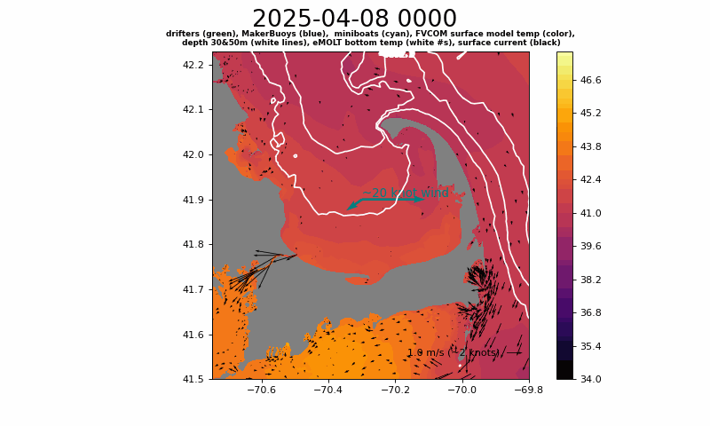
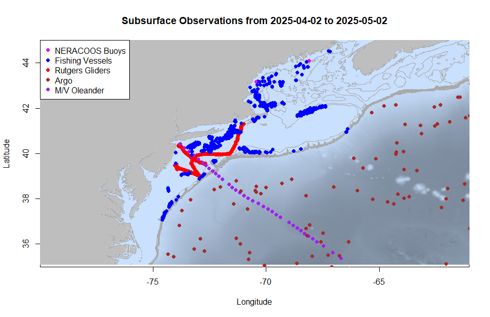
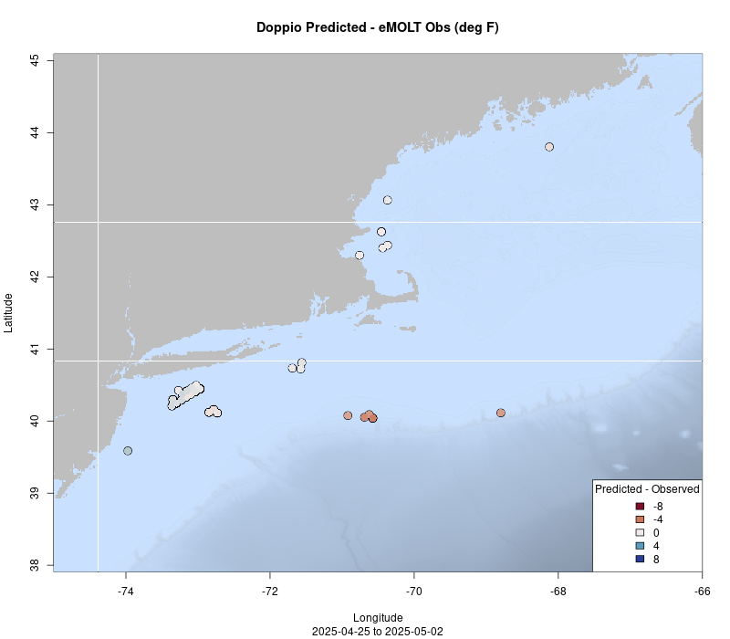
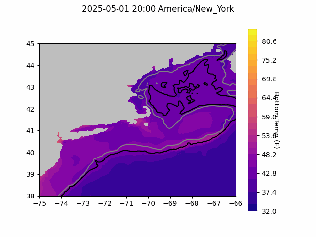
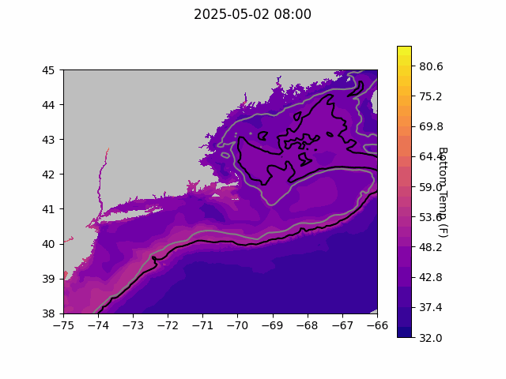
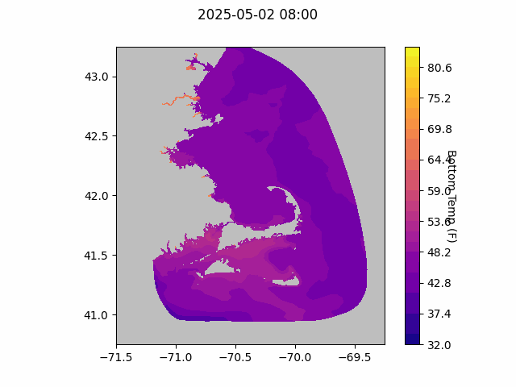

```{r setup, include=FALSE}
knitr::opts_chunk$set(echo = TRUE)
library(marmap)
library(rstudioapi)
if(Sys.info()["sysname"]=="Windows"){
  source("C:/Users/george.maynard/Documents/GitHubRepos/emolt_project_management/WeeklyUpdates/forecast_check/R/emolt_download.R")
} else {
  source("/home/george/Documents/emolt_project_management/WeeklyUpdates/forecast_check/R/emolt_download.R")
}

data=emolt_download(days=7)
start_date=Sys.Date()-lubridate::days(7)
## Use the dates from above to create a URL for grabbing the data
full_data=read.csv(
    paste0(
      "https://erddap.emolt.net/erddap/tabledap/eMOLT_RT.csvp?tow_id%2Csegment_type%2Ctime%2Clatitude%2Clongitude%2Cdepth%2Ctemperature%2Csensor_type&segment_type=%22Fishing%22&time%3E=",
      lubridate::year(start_date),
      "-",
      lubridate::month(start_date),
      "-",
      lubridate::day(start_date),
      "T00%3A00%3A00Z&time%3C=",
      lubridate::year(Sys.Date()),
      "-",
      lubridate::month(Sys.Date()),
      "-",
      lubridate::day(Sys.Date()),
      "T23%3A59%3A59Z"
    )
  )
sensor_time=0
for(tow in unique(full_data$tow_id)){
  x=subset(full_data,full_data$tow_id==tow)
  sensor_time=sensor_time+difftime(max(x$time..UTC.),units='hours',min(x$time..UTC.))
}
```

<center> 

<font size="5"> *eMOLT Update `r Sys.Date()` * </font>

</center>

## Weekly Recap 

Early this week, George headed over to Massachusetts Maritime Academy to meet with the team of cadets that has been deploying eMOLT sensors as part of their research project monitoring eelgrass restoration in Buzzards Bay. We spent some time on the water deploying and retrieving sensors, worked out a few beginning of the season technical glitches, and ran through a crash course on downloading data from ERDDAP. 



>*Figure 1 -- Attaching some extra weights to the line before dropping a TDO logger overboard in Buzzards Bay*

In the middle of the week, Huanxin and George visited Plymouth and Cotuit to set up long-time non-realtime eMOLT participant Captain Todd on the F/V Voyager and newcomer Captain Jake on the F/V Cornerstone. Several of our partners have also been busy. Thanks to Coonamesset Farm Foundation and the Center for Coastal Studies, we're happy to welcome the F/Vs Aarsheim Junior, Selje, Kimberly Ann, and Storm Elizabeth to the eMOLT Program. 

This week, the eMOLT fleet recorded `r length(unique(full_data$tow_id))` tows of sensorized fishing gear totaling `r as.numeric(sensor_time)` sensor hours underwater. The warmest recorded bottom temperature was `r round(max(full_data$temperature..degree_C.)*9/5+32,1)` F near Atlantis Canyon in approximately `r round(full_data[which(full_data$temperature..degree_C.==max(full_data$temperature..degree_C.)),"depth..m."]*0.546807,0)` fathoms (red profile) and the coldest recorded bottom temperature was `r round(min(full_data$temperature..degree_C.)*9/5+32,1)` F southeast of Boon Island in approximately `r round(full_data[which(full_data$temperature..degree_C.==min(full_data$temperature..degree_C.)),"depth..m."]*0.546807,0)[1]` fathoms (blue profile). 

Seasonal stratification is visible in profiles from around the region, with the exception of profiles east of Penobscot Bay (black profile shows no stratification).



> *Figure 2 -- Temperature profiles collected by eMOLT participants over the last week. The blue profile is where the coldest bottom temperature was measured and the red profile is where the warmest bottom temperature was measured. All other colors are assigned randomly. Colored points on the map indicate where profiles of the same color were collected. The small dark green dots represent other profiles collected this week, but not highlighted in the plot. Note that the warmest / coldest bottom temperatures measured could have occurred during gear soaks, which are not represented on this profile plot.*

### Drifter Program Kicks off 2025 Season

The drifter program has begun its 2025 season. Falmouth High School (Falmouth, MA), in coordination with Educational Passages, had a set of units deployed by R/V Tioga on April 8th off Plymouth. As seen in the animation below, they all came ashore within the first week after a few days of strong northerlies. This cluster included 2 miniboats (ashore the first day), 2 mini-drifters, and one standard drifter.  The standard drifter stayed out the longest.  It actually entered the canal where, a few days later, a large pod of right whales were sighted, documenting the possibility that the surface plankton they hunt was advected that way.



>*Figure 3 -- gif showing movements of of drifters (green), MakerBuoys (blue), and miniboats (cyan) along with FVCOM modeled surface temps and currents, and eMOLT bottom temps (white numbers).*

Two other drifters, built by Southern Maine Community College students, were deployed this past week off Southern Maine by F/V Captain B and F/V Tenacious II, respectively, and can be tracked [here](https://studentdrifters.org/tracks/drift_X.html).

### New Subsurface Observations Map

In an effort to put the value of the data you all collect into perspective, we've developed a map of publicly available subsurface observations from around the region that we will update weekly. All of these data are available on ERDDAP servers (a sort of "industry standard" for making oceanographic data available). To orient you to the map, the pink dots are the locations of buoys operated by the Northeast Regional Association of Coastal Ocean Observing Systems (NERACOOS) that include subsurface observations of temperature and salinity. Blue dots are observations from sensors on fishing vessels collected by participants in the eMOLT Program, one of the Commercial Fisheries Research Foundation's programs, or one of Ocean Data Network's programs. These observations are mostly water temperature, although some of vessels also deploy salinity and dissolved oxygen sensors. Red dots are observations from gliders affiliated with the Rutgers University Center for Ocean Observing Leadership and include a range of variables including temperature, salinity, chlorophyll levels, dissolved oxygen, nitrates, pH, and more. Brown dots are observations from the Argo Program, which deploys floats around the world, and include a range of variables including temperature, dissolved oxygen, salinity, chlorophyll, turbidity, and nitrates. Finally, purple dots are observations taken aboard the M/V Oleander using an Expendable Bathythermograph (XBT). These observations include temperature and salinity. You can see that on the shelf, there really isn't much subsurface data available in many areas without observations from the fleet. 



>*Figure 4 -- Map of realtime, publicly accessible subsurface measurements collected over the last month here in the Northeastern United States. Fishing vessel observations (blue) represent aggregated data from eMOLT, Commercial Fisheries Research Foundation, and Ocean Data Network.*

To learn more about the programs shown on this map, check out their websites:

- [Northeast Regional Association of Coastal Ocean Observing Systems](https://www.neracoos.org/)
- [environmental Monitors on Lobster Traps and Large Trawlers](https://www.fisheries.noaa.gov/new-england-mid-atlantic/climate/partnering-fishing-industry-monitor-northeast-shelf)
- [Commercial Fisheries Research Foundation](https://www.cfrfoundation.org/)
- [Ocean Data Network](https://oceandata.net/)
- [Rutgers University Center for Ocean Observing Leadership](https://rucool.marine.rutgers.edu/data/underwater-gliders/about-underwater-gliders/) 
- [Argo](https://argo.ucsd.edu/)
- [Oleander Line](https://bios.asu.edu/oleander)

### New Forecast Model Run Released

A new bottom temperature forecast for the region from a [downscaled version of the MOM6 (Modular Ocean Model) model](https://os.copernicus.org/articles/20/1631/2024/) is available. To check out a video of this forecast through the end of the calendar year, click [here](https://drive.google.com/file/d/1L9fMHZ4V9FVQCb-jcdHUziPSB40Za2FG/view). Per Dr. Vincent Saba at the Geophysical Fluid Dynamic Laboratory, the southern Mid-Atlantic Bight is forecasted to be warm, but the Gulf of Maine and parts of Georges Bank are forecasted to be cooler than average. We'll dig more into the model outputs in the coming weeks and see about including comparisons like we do for Doppio. 

### System Hardware Upgrade List

The following vessels remain on our list for hardware upgrades. If you aren't on the list and think you should be, please reach out. *Note that this list is different from our new install queue.*

>
 - F/V Kaitlyn Victoria
 - F/V Kyler C
 - F/V Noella C
 - F/V Sea Watcher I

### Bottom Temperature Forecasts

#### Doppio 

This week, 90.3% of bottom temperature observations were within 2 degrees (F) of the Doppio forecasted value at those points. Most of the tows this week took place in areas where the model has performed well previously (in Massachusetts Bay and south of Long Island). Temps were a cooler than expected east of New Jersey and warmer than expected along the shelf edge.  



> *Figure 5 -- Performance of the Doppio forecast's bottom temperature layer over the last week relative to observations collected by eMOLT participants. Red dots indicate areas where bottom temperature observations were warmer that predicted. Blue dots indicate areas where bottom temperature observations were cooler than predicted. Bottom temperature observations are compared with the most recent forecast run available before the observation was made.* 



> *Figure 6 -- The most recent Doppio bottom temperature forecast. The gray line is the 50 fathom line and the black line is the hundred fathom line. Purple shades indicate cooler water.*

#### Northeast Coastal Ocean Forecast System



> *Figure 7 -- The most recent bottom temperature forecast from the Northeast Coastal Ocean Forecast System GOM7 model. The gray line is the 50 fathom line and the black line is the hundred fathom line. Purple shades indicate cooler water.*



> *Figure 8 -- The most recent bottom temperature forecast from the Northeast Coastal Ocean Forecast System MassBay model. Purple shades indicate cooler water.*

### Disclaimer

The eMOLT Update is NOT an official NOAA document. Mention of products or manufacturers does not constitute an endorsement by NOAA or Department of Commerce. The content of this update reflects only the personal views of the authors and does not necessarily represent the views of NOAA Fisheries, the Department of Commerce, or the United States.


All the best,

-George
