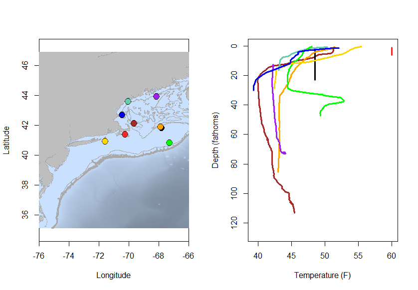
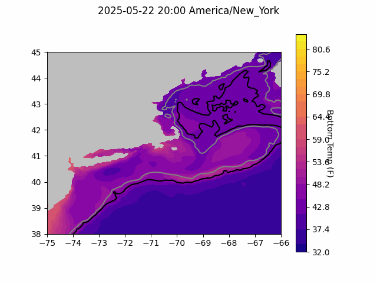
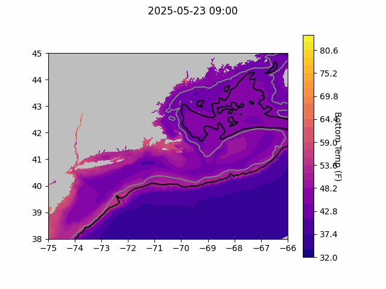
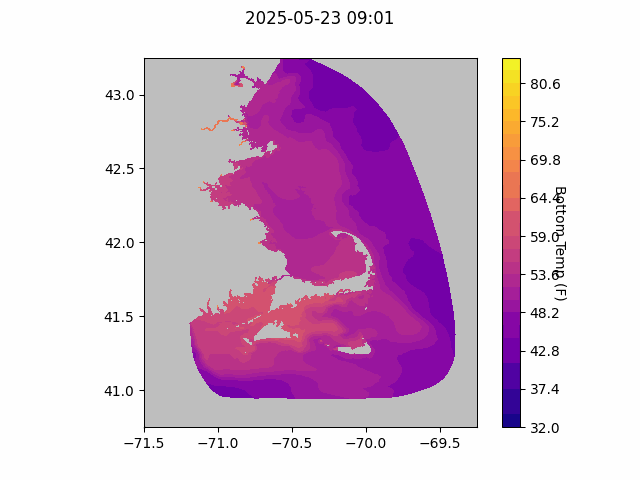

  
```{r setup, include=FALSE}
knitr::opts_chunk$set(echo = TRUE)
library(marmap)
library(rstudioapi)
if(Sys.info()["sysname"]=="Windows"){
  source("C:/Users/george.maynard/Documents/GitHubRepos/emolt_project_management/WeeklyUpdates/forecast_check/R/emolt_download.R")
} else {
  source("/home/george/Documents/emolt_project_management/WeeklyUpdates/forecast_check/R/emolt_download.R")
}

data=emolt_download(days=7)
start_date=Sys.Date()-lubridate::days(7)
## Use the dates from above to create a URL for grabbing the data
full_data=read.csv(
  paste0(
    "https://erddap.emolt.net/erddap/tabledap/eMOLT_RT.csvp?tow_id%2Csegment_type%2Ctime%2Clatitude%2Clongitude%2Cdepth%2Ctemperature%2Csensor_type&segment_type=3&time%3E=",
    lubridate::year(start_date),
    "-",
    lubridate::month(start_date),
    "-",
    lubridate::day(start_date),
    "T00%3A00%3A00Z&time%3C=",
    lubridate::year(Sys.Date()),
    "-",
    lubridate::month(Sys.Date()),
    "-",
    lubridate::day(Sys.Date()),
    "T23%3A59%3A59Z"
  )
)
sensor_time=0
for(tow in unique(full_data$tow_id)){
  x=subset(full_data,full_data$tow_id==tow)
  sensor_time=sensor_time+difftime(max(x$time..UTC.),units='hours',min(x$time..UTC.))
}
```

<center> 

<font size="5"> *eMOLT Update `r Sys.Date()` * </font>
  
</center>
  
## Weekly Recap 

Thanks to Owen, who's been out around the Cape installing new systems on a number of boats this week! Thanks also to JiM and Huanxin who finished packing up and mailing out the Vemco Minilog (non-realtime) sensors for their last deployment this year, and finally, thanks to Captains Dominic (F/V Tyrant), Curt (F/V Lil More Tail), George (F/V Eagle), Robert (F/V Darana R), Mark (F/V Prevail), David (R/V Gemma), Rob (F/V Bookie), and Todd (F/V Voyager) for reaching out to share reports of malfunctioning deckboxes and suggestions for improvements. We appreciate all of our industry partners taking the time to let us know how we can improve the program.

This week, the eMOLT fleet recorded `r length(unique(full_data$tow_id))` tows of sensorized fishing gear totaling `r as.numeric(sensor_time)` sensor hours underwater. The warmest recorded bottom temperature was `r round(max(full_data$temperature..degree_C.)*9/5+32,1)` F north of Muskeget Island in approximately `r round(full_data[which(full_data$temperature..degree_C.==max(full_data$temperature..degree_C.)),"depth..m."]*0.546807,0)` fathoms (red profile) and the coldest recorded bottom temperature was `r round(min(full_data$temperature..degree_C.)*9/5+32,1)` F east of Cape Ann in approximately `r round(full_data[which(full_data$temperature..degree_C.==min(full_data$temperature..degree_C.)),"depth..m."]*0.546807,0)[1]` fathoms (blue profile). 

Water on top of Georges Bank remains well mixed (black profile) around 50 degrees F, while just off the northern edge in around 80 fathoms, temps drop down to the lower 40s near the bottom (orange profile). Downeast Maine remains well mixed and cool with temps around 45 F from surface to bottom (purple profile).



> *Figure 1 -- Temperature profiles collected by eMOLT participants over the last week. The blue profile is where the coldest bottom temperature was measured and the red profile is where the warmest bottom temperature was measured. All other colors are assigned randomly. Colored points on the map indicate where profiles of the same color were collected. The small dark green dots represent other profiles collected this week, but not highlighted in the plot. Note that the warmest / coldest bottom temperatures measured could have occurred during gear soaks, which are not represented on this profile plot.*

### Cape Cod Bay / Buzzards Bay Physical Oceanography Real Time System (PORTS) Meeting hosted at Mass Maritime

NERACOOS organized an interesting meeting yesterday (22 May) at Massachusetts Maritime Academy to review the status of the [NOAA Cape Cod Bay and Buzzards Physical Oceanography Real Time System (PORTS)](https://tidesandcurrents.noaa.gov/ports/index.html?port=ca).  There were people from NERACOOS, MassDEP, USCG, MMA, WHG, ScrippsCDIP, Ørsted, USACE, MassCEC, Northeast Pilots Association, NOAA/CO-OPS, and NOAA/IOOS. Please excuse this over-use of acronyms but the point is, the meeting had many partners. While the fishing industry was not represented, the agenda was not specifically designed for stakeholders but primarily for those actively involved with the operations of the various assets. While the focus of the conversations was vessel safety, JiM attended to present a few slides on the use of these PORTS datasets for science sake.

### A Note on the Importance of Cooperative Research from Dr. Sarah Gaichas

Recently retired NEFSC scientist Dr. Sarah Gaichas [published a column in Fisheries magazine](https://doi.org/10.1093/fshmag/vuaf019) (a publication of the American Fisheries Society) describing some formative experiences early in her career conducting research aboard commercial fishing boats, and encouraging other scientists to make the effort to get out on the water with industry partners as well. 

### System Hardware Upgrade List

The following vessels remain on our list for hardware upgrades. If you aren't on the list and think you should be, please reach out. *Note that this list is different from our new install queue.*

>
 - F/V Kaitlyn Victoria
 - F/V Kyler C
 - F/V Noella C
 - F/V Sea Watcher I

### Bottom Temperature Forecasts

#### Doppio 

No model comparison this week, we had a few code hiccups on our end, but are hoping to get it back up and running next week. 



> *Figure 2 -- The most recent Doppio bottom temperature forecast. The gray line is the 50 fathom line and the black line is the hundred fathom line. Purple shades indicate cooler water.*
  
#### Northeast Coastal Ocean Forecast System
  


> *Figure 3 -- The most recent bottom temperature forecast from the Northeast Coastal Ocean Forecast System GOM7 model. The gray line is the 50 fathom line and the black line is the hundred fathom line. Purple shades indicate cooler water.*
  


> *Figure 4 -- The most recent bottom temperature forecast from the Northeast Coastal Ocean Forecast System MassBay model. Purple shades indicate cooler water.*
  
### Announcements

#### BOEM Announces Development of New Five Year Lease Schedule for the Outer Continental Shelf

BOEM is asking stakeholders to raise concerns, identify existing uses and recommend leasing opportunities in all 27 lease areas on the Atlantic, Pacific, Gulf and Alaskan coasts, including the North Atlantic and Mid-Atlantic lease areas. For more information, see the full announcement from BOEM [here](https://www.govinfo.gov/content/pkg/FR-2025-04-30/pdf/2025-07479.pdf). Public comments are due by June 16, 2025 and can be submitted [here](https://www.federalregister.gov/documents/2025/04/30/2025-07479/request-for-information-and-comments-on-the-preparation-of-the-11th-national-outer-continental-shelf). 


### Disclaimer
  
The eMOLT Update is NOT an official NOAA document. Mention of products or manufacturers does not constitute an endorsement by NOAA or Department of Commerce. The content of this update reflects only the personal views of the authors and does not necessarily represent the views of NOAA Fisheries, the Department of Commerce, or the United States.


All the best,

-George
