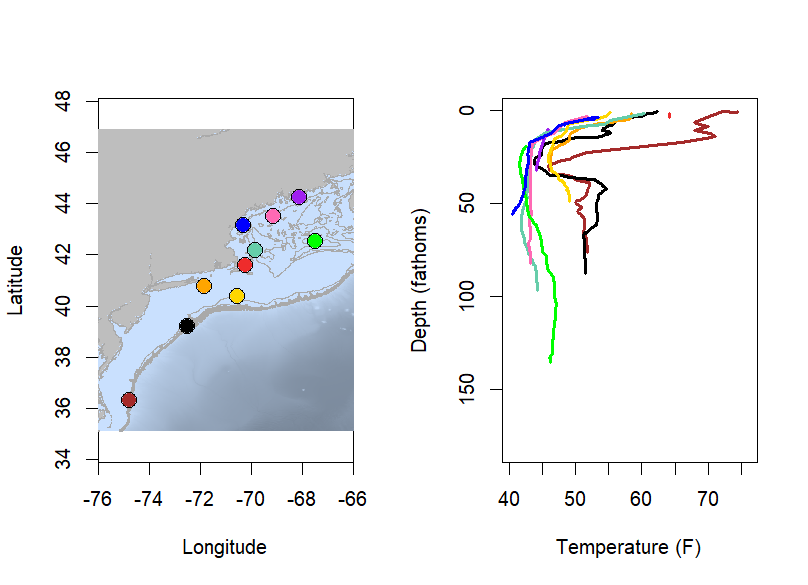
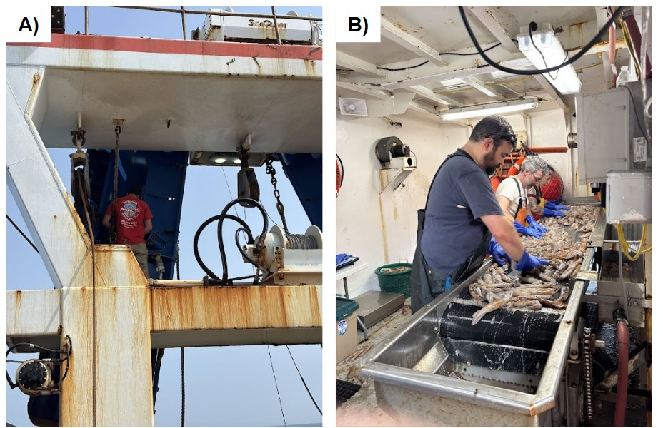
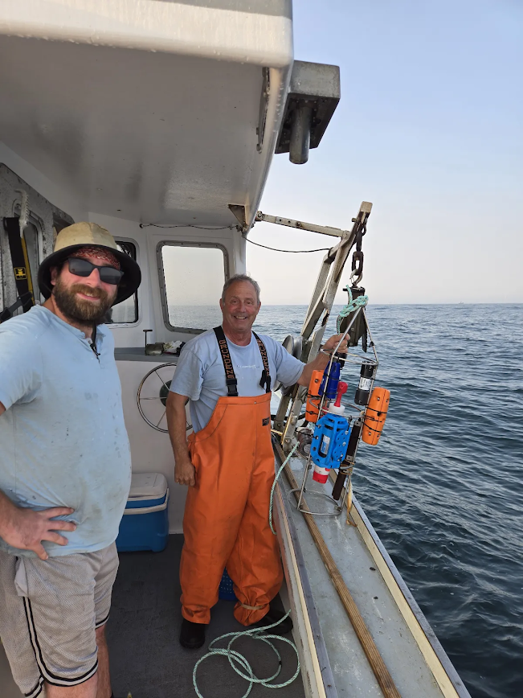
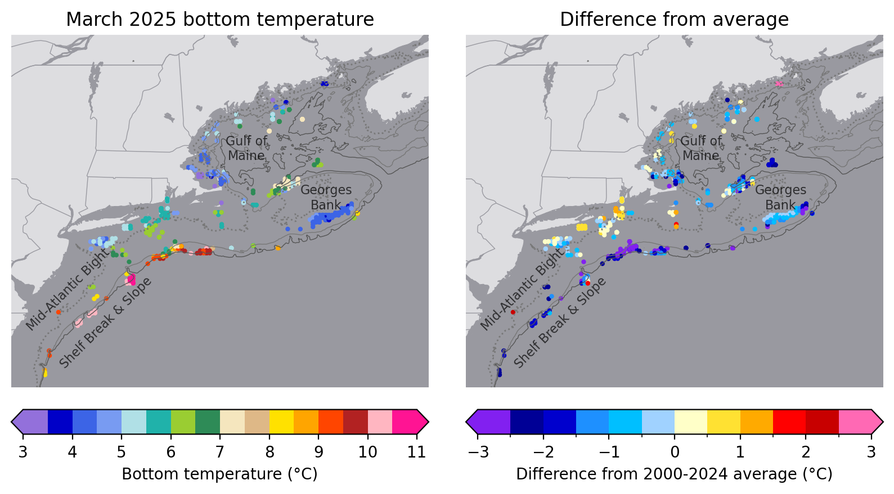
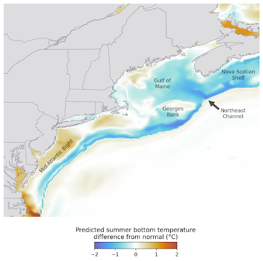
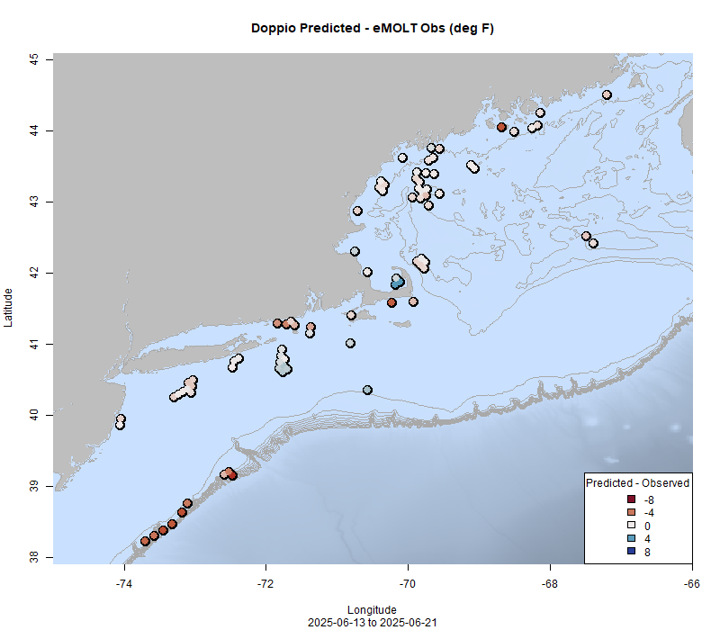
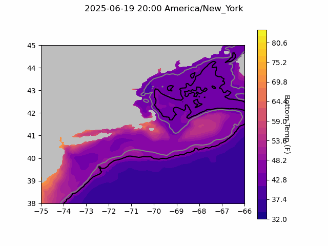
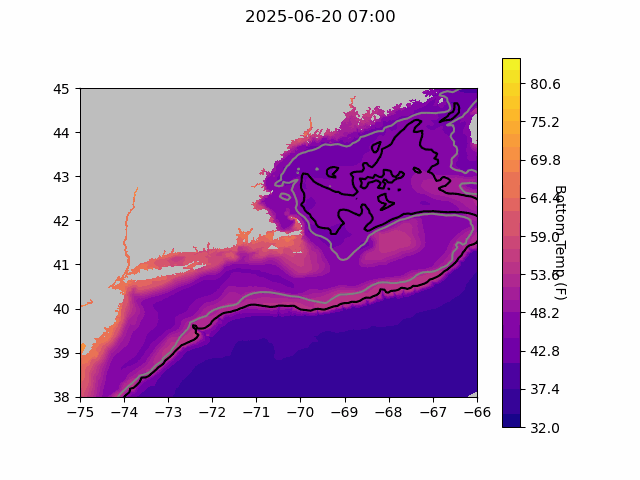
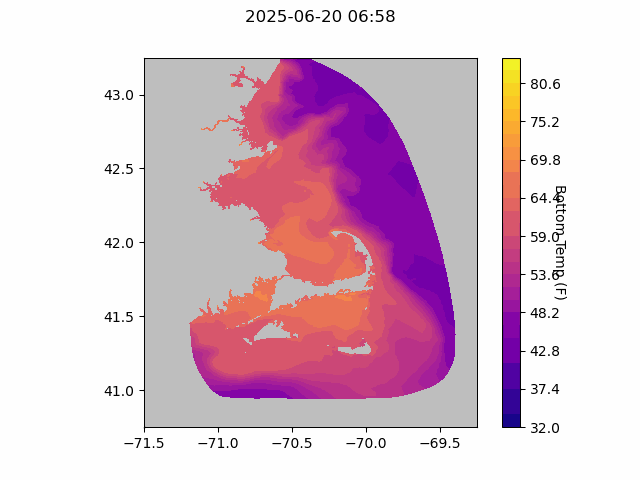

  
```{r setup, include=FALSE}
knitr::opts_chunk$set(echo = TRUE)
library(marmap)
library(rstudioapi)
if(Sys.info()["sysname"]=="Windows"){
  source("C:/Users/george.maynard/Documents/GitHubRepos/emolt_project_management/WeeklyUpdates/forecast_check/R/emolt_download.R")
} else {
  source("/home/george/Documents/emolt_project_management/WeeklyUpdates/forecast_check/R/emolt_download.R")
}

data=emolt_download(days=7)
start_date=Sys.Date()-lubridate::days(7)
## Use the dates from above to create a URL for grabbing the data
full_data=read.csv(
  paste0(
    "https://erddap.emolt.net/erddap/tabledap/eMOLT_RT.csvp?tow_id%2Csegment_type%2Ctime%2Clatitude%2Clongitude%2Cdepth%2Ctemperature%2Csensor_type&segment_type=3&time%3E=",
    lubridate::year(start_date),
    "-",
    lubridate::month(start_date),
    "-",
    lubridate::day(start_date),
    "T00%3A00%3A00Z&time%3C=",
    lubridate::year(Sys.Date()),
    "-",
    lubridate::month(Sys.Date()),
    "-",
    lubridate::day(Sys.Date()),
    "T23%3A59%3A59Z"
  )
)
sensor_time=0
for(tow in unique(full_data$tow_id)){
  x=subset(full_data,full_data$tow_id==tow)
  sensor_time=sensor_time+difftime(max(x$time..UTC.),units='hours',min(x$time..UTC.))
}
```

<center> 

<font size="5"> *eMOLT Update `r Sys.Date()` * </font>
  
</center>
  
## Weekly Recap 

It's been a while, but we're back! Between the end of the school year, a bunch of new eMOLT installs, and the shortfin squid oceanography cruise, the last few weeks have been a whirlwind. We've also been working hard to finish up calibration checks and general maintenance for all of the dissolved oxygen loggers. Thanks to Hannah and Huanxin for their efforts on that front. As of now, we have most of the Cape Cod Bay loggers ready to go. We are planning to spend time prepping the Maine loggers next week, although new guidance from NOAA Headquarters has pushed contracting paperwork to the top of our "to do" list, so there will likely be a delay on getting those loggers sent out. Thanks for your patience.

This week, the eMOLT fleet recorded `r length(unique(full_data$tow_id))` tows of sensorized fishing gear totaling `r as.numeric(sensor_time)` sensor hours underwater. The warmest recorded bottom temperature was `r round(max(full_data$temperature..degree_C.)*9/5+32,1)` F in Nantucket Sound in approximately `r round(full_data[which(full_data$temperature..degree_C.==max(full_data$temperature..degree_C.)),"depth..m."]*0.546807,0)` fathoms (red profile) and the coldest recorded bottom temperature was `r round(min(full_data$temperature..degree_C.)*9/5+32,1)` F east of Ogunquit in approximately `r round(full_data[which(full_data$temperature..degree_C.==min(full_data$temperature..degree_C.)),"depth..m."]*0.546807,0)[1]` fathoms (blue profile). 

Waters off the northern edge of Georges Bank and Downeast remain cold (upper 40s) and well mixed. 



> *Figure 1 -- Temperature profiles collected by eMOLT participants over the last week. The blue profile is where the coldest bottom temperature was measured and the red profile is where the warmest bottom temperature was measured. All other colors are assigned randomly. Colored points on the map indicate where profiles of the same color were collected.Note that the warmest / coldest bottom temperatures measured could have occurred during gear soaks, which are not represented on this profile plot.*

### Shortfin Squid Oceanographic Cruise Successes

The shortfin squid oceanographic cruise took place last week from 6/11 -- 6/14 aboard the F/V Dyrsten out of Cape May, NJ. Over the next few months, Mary Kate and the team will be publishing blogs and data analyses from this trip, which included measurements of temperature, salinity, and depth, sampling chlorophyll and zooplankton, and taking morphometrics and biological samples from hundreds of squid. For now though, thanks to Captains Leif and Stefan and engineers Matt and David for helping us get an eMOLT system set up on the F/V Dyrsten!



*Figure 2 -- A) David, an engineer aboard the F/V Dyrsten installed a new Lowell Instruments TDO on the starboard door. B) George, Jeff, and Sarah sorting the catch*

### Fishing Vessel Ocean Observing Network Continues Sensor Intercomparison Research

*Guest post from Linus Stoltz at [Commercial Fisheries Research Foundation](https://www.cfrfoundation.org/)*

Last week a sensor intercomparison test was conducted off the coast of Rhode Island to evaluate how various low-cost sensors compare to traditional, more expensive sensors. Instruments widely used throughout the eMOLT program were included in this test among others. Tests like this are being conducted around the world to document the data quality of cooperative ocean observing at a global scale. Stay tuned for analysis! A huge thank you to Greg and Andrew on the F/V Amelia Ann who conducted this test on top of regular survey work into the South Fork Wind Farm wind lease area.



*Figure 3 -- a whole slew of sensors from Canada, France, Japan, New Zealand, the United Kingdom, and the United States were tested together aboard the F/V Amelia Ann*. 

### eMOLT Contributes to New Seasonal Forecast

*Feature story from NOAA Office of Science and Technology*

Deep waters in the [Gulf of Maine](https://www.integratedecosystemassessment.noaa.gov/regions/northeast/gulf-maine) and the [Mid-Atlantic Bight](https://www.integratedecosystemassessment.noaa.gov/regions/northeast/mid-atlantic-bight) shelfbreak region are expected to remain cooler than in recent years. This prediction, a product of NOAA’s [Changing Ecosystems and Fisheries Initiative](https://www.fisheries.noaa.gov/topic/climate-change/changing-ecosystems-and-fisheries), is from the first experimental seasonal ocean outlook released by NOAA scientists in April. It is a shift from previous patterns: From 2004 to 2013, sea surface temperatures in the Gulf of Maine warmed faster than anywhere else in the world.

Conditions at the bottom of the ocean along much of the Northeast U.S. coast have been colder than normal in the first few months of 2025. Data collected in March 2025 by several surveys and the eMOLT program, a partnership between commercial fishermen and NOAA, showed:

- Bottom temperatures across much of the Gulf of Maine that were 0.5–2.0 °C (0.9–3.6 °F) below normal for March, though a few locations reported slightly warmer than normal conditions
- Cooler than normal conditions all along the edge of Georges Bank and deep along the Mid-Atlantic Bight shelf break and slope
- Patches of near to slightly above normal temperatures inshore around Long Island



*Figure 4 -- The left panel shows bottom temperatures observed in March 2025. The right panel shows the difference between March 2025 temperatures and the average of the previous 25 years of data at the same locations. Values below 0, marked by blue colors, show where the March 2025 conditions were cooler than average. Gray lines are contours of 50, 100, and 200 meters depth. Credit: Andrew Ross/NOAA Research*



*Figure 5 -- predicted ocean temperature forecasts for 2025 for the northwest Atlantic issued by the Changing Ecosystems and Fisheries Initiative. Credit: Andrew Ross/NOAA Research*

This summer...

- Continued cold is predicted in the deep Gulf of Maine, while some shallow nearshore regions may see moderately above normal temperatures
- Colder than normal conditions are also forecast to persist deep along the Mid-Atlantic Bight shelf break and slope, but warmer than normal conditions are predicted to develop in much of the shallower Mid-Atlantic Bight
- Near the surface, moderately warmer than normal conditions (about 1 °C or 2 °F above average) are predicted throughout most of the region

For more information, please check out the full article [here](https://www.fisheries.noaa.gov/feature-story/new-seasonal-forecast-predicts-cooler-waters-northeast).

### System Hardware Upgrade List

The following vessels remain on our list for hardware upgrades. If you aren't on the list and think you should be, please reach out. *Note that this list is different from our new install queue.*

>
 - F/V Kaitlyn Victoria
 - F/V Kyler C
 - F/V Noella C
 - F/V Sea Watcher I

### Bottom Temperature Forecasts

#### Doppio 

This week, 65.3% of bottom temperature observations were within 2 degrees (F) of the Doppio forecasted value at those points. eMOLT participants covered a wide swath of the region this week. Bottom temps along the Mid-Atlantic Canyons, around Block Island, in Nantucket Sound, and just east of Penobscot Bay were warmer than predicted. Bottom temps in Cape Cod Bay and south of Martha's Vineyard were cooler than predicted. Forecasts off southern Maine, New Hampshire, and south of Long Island were close to observations. 



> *Figure 6 -- Performance of the Doppio forecast's bottom temperature layer over the last week relative to observations collected by eMOLT participants. Red dots indicate areas where bottom temperature observations were warmer that predicted. Blue dots indicate areas where bottom temperature observations were cooler than predicted. Bottom temperature observations are compared with the most recent forecast run available before the observation was made.* 



> *Figure 7 -- The most recent Doppio bottom temperature forecast. The gray line is the 50 fathom line and the black line is the hundred fathom line. Purple shades indicate cooler water.*
  
#### Northeast Coastal Ocean Forecast System
  


> *Figure 8 -- The most recent bottom temperature forecast from the Northeast Coastal Ocean Forecast System GOM7 model. The gray line is the 50 fathom line and the black line is the hundred fathom line. Purple shades indicate cooler water.*
  


> *Figure 9 -- The most recent bottom temperature forecast from the Northeast Coastal Ocean Forecast System MassBay model. Purple shades indicate cooler water.*

### Disclaimer
  
The eMOLT Update is NOT an official NOAA document. Mention of products or manufacturers does not constitute an endorsement by NOAA or Department of Commerce. The content of this update reflects only the personal views of the authors and does not necessarily represent the views of NOAA Fisheries, the Department of Commerce, or the United States.


All the best,

-George
