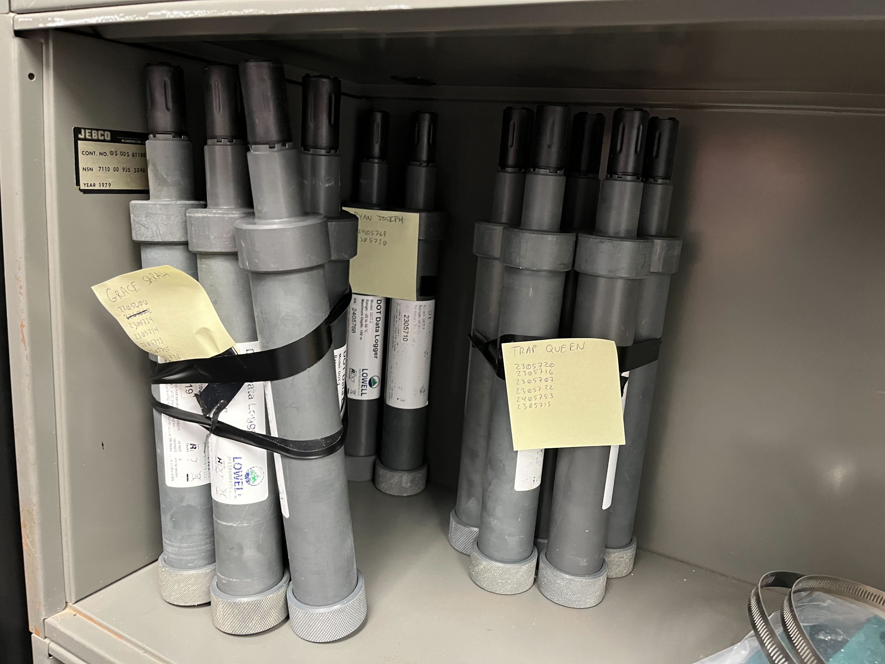
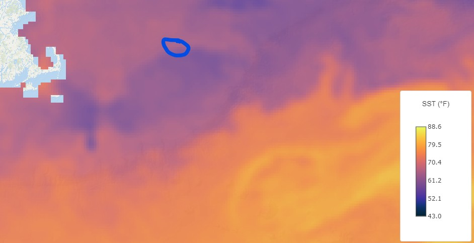
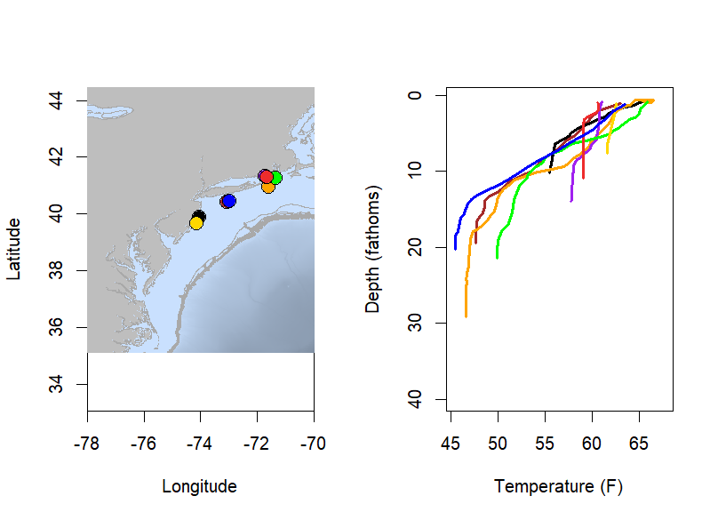
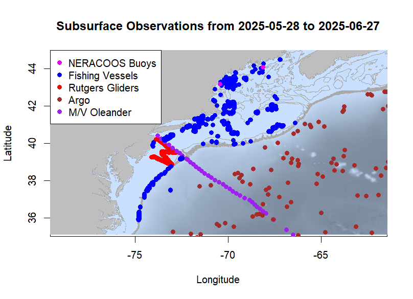
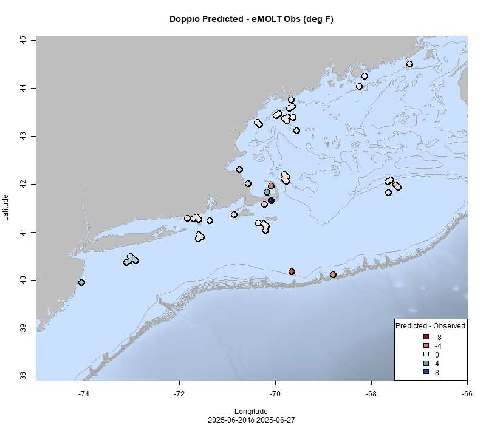
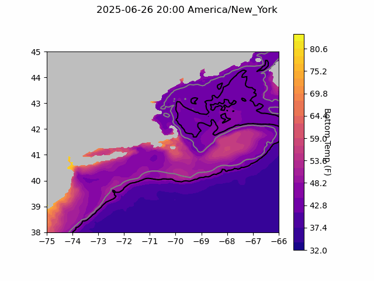
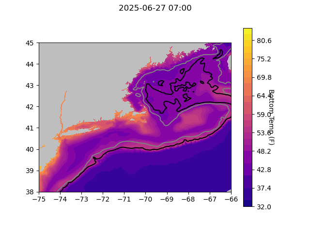
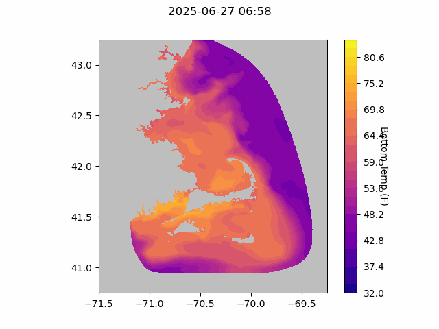

  
```{r setup, include=FALSE}
knitr::opts_chunk$set(echo = TRUE)
library(marmap)
library(rstudioapi)
if(Sys.info()["sysname"]=="Windows"){
  source("C:/Users/george.maynard/Documents/GitHubRepos/emolt_project_management/WeeklyUpdates/forecast_check/R/emolt_download.R")
} else {
  source("/home/george/Documents/emolt_project_management/WeeklyUpdates/forecast_check/R/emolt_download.R")
}

data=emolt_download(days=7)
start_date=Sys.Date()-lubridate::days(7)
## Use the dates from above to create a URL for grabbing the data
full_data=read.csv(
  paste0(
    "https://erddap.emolt.net/erddap/tabledap/eMOLT_RT.csvp?tow_id%2Csegment_type%2Ctime%2Clatitude%2Clongitude%2Cdepth%2Ctemperature%2Csensor_type&segment_type=3&time%3E=",
    lubridate::year(start_date),
    "-",
    lubridate::month(start_date),
    "-",
    lubridate::day(start_date),
    "T00%3A00%3A00Z&time%3C=",
    lubridate::year(Sys.Date()),
    "-",
    lubridate::month(Sys.Date()),
    "-",
    lubridate::day(Sys.Date()),
    "T23%3A59%3A59Z"
  )
)
sensor_time=0
for(tow in unique(full_data$tow_id)){
  x=subset(full_data,full_data$tow_id==tow)
  sensor_time=sensor_time+difftime(max(x$time..UTC.),units='hours',min(x$time..UTC.))
}
```

<center> 

<font size="5"> *eMOLT Update `r Sys.Date()` * </font>
  
</center>
  
## Weekly Recap 

This week, new NOAA Fisheries Assistant Administrator Eugenio Piñeiro Soler released a [leadership message](https://www.fisheries.noaa.gov/leadership-message/noaa-fisheries-assistant-administrator-charts-course-strengthen-support-marine?utm_medium=email&utm_source=govdelivery) emphasizing the need for reliable data, sound science, and strong partnerships, and specifically called out the importance of engaging fishing communities in cooperative research. Also this week, NOAA's Satellite Products and Services Division [announced the termination of the Defense Meteorological Satellite Program](https://www.ospo.noaa.gov/data/messages/2025/06/MSG_20250625_1735.html) by June 30th. These satellites have been [widely used in hurricane forecasting](https://www.nola.com/news/hurricane/hurricane-forecast-data-cut-noaa/article_c2f5c5c9-4451-4818-b60f-bc1d81f0c706.html) because they enable meteorologists to track storm systems, even at night.

Closer to home, we've spent a fair amount of time navigating the Department of Commerce's new contracting system to keep the eMOLT Program funded and operational next year, while also trying to get the dissolved oxygen loggers ready for deployment. Before going out in the field, each logger is carefully cleaned to remove any biofouling; then it gets new batteries and dessicant packs, o-rings are greased or replaced as necessary, and we run a series of calibration checks to make sure they are functioning properly.



> *Figure 1 -- Bundles of dissolved oxygen loggers ready for Cape Cod Bay*

Many of the loggers will be heading to Cape Cod Bay, where the eMOLT Program works to augment the [Cape Cod Bay Study Fleet](https://www.mass.gov/info-details/tracking-dissolved-oxygen-with-the-cape-cod-bay-study-fleet-and-dmf) Program run by the Massachusetts Lobstermen's Association and Massachusetts Division of Marine Fisheries. Another large batch is headed north, where we are partnering with Dr. Andrew Goode at the University of Maine to monitor dissolved oxygen around Boothbay. We will also continue responding to individual fishermen's concerns about dissolved oxygen as we are able, and plan to send small numbers of sensors to Gouldsboro, Stonington (ME), and Casco Bay as well. A handful of new loggers are already in the water off New Jersey, Rhode Island, and south of Cape Cod. If you are a **fixed gear** fishermen and have concerns about hypoxia on your fishing grounds, please reach let us know. 

This week, the eMOLT fleet recorded `r length(unique(full_data$tow_id))` tows of sensorized fishing gear totaling `r as.numeric(sensor_time)` sensor hours underwater. We're trying something a little different with the plots this week and have broken them out into northern (Gulf of Maine, Georges Bank) and southern (Southern New England, Mid-Atlantic Bight) regions. In the northern region, the seasonal thermocline is well defined everywhere except for well-mixed waters Downeast (black profile) and up on top of Georges Bank (pink profile). 


> *Figure 2 -- Temperature profiles collected by eMOLT participants up north and out east over the last week.*

Interestingly, the profiles in pink and green were taken less than 12 hours and 10 miles apart, but show very different surface conditions. Up on the bank (pink) surface temps were just above 50 F and just north of the bank (green), surface temps were close to 60 F. This difference is also visible in the sea surface temp satellite imagery from earlier this week, with both profiles coming from inside the blue circle. 



> *Figure 3 -- Sea surface temperatures from Georges Bank on June 22, 2025. Purple represents cooler water, yellow represents warmer water. The blue circle indicates the approximate location where the two profiles mentioned above were collected.*

In the profiles from the southern part of the region, the seasonal thermocline is ubiquitous, with surface temps in some areas (e.g. orange profile S. of Rhode Island) almost 20 degrees (F) warmer than the bottom. 



> *Figure 4 -- Temperature profiles collected by eMOLT participants over the last week in the southern part of our region.*

### Subsurface Observations Map

In an effort to put the value of the data you all collect into perspective, we've developed a map of publicly available subsurface observations from around the region that we will update weekly. All of these data are available on ERDDAP servers (a sort of "industry standard" for making oceanographic data available). To orient you to the map, the pink dots are the locations of buoys operated by the Northeast Regional Association of Coastal Ocean Observing Systems (NERACOOS) that include subsurface observations of temperature and salinity. Blue dots are observations from sensors on fishing vessels collected by participants in the eMOLT Program, one of the Commercial Fisheries Research Foundation's programs, or one of Ocean Data Network's programs. These observations are mostly water temperature, although some of vessels also deploy salinity and dissolved oxygen sensors. Red dots are observations from gliders affiliated with the Rutgers University Center for Ocean Observing Leadership and include a range of variables including temperature, salinity, chlorophyll levels, dissolved oxygen, nitrates, pH, and more. Brown dots are observations from the Argo Program, which deploys floats around the world, and include a range of variables including temperature, dissolved oxygen, salinity, chlorophyll, turbidity, and nitrates. Finally, purple dots are observations taken aboard the M/V Oleander using an Expendable Bathythermograph (XBT). These observations include temperature and salinity. You can see that on the shelf, there really isn't much subsurface data available in many areas without observations from the fleet. 



>*Figure 5 -- Map of realtime, publicly accessible subsurface measurements collected over the last month here in the Northeastern United States. Fishing vessel observations (blue) represent aggregated data from eMOLT, Commercial Fisheries Research Foundation, and Ocean Data Network.*

To learn more about the programs shown on this map, check out their websites:

- [Northeast Regional Association of Coastal Ocean Observing Systems](https://www.neracoos.org/)
- [environmental Monitors on Lobster Traps and Large Trawlers](https://www.fisheries.noaa.gov/new-england-mid-atlantic/climate/partnering-fishing-industry-monitor-northeast-shelf)
- [Commercial Fisheries Research Foundation](https://www.cfrfoundation.org/)
- [Ocean Data Network](https://oceandata.net/)
- [Rutgers University Center for Ocean Observing Leadership](https://rucool.marine.rutgers.edu/data/underwater-gliders/about-underwater-gliders/) 
- [Argo](https://argo.ucsd.edu/)
- [Oleander Line](https://bios.asu.edu/oleander)

### Fishing Vessel Ocean Observing Network Continues Sensor Intercomparison Research

The FVON sensor intercomparison testing work shifted to Japan recently, with Tetsutaro Takikawa and his team from Nagasaki University's Collaborative Research Promotion Unit testing the sensors dockside earlier this week before heading out to sea for a research trip beginning June 25th. 


> *Figure 6 -- Testing the sensors together to make sure everything works before heading out to sea.*

### System Hardware Upgrade List

The following vessels remain on our list for hardware upgrades. If you aren't on the list and think you should be, please reach out. *Note that this list is different from our new install queue.*

>
 - F/V Kaitlyn Victoria
 - F/V Kyler C
 - F/V Noella C
 - F/V Sea Watcher I

### Bottom Temperature Forecasts

#### Doppio 

This week, 60.7% of bottom temperature observations were within 2 degrees (F) of the Doppio forecasted value at those points. Bottom temps along the Maine coast, much of Southern New England, and out on Georges Bank were close to the forecasted values. Temperatures south and west of Long Island were cooler than forecasted, and the model struggled to resolve bottom temperatures around Cape Cod. 



> *Figure 7 -- Performance of the Doppio forecast's bottom temperature layer over the last week relative to observations collected by eMOLT participants. Red dots indicate areas where bottom temperature observations were warmer that predicted. Blue dots indicate areas where bottom temperature observations were cooler than predicted. Bottom temperature observations are compared with the most recent forecast run available before the observation was made.* 



> *Figure 8 -- The most recent Doppio bottom temperature forecast. The gray line is the 50 fathom line and the black line is the hundred fathom line. Purple shades indicate cooler water.*
  
#### Northeast Coastal Ocean Forecast System
  


> *Figure 9 -- The most recent bottom temperature forecast from the Northeast Coastal Ocean Forecast System GOM7 model. The gray line is the 50 fathom line and the black line is the hundred fathom line. Purple shades indicate cooler water.*
  


> *Figure 10 -- The most recent bottom temperature forecast from the Northeast Coastal Ocean Forecast System MassBay model. Purple shades indicate cooler water.*

### Disclaimer
  
The eMOLT Update is NOT an official NOAA document. Mention of products or manufacturers does not constitute an endorsement by NOAA or Department of Commerce. The content of this update reflects only the personal views of the authors and does not necessarily represent the views of NOAA Fisheries, the Department of Commerce, or the United States.


All the best,

-George
