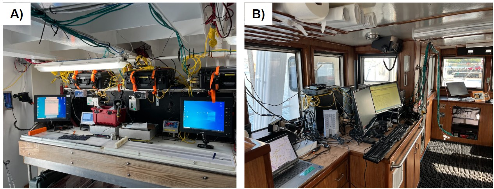
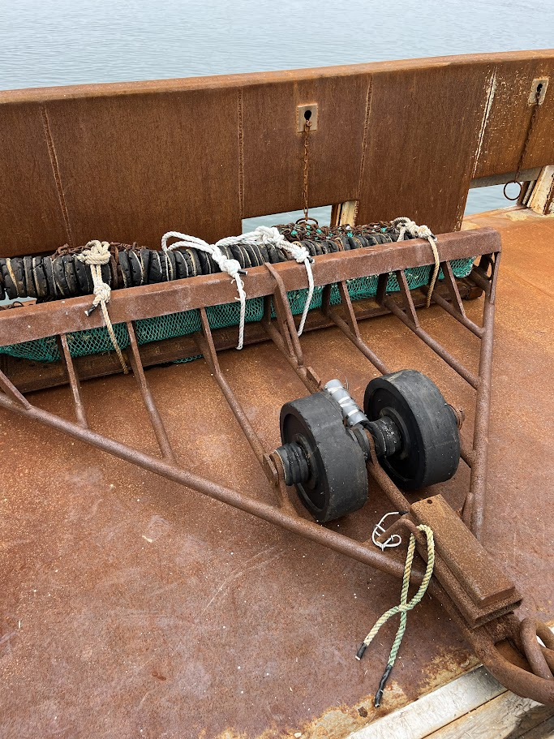
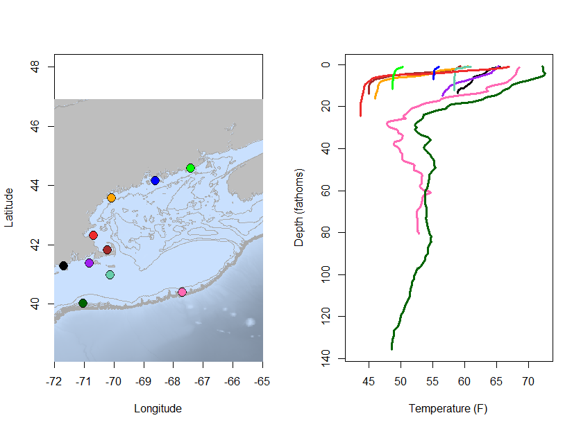
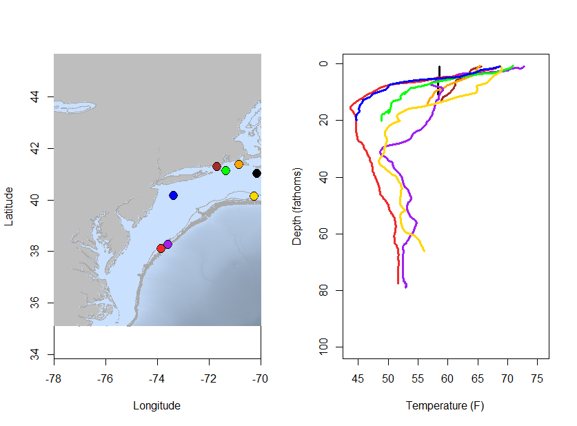
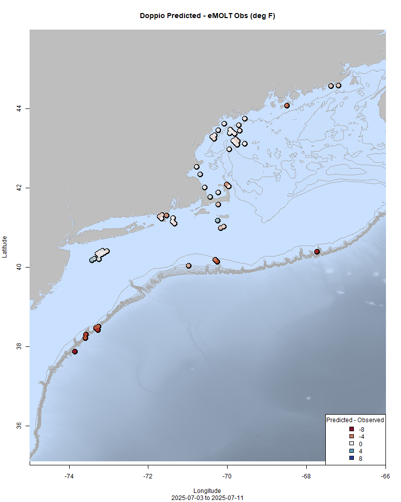
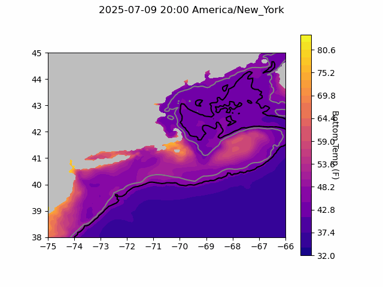
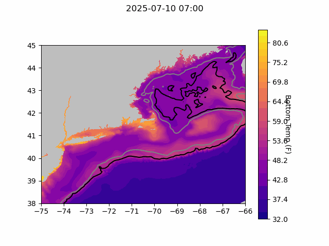
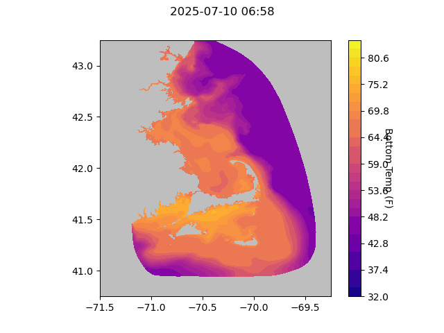
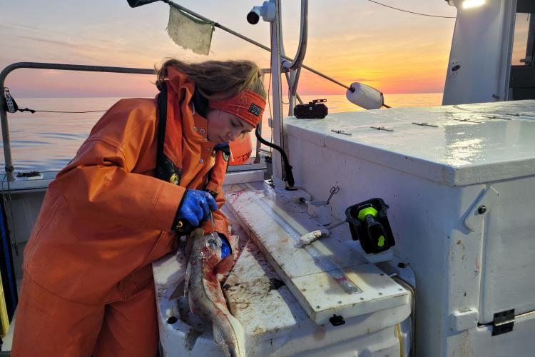

  
```{r setup, include=FALSE}
knitr::opts_chunk$set(echo = TRUE)
library(marmap)
library(rstudioapi)
if(Sys.info()["sysname"]=="Windows"){
  source("C:/Users/george.maynard/Documents/GitHubRepos/emolt_project_management/WeeklyUpdates/forecast_check/R/emolt_download.R")
} else {
  source("/home/george/Documents/emolt_project_management/WeeklyUpdates/forecast_check/R/emolt_download.R")
}

data=emolt_download(days=7)
start_date=Sys.Date()-lubridate::days(7)
## Use the dates from above to create a URL for grabbing the data
full_data=read.csv(
  paste0(
    "https://erddap.emolt.net/erddap/tabledap/eMOLT_RT.csvp?tow_id%2Csegment_type%2Ctime%2Clatitude%2Clongitude%2Cdepth%2Ctemperature%2Csensor_type&segment_type=3&time%3E=",
    lubridate::year(start_date),
    "-",
    lubridate::month(start_date),
    "-",
    lubridate::day(start_date),
    "T00%3A00%3A00Z&time%3C=",
    lubridate::year(Sys.Date()),
    "-",
    lubridate::month(Sys.Date()),
    "-",
    lubridate::day(Sys.Date()),
    "T23%3A59%3A59Z"
  )
)
sensor_time=0
for(tow in unique(full_data$tow_id)){
  x=subset(full_data,full_data$tow_id==tow)
  sensor_time=sensor_time+difftime(max(x$time..UTC.),units='hours',min(x$time..UTC.))
}
```

<center> 

<font size="5"> *eMOLT Update `r Sys.Date()` * </font>
  
</center>
  
## Weekly Recap 

With the current [freeze on hiring](https://www.whitehouse.gov/presidential-actions/2025/07/ensuring-accountability-and-prioritizing-public-safety-in-federal-hiring/) here at NOAA and the variety of staffing reductions that happened earlier in the year, eMOLT took a back seat for me this week, and I spent several days supporting the staging of the [scallop dredge survey](https://www.fisheries.noaa.gov/new-england-mid-atlantic/science-data/2024-sea-scallop-survey-results#dredge-survey-summary) alongside chief scientist Dr. Dana Morton, technicians Jon Duquette, Zach Fyke, and Jakub Kircun, and the captain and crew of the F/V Selje. This is the second year that the survey is running aboard the F/V Selje as part of an effort to [engage partners including the commercial fishing industry to diversify and modernize our scallop data collection enterprise](https://www.fisheries.noaa.gov/feature-story/long-running-sea-scallop-survey-diversifies-future). 

I've helped stage for the [Gulf of Maine Bottom Longline Survey](https://www.fisheries.noaa.gov/new-england-mid-atlantic/science-data/gulf-maine-bottom-longline-survey) aboard the F/V Mary Elizabeth and F/V Tenacious II a number of times, but this was the first time I've worked on deploying the full [Fisheries Scientific Computing System (FSCS)](https://www.fisheries.noaa.gov/feature-story/paper-records-touch-screens-and-bar-codes-data-acquisition-sea-has-gone-high-tech) aboard a commercial fishing vessel. If you haven't seen the FSCS system before, it's pretty involved. Over the last two and a half days, we loaded a bunch of gear on board the F/V Selje, installed work stations in the shucking house, turned the wheelhouse into a server room, hard-wired everything together, and tested it all out. 



>*Figure 1-- A) Workstations wired up in the shucking house aboard the F/V Selje. B) Computer infrastructure to support the scallop survey in the wheelhouse connects to the workstations in the shucking house via the green networking cables.*

Each workstation has a barcode scanner, scale, electronic length board, touch screen display, speakers, and a label printer. A server in the wheelhouse ties the work stations together, backing up the data and allowing the watch chief and captain to monitor catch processing while they set up for the next tow. A GPS timeserver in the wheelhouse synchronizes timestamps across all of the different hardware, and all of the systems have fully functional backups on board just in case...



>*Figure 2 -- a survey dredge with a Lowell Instruments TDO sensor mounted between the wheels*

The survey also carries three dredges and extra parts for all of them. Because the F/V Selje is part of the eMOLT Program -- thanks to Cassie, Samir, and the Coonamessett Farm team! -- we were also able to install Lowell Instruments TDO sensors onto the neck of each dredge. We're looking forward to comparing the orientation data from these sensors that are widely used in the eMOLT Program with the orientation data from the Star Oddi Starmon sensors used by the survey team to determine whether the dredge landed correctly. We're also working with Joaquim at Lowell Instruments to use this opportunity to test drive some new "smart lockout" software in the DDH system. Thanks to Captain Keith for setting us up with a Starlink connection so that we can monitor how well that software patch works over the course of the scallop survey. If all goes well, this should reduce the number of "out of water" datafiles generated by the TDO loggers.

Thanks to Hannah Ciarametaro here at NEFSC who finished up calibration checks on DO sensors for lobstermen up in Maine this week. We'll be shipping those out first thing next week. Thanks also to Linus at CFRF, Owen at CCS, Joey at Rutgers, and Huanxin at GOMLF who installed a bunch of new eMOLT systems and worked with captains to troubleshoot existings systems this week. Also a big thanks to Carles at ODN for ironing out some wrinkles in the data system caused by swapping loggers back and forth between different boats. 

This week, the eMOLT fleet recorded `r length(unique(full_data$tow_id))` tows of sensorized fishing gear totaling `r as.numeric(sensor_time)` sensor hours underwater. 

North of Cape Cod, bottom temperatures remain chilly (light green, blue, orange, red, and brown profiles). Even in Massachusetts Bay where surface temps are in the mid-60s, bottom temps are only in the mid-40s (red profile). Around Martha's Vineyard and Nantucket, bottom temps are in the high 50s.



> *Figure 3 -- Temperature profiles collected by eMOLT participants up north and out east over the last week.*

Throughout the Mid-Atlantic and much of Southern New England, surface temps are up between 65 and 75 F, but bottom temperatures range from around 60 degrees F near Block Island (brown profile) down to a chilly 45 F south of Long Island (blue profile), where the seasonal Cold Pool appears to be setting up. Cold temps in that area are visible in the eMOLT profiles and both forecast models. The purple and red profiles along the shelf break east of Maryland are interesting because they're only ~ 7 hours and 20 miles apart, but show radically different subsurface conditions. In the northeast part of this plot south of Cape Cod (black profile) the surface water is much cooler and well mixed down to 14 fathoms or so



> *Figure 4 -- Temperature profiles collected by eMOLT participants over the last week in the southern part of our region.*

### System Hardware Upgrade List

The following vessels remain on our list for hardware upgrades. If you aren't on the list and think you should be, please reach out. *Note that this list is different from our new install queue.*

>
 - F/V Kaitlyn Victoria
 - F/V Kyler C
 - F/V Noella C
 - F/V Sea Watcher I

### Bottom Temperature Forecasts

#### Doppio 

This week, 79.7% of bottom temperature observations were within 2 degrees (F) of the Doppio forecasted value at those points. Bottom temps along the Maine coast, much of Southern New England, and south of Long Island were close to the forecast values. Temperatures along the shelf break were generally warmer than forecast. 



> *Figure 5 -- Performance of the Doppio forecast's bottom temperature layer over the last week relative to observations collected by eMOLT participants. Red dots indicate areas where bottom temperature observations were warmer that predicted. Blue dots indicate areas where bottom temperature observations were cooler than predicted. Bottom temperature observations are compared with the most recent forecast run available before the observation was made.* 



> *Figure 6 -- The most recent Doppio bottom temperature forecast. The gray line is the 50 fathom line and the black line is the hundred fathom line. Purple shades indicate cooler water.*
  
#### Northeast Coastal Ocean Forecast System
  


> *Figure 7 -- The most recent bottom temperature forecast from the Northeast Coastal Ocean Forecast System GOM7 model. The gray line is the 50 fathom line and the black line is the hundred fathom line. Purple shades indicate cooler water.*
  


> *Figure 8 -- The most recent bottom temperature forecast from the Northeast Coastal Ocean Forecast System MassBay model. Purple shades indicate cooler water.*

### From Observer to Surveyor: Sailing on the Same Vessel in Different Capacities

For another look behind the scenes at cooperative industry / science surveys here at the Northeast Fisheries Science Center, check out Hannah Ciarametaro's [blog post](https://www.fisheries.noaa.gov/science-blog/observer-surveyor-sailing-same-vessel-different-capacities) about sailing on the Gulf of Maine Bottom Longline Survey this spring and how it differed from her experience as an observer. 



### Join CFRF and WHOI for an Ocean Conditions Meeting

The Commercial Fisheries Research Foundation and Woods Hole Oceanographic Institution welcome you to join a conversation about the oceanographic conditions in the region on Tuesday, July 15th, from 4-6 pm ET.

Dr. Glen Gawarkiewicz (WHOI) will give an overview of the fresh and cool conditions seen in 2024 and compare them to what we’re seeing this year and what we’ve seen in the past. We invite fishermen to share their observations from the water and to bring any questions they may have about what’s happening below the surface. To join in person, we will meet in the upstairs conference room at Superior Trawl in Point Judith, RI. There will also be a virtual attendance option with the call-in information below. You can learn more about the project [here](https://www.cfrfoundation.org/shelf-research-fleet).

>
- When: Tuesday, July 15th from 4-6pm ET
- Where: [Superior Trawl, 55 State St, Narragansett, RI 02882](https://maps.app.goo.gl/nq4Hr7kLJZMp6L178)
- Webinar link: https://meet.google.com/aax-prcc-ahn
- Audio only: call 252-563-4355 PIN: 342 173 461 #
- Questions? Please contact Noelle Olsen, Senior Research Biologist, CFRF
Email: nolsen@cfrfoundation.org, Phone: (401) 515-4892


### Disclaimer
  
The eMOLT Update is NOT an official NOAA document. Mention of products or manufacturers does not constitute an endorsement by NOAA or Department of Commerce. The content of this update reflects only the personal views of the authors and does not necessarily represent the views of NOAA Fisheries, the Department of Commerce, or the United States.


All the best,

-George
