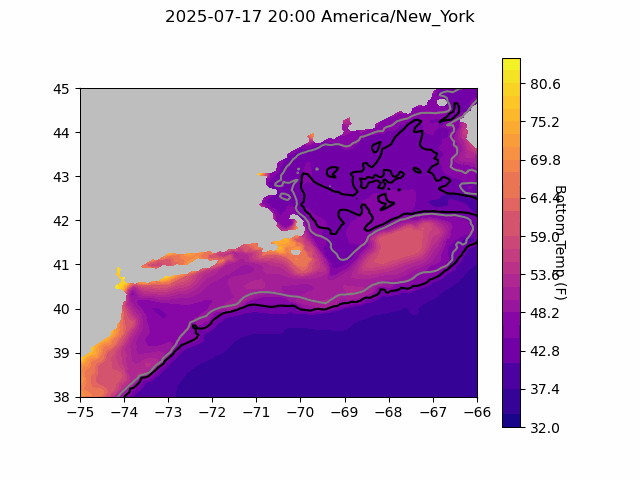

  
```{r setup, include=FALSE}
knitr::opts_chunk$set(echo = TRUE)
library(marmap)
library(rstudioapi)
if(Sys.info()["sysname"]=="Windows"){
  source("C:/Users/george.maynard/Documents/GitHubRepos/emolt_project_management/WeeklyUpdates/forecast_check/R/emolt_download.R")
} else {
  source("/home/george/Documents/emolt_project_management/WeeklyUpdates/forecast_check/R/emolt_download.R")
}

data=emolt_download(days=7)
start_date=Sys.Date()-lubridate::days(7)
## Use the dates from above to create a URL for grabbing the data
full_data=read.csv(
  paste0(
    "https://erddap.emolt.net/erddap/tabledap/eMOLT_RT.csvp?tow_id%2Csegment_type%2Ctime%2Clatitude%2Clongitude%2Cdepth%2Ctemperature%2Csensor_type&segment_type=3&time%3E=",
    lubridate::year(start_date),
    "-",
    lubridate::month(start_date),
    "-",
    lubridate::day(start_date),
    "T00%3A00%3A00Z&time%3C=",
    lubridate::year(Sys.Date()),
    "-",
    lubridate::month(Sys.Date()),
    "-",
    lubridate::day(Sys.Date()),
    "T23%3A59%3A59Z"
  )
)
sensor_time=0
for(tow in unique(full_data$tow_id)){
  x=subset(full_data,full_data$tow_id==tow)
  sensor_time=sensor_time+difftime(max(x$time..UTC.),units='hours',min(x$time..UTC.))
}
```

<center> 

<font size="5"> *eMOLT Update `r Sys.Date()` * </font>
  
</center>
  
## Weekly Recap 

This week, we've been working on ironing out a few wrinkles in our data processing. A big thanks to all of the captains who've reached out to report issues either on their deckboxes or on the online portal. These bug reports help us identify problems and get them fixed. One such challenge has been that some deckboxes were failing to upload position data associated with sensor deployments, resulting in fishermen not being able to log in and view their tows on the online portal even though things were displaying correctly on the deckbox (thanks to captains Jeff, Ron, George, and Phil for flagging this). Thanks also to Joaquim at Lowell Instruments for adjusting the code. We're working to apply the new patch across all vessels as the deckboxes show up online.

A big thanks also to Owen at the Center for Coastal Studies for helping troubleshoot and solve a number of technical issues for eMOLT participants here on Cape Cod. 

All of our dissolved oxygen loggers from last year are out the door and deployed in Cape Cod Bay or ready for deployment off Boothbay. If you are a fixed gear fisherman and are concerned about dissolved oxygen on your fishing grounds, please reach out and we can work on getting you some sensors. 

The Gulf of Maine Lobster Foundation also got a shipment of freshly calibrated Moana Temperature / Depth sensors back from New Zealand earlier this week, so we'll be working to deploy those around the region in the coming weeks.

This week, the eMOLT fleet recorded `r length(unique(full_data$tow_id))` tows of sensorized fishing gear totaling `r as.numeric(sensor_time)` sensor hours underwater. 

### Bottom Temperature Forecasts

#### Doppio 

This week, 62.8% of bottom temperature observations were within 2 degrees (F) of the Doppio forecasted value at those points. Bottom temps in the Gulf of Maine, south and west of Penobscot Bay generally matched the forecast. Temps in Cape Cod Bay continue to be lower than forecast, while bottom temps along the shelfbreak and east of Penobscot Bay were higher than forecast. 


> *Figure 1 -- Performance of the Doppio forecast's bottom temperature layer over the last week relative to observations collected by eMOLT participants. Red dots indicate areas where bottom temperature observations were warmer that predicted. Blue dots indicate areas where bottom temperature observations were cooler than predicted. Bottom temperature observations are compared with the most recent forecast run available before the observation was made.* 



> *Figure 2 -- The most recent Doppio bottom temperature forecast. The gray line is the 50 fathom line and the black line is the hundred fathom line. Purple shades indicate cooler water.*
  
#### Northeast Coastal Ocean Forecast System
  


> *Figure 3 -- The most recent bottom temperature forecast from the Northeast Coastal Ocean Forecast System GOM7 model. The gray line is the 50 fathom line and the black line is the hundred fathom line. Purple shades indicate cooler water.*
  


> *Figure 4 -- The most recent bottom temperature forecast from the Northeast Coastal Ocean Forecast System MassBay model. Purple shades indicate cooler water.*

### Disclaimer
  
The eMOLT Update is NOT an official NOAA document. Mention of products or manufacturers does not constitute an endorsement by NOAA or Department of Commerce. The content of this update reflects only the personal views of the authors and does not necessarily represent the views of NOAA Fisheries, the Department of Commerce, or the United States.


All the best,

-George
