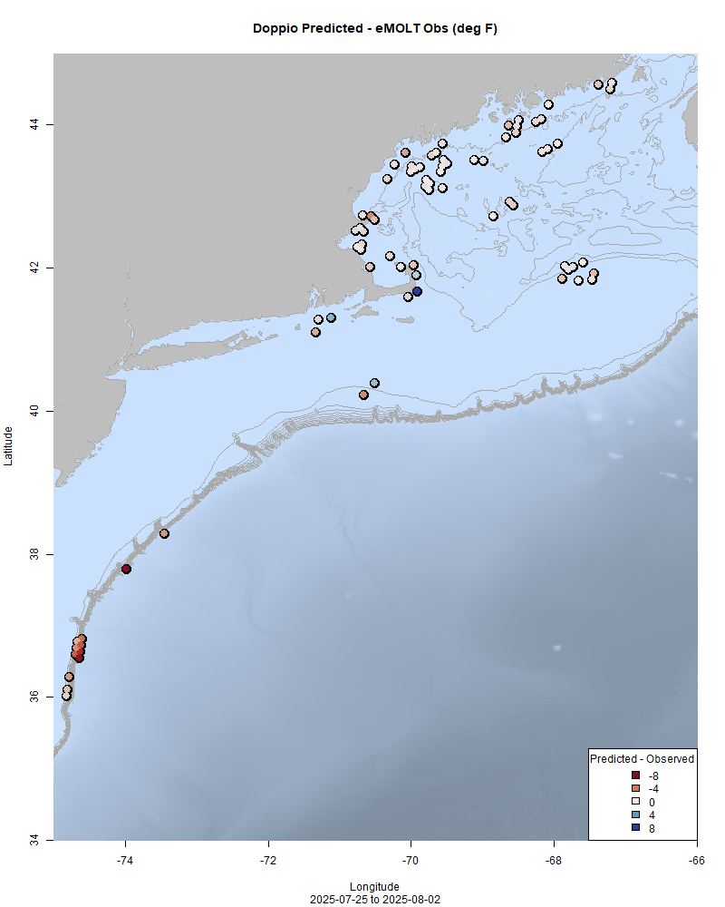

  
```{r setup, include=FALSE}
knitr::opts_chunk$set(echo = TRUE)
library(marmap)
library(rstudioapi)
if(Sys.info()["sysname"]=="Windows"){
  source("C:/Users/george.maynard/Documents/GitHubRepos/emolt_project_management/WeeklyUpdates/forecast_check/R/emolt_download.R")
} else {
  source("/home/george/Documents/emolt_project_management/WeeklyUpdates/forecast_check/R/emolt_download.R")
}

data=emolt_download(days=7)
start_date=Sys.Date()-lubridate::days(7)
## Use the dates from above to create a URL for grabbing the data
full_data=read.csv(
  paste0(
    "https://erddap.emolt.net/erddap/tabledap/eMOLT_RT.csvp?tow_id%2Csegment_type%2Ctime%2Clatitude%2Clongitude%2Cdepth%2Ctemperature%2Csensor_type&segment_type=3&time%3E=",
    lubridate::year(start_date),
    "-",
    lubridate::month(start_date),
    "-",
    lubridate::day(start_date),
    "T00%3A00%3A00Z&time%3C=",
    lubridate::year(Sys.Date()),
    "-",
    lubridate::month(Sys.Date()),
    "-",
    lubridate::day(Sys.Date()),
    "T23%3A59%3A59Z"
  )
)
sensor_time=0
for(tow in unique(full_data$tow_id)){
  x=subset(full_data,full_data$tow_id==tow)
  sensor_time=sensor_time+difftime(max(x$time..UTC.),units='hours',min(x$time..UTC.))
}
```

<center> 

<font size="5"> *eMOLT Update `r Sys.Date()` * </font>
  
</center>
  
## Weekly Recap 

A big thanks this week to our partners at the Center for Coastal Studies, Coonamessett Farm Foundation, the Gulf of Maine Lobster Foundation, and the NEFSC Cooperative Research Branch for getting out to the docks from Gloucester down to Quonset to install new new systems. 

Thanks also to Captains Chuck, Curt, Dominic, and Thom up in Maine, Captains Kurt, Lara, and Todd here in Massachusetts, and the team at Commercial Fisheries Research Foundation in Rhode Island for helping us get more dissolved oxygen loggers deployed around the region.     

This week, the eMOLT fleet recorded `r length(unique(full_data$tow_id))` tows of sensorized fishing gear totaling `r as.numeric(sensor_time)` sensor hours underwater. 


> *Figure 1 -- FISHBOT bottom temperature records from the past week. The data are available on the [Commercial Fisheries Research Foundation ERDDAP](https://erddap.ondeckdata.com/erddap/tabledap/fishbot_realtime.html) and an interactive visualization is available at the [Cape Cod Ocean Watch](https://ccocean.whoi.edu/index.html) dashboard hosted by Woods Hole Oceanographic Institution. FISHBOT aggregates data provided by participants in eMOLT, the CFRF Lobster and Jonah Crab Research Fleet, the CFRF Shelf Research Fleet, the Cape Cod Commercial Fishermen's Alliance Cape Cod Oceanographic Research Fleet, the Maine Coast Fishermen's Association Fisheries Ocean Data Program, MassDMF Cape Cod Bay Study Fleet, the Northeast Fisheries Science Center Study Fleet, and the Northeast Fisheries Science Center Ecosystem Monitoring Surveys*

In the northern region, the seasonal thermocline is well defined everywhere between 10 and 15 fathoms except for well-mixed waters Downeast (brown and red profiles) and up on top of Georges Bank (light green profile). 


> *Figure 2 -- Temperature profiles collected by eMOLT participants up north and out east over the last week.*


In the profiles from the southern part of the region, the seasonal thermocline is ubiquitous in that same 10-15 fathom window, with surface temps in some areas (e.g. yellow profile east of North Carolina) almost 30 degrees (F) warmer than the bottom. 


> *Figure 3 -- Temperature profiles collected by eMOLT participants over the last week in the southern part of our region.*

### Big News for NERACOOS and New England!

*Guest post from the Northeastern Regional Association of Coastal Ocean Observing Systems*

[New England Seafood Partnership for Innovations, Research and Engagement (NSPIRE)](https://seafoodengine.org) is a  vision for an emerging innovation ecosystem led by NERACOOS in collaboration with many of our region's leading seafood associations, technology companies, government agencies, academic and scientific institutions, and other notable organizations. NSPIRE aims to confront the challenges facing the seafood industry head-on by mobilizing New England's dynamic, expanding, and world-leading tech sector to break through bottlenecks across the seafood supply chain.

Last month, we learned that [NSPIRE was selected as one of 29 semifinalists as a National Science Foundation Regional Innovation Engine](https://www.nsf.gov/news/nsf-advances-29-semifinalists-second-nsf-regional-innovation) from more than 300 Letters of Intent. Should NSPIRE take top honors in this prestigious competition, it could receive up to $160 million over ten years to support the development of regional coalitions of researchers, institutions, and companies to create solutions with both economic and societal impacts.

### [Dissolved Oxygen in Cape Cod Bay](https://experience.arcgis.com/experience/0d553dfc6c60487cb1f4d20b5366ee0b/page/Map-Page/)

With most of the loggers deployed in Cape Cod Bay through MassDMF's CCB Study Fleet and the eMOLT Program, we're happy to say that oxygen levels are looking good so far this year. You can click on the link above to access MassDMF's interactive data display online.


> *Figure 4 -- Dissolved oxygen observations from Cape Cod Bay collected by participants in the eMOLT program and the Cape Cod Bay Study Fleet program operated by Massachusetts Division of Marine Fisheries and the Massachusetts Lobstermen's Association over the past week. Purple dots indicate dissolved oxygen values in the normal range (> 6 mg/L), yellow dots indicate low dissolved oxygen values (4-6 mg/L), orange dots indicate very low dissolved oxygen values (2-4 mg/L), and red dots indicate critically low values (< 2 mg/L).*

### Subsurface Observations Map


>*Figure 5 -- Map of realtime, publicly accessible subsurface measurements collected over the last month here in the Northeastern United States. Fishing vessel observations (blue) represent aggregated data from eMOLT, Commercial Fisheries Research Foundation, and Ocean Data Network.*

To learn more about the programs shown on this map, check out their websites:

- [Northeast Regional Association of Coastal Ocean Observing Systems](https://www.neracoos.org/)
- [environmental Monitors on Lobster Traps and Large Trawlers](https://www.fisheries.noaa.gov/new-england-mid-atlantic/climate/partnering-fishing-industry-monitor-northeast-shelf)
- [Commercial Fisheries Research Foundation](https://www.cfrfoundation.org/)
- [Ocean Data Network](https://oceandata.net/)
- [Rutgers University Center for Ocean Observing Leadership](https://rucool.marine.rutgers.edu/data/underwater-gliders/about-underwater-gliders/) 
- [Argo](https://argo.ucsd.edu/)
- [Oleander Line](https://bios.asu.edu/oleander)

### Bottom Temperature Forecasts

#### Doppio 

This week, 67.9% of bottom temperature observations were within 2 degrees (F) of the Doppio forecasted value at those points. Bottom temps throughout the eastern Gulf of Maine and the northern flank of Georges Bank were fairly close to forecasted values, although some observations in the western Gulf of Maine were warmer than expected. The model struggled south of New England, with temperatures along the shelf break being warmer than expected and some temperatures closer in to Cape Cod and the Islands being cooler than expected. 



> *Figure 6 -- Performance of the Doppio forecast's bottom temperature layer over the last week relative to observations collected by eMOLT participants. Red dots indicate areas where bottom temperature observations were warmer that predicted. Blue dots indicate areas where bottom temperature observations were cooler than predicted. Bottom temperature observations are compared with the most recent forecast run available before the observation was made.* 


> *Figure 7 -- The most recent Doppio bottom temperature forecast. The gray line is the 50 fathom line and the black line is the hundred fathom line. Purple shades indicate cooler water.*
  
#### Northeast Coastal Ocean Forecast System
  


> *Figure 8 -- The most recent bottom temperature forecast from the Northeast Coastal Ocean Forecast System GOM7 model. The gray line is the 50 fathom line and the black line is the hundred fathom line. Purple shades indicate cooler water.*
  


> *Figure 9 -- The most recent bottom temperature forecast from the Northeast Coastal Ocean Forecast System MassBay model. Purple shades indicate cooler water.*

### Disclaimer
  
The eMOLT Update is NOT an official NOAA document. Mention of products or manufacturers does not constitute an endorsement by NOAA or Department of Commerce. The content of this update reflects only the personal views of the authors and does not necessarily represent the views of NOAA Fisheries, the Department of Commerce, or the United States.


All the best,

-George
