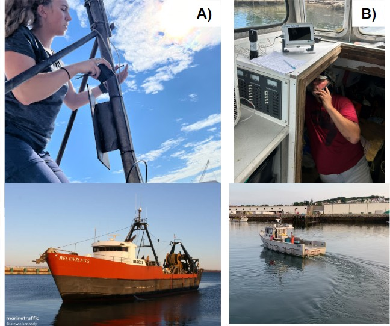
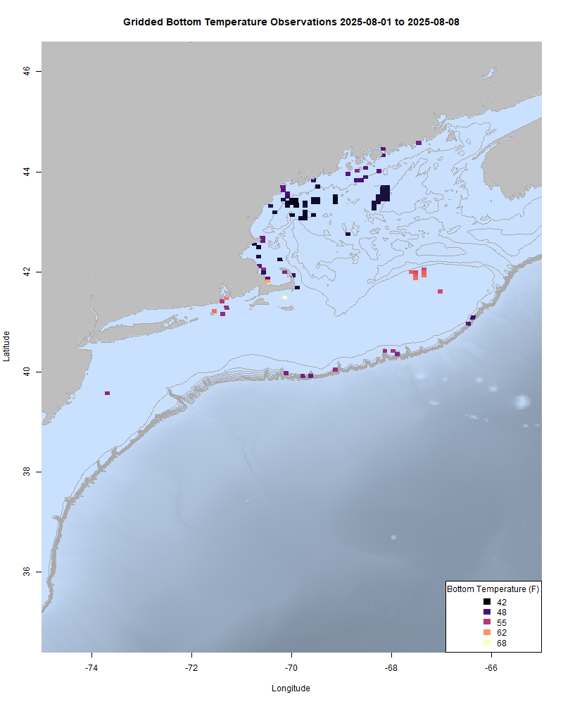
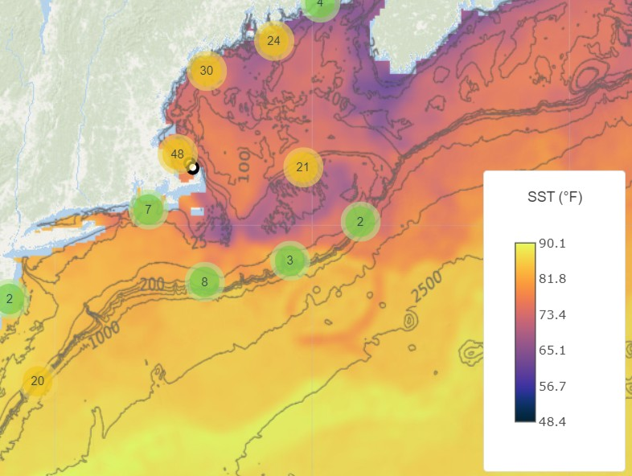

  
```{r setup, include=FALSE}
knitr::opts_chunk$set(echo = TRUE)
library(marmap)
library(rstudioapi)
if(Sys.info()["sysname"]=="Windows"){
  source("C:/Users/george.maynard/Documents/GitHubRepos/emolt_project_management/WeeklyUpdates/forecast_check/R/emolt_download.R")
} else {
  source("/home/george/Documents/emolt_project_management/WeeklyUpdates/forecast_check/R/emolt_download.R")
}

data=emolt_download(days=7)
start_date=Sys.Date()-lubridate::days(7)
## Use the dates from above to create a URL for grabbing the data
full_data=read.csv(
  paste0(
    "https://erddap.emolt.net/erddap/tabledap/eMOLT_RT.csvp?tow_id%2Csegment_type%2Ctime%2Clatitude%2Clongitude%2Cdepth%2Ctemperature%2Csensor_type&segment_type=3&time%3E=",
    lubridate::year(start_date),
    "-",
    lubridate::month(start_date),
    "-",
    lubridate::day(start_date),
    "T00%3A00%3A00Z&time%3C=",
    lubridate::year(Sys.Date()),
    "-",
    lubridate::month(Sys.Date()),
    "-",
    lubridate::day(Sys.Date()),
    "T23%3A59%3A59Z"
  )
)
sensor_time=0
for(tow in unique(full_data$tow_id)){
  x=subset(full_data,full_data$tow_id==tow)
  sensor_time=sensor_time+difftime(max(x$time..UTC.),units='hours',min(x$time..UTC.))
}
```

<center> 

<font size="5"> *eMOLT Update `r Sys.Date()` * </font>
  
</center>
  
## Weekly Recap 

A big thanks this week to our partners at the Center for Coastal Studies, Coonamessett Farm Foundation, the Gulf of Maine Lobster Foundation, and the NEFSC Cooperative Research Branch for getting out to the docks from Gloucester down to Quonset to install new new systems. 



> *Figure 1 -- A) Hannah from the Cooperative Research Branch here at NEFSC attaches a bluetooth antenna extension to a mast aboard the F/V Relentless. B) Captain Chris checks the wiring of the new deckbox aboard the F/V Trapper John. Vessel photos from [marinetraffic.com](https://www.marinetraffic.com/en/photos/of/ships/shipid:3555299/shipname:RELENTLESS?order=date_uploaded) and [Good Morning Gloucester](https://goodmorninggloucester.com/2019/07/16/all-aluminum-construction-lobsterboat-f-v-trapper-john-heads-out-to-harvest-lobster/)*

Thanks also to Captains Chuck, Curt, Dominic, and Thom up in Maine, Captains Kurt, Lara, and Todd here in Massachusetts, and the team at Commercial Fisheries Research Foundation in Rhode Island for helping us get more dissolved oxygen loggers deployed around the region.     

This week, the eMOLT fleet recorded `r length(unique(full_data$tow_id))` tows of sensorized fishing gear totaling `r as.numeric(sensor_time)` sensor hours underwater. 



> *Figure 1 -- FISHBOT bottom temperature records from the past week. The data are available on the [Commercial Fisheries Research Foundation ERDDAP](https://erddap.ondeckdata.com/erddap/tabledap/fishbot_realtime.html) and an interactive visualization is available at the [Cape Cod Ocean Watch](https://ccocean.whoi.edu/index.html) dashboard hosted by Woods Hole Oceanographic Institution. FISHBOT aggregates data provided by participants in eMOLT, the CFRF Lobster and Jonah Crab Research Fleet, the CFRF Shelf Research Fleet, the Cape Cod Commercial Fishermen's Alliance Cape Cod Oceanographic Research Fleet, the Maine Coast Fishermen's Association Fisheries Ocean Data Program, MassDMF Cape Cod Bay Study Fleet, the Northeast Fisheries Science Center Study Fleet, and the Northeast Fisheries Science Center Ecosystem Monitoring Surveys*


### New Online Dashboard Available



> *Figure -- A screenshot from the Cape Cod Ocean Watch website showing approximate locations of water column profiles collected by the fishing industry over the last two weeks along with gap-filled sea surface temperature from July 29. Users can zoom in to see approximate locations of individual profiles (fuzzed a little to protect privacy) and click on profiles to select and view them side by side.*

In an effort to respond to industry requests for a single clearinghouse for lots of environmental information that you all use, the eMOLT team has partnered with Woods Hole Oceanographic Institution, Commercial Fisheries Research Foundation, the Cape Cod Commercial Fishermen's Alliance, and Sea Grant to support WHOI's development of a new web portal, which they've dubbed "[Cape Cod Ocean Watch](https://ccocean.whoi.edu/index.html)". The portal displays temperature profiles collected by eMOLT participants (with the actual locations blurred a little), CTD casts from the CCCFA and CFRF research fleets (include salinity along with depth and temperature), daily bottom condition averages from FISHBOT, and sea surface data (chlorophyll, salinity, and temperature) collected by satellites. Data can be filtered by date and displayed in standard or metric units. If you have questions or suggestions about this product, don't hesitate to reach out!

### [Dissolved Oxygen in Cape Cod Bay](https://experience.arcgis.com/experience/0d553dfc6c60487cb1f4d20b5366ee0b/page/Map-Page/)

Oxygen levels are still looking good so far this year. You can click on the link above to access MassDMF's interactive data display online.


> *Figure 4 -- Dissolved oxygen observations from Cape Cod Bay collected by participants in the eMOLT program and the Cape Cod Bay Study Fleet program operated by Massachusetts Division of Marine Fisheries and the Massachusetts Lobstermen's Association over the past week. Purple dots indicate dissolved oxygen values in the normal range (> 6 mg/L), yellow dots indicate low dissolved oxygen values (4-6 mg/L), orange dots indicate very low dissolved oxygen values (2-4 mg/L), and red dots indicate critically low values (< 2 mg/L).*

### Science Stroll Tomorrow 8/9/2025

If you on Cape Cod tomorrow, we'd love to see you at the annual Woods Hole Science Stroll. The Cooperative Research Branch team will be there to showcase programs like the Bottom Longline Survey, Hook and Line Survey, and eMOLT. Other research groups from the Northeast Fisheries Science Center will also have displays, and many other labs in Woods Hole will be open for tours to check out the array of research projects going on in the village. For more information, check out the event website [here](https://woodsholesciencestroll.org/). 


### Disclaimer
  
The eMOLT Update is NOT an official NOAA document. Mention of products or manufacturers does not constitute an endorsement by NOAA or Department of Commerce. The content of this update reflects only the personal views of the authors and does not necessarily represent the views of NOAA Fisheries, the Department of Commerce, or the United States.


All the best,

-George
