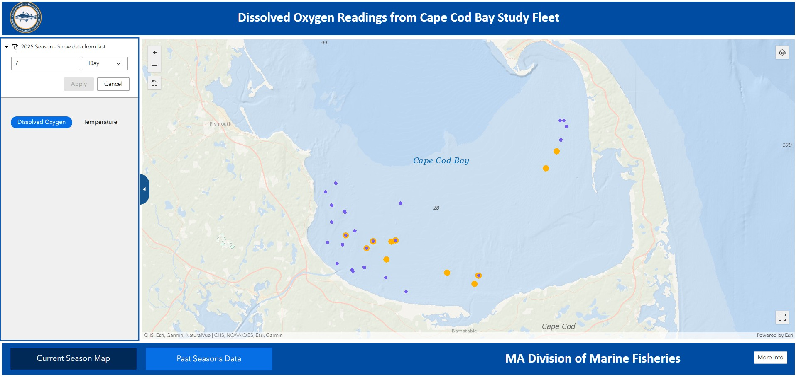

  
```{r setup, include=FALSE}
knitr::opts_chunk$set(echo = TRUE)
library(marmap)
library(rstudioapi)
if(Sys.info()["sysname"]=="Windows"){
  source("C:/Users/george.maynard/Documents/GitHubRepos/emolt_project_management/WeeklyUpdates/forecast_check/R/emolt_download.R")
} else {
  source("/home/george/Documents/emolt_project_management/WeeklyUpdates/forecast_check/R/emolt_download.R")
}

data=emolt_download(days=7)
start_date=Sys.Date()-lubridate::days(7)
## Use the dates from above to create a URL for grabbing the data
full_data=read.csv(
  paste0(
    "https://erddap.emolt.net/erddap/tabledap/eMOLT_RT.csvp?tow_id%2Csegment_type%2Ctime%2Clatitude%2Clongitude%2Cdepth%2Ctemperature%2Csensor_type&segment_type=3&time%3E=",
    lubridate::year(start_date),
    "-",
    lubridate::month(start_date),
    "-",
    lubridate::day(start_date),
    "T00%3A00%3A00Z&time%3C=",
    lubridate::year(Sys.Date()),
    "-",
    lubridate::month(Sys.Date()),
    "-",
    lubridate::day(Sys.Date()),
    "T23%3A59%3A59Z"
  )
)
sensor_time=0
for(tow in unique(full_data$tow_id)){
  x=subset(full_data,full_data$tow_id==tow)
  sensor_time=sensor_time+difftime(max(x$time..UTC.),units='hours',min(x$time..UTC.))
}
```

<center> 

<font size="5"> *eMOLT Update `r Sys.Date()` * </font>
  
</center>
  
## Weekly Recap 

Dissolved oxygen remains at normal levels at sites eMOLT participants monitor along the Maine coast, along the South Shore of Massachusetts, and south of Martha's Vineyard. Sites monitored by fishermen working with the CFRF fleet at the mouth of Narragansett Bay show levels dipping below the "normal" threshold of 6 mg/l this week, although not into hypoxic levels. 

We've had a few requests come in recently from fishermen interested in a refresher on interpreting the Dissolved Oxygen graphs that show up on the deckboxes if you have those sensors. These are a little different from the Temperature / Depth sensors in that they don't have a pressure (depth) value, just temperature and dissolved oxygen. They also don't profile on the way down. Check out the plot below for more info, and please feel free to reach out if you want to walk through one of these plots over the phone.


>*Figure 1 -- Screenshot of a Dissolved Oxygen graph from a Deck Data Hub*

In the graph above, dissolved oxygen concentration is shown by the blue line. The closer the line is to the top of the graph, the higher the oxygen content of the water. Across the bottom is date and time, with the most recent measurements on the right hand side of the graph and the oldest measurements on the left hand side of the graph. Match the blue line with the scale on the left hand side of the graph (blue numbers). Dissolved oxygen is measured in milligrams per liter (mg/l) which is not that informative, so the graph is color coded. If the blue line is up top in the green zone (more than 6 mg/l), that's a "normal" or "good" level of dissolved oxygen. If the blue line is in the red zone at the bottom of the graph (less than 2 mg/l) that's indicative of hypoxia ('dead zones'). As I'm typing this, I realize we should probably change the colors so they're more friendly to folks who are color blind...sorry about that!

So to recap, in the graph above, oxygen is always in the "good" zone and bounces around near 8 mg/L from August 25 through August 29. 

The red line on the graph represents bottom temperature over the same time period (shown in the red numbers on the right hand side of the graph). Early on after this logger was set on August 25, the temperature was around 62 degrees, but it dropped to 56 degrees on August 26, before climbing back up to around 60-61 degrees on August 28 and dropping back into the upper 50s on August 29. 

This week, the eMOLT fleet recorded `r length(unique(full_data$tow_id))` tows of sensorized fishing gear totaling `r as.numeric(sensor_time)` sensor hours underwater.

  

> *Figure 2 -- FISHBOT bottom temperature records from the past week. The data are available on the [Commercial Fisheries Research Foundation ERDDAP](https://erddap.ondeckdata.com/erddap/tabledap/fishbot_realtime.html) and an interactive visualization is available at the [Cape Cod Ocean Watch](https://ccocean.whoi.edu/index.html) dashboard hosted by Woods Hole Oceanographic Institution. FISHBOT aggregates data provided by participants in eMOLT, the CFRF Lobster and Jonah Crab Research Fleet, the CFRF Shelf Research Fleet, the Cape Cod Commercial Fishermen's Alliance Cape Cod Oceanographic Research Fleet, the Maine Coast Fishermen's Association Fisheries Ocean Data Program, MassDMF Cape Cod Bay Study Fleet, the Northeast Fisheries Science Center Study Fleet, and the Northeast Fisheries Science Center Ecosystem Monitoring Surveys*

### Hurricane Erin Impacts

Although Hurricane Erin didn't directly track over the fishing grounds off the Northeastern USA, it was strong enough and close enough to have some impacts beginning around August 21, when it passed ~200 miles off Cape Hatteras.

- Some eMOLT participants fishing in Nantucket Sound reported lots of weed growth and low numbers of fish and crabs prior to Hurricane Erin passing by. The weed seems to have subsided since the storm, although fish numbers are still low. Dissolved oxygen loggers in the southeastern part of the Sound report normal levels.

 
>*Figure 3 -- normal dissolved oxygen levels observed in Southeast Nantucket Sound (blue line)*

- eMOLT participants operating south of Long Island collected these data before and after Hurricane Erin, showing a decrease in surface temperature from ~75 F to ~70 F. In the middle of the water column, the distribution of temperatures tightens up, indicating mixing and the beginning of the breakdown of the thermocline. According to [research from Dr. Glen Gawarkiewicz's group at WHOI published a few years back](https://doi.org/10.1029/2022JC019625), this is almost a month earlier than the average breakdown occurred from 2015-2022.


>*Figure 4 -- water column temperatures south of Long Island before and after Hurricane Erin passed the region*

- Our partners at Commercial Fisheries Research Foundation observed drastic changes in bottom temperature (almost a 10 degree increase, solid blue lines) and dissolved oxygen off Point Pleasant, NJ. Before the storm, this area was hypoxic, and oxygen levels (solid red line) are now back to normal.


>*Figure 5 -- Temperature plots from two loggers off Point Pleasant, NJ show the same rapid spike in bottom temps after Hurricane Erin passed. The logger on the right also had a DO sensor and shows a spike up to "normal" levels from hypoxia before the storm.*

### [Dissolved Oxygen in Cape Cod Bay](https://experience.arcgis.com/experience/0d553dfc6c60487cb1f4d20b5366ee0b/page/Map-Page/)

There were a few low readings in the Southwestern part of Cape Cod Bay between Manomet and Barnstable in the early part of the week. Recent readings in the area appear to be back up into more normal levels. You can click on the link above to access MassDMF's interactive data display online.



> *Figure 6 -- Dissolved oxygen observations from Cape Cod Bay collected by participants in the eMOLT program and the Cape Cod Bay Study Fleet program operated by Massachusetts Division of Marine Fisheries and the Massachusetts Lobstermen's Association over the past week. Purple dots indicate dissolved oxygen values in the normal range (> 6 mg/L), yellow dots indicate low dissolved oxygen values (4-6 mg/L), orange dots indicate very low dissolved oxygen values (2-4 mg/L), and red dots indicate critically low values (< 2 mg/L).*

### [NOAA Fisheries Seeks Recommendations for Restoring American Seafood Competitiveness](https://www.fisheries.noaa.gov/feature-story/noaa-fisheries-seeks-recommendations-restoring-american-seafood-competitiveness)

A 45-day public comment period in support of [Executive Order 14276 (Restoring American Seafood Competitiveness)](https://www.whitehouse.gov/presidential-actions/2025/04/restoring-american-seafood-competitiveness/) is open until October 14, 2025. To read more about the comment period, click the links above. For instructions on how to comment, check out the Federal Register [here](https://www.federalregister.gov/documents/2025/08/27/2025-16377/recommendations-for-restoring-american-seafood-competitiveness#addresses)

### Other News from the Region

- [Lobstermen save teen boaters off Chatham, MA](https://www.capecodchronicle.com/articles/3284/view/firefighters-residents-recognized-for-service-to-community-lobstermen-who-saved-teens-lauded)
- [Massachusetts DMF Trawl Survey Begins 9/2/2025](https://content.govdelivery.com/accounts/MADMF/bulletins/3ef99fd)
- [Maine Coast Fishermen's Association Director interviews WHOI scientist about the LOC-NESS Project](https://www.mainecoastfishermen.org/post/podcast-understanding-whoi-s-loc-ness-project)
- [Island Institute offers lobstermen free training to diversify and grow their businesses](https://www.islandinstitute.org/priorities/marine-economy/future-of-fishing-toolkit/)


### Disclaimer
  
The eMOLT Update is NOT an official NOAA document. Mention of products or manufacturers does not constitute an endorsement by NOAA or Department of Commerce. The content of this update reflects only the personal views of the authors and does not necessarily represent the views of NOAA Fisheries, the Department of Commerce, or the United States.


All the best,

-George
