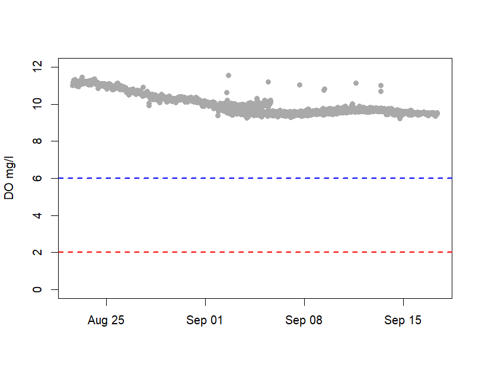
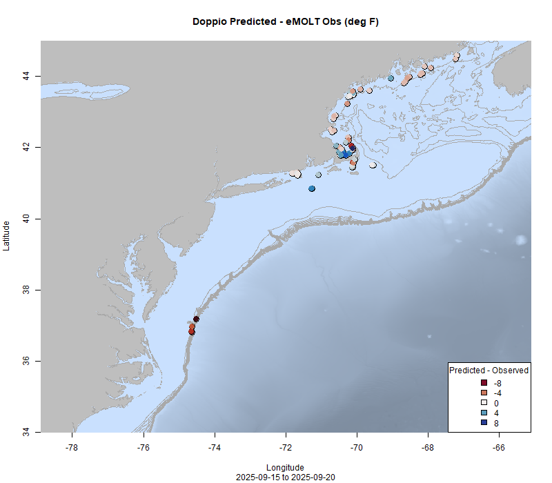
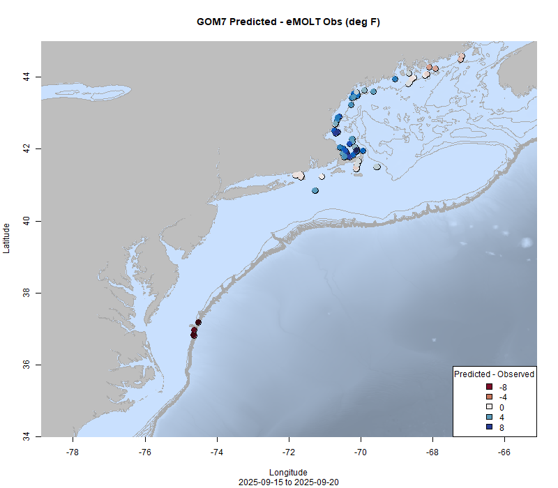

  
```{r setup, include=FALSE}
knitr::opts_chunk$set(echo = TRUE)
options(scipen = 999)
library(marmap)
library(rstudioapi)
if(Sys.info()["sysname"]=="Windows"){
  source("C:/Users/george.maynard/Documents/GitHubRepos/emolt_project_management/WeeklyUpdates/forecast_check/R/emolt_download.R")
} else {
  source("/home/george/Documents/emolt_project_management/WeeklyUpdates/forecast_check/R/emolt_download.R")
}

data=emolt_download(days=7)
start_date=Sys.Date()-lubridate::days(7)
## Use the dates from above to create a URL for grabbing the data
full_data=read.csv(
  paste0(
    "https://erddap.emolt.net/erddap/tabledap/eMOLT_RT.csvp?tow_id%2Csegment_type%2Ctime%2Clatitude%2Clongitude%2Cdepth%2Ctemperature%2Csensor_type&segment_type=3&time%3E=",
    lubridate::year(start_date),
    "-",
    lubridate::month(start_date),
    "-",
    lubridate::day(start_date),
    "T00%3A00%3A00Z&time%3C=",
    lubridate::year(Sys.Date()),
    "-",
    lubridate::month(Sys.Date()),
    "-",
    lubridate::day(Sys.Date()),
    "T23%3A59%3A59Z"
  )
)
sensor_time=0
for(tow in unique(full_data$tow_id)){
  x=subset(full_data,full_data$tow_id==tow)
  sensor_time=sensor_time+difftime(max(x$time..UTC.),units='hours',min(x$time..UTC.))
}
```

<center> 

<font size="5"> *eMOLT Update `r Sys.Date()` * </font>
  
</center>
  
## Weekly Recap 

Over the last week, we've heard from lobstermen and our colleagues at the Maine Center for Coastal Fisheries and NERACOOS that the water in Jericho Bay and around Marshall Island was red because of some sort of plankton. While there were detections of several Harmful Algal Bloom species at the MDI Biological Laboratory's monitoring station, Dr. David Townsend at the University of Maine cautioned that the red water could just as well be caused by something benign such as *Myrionecta rubra*, which has commonly caused red water in nearby Frenchman Bay. On the Squid Squad call this morning, Dr. Erin Grey (also at UMaine) mentioned that the Gulf of Maine Marine Biodiversity Observation Network detected a *Tripos spp.* bloom recently as well. Dissolved oxygen levels recorded by eMOLT participants in the vicinity of the bloom remain well above the "normal" threshold of 6 mg/l (blue dashed line) and nowhere near the "hypoxic" threshold of 2 mg/l (red dashed line). Our colleagues at Maine DMR are slated to do some sea sampling up that way in the near future and may have some more information after that trip.



> *Figure 1 -- Dissolved oxygen records from several loggers near Jericho Bay, Maine from late August to present. All loggers showed normal levels of dissolved oxygen (greater than 6 mg/l) for the entire time period.*

Another issue that has cropped up several times in the last few years is the presence of "gorilla hair" or "bear fur". The scientific name for this red weed is *Dasysiphonia japonica* and it has spread throughout New England over the last few decades, creating dense monocultures where native seaweeds are excluded. In 2019, there was a major outbreak south of Long Island. Two years ago, there were reports of dense beds of this weed along the South Shore in Massachusetts. This year, we've heard from fishermen in Nantucket Sound, Casco Bay, and Downeast Maine that they are struggling with the weed, and earlier this month [a bloom stunk up Good Harbor Beach in Gloucester, MA](https://www.boston.com/news/environment/2025/09/04/invasive-seaweed-stinks-up-one-of-the-north-shores-favorite-seaside-spots/). We've started to try to brainstorm ideas for a way to help improve our collective understanding of this invasive species and what environmental conditions might contribute to outbreaks, so if you've got thoughts, please feel free to reach out.

This week, the eMOLT fleet recorded `r length(unique(full_data$tow_id))` tows of sensorized fishing gear totaling `r as.numeric(sensor_time)` sensor hours underwater.

```{r FISHBOT_Plot, echo=FALSE, fig.width=8, fig.height=10,warning=FALSE,message=FALSE,error=FALSE}
source("C:/Users/george.maynard/Documents/emolt_project_management/WeeklyUpdates/Plotting/FISHBOT_Weekly.R")
```

> *Figure 2 -- FISHBOT bottom temperature records from the past week. The data are available on the [Commercial Fisheries Research Foundation ERDDAP](https://erddap.ondeckdata.com/erddap/tabledap/fishbot_realtime.html) and an interactive visualization is available at the [Cape Cod Ocean Watch](https://ccocean.whoi.edu/index.html) dashboard hosted by Woods Hole Oceanographic Institution. FISHBOT aggregates data provided by participants in eMOLT, the CFRF Lobster and Jonah Crab Research Fleet, the CFRF Shelf Research Fleet, the Cape Cod Commercial Fishermen's Alliance Cape Cod Oceanographic Research Fleet, the Maine Coast Fishermen's Association Fisheries Ocean Data Program, MassDMF Cape Cod Bay Study Fleet, the Northeast Fisheries Science Center Study Fleet, and the Northeast Fisheries Science Center Ecosystem Monitoring Surveys*

### Regional Dissolved Oxygen Loggers

Our partners at CFRF detected very low (2.7 mg/l) dissolved oxygen just south of Newport on 9/18. Dissolved oxygen loggers east of New Jersey, south of Cape Cod, and along the Maine coast reported normal values. 

### [Dissolved Oxygen in Cape Cod Bay](https://experience.arcgis.com/experience/0d553dfc6c60487cb1f4d20b5366ee0b/page/Map-Page/)

This week, there were several low readings in the southwestern part of Cape Cod Bay and west of Wellfleet although none of those readings were below the 2 mg/l hypoxia threshold. North and west of the canal entrance lighted bell buoy oxygen levels still look good. You can click on the link above to access MassDMF's interactive data display online.


> *Figure 3 -- Dissolved oxygen observations from Cape Cod Bay collected by participants in the eMOLT program and the Cape Cod Bay Study Fleet program operated by Massachusetts Division of Marine Fisheries and the Massachusetts Lobstermen's Association over the past week. Purple dots indicate dissolved oxygen values in the normal range (> 6 mg/L), yellow dots indicate low dissolved oxygen values (4-6 mg/L), orange dots indicate very low dissolved oxygen values (2-4 mg/L), and red dots indicate critically low values (< 2 mg/L).*


### Bottom Temperature Forecast Performance

This week, when compared with observations from the eMOLT program, the Doppio and NECOFS models had similar R<sup>2</sup> values. This measures the "goodness of fit" or how close model predictions are to the actual data. They also had similar Root Mean Squared Errors, which are indicative of the model's prediction accuracy. Where there was a measurable difference, however, was in the model Bias which measures the consistency of errors. Doppio had a fairly low bias, indicating that there wasn't much consistency in the errors. This is visible in the map, where you can see some observations are warmer than predicted (red) and some are cooler than predicted (blue). In contrast, NECOFS was biased warm, such that observations were generally cooler than the model predicted, as evidenced by all of the blue dots between Cape Cod and Penobscot Bay. NECOFS performed best along Southern New England. Both models struggled to resolve temperatures along the shelf break east of Virginia where observations were much warmer than predicted (dark red) and in western Cape Cod Bay where temperature were much cooler than expected. 

{width=45%} {width=45%}

> *Figure 4 -- Comparisons between bottom temperatures predicted by two ocean forecasting models and observations from the eMOLT fleet. Blue dots show where the observations were cooler than the forecast and red dots show where the observations were warmer than the forecast. White dots show areas where the observations and forecasts agreed. On the left is the comparison with the Doppio model and on the right is the comparison with the NECOFS model (GOM7).*

### [NOAA Fisheries Seeks Recommendations for Restoring American Seafood Competitiveness](https://www.fisheries.noaa.gov/feature-story/noaa-fisheries-seeks-recommendations-restoring-american-seafood-competitiveness)

A 45-day public comment period in support of [Executive Order 14276 (Restoring American Seafood Competitiveness)](https://www.whitehouse.gov/presidential-actions/2025/04/restoring-american-seafood-competitiveness/) is open until October 14, 2025. To read more about the comment period, click the links above. For instructions on how to comment, check out the Federal Register [here](https://www.federalregister.gov/documents/2025/08/27/2025-16377/recommendations-for-restoring-american-seafood-competitiveness#addresses)

### NERACOOS Seeks Fishing Industry Input

The NERACOOS Mariners’ Dashboard provides real-time weather and ocean info to help plan your time on the water, and they need your help to make it even better. Please take a few minutes to let us know what works, what doesn’t, and what would make the Dashboard more useful for you by [filling out the short survey here](https://www.surveymonkey.com/r/V5F5Z7P)

### Other News from the Region

- Buoy M is back online! Buoy M was damaged by a ship strike last August and went offline. The University of Maine's Physical Oceanography Group deployed a replacement for Buoy M and took advantage of their time at sea to replace Buoys A and I as well. You can see live data from Buoy M on the [NERACOOS Mariner's Dashboard here](https://mariners.neracoos.org/platform/M01).

- NERACOOS Led [NSPIRE Project](https://seafoodengine.org/) Advances to [Final Round of NSF Funding Competition](https://www.nsf.gov/news/nsf-selects-15-finalists-advance-next-round-its-second)

- [Fishing Vessel Ocean Observing Network](http://www.fvon.org) to be highlighted in two part webinar series called "Ocean Data for Sustainable and Profitable Fisheries". The first part (Friday October 9 at 12 PM EDT) will feature Ocean Data Network's Cooper Van Vranken and eMOLT's George Maynard. To register [click here](https://safet.mn.co/posts/90930851). The second part will feature FVON members from the Eastern Hemisphere. Stay tuned for more info!

### Disclaimer
  
The eMOLT Update is NOT an official NOAA document. Mention of products or manufacturers does not constitute an endorsement by NOAA or Department of Commerce. The content of this update reflects only the personal views of the authors and does not necessarily represent the views of NOAA Fisheries, the Department of Commerce, or the United States.


All the best,

-George
