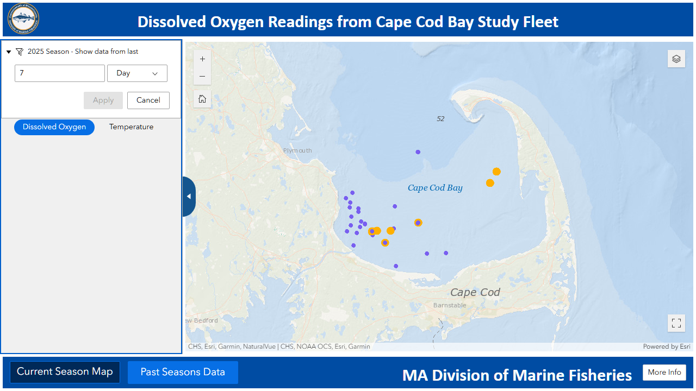
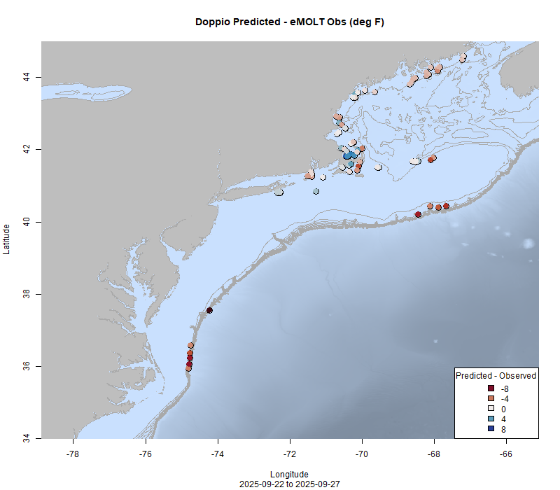

  
```{r setup, include=FALSE}
knitr::opts_chunk$set(echo = TRUE)
options(scipen = 999)
library(marmap)
library(rstudioapi)
if(Sys.info()["sysname"]=="Windows"){
  source("C:/Users/george.maynard/Documents/GitHubRepos/emolt_project_management/WeeklyUpdates/forecast_check/R/emolt_download.R")
} else {
  source("/home/george/Documents/emolt_project_management/WeeklyUpdates/forecast_check/R/emolt_download.R")
}
reticulate::source_python("C:/Users/george.maynard/Documents/emolt_project_management/WeeklyUpdates/Plotting/MA_DMF_screenshot.py")
data=emolt_download(days=7)
start_date=Sys.Date()-lubridate::days(7)
## Use the dates from above to create a URL for grabbing the data
full_data=read.csv(
  paste0(
    "https://erddap.emolt.net/erddap/tabledap/eMOLT_RT.csvp?tow_id%2Csegment_type%2Ctime%2Clatitude%2Clongitude%2Cdepth%2Ctemperature%2Csensor_type&segment_type=3&time%3E=",
    lubridate::year(start_date),
    "-",
    lubridate::month(start_date),
    "-",
    lubridate::day(start_date),
    "T00%3A00%3A00Z&time%3C=",
    lubridate::year(Sys.Date()),
    "-",
    lubridate::month(Sys.Date()),
    "-",
    lubridate::day(Sys.Date()),
    "T23%3A59%3A59Z"
  )
)
sensor_time=0
for(tow in unique(full_data$tow_id)){
  x=subset(full_data,full_data$tow_id==tow)
  sensor_time=sensor_time+difftime(max(x$time..UTC.),units='hours',min(x$time..UTC.))
}
```

<center> 

<font size="5"> *eMOLT Update `r Sys.Date()` * </font>
  
</center>
  
## Weekly Recap 

This week has been a little scrambled, with the team working to make sure we have as many issues ironed out as possible before the potential shutdown next week. Thanks to Captains Bobby (F/V Darana R), Corey (F/V Kathy Anne), Danny (F/V Monica), George (F/V Eagle), Jamien (F/V Ella V), John (F/V Deborah Lee), Kevin (F/V Dana Christine II),  Mike (F/V Adventure), Paulo (F/V Princess Scarlett), Todd (F/V Voyager), and Tony (F/V Chatham) for your patience and assistance identifying and resolving issues from software bugs to lost and broken sensors and for your help looping more boats into the program. Thanks also to all of the tech teams who've been at the docks and behind computers around the region supporting these efforts (Carles, Cassie, Huanxin, Nick, and Owen have all been busy this week), and a big thanks to Joey and the Rutgers team for bringing my NEFSC colleague Dr. Jason Morson up to speed on hardware and software maintenance so that we can expand our local capabilities in New Jersey ports. To streamline general maintenance (sensor recalibration, battery replacement, software and firmware updates, etc.) Huanxin, Carles, and I have been working on a few new tools for the tech support teams that we'll be rolling out in the next month or so. 

The Maine Division of Marine Resources got out and collected bottle samples from the plankton bloom south of Bar Harbor / Swan's Island. According to scientist Kevin Lachapelle, "The sample was predominately *ceratium lineatum* (~150,900 cells/L) along with an elevated level of *prorocentrum micans* (~4,518 cells/L), and low/typical amounts of assorted *Dinophysis* and *pseudo-nitzschia*." Although both *Dinophysis* and *pseudo-nitzschia* can cause human health problems, it's important to note that they were found at low/typical levels. To learn more about any of these organisms check out the links below:

- [*Ceratium lineatum*](https://www.st.nmfs.noaa.gov/nauplius/media/copepedia/taxa/T2004253/)
- [*Prorocentrum micans*](https://phytoplankton.eoas.ubc.ca/research/phytoplankton/dinoflagellates/prorocentrum/p_micans.html)
- [*Dinophysis*](https://www.vims.edu/bayinfo/habs/guide/dinophysis.php)
- [*Pseudo-nitzschia*](https://hab.whoi.edu/species/species-by-name/pseudo-nitzschia/)

This week, the eMOLT fleet recorded `r length(unique(full_data$tow_id))` tows of sensorized fishing gear totaling `r as.numeric(sensor_time)` sensor hours underwater.

```{r FISHBOT_Plot, echo=FALSE, fig.width=8, fig.height=10,warning=FALSE,message=FALSE,error=FALSE}
source("C:/Users/george.maynard/Documents/emolt_project_management/WeeklyUpdates/Plotting/FISHBOT_Weekly.R")
```

> *Figure 2 -- FISHBOT bottom temperature records from the past week. The data are available on the [Commercial Fisheries Research Foundation ERDDAP](https://erddap.ondeckdata.com/erddap/tabledap/fishbot_realtime.html) and an interactive visualization is available at the [Cape Cod Ocean Watch](https://ccocean.whoi.edu/index.html) dashboard hosted by Woods Hole Oceanographic Institution. FISHBOT aggregates data provided by participants in eMOLT, the CFRF Lobster and Jonah Crab Research Fleet, the CFRF Shelf Research Fleet, the Cape Cod Commercial Fishermen's Alliance Cape Cod Oceanographic Research Fleet, the Maine Coast Fishermen's Association Fisheries Ocean Data Program, MassDMF Cape Cod Bay Study Fleet, the Northeast Fisheries Science Center Study Fleet, and the Northeast Fisheries Science Center Ecosystem Monitoring Surveys*

### Regional Dissolved Oxygen Loggers

Dissolved oxygen loggers just south of Jamestown Rhode Island, east of New Jersey, south of Cape Cod, and along the Maine coast reported normal values. 

### [Dissolved Oxygen in Cape Cod Bay](https://experience.arcgis.com/experience/0d553dfc6c60487cb1f4d20b5366ee0b/page/Map-Page/)

This week, there were several low readings in the southwestern part of Cape Cod Bay and west of Wellfleet although none of those readings were below the 2 mg/l hypoxia threshold. North and west of the canal entrance lighted bell buoy oxygen levels still look good. You can click on the link above to access MassDMF's interactive data display online.



> *Figure 3 -- Dissolved oxygen observations from Cape Cod Bay collected by participants in the eMOLT program and the Cape Cod Bay Study Fleet program operated by Massachusetts Division of Marine Fisheries and the Massachusetts Lobstermen's Association over the past week. Purple dots indicate dissolved oxygen values in the normal range (> 6 mg/L), yellow dots indicate low dissolved oxygen values (4-6 mg/L), orange dots indicate very low dissolved oxygen values (2-4 mg/L), and red dots indicate critically low values (< 2 mg/L).*


### Bottom Temperature Forecast Performance

This week, when compared with observations from the eMOLT program, Doppio had a higher R<sup>2</sup> value (0.861 vs. 0.677). This measures the "goodness of fit" or how close model predictions are to the actual data. The models had similar Root Mean Squared Errors (3.017 vs. 3.19), which are indicative of the model's prediction accuracy. Once again, there was a difference in the model Bias which measures the consistency of errors. Doppio had a fairly low bias (-.0251), indicating that there wasn't much consistency in the errors. This is visible in the map, where you can see some observations are warmer than predicted (red) and some are cooler than predicted (blue). In contrast, NECOFS was biased warm (1.602), such that observations were generally cooler than the model predicted, as evidenced by all of the blue dots between Cape Cod and Penobscot Bay and out on Georges Bank. Both models struggled to resolve temperatures along the shelf break east of Virginia where observations were much warmer than predicted (dark red) and along the southern edge of Georges Bank where eMOLT observations were warmer than what Doppio forecasted but colder than what NECOFS forecasted. 

{width=45%} {width=45%}

> *Figure 4 -- Comparisons between bottom temperatures predicted by two ocean forecasting models and observations from the eMOLT fleet. Blue dots show where the observations were cooler than the forecast and red dots show where the observations were warmer than the forecast. White dots show areas where the observations and forecasts agreed. On the left is the comparison with the Doppio model and on the right is the comparison with the NECOFS model (GOM7).*

### Registration is open for the Northeast Cooperative Research Summit

[Registration](https://docs.google.com/forms/d/e/1FAIpQLSdEOiWo43NhsRpQHYecVgd6nBpvPHVAzztcH8XC2iXBKmKvyA/viewform) for the 2026 [Northeast Cooperative Research Summit](https://www.fisheries.noaa.gov/event/2026-northeast-cooperative-research-summit) on February 26, 2026 in Riverhead, New York is live! Everyone involved or interested in cooperative research is encouraged to attend, participate in breakout discussions and the research prioritization exercise, or contribute a presentation. Registration is open until November 7, 2025. Participation stipends are available for the first 30 on-the-water fishermen that register.

### New England Fishery Management Council Seeks Applicants for Advisory Panels

The New England Fishery Management Council is seeking commercial and recreational fishermen and stakeholders to serve on all its advisory panels. The deadline to apply is October 3, 2025.

To apply, please complete [this application](https://links-2.govdelivery.com/CL0/https:%2F%2Fd23h0vhsm26o6d.cloudfront.net%2FAdvisory-Panel-Application-2026-2028-Fillable-Form.pdf%3Futm_medium=email%26utm_source=govdelivery/1/01010199726ce639-2c5ac42e-3481-4b01-a403-d79977d2d11b-000000/cGQduqucbTEvlEl4yLjo9V-L0hvLWiEEGdBcZY0YvN0=423) and email it to Sherie Goutier sgoutier@nefmc.org or mail it to New England Fishery Management Council, 50 Water Street, Mill 2, Newburyport, MA 01950.

### [NOAA Fisheries Seeks Recommendations for Restoring American Seafood Competitiveness](https://www.fisheries.noaa.gov/feature-story/noaa-fisheries-seeks-recommendations-restoring-american-seafood-competitiveness)

A 45-day public comment period in support of [Executive Order 14276 (Restoring American Seafood Competitiveness)](https://www.whitehouse.gov/presidential-actions/2025/04/restoring-american-seafood-competitiveness/) is open until October 14, 2025. To read more about the comment period, click the links above. For instructions on how to comment, check out the Federal Register [here](https://www.federalregister.gov/documents/2025/08/27/2025-16377/recommendations-for-restoring-american-seafood-competitiveness#addresses)

### NERACOOS Seeks Fishing Industry Input

The NERACOOS Mariners’ Dashboard provides real-time weather and ocean info to help plan your time on the water, and they need your help to make it even better. Please take a few minutes to let us know what works, what doesn’t, and what would make the Dashboard more useful for you by [filling out the short survey here](https://www.surveymonkey.com/r/V5F5Z7P)

### Other News from the Region

- [Shortfin Squid Project "Squids" Their Stride in 2025](https://www.fisheries.noaa.gov/science-blog/shortfin-squid-project-squids-their-stride-2025)

- [NOAA Fisheries Partners with Northeast Groundfish Industry to Update Key Data for Stock Assessments](https://www.fisheries.noaa.gov/feature-story/noaa-fisheries-partners-northeast-groundfish-industry-update-key-data-stock)

- [Fishing Vessel Ocean Observing Network](http://www.fvon.org) to be highlighted in two part webinar series called "Ocean Data for Sustainable and Profitable Fisheries". The first part (Friday October 9 at 12 PM EDT) will feature Ocean Data Network's Cooper Van Vranken and eMOLT's George Maynard. To register [click here](https://safet.mn.co/posts/90930851). The second part will feature FVON members from the Eastern Hemisphere. Stay tuned for more info!

### Disclaimer
  
The eMOLT Update is NOT an official NOAA document. Mention of products or manufacturers does not constitute an endorsement by NOAA or Department of Commerce. The content of this update reflects only the personal views of the authors and does not necessarily represent the views of NOAA Fisheries, the Department of Commerce, or the United States.


All the best,

-George
