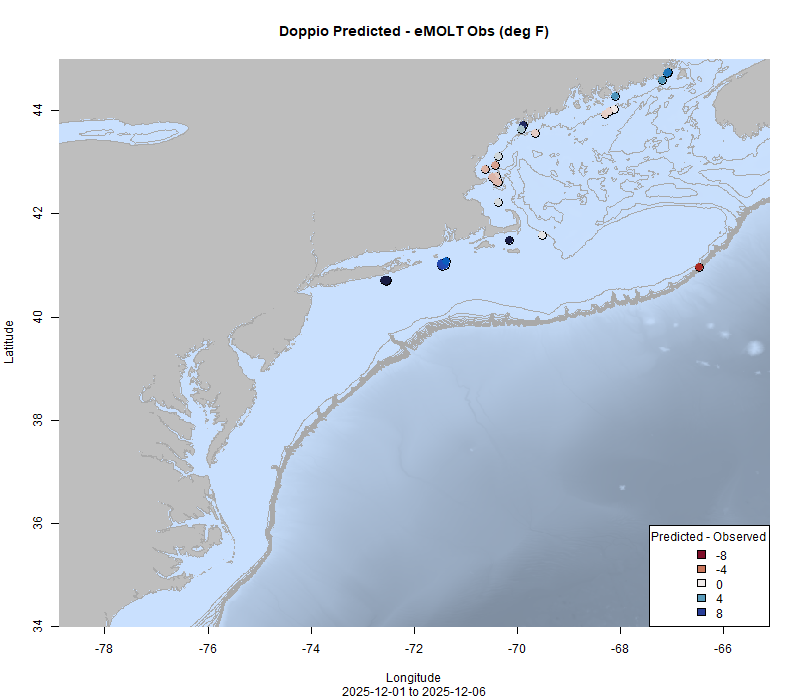

  
```{r setup, include=FALSE}
knitr::opts_chunk$set(echo = TRUE)
options(scipen = 999)
library(marmap)
library(rstudioapi)
if(Sys.info()["sysname"]=="Windows"){
  source("C:/Users/george.maynard/Documents/GitHubRepos/emolt_project_management/WeeklyUpdates/forecast_check/R/emolt_download.R")
} else {
  source("/home/george/Documents/emolt_project_management/WeeklyUpdates/forecast_check/R/emolt_download.R")
}
if(file.exists(paste0("C:/Users/george.maynard/Documents/emolt_project_management/WeeklyUpdates/",lubridate::year(Sys.time()),"/",lubridate::year(Sys.time()),"-",lubridate::month(Sys.time()),"-",lubridate::day(Sys.time()),"/Doppio_comparison_",format(Sys.time(), "%Y%m%d"),".csv")
)==FALSE){
  reticulate::source_python("C:/Users/george.maynard/Documents/emolt_project_management/WeeklyUpdates/Plotting/Windows/Doppio.py")
}
if(file.exists(paste0("C:/Users/george.maynard/Documents/emolt_project_management/WeeklyUpdates/",lubridate::year(Sys.time()),"/",lubridate::year(Sys.time()),"-",lubridate::month(Sys.time()),"-",lubridate::day(Sys.time()),"/CCB_screenshot.png"))==FALSE){
  reticulate::source_python("C:/Users/george.maynard/Documents/emolt_project_management/WeeklyUpdates/Plotting/MA_DMF_screenshot.py")
}
if(file.exists(paste0("C:/Users/george.maynard/Documents/emolt_project_management/WeeklyUpdates/",lubridate::year(Sys.time()),"/",lubridate::year(Sys.time()),"-",lubridate::month(Sys.time()),"-",lubridate::day(Sys.time()),"/GOM7_comparison_",format(Sys.time(), "%Y%m%d"),".csv")
)==FALSE){
  reticulate::source_python("C:/Users/george.maynard/Documents/emolt_project_management/WeeklyUpdates/Plotting/Windows/GOM7.py")
  source("C:/Users/george.maynard/Documents/emolt_project_management/WeeklyUpdates/forecast_check/R/plot_comparisons.R")
}
data=emolt_download(days=7)
start_date=Sys.Date()-lubridate::days(7)
## Use the dates from above to create a URL for grabbing the data
full_data=read.csv(
  paste0(
    "https://erddap.emolt.net/erddap/tabledap/eMOLT_RT.csvp?tow_id%2Csegment_type%2Ctime%2Clatitude%2Clongitude%2Cdepth%2Ctemperature%2Csensor_type&segment_type=3&time%3E=",
    lubridate::year(start_date),
    "-",
    lubridate::month(start_date),
    "-",
    lubridate::day(start_date),
    "T00%3A00%3A00Z&time%3C=",
    lubridate::year(Sys.Date()),
    "-",
    lubridate::month(Sys.Date()),
    "-",
    lubridate::day(Sys.Date()),
    "T23%3A59%3A59Z"
  )
)
sensor_time=0
for(tow in unique(full_data$tow_id)){
  x=subset(full_data,full_data$tow_id==tow)
  sensor_time=sensor_time+difftime(max(x$time..UTC.),units='hours',min(x$time..UTC.))
}
```

<center> 

<font size="5"> *eMOLT Update `r Sys.Date()` * </font>
  
</center>
  
## Weekly Recap 

This week, I'm out to sea supporting the Bottom Trawl Survey aboard the NOAA Ship Henry B. Bigelow, so the update will be pretty short. We still haven't caught up with all of the new boats that joined the program over the shutdown, so I appreciate your patience if your data haven't showed up in the portal yet. 

This week, the eMOLT fleet recorded `r length(unique(full_data$tow_id))` tows of sensorized fishing gear totaling `r as.numeric(sensor_time)` sensor hours underwater.

```{r FISHBOT_Plot, echo=FALSE, fig.width=8, fig.height=10,warning=FALSE,message=FALSE,error=FALSE}
source("C:/Users/george.maynard/Documents/emolt_project_management/WeeklyUpdates/Plotting/FISHBOT_Weekly.R")
```

> *Figure 1 -- FISHBOT bottom temperature records from the past week. The data are available on the [Commercial Fisheries Research Foundation ERDDAP](https://erddap.ondeckdata.com/erddap/tabledap/fishbot_realtime.html) and an interactive visualization is available at the [Cape Cod Ocean Watch](https://ccocean.whoi.edu/index.html) dashboard hosted by Woods Hole Oceanographic Institution. FISHBOT aggregates data provided by participants in eMOLT, the CFRF Lobster and Jonah Crab Research Fleet, the CFRF Shelf Research Fleet, the Cape Cod Commercial Fishermen's Alliance Cape Cod Oceanographic Research Fleet, the Maine Coast Fishermen's Association Fisheries Ocean Data Program, MassDMF Cape Cod Bay Study Fleet, the Northeast Fisheries Science Center Study Fleet, and the Northeast Fisheries Science Center Ecosystem Monitoring Surveys*

### Regional Dissolved Oxygen Loggers

We will be organizing ways to return the dissolved oxygen loggers over the next few weeks. For vessels on Cape Cod or the South Shore, we'll try to pick the sensors up from you. For vessels up in Maine or down in New Jersey, we'll send you a prepaid shipping label so you can send them back for recalibration and battery replacement. 

### Bottom Temperature Forecast Performance

This week, when compared with observations from the eMOLT program, NECOFS had a better R<sup>2</sup> value. This measures the "goodness of fit" or how close model predictions are to the actual data. NECOFS also had a lower Root Mean Squared Error and a lower bias indicating that when the model was off from the actual data it was less far off. This is visible in the map, where you can see lighter colors on the points (indicating smaller differences between forecast and observation) in the NECOFS comparison and darker colors (indicating a larger difference between forecast and observation) in the Doppio comparison. Observations were generally cooler than predicted by Doppio south of Cape Cod and warmer than predicted by Doppio north of Cape Cod. NECOFS performed well around Cape Cod. Observations east of Penobscot Bay were slightly warmer than predictions by both forecast models.   

{width=45%} {width=45%}

> *Figure 4 -- Comparisons between bottom temperatures predicted by two ocean forecasting models and observations from the eMOLT fleet. Blue dots show where the observations were cooler than the forecast and red dots show where the observations were warmer than the forecast. White dots show areas where the observations and forecasts agreed. On the left is the comparison with the Doppio model and on the right is the comparison with the NECOFS model (GOM7).*

### Disclaimer
  
The eMOLT Update is NOT an official NOAA document. Mention of products or manufacturers does not constitute an endorsement by NOAA or Department of Commerce. The content of this update reflects only the personal views of the authors and does not necessarily represent the views of NOAA Fisheries, the Department of Commerce, or the United States.


All the best,

-George
