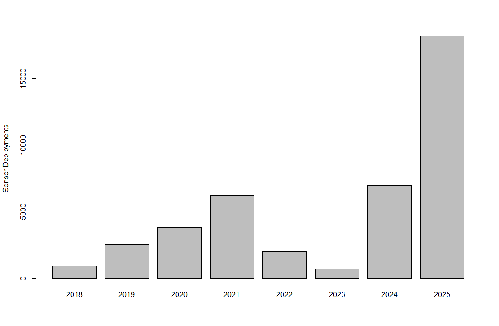

  
```{r setup, include=FALSE}
knitr::opts_chunk$set(echo = TRUE)
options(scipen = 999)
library(marmap)
library(rstudioapi)
if(Sys.info()["sysname"]=="Windows"){
  source("C:/Users/george.maynard/Documents/GitHubRepos/emolt_project_management/WeeklyUpdates/forecast_check/R/emolt_download.R")
} else {
  source("/home/george/Documents/emolt_project_management/WeeklyUpdates/forecast_check/R/emolt_download.R")
}
if(file.exists(paste0("C:/Users/george.maynard/Documents/emolt_project_management/WeeklyUpdates/",lubridate::year(Sys.time()),"/",lubridate::year(Sys.time()),"-",lubridate::month(Sys.time()),"-",lubridate::day(Sys.time()),"/Doppio_comparison_",format(Sys.time(), "%Y%m%d"),".csv")
)==FALSE){
  reticulate::source_python("C:/Users/george.maynard/Documents/emolt_project_management/WeeklyUpdates/Plotting/Windows/Doppio.py")
}
if(file.exists(paste0("C:/Users/george.maynard/Documents/emolt_project_management/WeeklyUpdates/",lubridate::year(Sys.time()),"/",lubridate::year(Sys.time()),"-",lubridate::month(Sys.time()),"-",lubridate::day(Sys.time()),"/CCB_screenshot.png"))==FALSE){
  reticulate::source_python("C:/Users/george.maynard/Documents/emolt_project_management/WeeklyUpdates/Plotting/MA_DMF_screenshot.py")
}
if(file.exists(paste0("C:/Users/george.maynard/Documents/emolt_project_management/WeeklyUpdates/",lubridate::year(Sys.time()),"/",lubridate::year(Sys.time()),"-",lubridate::month(Sys.time()),"-",lubridate::day(Sys.time()),"/GOM7_comparison_",format(Sys.time(), "%Y%m%d"),".csv")
)==FALSE){
  reticulate::source_python("C:/Users/george.maynard/Documents/emolt_project_management/WeeklyUpdates/Plotting/Windows/GOM7.py")
  source("C:/Users/george.maynard/Documents/emolt_project_management/WeeklyUpdates/forecast_check/R/plot_comparisons.R")
}
data=emolt_download(days=7)
start_date=Sys.Date()-lubridate::days(7)
## Use the dates from above to create a URL for grabbing the data
full_data=read.csv(
  paste0(
    "https://erddap.emolt.net/erddap/tabledap/eMOLT_RT.csvp?tow_id%2Csegment_type%2Ctime%2Clatitude%2Clongitude%2Cdepth%2Ctemperature%2Csensor_type&segment_type=3&time%3E=",
    lubridate::year(start_date),
    "-",
    lubridate::month(start_date),
    "-",
    lubridate::day(start_date),
    "T00%3A00%3A00Z&time%3C=",
    lubridate::year(Sys.Date()),
    "-",
    lubridate::month(Sys.Date()),
    "-",
    lubridate::day(Sys.Date()),
    "T23%3A59%3A59Z"
  )
)
sensor_time=0
for(tow in unique(full_data$tow_id)){
  x=subset(full_data,full_data$tow_id==tow)
  sensor_time=sensor_time+difftime(max(x$time..UTC.),units='hours',min(x$time..UTC.))
}
```

<center> 

<font size="5"> *eMOLT Update `r Sys.Date()` * </font>
  
</center>
  
## Weekly Recap 

This will be the last weekly update for the year. It's been a year of tremendous growth for the eMOLT Program, with 18,185 sensor deployments collected by 145 fishing vessels operating between Maine and North Carolina. That's up from 6,980 sensor deployments collected by 55 fishing vessels in 2024. 



We've also made major strides in streamlining data collection on deck and data availability to end users, partnering with the Maine Department of Marine Resources, New Hampshire Fish and Game, Massachusetts Division of Marine Fisheries, Commercial Fisheries Research Foundation, and the Coonamessett Farm Foundation to leverage eMOLT systems to collect temperature data for other research projects on lobsters and scallops. 

Thanks to everyone who's worked together to make that happen. I believe we can accomplish the most good when we treat science as a team sport, and so much credit for the success of this program goes to the network of external partners who have worked tirelessly to install new systems, troubleshoot technical problems, keep the data flowing through the cloud, and make sure all the bills are paid on time. A huge thanks to the teams at the Cape Cod Commercial Fishermen's Alliance, the Center for Coastal Studies, the Commercial Fisheries Research Foundation, Coonamessett Farm Foundation, Gulf of Maine Lobster Foundation, the Lobster Institute, Lowell Instruments, Massachusetts Maritime Academy, Ocean Data Network, Rutgers University, the University of Maine, UMass Dartmouth, and Woods Hole Oceanographic Institution. And of course, none of this would be possible without our industry partners, thanks to the captains, crews, fleet managers, welders, and dockside support teams who have allowed us access to your vessels, fabricated new ways to install sensors and keep them safe, and worked with us to make sense of the data we're collecting. It's a privilege to work with all of you.

This week, the eMOLT fleet recorded `r length(unique(full_data$tow_id))` tows of sensorized fishing gear totaling `r as.numeric(sensor_time)` sensor hours underwater.

```{r FISHBOT_Plot, echo=FALSE, fig.width=8, fig.height=10,warning=FALSE,message=FALSE,error=FALSE}
source("C:/Users/george.maynard/Documents/emolt_project_management/WeeklyUpdates/Plotting/FISHBOT_Weekly.R")
```

> *Figure 1 -- FISHBOT bottom temperature records from the past week. The data are available on the [Commercial Fisheries Research Foundation ERDDAP](https://erddap.ondeckdata.com/erddap/tabledap/fishbot_realtime.html) and an interactive visualization is available at the [Cape Cod Ocean Watch](https://ccocean.whoi.edu/index.html) dashboard hosted by Woods Hole Oceanographic Institution. FISHBOT aggregates data provided by participants in eMOLT, the CFRF Lobster and Jonah Crab Research Fleet, the CFRF Shelf Research Fleet, the Cape Cod Commercial Fishermen's Alliance Cape Cod Oceanographic Research Fleet, the Maine Coast Fishermen's Association Fisheries Ocean Data Program, MassDMF Cape Cod Bay Study Fleet, the Northeast Fisheries Science Center Study Fleet, and the Northeast Fisheries Science Center Ecosystem Monitoring Surveys*

### Regional Dissolved Oxygen Loggers

We've begun collecting dissolved oxygen loggers on the South Shore and Cape Cod. If you are on the Cape and hauling out for the year, you are welcome to drop any loggers off at the Cape Cod Commercial Fishermen's Alliance building (1566 Main Street, Chatham, MA) during normal business hours. Outside of business hours, there is a bin near the back entrance. If you are in Stonington, Maine, please reach out to Emma Weed to get your loggers back to her. 

## Cooperative Research and Environmental News from the Region

### Longline Sampling Confirms Young Bluefin Tuna Spawn in the Slope Sea

A team of scientists from the Northeast Fisheries Science Center and UMass Dartmouth worked aboard the F/V Eagle Eye II out of Fairhaven earlier this year to answer longstanding questions about Atlantic bluefin tuna stock structure and spawning. For more info, check out the article [here](https://www.fisheries.noaa.gov/feature-story/longline-sampling-confirms-young-bluefin-tuna-spawn-slope-sea).

### Scallop Survey Pictures

A few months ago, I helped stage the 2025 scallop survey aboard the F/V Selje, a scalloper out of New Bedford whose captain also participates in the eMOLT Program. NOAA's Research Communications group recently published a gallery of photos from that survey that you can check out [here](https://www.fisheries.noaa.gov/gallery/2025-sea-scallop-dredge-survey-photos). You can also check out results from the survey [here](https://www.fisheries.noaa.gov/new-england-mid-atlantic/science-data/2025-sea-scallop-dredge-survey-completed).

### Cuts to Integrated Ocean Observing System may impact coastal forecasts

Years of underfunding and new delays in grantmaking threaten buoys and ocean monitoring assets that protect fishermen, cargo ships and endangered species across the country. With key grant deadlines now passed and new awards still pending, regional operators warn that some of those services could go dark at the peak of hurricane season. [Read the full article at the Portland Press Herald](https://www.pressherald.com/2025/12/12/as-noaa-funding-lags-a-critical-ocean-weather-system-nears-a-breaking-point/)

### Disclaimer
  
The eMOLT Update is NOT an official NOAA document. Mention of products or manufacturers does not constitute an endorsement by NOAA or Department of Commerce. The content of this update reflects only the personal views of the authors and does not necessarily represent the views of NOAA Fisheries, the Department of Commerce, or the United States.


Happy holidays!

-George
