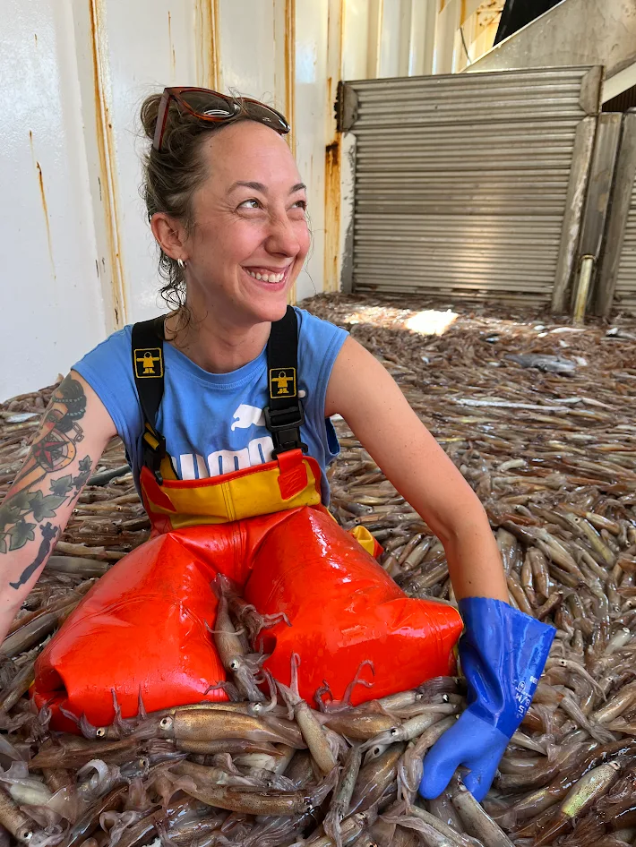
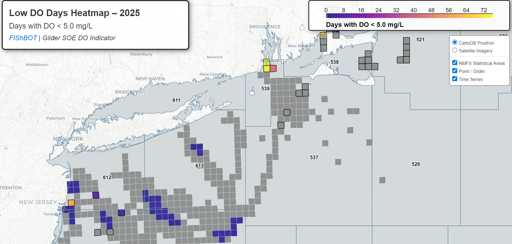

  
```{r setup, include=FALSE}
knitr::opts_chunk$set(echo = TRUE)
options(scipen = 999)
library(marmap)
library(rstudioapi)
if(Sys.info()["sysname"]=="Windows"){
  source("C:/Users/george.maynard/Documents/GitHubRepos/emolt_project_management/WeeklyUpdates/forecast_check/R/emolt_download.R")
} else {
  source("/home/george/Documents/emolt_project_management/WeeklyUpdates/forecast_check/R/emolt_download.R")
}
if(file.exists(paste0("C:/Users/george.maynard/Documents/emolt_project_management/WeeklyUpdates/",lubridate::year(Sys.time()),"/",lubridate::year(Sys.time()),"-",lubridate::month(Sys.time()),"-",lubridate::day(Sys.time()),"/Doppio_comparison_",format(Sys.time(), "%Y%m%d"),".csv")
)==FALSE){
  reticulate::source_python("C:/Users/george.maynard/Documents/emolt_project_management/WeeklyUpdates/Plotting/Windows/Doppio.py")
}
if(file.exists(paste0("C:/Users/george.maynard/Documents/emolt_project_management/WeeklyUpdates/",lubridate::year(Sys.time()),"/",lubridate::year(Sys.time()),"-",lubridate::month(Sys.time()),"-",lubridate::day(Sys.time()),"/CCB_screenshot.png"))==FALSE){
  reticulate::source_python("C:/Users/george.maynard/Documents/emolt_project_management/WeeklyUpdates/Plotting/MA_DMF_screenshot.py")
}
if(file.exists(paste0("C:/Users/george.maynard/Documents/emolt_project_management/WeeklyUpdates/",lubridate::year(Sys.time()),"/",lubridate::year(Sys.time()),"-",lubridate::month(Sys.time()),"-",lubridate::day(Sys.time()),"/GOM7_comparison_",format(Sys.time(), "%Y%m%d"),".csv")
)==FALSE){
  reticulate::source_python("C:/Users/george.maynard/Documents/emolt_project_management/WeeklyUpdates/Plotting/Windows/GOM7.py")
  source("C:/Users/george.maynard/Documents/emolt_project_management/WeeklyUpdates/forecast_check/R/plot_comparisons.R")
}
data=emolt_download(days=7)
start_date=Sys.Date()-lubridate::days(7)
## Use the dates from above to create a URL for grabbing the data
full_data=read.csv(
  paste0(
    "https://erddap.emolt.net/erddap/tabledap/eMOLT_RT.csvp?tow_id%2Csegment_type%2Ctime%2Clatitude%2Clongitude%2Cdepth%2Ctemperature%2Csensor_type&segment_type=3&time%3E=",
    lubridate::year(start_date),
    "-",
    lubridate::month(start_date),
    "-",
    lubridate::day(start_date),
    "T00%3A00%3A00Z&time%3C=",
    lubridate::year(Sys.Date()),
    "-",
    lubridate::month(Sys.Date()),
    "-",
    lubridate::day(Sys.Date()),
    "T23%3A59%3A59Z"
  )
)
sensor_time=0
for(tow in unique(full_data$tow_id)){
  x=subset(full_data,full_data$tow_id==tow)
  sensor_time=sensor_time+difftime(max(x$time..UTC.),units='hours',min(x$time..UTC.))
}
```

<center> 

<font size="5"> *eMOLT Update `r Sys.Date()` * </font>
  
</center>
  
## Weekly Recap 

While the lead up to the holidays feels a little relaxed most of the time, these first few weeks back are often a wild race to get ready for all of the meetings that get crammed in during the winter fishing lull. One or more folks from the eMOLT team will be at many of these winter meetings including 

- Maine Fishermen's Forum 
- Massachusetts Lobstermen's Association 
- Northeast Cooperative Research Summit
- U.S. Canada Lobster Town Meeting

We'll have more details about all of these events in the coming weeks, but as a heads up, the eMOLT team, Massachusetts DMF, and NERACOOS will be hosting a data visualization session at the MLA meeting in Hyannis on Saturday 1/31 in the afternoon. 

Speaking of the eMOLT team, we are really excited to welcome a new member who is probably already a familiar face to many of you. Dr. Sarah Salois of Squid Squad acclaim has joined the Northeast Fisheries Science Center Cooperative Research Branch and will be providing support for the eMOLT Program as well as the Squid Squad's shortfin squid oceanographic drivers research. Sarah brings a wealth of expertise in data analytics and species distribution modeling, and we're really excited to work with her to increase the use of eMOLT data outside of the realm of physical oceanography. 

<center>
{height=50%}
</center>

*Figure 1 -- Dr. Sarah Salois in the checker aboard the F/V Dyrsten during a research cruise*

This week, the eMOLT fleet recorded `r length(unique(full_data$tow_id))` tows of sensorized fishing gear totaling `r as.numeric(sensor_time)` sensor hours underwater.

```{r FISHBOT_Plot, echo=FALSE, fig.width=8, fig.height=10,warning=FALSE,message=FALSE,error=FALSE}
source("C:/Users/george.maynard/Documents/emolt_project_management/WeeklyUpdates/Plotting/FISHBOT_Weekly.R")
```

> *Figure 2 -- FISHBOT bottom temperature records from the past week. The data are available on the [Commercial Fisheries Research Foundation ERDDAP](https://erddap.ondeckdata.com/erddap/tabledap/fishbot_realtime.html) and an interactive visualization is available at the [Cape Cod Ocean Watch](https://ccocean.whoi.edu/index.html) dashboard hosted by Woods Hole Oceanographic Institution. FISHBOT aggregates data provided by participants in eMOLT, the CFRF Lobster and Jonah Crab Research Fleet, the CFRF Shelf Research Fleet, the Cape Cod Commercial Fishermen's Alliance Cape Cod Oceanographic Research Fleet, the Maine Coast Fishermen's Association Fisheries Ocean Data Program, MassDMF Cape Cod Bay Study Fleet, the Northeast Fisheries Science Center Study Fleet, and the Northeast Fisheries Science Center Ecosystem Monitoring Surveys*


Huanxin and George have been out and about collecting equipment for winter maintenance in New Bedford and on the South Shore. Thanks to Captain Tony on the F/V Sao Paulo, Captain Todd on the F/V Voyager, and Captain Danny on the F/V Monica for letting us know about hard drive issues on their deckboxes. The team at Lowell Instruments is doing some testing to get at the root cause of these problems (likely something power related), and we're putting our heads together to try to come up with a partitioning scheme or backup hardware solution to prevent this from happening moving forwards.

If you were around at the Cooperative Research Summit last year, you may have seen a preview of the "FIShBOT" data product that we've been working on collaboratively with the Commercial Fisheries Research Foundation and the Study Fleet Program. We're dangerously close to having a NOAA Tech Memo about the data product published. Linus also worked with the RUCOOL team down at Rutgers University to combine dissolved oxygen data from all of your work in the field with dissolved oxygen data from the glider team at Rutgers University. You can check out an interactive plot of the output courtesy of CFRF [here](https://ondeckdata.com/database/soe_hypoxic_days_2025.html) that shows monitoring coverage and number of days of hypoxia around the region last year -- or click [here](https://ondeckdata.com/database/soe_low_do_days_2025.html) to look at a map of low dissolved oxygen days. A huge thanks to Linus for pulling this together and presenting it to the State of the Ecosystem team at the Northeast Fisheries Science Center this past week. 


*Figure 3 -- Screenshot of interactive low DO day map hosted by CFRF*

## Cooperative Research and Environmental News from the Region

### [New article on lobster habitat modeling](https://www.sciencedirect.com/science/authShare/S0079661126000017/20260107T103500Z/1?md5=c64060e7c962ecf5797cc410e8f3ef27&dgcid=author)

Xiangyan Yang from the Chen Lab at SUNY Stony Brook led the publication of new research using eMOLT data to understand if sea surface temperature and bottom temperature are linked closely enough that surface temps can be used as a predictor for lobster habitat suitability. The results suggest that easily accessible sea surface temperature measurements can be used as a proxy for bottom temperature in areas where stratification is limited, but that bottom temperature measurements are needed in places and times of year when the water column is stratified. To read the full article, click the link above. 

### [Could moon snails, neon flying squid fisheries save the scallop industry? Some local scientists are hopeful](https://www.wbur.org/news/2026/01/06/neon-flying-squid-moon-snail-eating-scallop-fishery-cape-cod)

Our colleagues at the Coonamessett Farm Foundation are working on developing a few new fisheries for critters you probably haven't seen in a seafood market around here. Click on the link above to learn more. 

### [Population- and temperature-dependent variation in molt phenology and disease susceptibility shape epidemiological outcomes in American lobster (*Homarus americanus*)](https://lnkd.in/eDztyPVe)

Check out some new research from the ICES Journal of Marine Science where a team from the Bigelow Lab for Ocean Sciences, Maine DMR, Massachusetts DMF, and the Virginia Institute of Marine Sciences looked at how water temperatures and molting shape shell disease outcomes in American lobsters - comparing lobster populations from the Gulf of Maine and southern New England.

### Disclaimer
  
The eMOLT Update is NOT an official NOAA document. Mention of products or manufacturers does not constitute an endorsement by NOAA or Department of Commerce. The content of this update reflects only the personal views of the authors and does not necessarily represent the views of NOAA Fisheries, the Department of Commerce, or the United States.


Happy holidays!

-George
