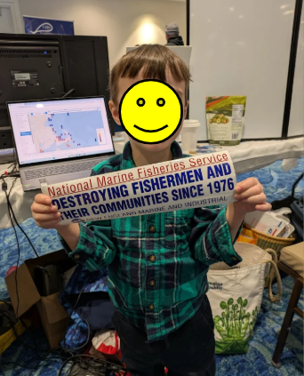
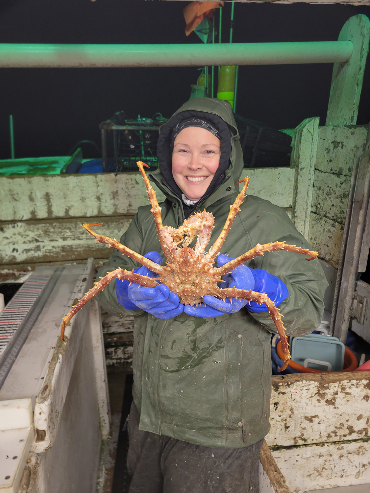

  
```{r setup, include=FALSE}
knitr::opts_chunk$set(echo = TRUE)
options(scipen = 999)
library(marmap)
library(rstudioapi)
if(Sys.info()["sysname"]=="Windows"){
  source("C:/Users/george.maynard/Documents/GitHubRepos/emolt_project_management/WeeklyUpdates/forecast_check/R/emolt_download.R")
} else {
  source("/home/george/Documents/emolt_project_management/WeeklyUpdates/forecast_check/R/emolt_download.R")
}
# if(file.exists(paste0("C:/Users/george.maynard/Documents/emolt_project_management/WeeklyUpdates/",lubridate::year(Sys.time()),"/",lubridate::year(Sys.time()),"-",lubridate::month(Sys.time()),"-",lubridate::day(Sys.time()),"/Doppio_comparison_",format(Sys.time(), "%Y%m%d"),".csv")
# )==FALSE){
#   reticulate::source_python("C:/Users/george.maynard/Documents/emolt_project_management/WeeklyUpdates/Plotting/Windows/Doppio.py")
# }
# if(file.exists(paste0("C:/Users/george.maynard/Documents/emolt_project_management/WeeklyUpdates/",lubridate::year(Sys.time()),"/",lubridate::year(Sys.time()),"-",lubridate::month(Sys.time()),"-",lubridate::day(Sys.time()),"/CCB_screenshot.png"))==FALSE){
#   reticulate::source_python("C:/Users/george.maynard/Documents/emolt_project_management/WeeklyUpdates/Plotting/MA_DMF_screenshot.py")
# }
# if(file.exists(paste0("C:/Users/george.maynard/Documents/emolt_project_management/WeeklyUpdates/",lubridate::year(Sys.time()),"/",lubridate::year(Sys.time()),"-",lubridate::month(Sys.time()),"-",lubridate::day(Sys.time()),"/GOM7_comparison_",format(Sys.time(), "%Y%m%d"),".csv")
# )==FALSE){
#   reticulate::source_python("C:/Users/george.maynard/Documents/emolt_project_management/WeeklyUpdates/Plotting/Windows/GOM7.py")
#   source("C:/Users/george.maynard/Documents/emolt_project_management/WeeklyUpdates/forecast_check/R/plot_comparisons.R")
# }
data=emolt_download(days=7)
start_date=Sys.Date()-lubridate::days(7)
## Use the dates from above to create a URL for grabbing the data
full_data=read.csv(
  paste0(
    "https://erddap.emolt.net/erddap/tabledap/eMOLT_RT.csvp?tow_id%2Csegment_type%2Ctime%2Clatitude%2Clongitude%2Cdepth%2Ctemperature%2Csensor_type&segment_type=3&time%3E=",
    lubridate::year(start_date),
    "-",
    lubridate::month(start_date),
    "-",
    lubridate::day(start_date),
    "T00%3A00%3A00Z&time%3C=",
    lubridate::year(Sys.Date()),
    "-",
    lubridate::month(Sys.Date()),
    "-",
    lubridate::day(Sys.Date()),
    "T23%3A59%3A59Z"
  )
)
sensor_time=0
for(tow in unique(full_data$tow_id)){
  x=subset(full_data,full_data$tow_id==tow)
  sensor_time=sensor_time+difftime(max(x$time..UTC.),units='hours',min(x$time..UTC.))
}
```

<center> 

<font size="5"> *eMOLT Update `r Sys.Date()` * </font>
  
</center>
  
This week begins on a somber note, with the [loss of Captain Tom Williams of the F/V Heritage](https://www.buckler-johnston.com/obituaries/Thomas-H-Williams?obId=47125329) out of Stonington, Connecticut, and the [sinking of the F/V Lily Jean out of Gloucester](https://www.news.uscg.mil/Press-Releases/Article/4394704/update-coast-guard-suspends-search-for-missing-crewmembers-from-fishing-vessel/). Although we didn't work directly with Captain Tom or the captain, crew, and observer aboard the F/V Lily Jean, their passings are a tragic loss for the fishing community and a stark reminder of the dangers faced by anyone who works on and around the water. Our thoughts are with the families they leave behind and with anyone heading to sea in the coming days and weeks. Please give your loved ones an extra hug and stay safe. 

## Massachusetts Lobstermen's Association Annual Meeting

Thank you to the Massachusetts Lobstermen's Association and their members for another great year at the annual MLA weekend. Erin Pelletier, Huanxin Xu, and Emma Weed (GOMLF), Melissa Sanderson (CCCFA), Sarah Salois (NEFSC), and I spent time at the trade show inviting fishermen to sign up for the program and meeting with current eMOLT Program members to discuss their experience working with us so that we can learn what works and where we need to do better. Thanks also to the folks at New England Marine and Industrial who swung by our booth, attended our seminar, and gave us a chance to explain some of the work that the National Marine Fisheries Service does. That conversation wouldn't have happened without my 4 year old son grabbing one of the "really big cool stickers" off their table, so thanks to Francis as well. 


*Figure 1 -- Four year old Francis -- still too young to read -- with his "really big cool sticker"*

It was also great to catch up with colleagues from the Northeast Regional Association of Coastal Ocean Observing Systems and The Lobster Institute. We work across a large region, and with the current restrictions on federal employees traveling, it's been difficult to meet in person with our partners from Northern New England over the last year. Finally, a big thanks to the fishermen and collaborating scientists who came to our seminar on Saturday afternoon. I know we were towards the end of the event and there was a storm potentially bearing down on the Cape, so I appreciate all of you who made the effort to stick around. We got some good feedback on some of the data products that are available for fishermen, and learned a few logistical lessons to improve the workshop we plan to host down at the Cooperative Research Summit in Riverhead, New York in a few weeks. 

## Other updates

Late last week, we got word that the FIShBOT documentation has o-fish-ally been published by NOAA as a [Technical Memorandum and is now available online through the NOAA Library at this link](https://library.oarcloud.noaa.gov/noaa_documents.lib/NMFS/NEFSC/TM_NMFS_NE/TM_NMFS_NE_341.pdf) with the DOI: 10.25923/1me2-g192. Thanks to Linus Stoltz at the Commercial Fisheries Research Foundation as well as Sarah Salois and Mike Morin (NEFSC) for all of their work pulling that document together. The FIShBOT data product is available to view through the [Cape Cod Ocean Watch online dashboard](https://ccocean.whoi.edu/index.html) and is downloadable for analysis via the [Commercial Fisheries Research Foundation ERDDAP server](https://erddap.ondeckdata.com/erddap/tabledap/index.html?page=1&itemsPerPage=1000). Our next steps will be to build an R Package (and maybe a Python library) to enable easier access to and analysis of the data for scientists. 

This week, the eMOLT fleet recorded `r length(unique(full_data$tow_id))` tows of sensorized fishing gear totaling `r as.numeric(sensor_time)` sensor hours underwater.

```{r FISHBOT_Plot, echo=FALSE, fig.width=8, fig.height=10,warning=FALSE,message=FALSE,error=FALSE}
source("C:/Users/george.maynard/Documents/emolt_project_management/WeeklyUpdates/Plotting/FISHBOT_Weekly.R")
```

> *Figure 2 -- FISHBOT bottom temperature records from the past week. The data are available on the [Commercial Fisheries Research Foundation ERDDAP](https://erddap.ondeckdata.com/erddap/tabledap/fishbot_realtime.html) and an interactive visualization is available at the [Cape Cod Ocean Watch](https://ccocean.whoi.edu/index.html) dashboard hosted by Woods Hole Oceanographic Institution. FISHBOT aggregates data provided by participants in eMOLT, the CFRF Lobster and Jonah Crab Research Fleet, the CFRF Shelf Research Fleet, the Cape Cod Commercial Fishermen's Alliance Cape Cod Oceanographic Research Fleet, the Maine Coast Fishermen's Association Fisheries Ocean Data Program, MassDMF Cape Cod Bay Study Fleet, the Northeast Fisheries Science Center Study Fleet, and the Northeast Fisheries Science Center Ecosystem Monitoring Surveys*

## Teacher Workshop with Woods Hole Sea Grant

A huge thanks to the team at Woods Hole Oceanographic Institution and Woods Hole Sea Grant for hosting dozens of high school teachers from around the region (NY, NH, ME, VT, and MA were all represented), Mel Sanderson (CCCFA), and me for the day. The teachers learned how to use a new curriculum that's been developed from eMOLT data with the goal of using the data to introduce high schoolers to commercial fishing, ocean observing, and the oceanography of our region. Teachers got to learn a bit about physical oceanography from scientists at WHOI, starting with a basic intro to water density as shown in the .gif below. 


*Figure 3 -- A density tank with a small divider shows the influence that salinity alone has on water movement. The blue water is salty (more dense) and the yellow is fresh (less dense).*

The blue water is salty, and therefore much more dense than the yellow (fresh) water. When the divider is removed from the tank, the denser water flows to the bottom of the tank. Then the teachers were able to use other food dyes to build their own stratified water columns with other layers of varying salinities. The same approach can be used with temperature too, adding ice cubes or water from a tea kettle to the tanks. Overall, the teachers seemed really excited to learn more about the region's fisheries and oceanography. Some who work in port towns also expressed interest in introducing their students to fishermen to hear directly from you all about your work. If you have any interest, please reach out and I can put you in touch with teachers local to your port. 

## Other Cooperative Research News

Maura Flynn, a field scientist here in the Cooperative Research Branch, recently put out a blog post describing her experience aboard the 2025 Fall Gulf of Maine Bottom Longline Survey. You can learn more about life participating in this long-running survey that takes place aboard two commercial vessels each Spring and Fall by [clicking here](https://www.fisheries.noaa.gov/science-blog/adventures-field-scientist-gulf-maine-so-what-do-you-do-out-there). 

{width=30%}

*Figure 4 -- Field Scientist Maura Flynn with a Northern stone crab on the Fall Gulf of Maine Bottom Longline Survey. Credit: NOAA Fisheries/ Ben Church*

### Disclaimer
  
The eMOLT Update is NOT an official NOAA document. Mention of products or manufacturers does not constitute an endorsement by NOAA or Department of Commerce. The content of this update reflects only the personal views of the authors and does not necessarily represent the views of NOAA Fisheries, the Department of Commerce, or the United States.


All the best,

-George
