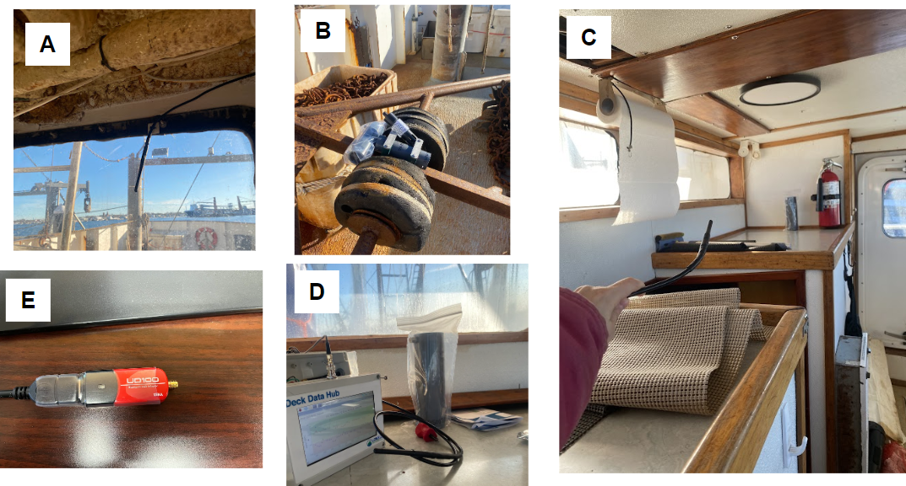

  
```{r setup, include=FALSE}
knitr::opts_chunk$set(echo = TRUE)
options(scipen = 999)
library(marmap)
library(rstudioapi)
if(Sys.info()["sysname"]=="Windows"){
  source("C:/Users/george.maynard/Documents/GitHubRepos/emolt_project_management/WeeklyUpdates/forecast_check/R/emolt_download.R")
} else {
  source("/home/george/Documents/emolt_project_management/WeeklyUpdates/forecast_check/R/emolt_download.R")
}
# if(file.exists(paste0("C:/Users/george.maynard/Documents/emolt_project_management/WeeklyUpdates/",lubridate::year(Sys.time()),"/",lubridate::year(Sys.time()),"-",lubridate::month(Sys.time()),"-",lubridate::day(Sys.time()),"/Doppio_comparison_",format(Sys.time(), "%Y%m%d"),".csv")
# )==FALSE){
#   reticulate::source_python("C:/Users/george.maynard/Documents/emolt_project_management/WeeklyUpdates/Plotting/Windows/Doppio.py")
# }
# if(file.exists(paste0("C:/Users/george.maynard/Documents/emolt_project_management/WeeklyUpdates/",lubridate::year(Sys.time()),"/",lubridate::year(Sys.time()),"-",lubridate::month(Sys.time()),"-",lubridate::day(Sys.time()),"/CCB_screenshot.png"))==FALSE){
#   reticulate::source_python("C:/Users/george.maynard/Documents/emolt_project_management/WeeklyUpdates/Plotting/MA_DMF_screenshot.py")
# }
# if(file.exists(paste0("C:/Users/george.maynard/Documents/emolt_project_management/WeeklyUpdates/",lubridate::year(Sys.time()),"/",lubridate::year(Sys.time()),"-",lubridate::month(Sys.time()),"-",lubridate::day(Sys.time()),"/GOM7_comparison_",format(Sys.time(), "%Y%m%d"),".csv")
# )==FALSE){
#   reticulate::source_python("C:/Users/george.maynard/Documents/emolt_project_management/WeeklyUpdates/Plotting/Windows/GOM7.py")
#   source("C:/Users/george.maynard/Documents/emolt_project_management/WeeklyUpdates/forecast_check/R/plot_comparisons.R")
# }
data=emolt_download(days=7)
start_date=Sys.Date()-lubridate::days(7)
## Use the dates from above to create a URL for grabbing the data
full_data=read.csv(
  paste0(
    "https://erddap.emolt.net/erddap/tabledap/eMOLT_RT.csvp?tow_id%2Csegment_type%2Ctime%2Clatitude%2Clongitude%2Cdepth%2Ctemperature%2Csensor_type&segment_type=3&time%3E=",
    lubridate::year(start_date),
    "-",
    lubridate::month(start_date),
    "-",
    lubridate::day(start_date),
    "T00%3A00%3A00Z&time%3C=",
    lubridate::year(Sys.Date()),
    "-",
    lubridate::month(Sys.Date()),
    "-",
    lubridate::day(Sys.Date()),
    "T23%3A59%3A59Z"
  )
)
sensor_time=0
for(tow in unique(full_data$tow_id)){
  x=subset(full_data,full_data$tow_id==tow)
  sensor_time=sensor_time+difftime(max(x$time..UTC.),units='hours',min(x$time..UTC.))
}
```

<center> 

<font size="5"> *eMOLT Update `r Sys.Date()` * </font>
  
</center>
  
This week has been a busy one for the eMOLT team over in New Bedford. Huanxin and I visited the F/V Sao Paulo, F/V American Eagle, and F/V Eagle earlier this week, and Cassie has made several trips down to the F/V Mirage. These trips have been a mix of straightforward (installing a new system on the F/V American Eagle and adding new loggers aboard the F/V Eagle) and challenging. Aboard the F/V Sao Paulo and F/V Mirage however, we ran into new technical issues that we hadn't seen before. The deckbox power supply failed aboard the F/V Sao Paulo, taking the hard drive along with it. Thanks to Huanxin and Nick for figuring out that issue and replacing the part so that we could get Tony's system back up and running. Aboard the Mirage, Cassie and I couldn't get a read from the logger mounted on the dredge. We tried several different combinations of loggers and antennas before finally coming to the conclusion that the issue is actually with the UD-100 bluetooth reader itself. A big thanks to both Cassie and the dockside team over at the F/V Mirage for your patience. 



*Figure 1 -- F/V Mirage troubleshooting. A) the bluetooth antenna we originally suspected, B) sensors in position for testing on the dredge, C) Cassie testing an antenna's detection range inside the wheelhouse, D) swapping in a new antenna, and E) the real culprit*

As we continue to scale up the eMOLT Program and put more systems out into the field, we are bound to run into these weird edge cases. Please don't hesitate to reach out to your tech support contacts or to me directly if you experience any issues at all with your system. By isolating and understanding these issues we can make the system more resilient and speed up our response times in the future. 

## FIShBOT Improvements

Our colleague Linus Stoltz over at CFRF has been making strides to pull even more datasets into the FIShBOT product. Now, in addition to real-world observations from the fishing industry and NOAA Ships, FIShBOT also includes data collected by gliders traversing the region as well as the M/V Oleander, which collects oceanographic data on its weekly transit from New Jersey to Bermuda.  

Thanks also to Dr. Paula Fratantoni here at the Northeast Fisheries Science Center for her suggestions to improve our data handling for FIShBOT. Her suggestions helped us better process the CTD data collected by NOAA ships and in the process, helped us find a few bugs in our own data processing. It's great to have support from the Oceanography Branch to help improve the product.

This week, the eMOLT fleet recorded `r length(unique(full_data$tow_id))` tows of sensorized fishing gear totaling `r as.numeric(sensor_time)` sensor hours underwater.

```{r FISHBOT_Plot, echo=FALSE, fig.width=8, fig.height=10,warning=FALSE,message=FALSE,error=FALSE}
source("C:/Users/george.maynard/Documents/emolt_project_management/WeeklyUpdates/Plotting/FISHBOT_Weekly.R")
```

> *Figure 2 -- FISHBOT bottom temperature records from the past week. The data are available on the [Commercial Fisheries Research Foundation ERDDAP](https://erddap.ondeckdata.com/erddap/tabledap/fishbot_realtime.html) and an interactive visualization is available at the [Cape Cod Ocean Watch](https://ccocean.whoi.edu/index.html) dashboard hosted by Woods Hole Oceanographic Institution. FISHBOT aggregates data provided by participants in eMOLT, the CFRF Lobster and Jonah Crab Research Fleet, the CFRF Shelf Research Fleet, the Cape Cod Commercial Fishermen's Alliance Cape Cod Oceanographic Research Fleet, the Maine Coast Fishermen's Association Fisheries Ocean Data Program, MassDMF Cape Cod Bay Study Fleet, the Northeast Fisheries Science Center Study Fleet, and the Northeast Fisheries Science Center Ecosystem Monitoring Surveys*

## Other News

- There are several exciting seminars shaping up at the Maine Fishermen's Forum. While I won't be able to attend because of the ongoing restrictions on federal travel, Erin and Emma from the Gulf of Maine Lobster Foundation will be at the Forum along with several other eMOLT collaborators, so be sure to check out their booth!

> - The Lobster Institute will be hosting a "Fisherman Informed Research" seminar on Saturday, March 7th at 0900. If you have questions that need answering or ideas for new data collection, please go spend some time with Chris and her team, especially if you can't make it down to Riverhead, NY for the Northeast Cooperative Research Summit in a few weeks. 
> - Our partners up at Maine Sea Grant's American Lobster Initiative are hosting an interactive seminar at the Maine Fishermen's Forum on Saturday, March 7th at 1030 to discuss the 2025 stock assessment and help connect fishermen and managers with scientists in preparation for their upcoming Request for Proposals.

- If you, like me, spend a lot of time sitting in traffic, WGBH has a new podcast out about Carlos Rafael and groundfish management in the Northeast. You can learn more about it [here](https://www.wgbh.org/podcasts/thecodfather).

- On February 19, the NOAA Science Seminar Series highlights the Skipper Science program up in Alaska. This program empowers fishermen with tools to collect data to inform fisheries management and weather forecasts. These data range from black cod stomach contents and water temperature to ice build up and seabird bycatch. You can learn more about the seminar series and find links to watch [here](https://www.star.nesdis.noaa.gov/star/NOAAScienceSeminars.php#TopExp228230_).

- The Coonamessett Farm Foundation recently published their final report for the 2024 Sea Scallop RSA Award "Seasonal Surveys of Bycatch in the Scallop Fishery". You can read a little more about the project and find the final report on their website [here](https://www.coonamessettfarmfoundation.org/news#final-report-seasonal-surve). 

### Disclaimer
  
The eMOLT Update is NOT an official NOAA document. Mention of products or manufacturers does not constitute an endorsement by NOAA or Department of Commerce. The content of this update reflects only the personal views of the authors and does not necessarily represent the views of NOAA Fisheries, the Department of Commerce, or the United States.


All the best,

-George
