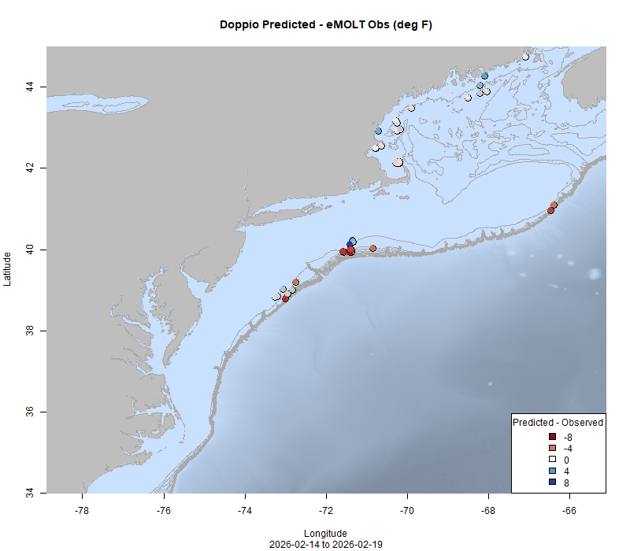

  
```{r setup, include=FALSE}
knitr::opts_chunk$set(echo = TRUE)
options(scipen = 999)
library(marmap)
library(rstudioapi)
if(Sys.info()["sysname"]=="Windows"){
  source("C:/Users/george.maynard/Documents/GitHubRepos/emolt_project_management/WeeklyUpdates/forecast_check/R/emolt_download.R")
} else {
  source("/home/george/Documents/emolt_project_management/WeeklyUpdates/forecast_check/R/emolt_download.R")
}
if(file.exists(paste0("C:/Users/george.maynard/Documents/emolt_project_management/WeeklyUpdates/",lubridate::year(Sys.time()),"/",lubridate::year(Sys.time()),"-",lubridate::month(Sys.time()),"-",lubridate::day(Sys.time()),"/Doppio_comparison_",format(Sys.time(), "%Y%m%d"),".csv")
)==FALSE){
  source("C:/Users/george.maynard/Documents/emolt_project_management/WeeklyUpdates/forecast_check/R/doppio_all_R_compare_and_plot.R")
}
if(file.exists(paste0("C:/Users/george.maynard/Documents/emolt_project_management/WeeklyUpdates/",lubridate::year(Sys.time()),"/",lubridate::year(Sys.time()),"-",lubridate::month(Sys.time()),"-",lubridate::day(Sys.time()),"/GOM7_comparison_",format(Sys.time(), "%Y%m%d"),".csv")
)==FALSE){
  reticulate::source_python("C:/Users/george.maynard/Documents/emolt_project_management/WeeklyUpdates/Plotting/Windows/GOM7.py")
  source("C:/Users/george.maynard/Documents/emolt_project_management/WeeklyUpdates/forecast_check/R/plot_comparisons.R")
}
data=emolt_download(days=7)
start_date=Sys.Date()-lubridate::days(7)
## Use the dates from above to create a URL for grabbing the data
full_data=read.csv(
  paste0(
    "https://erddap.emolt.net/erddap/tabledap/eMOLT_RT.csvp?tow_id%2Csegment_type%2Ctime%2Clatitude%2Clongitude%2Cdepth%2Ctemperature%2Csensor_type&segment_type=3&time%3E=",
    lubridate::year(start_date),
    "-",
    lubridate::month(start_date),
    "-",
    lubridate::day(start_date),
    "T00%3A00%3A00Z&time%3C=",
    lubridate::year(Sys.Date()),
    "-",
    lubridate::month(Sys.Date()),
    "-",
    lubridate::day(Sys.Date()),
    "T23%3A59%3A59Z"
  )
)
sensor_time=0
for(tow in unique(full_data$tow_id)){
  x=subset(full_data,full_data$tow_id==tow)
  sensor_time=sensor_time+difftime(max(x$time..UTC.),units='hours',min(x$time..UTC.))
}
```

<center> 

<font size="5"> *eMOLT Update `r Sys.Date()` * </font>
  
</center>
  
## Weekly Recap 

We've been gearing up for the Northeast Cooperative Research Summit in Riverhead, NY later next week. These opportunities to get people together are few and far between with the current administration's continued restrictions on travel for federal employees, so we intend to make the most of our time in New York. From the eMOLT team, a few highlights include:

- Sarah Salois will be presenting about our new data product, FIShBOT
- Sarah, Mel (CCCFA), Katy (NERACOOS), Finn (WHOI), and I will be hosting a breakout session about data visualizations where we hope to get feedback from industry members and scientists about some online tools we've developed to make data more accessible to all of you.

We're also taking the opportunity to swap out hardware that needs refurbishing back here in Massachusetts. Thanks to Joey down at Rutgers for collecting some badly behaved deckboxes off the F/V Monica and F/V Searcher, and thanks to the captains of those vessels for their patience. Both deckboxes need some replacement circuit boards (a bad voltage regulator on the Monica and a bad cell modem on the Searcher), and the Summit saves us from having to ship those. We'll also be transporting some hardware from WHOI down to colleagues from the Sandy Hook Lab and vice versa. And of course, it'll be great to catch up with many of our industry partners from around the region who we don't get to see on a regular basis. 

This week, the eMOLT fleet recorded `r length(unique(full_data$tow_id))` tows of sensorized fishing gear totaling `r as.numeric(sensor_time)` sensor hours underwater.

```{r FISHBOT_Plot, echo=FALSE, fig.width=8, fig.height=10,warning=FALSE,message=FALSE,error=FALSE}
source("C:/Users/george.maynard/Documents/emolt_project_management/WeeklyUpdates/Plotting/FISHBOT_Weekly.R")
```

> *Figure 2 -- FISHBOT bottom temperature records from the past week. The data are available on the [Commercial Fisheries Research Foundation ERDDAP](https://erddap.ondeckdata.com/erddap/tabledap/fishbot_realtime.html) and an interactive visualization is available at the [Cape Cod Ocean Watch](https://ccocean.whoi.edu/index.html) dashboard hosted by Woods Hole Oceanographic Institution. FISHBOT aggregates data provided by participants in eMOLT, the CFRF Lobster and Jonah Crab Research Fleet, the CFRF Shelf Research Fleet, the Cape Cod Commercial Fishermen's Alliance Cape Cod Oceanographic Research Fleet, the Maine Coast Fishermen's Association Fisheries Ocean Data Program, MassDMF Cape Cod Bay Study Fleet, the Northeast Fisheries Science Center Study Fleet, and the Northeast Fisheries Science Center Ecosystem Monitoring Surveys*

### Bottom Temperature Forecast Performance

This week, when compared with observations from the eMOLT Program, Doppio performed well in Massachusetts Bay and along the Maine coast (although there was one spot that was colder than expected east of MDI). Both models struggled along the shelf edge, with observations generally warmer than expected except for some colder than expected waters around Block Canyon. 

{width=45%} {width=45%}

## News from the Region

### [Gulf of Maine haddock quota stalled as boats near tying up](https://www.nationalfisherman.com/gulf-of-maine-haddock-quota-stalled-as-boats-near-tying-up)

"Frameworks are the annual regulatory mechanisms that set quotas for the groundfish fleet. Ideally, new quotas are in place on May 1 at the start of each fishing year... this year, however, administrative turnover and the government shutdown stalled regulatory movement. The biggest piece of Framework 69 from the fleet’s perspective is the 50 percent increase in the GOM haddock quota — a bump that fishermen had planned their year around."

### Disclaimer
  
The eMOLT Update is NOT an official NOAA document. Mention of products or manufacturers does not constitute an endorsement by NOAA or Department of Commerce. The content of this update reflects only the personal views of the authors and does not necessarily represent the views of NOAA Fisheries, the Department of Commerce, or the United States.


All the best,

-George
