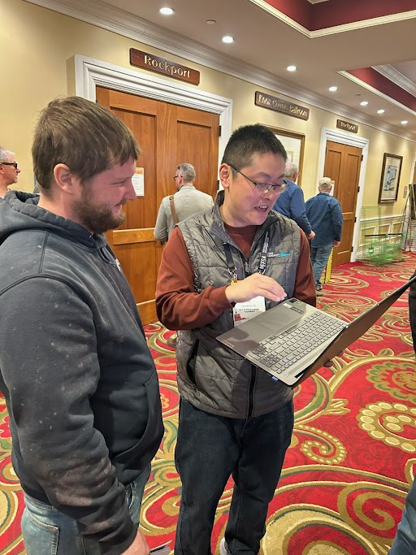
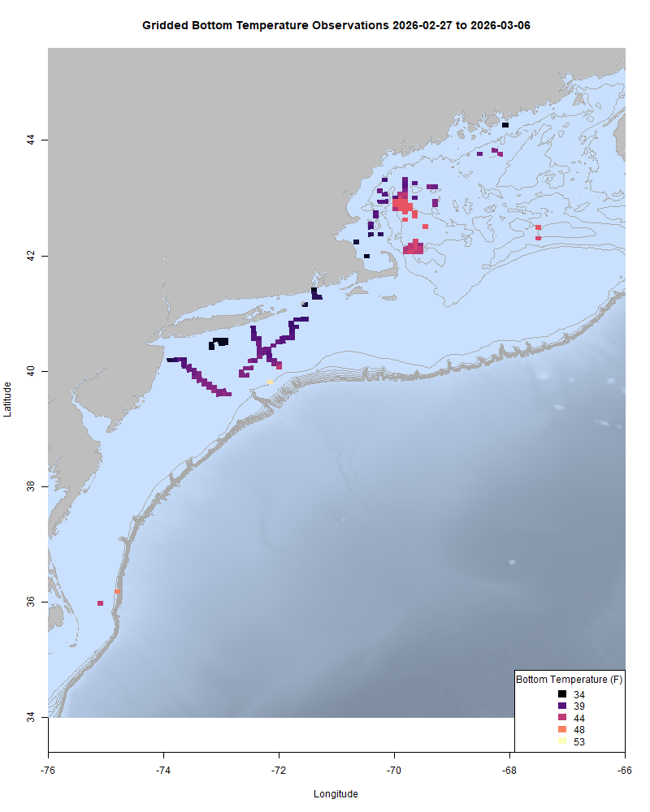
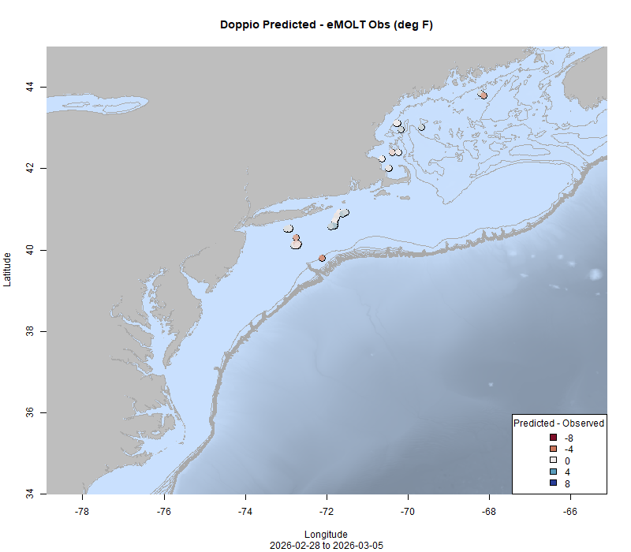
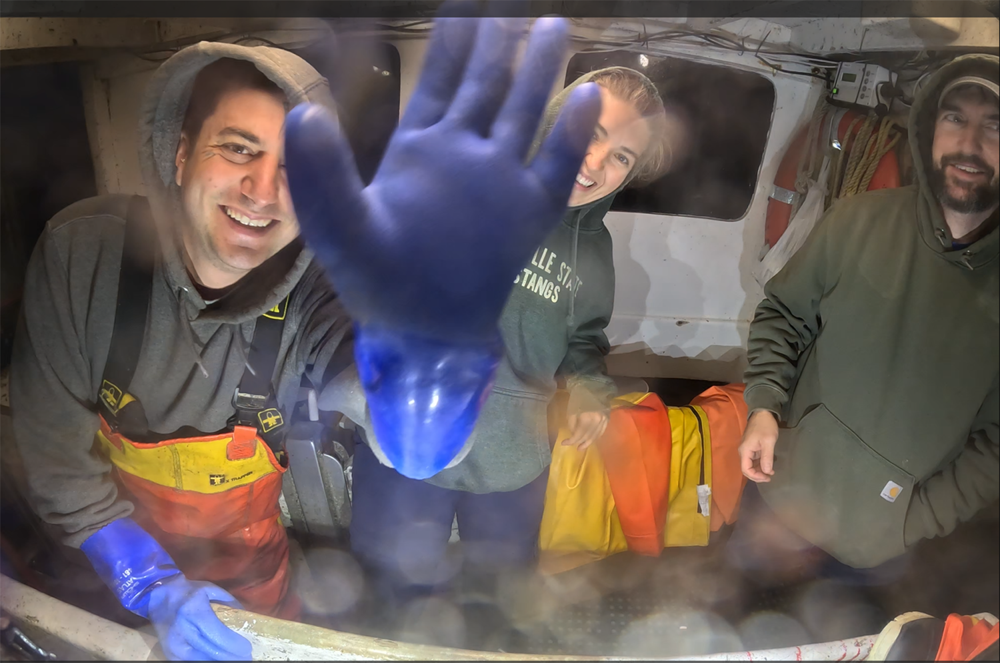

  
```{r setup, include=FALSE}
knitr::opts_chunk$set(echo = TRUE)
options(scipen = 999)
library(marmap)
library(rstudioapi)
if(Sys.info()["sysname"]=="Windows"){
  source("C:/Users/george.maynard/Documents/GitHubRepos/emolt_project_management/WeeklyUpdates/forecast_check/R/emolt_download.R")
} else {
  source("/home/george/Documents/emolt_project_management/WeeklyUpdates/forecast_check/R/emolt_download.R")
}
# if(file.exists(paste0("C:/Users/george.maynard/Documents/emolt_project_management/WeeklyUpdates/",lubridate::year(Sys.time()),"/",lubridate::year(Sys.time()),"-",lubridate::month(Sys.time()),"-",lubridate::day(Sys.time()),"/Doppio_comparison_",format(Sys.time(), "%Y%m%d"),".csv")
# )==FALSE){
#   source("C:/Users/george.maynard/Documents/emolt_project_management/WeeklyUpdates/forecast_check/R/doppio_all_R_compare_and_plot.R")
# }
# if(file.exists(paste0("C:/Users/george.maynard/Documents/emolt_project_management/WeeklyUpdates/",lubridate::year(Sys.time()),"/",lubridate::year(Sys.time()),"-",lubridate::month(Sys.time()),"-",lubridate::day(Sys.time()),"/GOM7_comparison_",format(Sys.time(), "%Y%m%d"),".csv")
# )==FALSE){
#   reticulate::source_python("C:/Users/george.maynard/Documents/emolt_project_management/WeeklyUpdates/Plotting/Windows/GOM7.py")
#   source("C:/Users/george.maynard/Documents/emolt_project_management/WeeklyUpdates/forecast_check/R/plot_comparisons.R")
# }
data=emolt_download(days=7)
start_date=Sys.Date()-lubridate::days(7)
## Use the dates from above to create a URL for grabbing the data
full_data=read.csv(
  paste0(
    "https://erddap.emolt.net/erddap/tabledap/eMOLT_RT.csvp?tow_id%2Csegment_type%2Ctime%2Clatitude%2Clongitude%2Cdepth%2Ctemperature%2Csensor_type&segment_type=3&time%3E=",
    lubridate::year(start_date),
    "-",
    lubridate::month(start_date),
    "-",
    lubridate::day(start_date),
    "T00%3A00%3A00Z&time%3C=",
    lubridate::year(Sys.Date()),
    "-",
    lubridate::month(Sys.Date()),
    "-",
    lubridate::day(Sys.Date()),
    "T23%3A59%3A59Z"
  )
)
sensor_time=0
for(tow in unique(full_data$tow_id)){
  x=subset(full_data,full_data$tow_id==tow)
  sensor_time=sensor_time+difftime(max(x$time..UTC.),units='hours',min(x$time..UTC.))
}
```

<center> 

<font size="5"> *eMOLT Update `r Sys.Date()` * </font>
  
</center>
  
## Weekly Recap 

Once again, we start this week with heartfelt condolences to the families and friends of the crew aboard another fishing vessel struck by tragedy. The F/V Yankee Rose capsized off Provincetown yesterday afternoon. Please do what you can to keep yourself and your colleagues safe on the water. Beyond workplace safety training, Fishing Partnership Support Services has links to mental health resources for fishing families [here](https://fishingpartnership.org/mental-health-for-fishermen/).

It's been a challenging few weeks for a lot of people in Southern New England, particularly here on Cape Cod, where we were out of power for most of the previous week. As a result, the Northeast Cooperative Research Summit has been postponed until April 2. If you were registered to attend you should have received emails with instructions for confirming your attendance on the new date and rebooking your hotel from Maura or Anna. If not, please feel free to reach out and I can forward that information along to you.

A few reminders this week:

1) If you change fishing gears and move your sensor to a different gear type, please let us know. This is especially important if you are switching between mobile and fixed gears (e.g. lobster pots to scallop dredge).
2) If you were registered for the Cooperative Research Summit in March, please let us know whether you are attended the rescheduled Cooperative Research Summit in April ASAP by [filling out this form](https://docs.google.com/forms/d/e/1FAIpQLSe6lmujiIbhAle8VMAOHt6WA-mrbJ5ZGPzq5sVkLwkhqOiZyw/viewform). Next week, we plan to open up unclaimed seats to people on the waitlist.
3) Scallop RSA Proposals are due in a few weeks (March 23). You can learn more and apply [here](https://www.fisheries.noaa.gov/grant/application-solicitation-scallop-research-set-aside-program?utm_medium=email&utm_source=govdelivery).

Yesterday marked the start of the 51st Maine Fishermen's Forum up in Rockport. I'm not there, but Erin, Huanxin, and Emma will be around at the Gulf of Maine Lobster Foundation Booth if you want to stop by and chat about eMOLT, drop off your sensors for maintenance, or learn about some of the other work they're doing with fishermen to clean up derelict gear and monitor ocean currents. Please also consider checking out the seminar on Fishermen Informed Research hosted by Gayle Zydlewski from Maine Sea Grant and Chris Cash from The Lobster Institute on Saturday morning from 0900-1015 in the Camden Room. 



<p class="caption-text">Huanxin walks Captain Josiah of the F/V Shirley Kate through some data visualizations at the Maine Fishermen's Forum</p>

Over the course of the week, Huanxin and I have been working on sensor maintenance and getting ready to visit a few ports on the South Shore and the South Coast of Massachusetts to repair hardware on a few boats and pick up sensors for maintenance from a few others. A big thanks to Steve here in the Woods Hole Lab's maintenance shop for coming up with a way to make our sensor preparation more efficient next week. I've also been working with some of my illex oceanography colleagues on a new manuscript comparing oceanographic data collected by different sensors aboard two commercial fishing vessels and wrapping up our annual reporting to the Population and Ecosystems Monitoring and Analysis Division (PEMAD), which is the part of the Northeast Fisheries Science Center that the Cooperative Research Branch (and by extension the eMOLT Program) nest into.     

This week, the eMOLT fleet recorded `r length(unique(full_data$tow_id))` tows of sensorized fishing gear totaling `r as.numeric(sensor_time)` sensor hours underwater.

```{r FISHBOT_Plot, echo=FALSE, fig.width=8, fig.height=10,warning=FALSE,message=FALSE,error=FALSE}
# source("C:/Users/george.maynard/Documents/emolt_project_management/WeeklyUpdates/Plotting/FISHBOT_Weekly.R")
```



> *FISHBOT bottom temperature records from the past week. The data are available on the [Commercial Fisheries Research Foundation ERDDAP](https://erddap.ondeckdata.com/erddap/tabledap/fishbot_realtime.html) and an interactive visualization is available at the [Cape Cod Ocean Watch](https://ccocean.whoi.edu/index.html) dashboard hosted by Woods Hole Oceanographic Institution. FISHBOT aggregates data provided by participants in eMOLT, the CFRF Lobster and Jonah Crab Research Fleet, the CFRF Shelf Research Fleet, the Cape Cod Commercial Fishermen's Alliance Cape Cod Oceanographic Research Fleet, the Maine Coast Fishermen's Association Fisheries Ocean Data Program, MassDMF Cape Cod Bay Study Fleet, the Northeast Fisheries Science Center Study Fleet, and the Northeast Fisheries Science Center Ecosystem Monitoring Surveys*

### Bottom Temperature Forecast Performance

This week, when compared with observations from the eMOLT Program, Doppio performed well in Massachusetts Bay and Southeast of Long Island. Observed bottom temperatures were slightly warmer than expected along Hudson Canyon. Observations were cooler than NECOFS forecasts further at the offshore end of Hudson Canyon, but warmer than NECOFS forecasts closer in. NECOFS forecasts were close to observed values in Cape Cod Bay and just north of Cape Ann, but observations were cooler than expected further east. 

{width=45%} {width=45%}
<p class="caption-text">Comparisons between forecast models and observations from the last week</p>

### NOAA Seeks Community Input To the 2027 Management Track Fishery Stock Assessments

We are seeking input from our regional assessment partners, including the commercial and recreational fishing industry, state agency scientists, academic researchers, and interested members of the public to help guide development of our next [Management Track Assessments](https://www.fisheries.noaa.gov/new-england-mid-atlantic/population-assessments/management-track-stock-assessments).

Our partners can help by identifying new data sources, providing on-the water observations, and flagging emerging issues important to consider during the assessment process. A [list of stock specific community questions is available on our website](https://www.fisheries.noaa.gov/s3/2026-03/Community-Questions-for-2027-Management-Track-Assessments_20260305.pdf).

There are two ways to participate:

1) [Attend our virtual meeting](https://www.fisheries.noaa.gov/event/management-track-community-input) on March 18, 2026.
2) Submit your comments using the [community input form](https://docs.google.com/forms/d/e/1FAIpQLSdOZC0LWqj0ftu-OrBTsnOfh8TBh-8Dj552bfqWm3FNRekyuw/viewform). This form is open today through April 30, 2026.

#### 2027 Management Track Stocks
- Atlantic cod (Georges Bank, Eastern GoM, Western GoM, Southern New England)
- Atlantic mackerel
- Black sea bass
- Bluefish
- Scup
- Summer flounder

### FIShBOT Presentations

Linus from the Commercial Fisheries Research Foundation recently presented FIShBOT at the Ocean Sciences Meeting in Glasgow, Scotland. He'll also be showing it off as part of the NOAA Science Seminar Series on March 26, from 1200-1300 Eastern Time. You can find out more and check out the rest of the presentations in the series [here](https://www.star.nesdis.noaa.gov/star/NOAAScienceSeminars.php). 

### Weird and Wonderful: 10 Years of Northeast Bottom Longline Survey Video Footage

Field scientist Hannah Ciarametaro explains how and why the Cooperative Research team collects video footage of the ocean floor during the Gulf of Maine Bottom Longline Survey. She shares the weird and wonderful things they have seen along the way. Click [here for the full article](https://www.fisheries.noaa.gov/science-blog/weird-and-wonderful-10-years-northeast-bottom-longline-survey-video-footage?utm_medium=email&utm_source=govdelivery).


<p class="caption-text">(L-R) Crew member Henry, field scientist Hannah, and chief scientist Dave say goodbye to the camera before deployment over the side of the F/V Mary Elizabeth during the Gulf of Maine Bottom Longline Survey.</p>


### Disclaimer
  
The eMOLT Update is NOT an official NOAA document. Mention of products or manufacturers does not constitute an endorsement by NOAA or Department of Commerce. The content of this update reflects only the personal views of the authors and does not necessarily represent the views of NOAA Fisheries, the Department of Commerce, or the United States.


All the best,

-George
