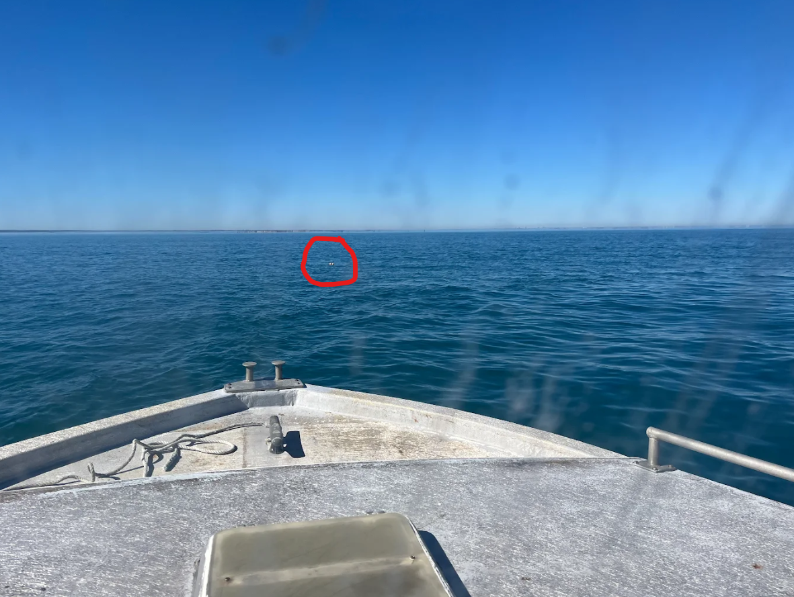
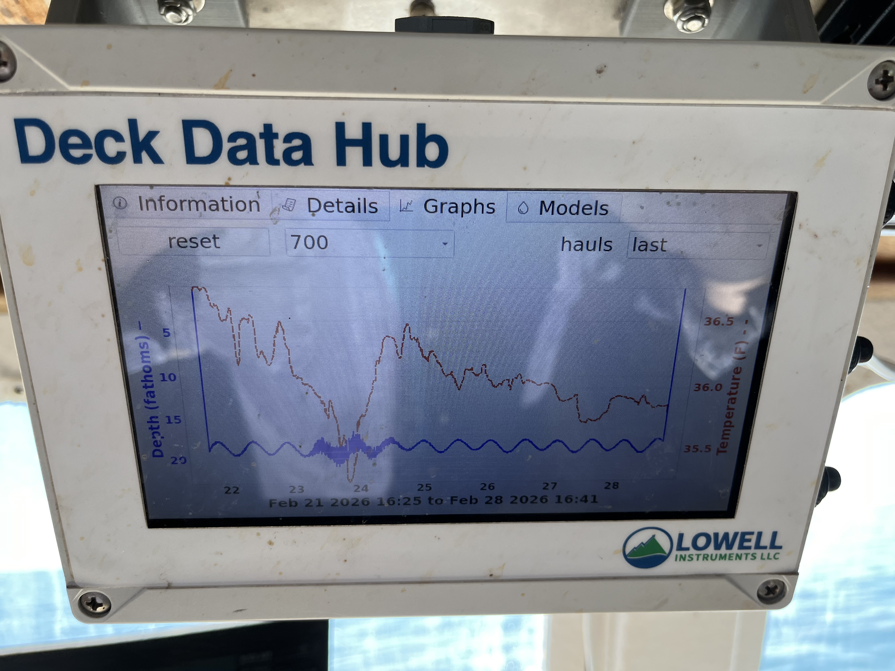
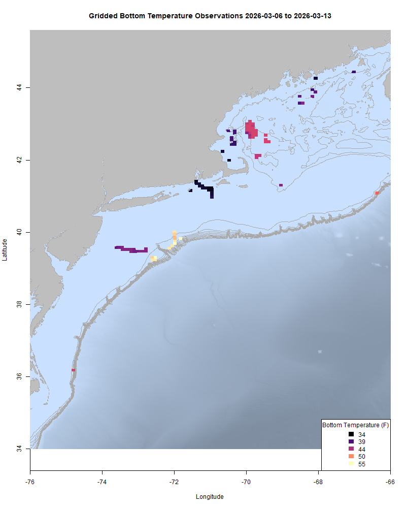
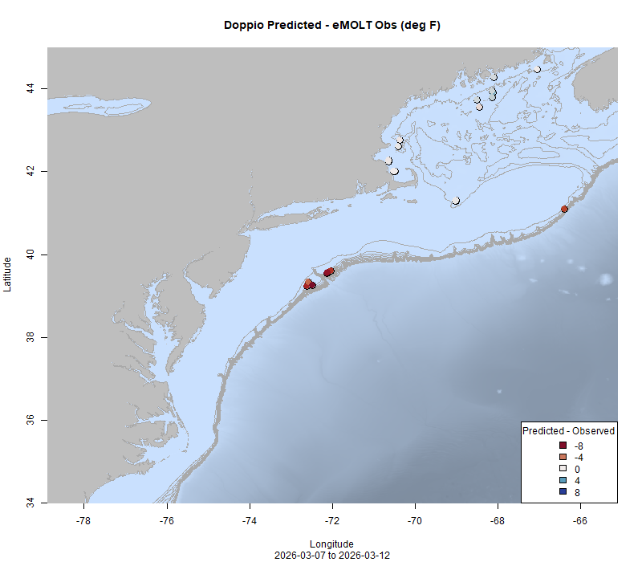

  
```{r setup, include=FALSE}
knitr::opts_chunk$set(echo = TRUE)
options(scipen = 999)
library(marmap)
library(rstudioapi)
if(Sys.info()["sysname"]=="Windows"){
  source("C:/Users/george.maynard/Documents/GitHubRepos/emolt_project_management/WeeklyUpdates/forecast_check/R/emolt_download.R")
} else {
  source("/home/george/Documents/emolt_project_management/WeeklyUpdates/forecast_check/R/emolt_download.R")
}
if(file.exists(paste0("C:/Users/george.maynard/Documents/emolt_project_management/WeeklyUpdates/",lubridate::year(Sys.time()),"/",lubridate::year(Sys.time()),"-",lubridate::month(Sys.time()),"-",lubridate::day(Sys.time()),"/Doppio_comparison_",format(Sys.time(), "%Y%m%d"),".csv")
)==FALSE){
  source("C:/Users/george.maynard/Documents/emolt_project_management/WeeklyUpdates/forecast_check/R/doppio_all_R_compare_and_plot.R")
}
if(file.exists(paste0("C:/Users/george.maynard/Documents/emolt_project_management/WeeklyUpdates/",lubridate::year(Sys.time()),"/",lubridate::year(Sys.time()),"-",lubridate::month(Sys.time()),"-",lubridate::day(Sys.time()),"/GOM7_comparison_",format(Sys.time(), "%Y%m%d"),".csv")
)==FALSE){
  reticulate::source_python("C:/Users/george.maynard/Documents/emolt_project_management/WeeklyUpdates/Plotting/Windows/GOM7.py")
  source("C:/Users/george.maynard/Documents/emolt_project_management/WeeklyUpdates/forecast_check/R/plot_comparisons.R")
}
data=emolt_download(days=7)
start_date=Sys.Date()-lubridate::days(7)
## Use the dates from above to create a URL for grabbing the data
full_data=read.csv(
  paste0(
    "https://erddap.emolt.net/erddap/tabledap/eMOLT_RT.csvp?tow_id%2Csegment_type%2Ctime%2Clatitude%2Clongitude%2Cdepth%2Ctemperature%2Csensor_type&segment_type=3&time%3E=",
    lubridate::year(start_date),
    "-",
    lubridate::month(start_date),
    "-",
    lubridate::day(start_date),
    "T00%3A00%3A00Z&time%3C=",
    lubridate::year(Sys.Date()),
    "-",
    lubridate::month(Sys.Date()),
    "-",
    lubridate::day(Sys.Date()),
    "T23%3A59%3A59Z"
  )
)
sensor_time=0
for(tow in unique(full_data$tow_id)){
  x=subset(full_data,full_data$tow_id==tow)
  sensor_time=sensor_time+difftime(max(x$time..UTC.),units='hours',min(x$time..UTC.))
}
```

<center> 

<font size="5"> *eMOLT Update `r Sys.Date()` * </font>
  
</center>
  
## Weekly Recap 

As we've mentioned before, the rescheduled Cooperative Research Summit will be held on April 2, in Riverhead, NY. After working through re-registering attendees, some seats have opened up, along with a small number of travel stipends for on the water fishermen to attend. If you've been considering attending, please register ASAP at [this link](https://docs.google.com/forms/d/e/1FAIpQLSdEOiWo43NhsRpQHYecVgd6nBpvPHVAzztcH8XC2iXBKmKvyA/viewform). The discounted hotel block in Riverhead is only available until Tuesday 3/17, so please register and book your room before rates go up.

This week, we spent some time working with the team from Lowell Instruments to check out orientation and acceleration data captured by their new TDO loggers in lobster pots. If you fish pots for lobsters, crabs, or fish, and would be interested in providing feedback on how we make those data available, please reach out. With the number of people who left NMFS over the last year, many projects continue to be all hands on deck exercises. On Tuesday, I headed up to Cohasset to assist industry partners and research team in the Risk Assessment and Mitigation Branch in testing on-demand fishing gear in the Massachusetts Restricted Area. It was my first time seeing the gear in action in the field. The fishing was slow, but bottom temps in that area were still around 34-36 F, so hopefully when the temps come up the lobsters will get moving. 



<p class="caption-text">Pop up buoys visible off the bow</p>

While I was out on the water, the captain and I also had some time to chat eMOLT. It was neat to see a plot from his deckbox showing a quick drop in water temps along with crazy pressure changes related to the big storm we had a few weeks back. I also got to meet up with a few other eMOLT participants in the area to collect hardware for seasonal maintenance, get feedback on how their systems have been working, and discuss potential improvements to the program. 




<p class="caption-text">Temperature (red) and pressure (blue) changes related to the blizzard of 2026 captured by an eMOLT participant.</p>

A few reminders this week:

1) If you change fishing gears and move your sensor to a different gear type, please let us know. This is especially important if you are switching between mobile and fixed gears (e.g. lobster pots to scallop dredge).
2) Scallop RSA Proposals are due in a few weeks (March 23). You can learn more and apply [here](https://www.fisheries.noaa.gov/grant/application-solicitation-scallop-research-set-aside-program?utm_medium=email&utm_source=govdelivery).


This week, the eMOLT fleet recorded `r length(unique(full_data$tow_id))` tows of sensorized fishing gear totaling `r as.numeric(sensor_time)` sensor hours underwater.

```{r FISHBOT_Plot, echo=FALSE, fig.width=8, fig.height=10,warning=FALSE,message=FALSE,error=FALSE}
source("C:/Users/george.maynard/Documents/emolt_project_management/WeeklyUpdates/Plotting/FISHBOT_Weekly.R")
```



> *FISHBOT bottom temperature records from the past week. The data are available on the [Commercial Fisheries Research Foundation ERDDAP](https://erddap.ondeckdata.com/erddap/tabledap/fishbot_realtime.html) and an interactive visualization is available at the [Cape Cod Ocean Watch](https://ccocean.whoi.edu/index.html) dashboard hosted by Woods Hole Oceanographic Institution. FISHBOT aggregates data provided by participants in eMOLT, the CFRF Lobster and Jonah Crab Research Fleet, the CFRF Shelf Research Fleet, the Cape Cod Commercial Fishermen's Alliance Cape Cod Oceanographic Research Fleet, the Maine Coast Fishermen's Association Fisheries Ocean Data Program, MassDMF Cape Cod Bay Study Fleet, the Northeast Fisheries Science Center Study Fleet, and the Northeast Fisheries Science Center Ecosystem Monitoring Surveys*

### Bottom Temperature Forecast Performance

This week, when compared with observations from the eMOLT Program, Doppio performed well in the Gulf of Maine, but observations were warmer than forecast out on the shelf break. NECOFS also performed well in the Gulf of Maine, but observations were cooler than forecast in the Great South Channel.

{width=45%} {width=45%}
<p class="caption-text">Comparisons between forecast models and observations from the last week</p>

### NOAA Seeks Community Input To the 2027 Management Track Fishery Stock Assessments

We are seeking input from our regional assessment partners, including the commercial and recreational fishing industry, state agency scientists, academic researchers, and interested members of the public to help guide development of our next [Management Track Assessments](https://www.fisheries.noaa.gov/new-england-mid-atlantic/population-assessments/management-track-stock-assessments).

Our partners can help by identifying new data sources, providing on-the water observations, and flagging emerging issues important to consider during the assessment process. A [list of stock specific community questions is available on our website](https://www.fisheries.noaa.gov/s3/2026-03/Community-Questions-for-2027-Management-Track-Assessments_20260305.pdf).

There are two ways to participate:

1) [Attend our virtual meeting](https://www.fisheries.noaa.gov/event/management-track-community-input) on March 18, 2026.
2) Submit your comments using the [community input form](https://docs.google.com/forms/d/e/1FAIpQLSdOZC0LWqj0ftu-OrBTsnOfh8TBh-8Dj552bfqWm3FNRekyuw/viewform). This form is open today through April 30, 2026.

#### 2027 Management Track Stocks
- Atlantic cod (Georges Bank, Eastern GoM, Western GoM, Southern New England)
- Atlantic mackerel
- Black sea bass
- Bluefish
- Scup
- Summer flounder

### FIShBOT Presentations

Linus from the Commercial Fisheries Research Foundation recently presented FIShBOT at the Ocean Sciences Meeting in Glasgow, Scotland. He'll also be showing it off as part of the NOAA Science Seminar Series on March 26, from 1200-1300 Eastern Time. You can find out more and check out the rest of the presentations in the series [here](https://www.star.nesdis.noaa.gov/star/NOAAScienceSeminars.php). 

### Disclaimer
  
The eMOLT Update is NOT an official NOAA document. Mention of products or manufacturers does not constitute an endorsement by NOAA or Department of Commerce. The content of this update reflects only the personal views of the authors and does not necessarily represent the views of NOAA Fisheries, the Department of Commerce, or the United States.


All the best,

-George
