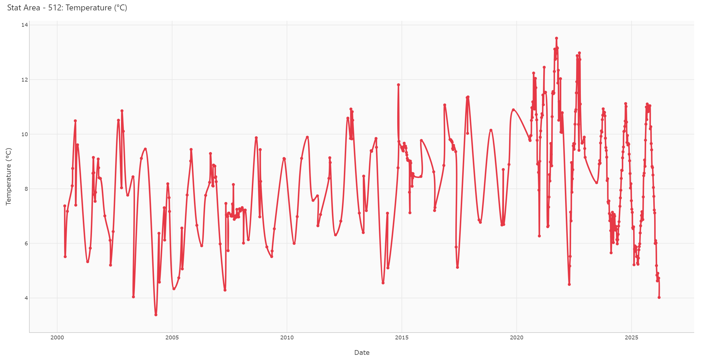
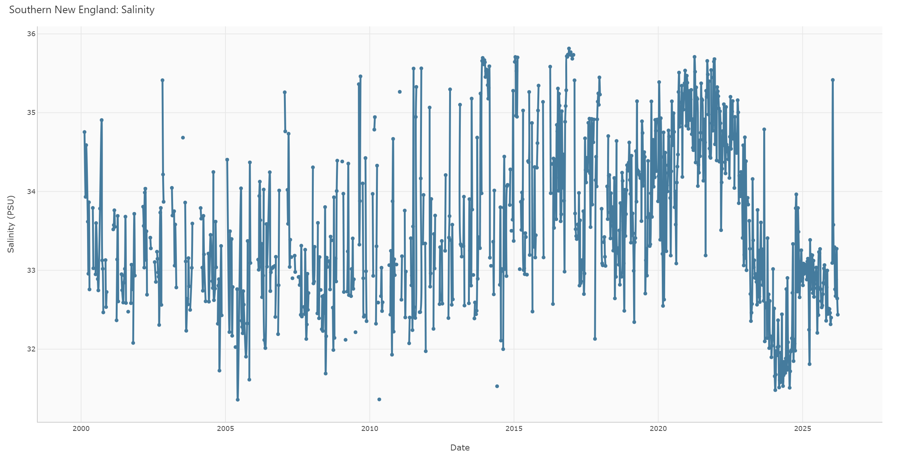
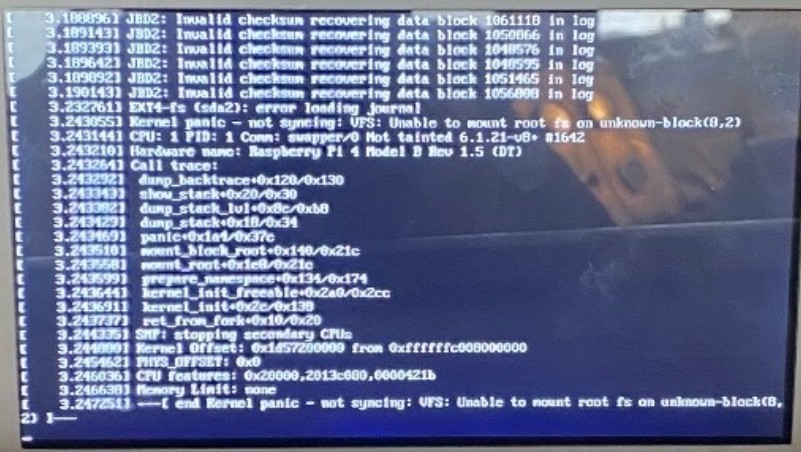
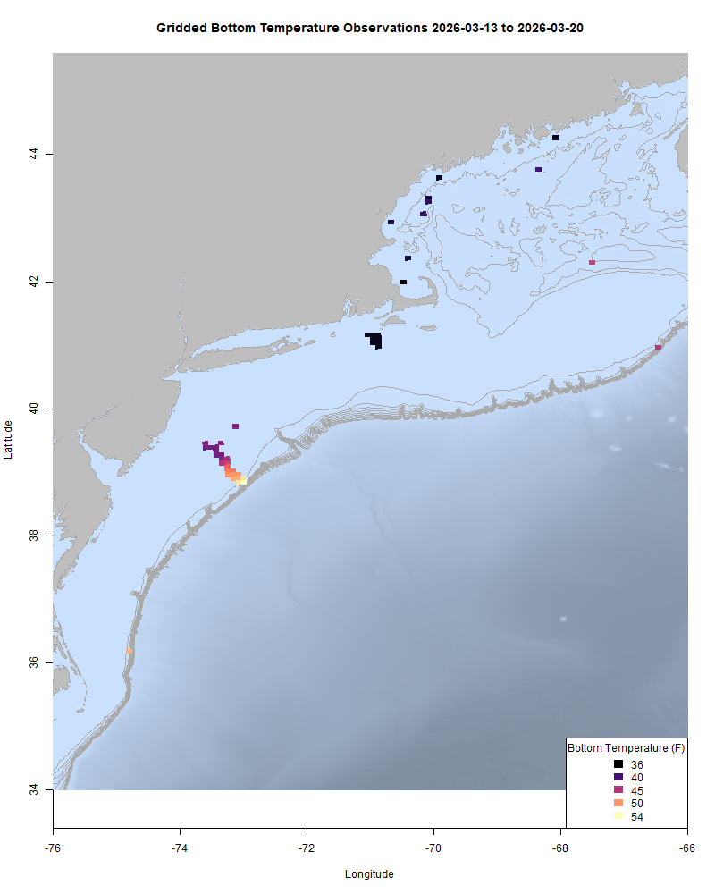
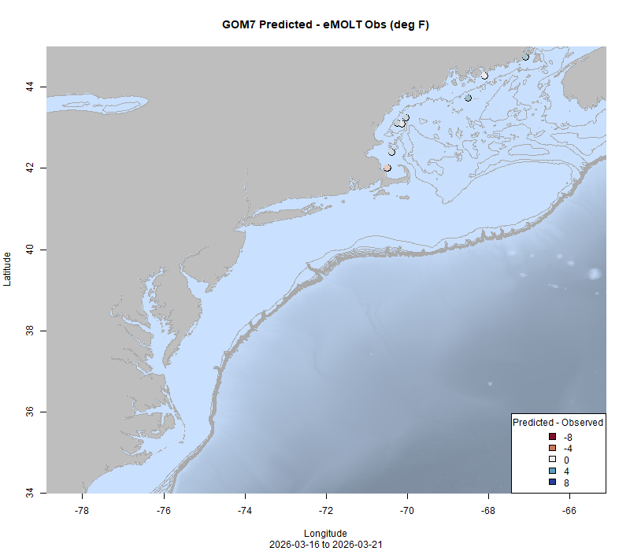

  
```{r setup, include=FALSE}
knitr::opts_chunk$set(echo = TRUE)
options(scipen = 999)
library(marmap)
library(rstudioapi)
if(Sys.info()["sysname"]=="Windows"){
  source("C:/Users/george.maynard/Documents/GitHubRepos/emolt_project_management/WeeklyUpdates/forecast_check/R/emolt_download.R")
} else {
  source("/home/george/Documents/emolt_project_management/WeeklyUpdates/forecast_check/R/emolt_download.R")
}
if(file.exists(paste0("C:/Users/george.maynard/Documents/emolt_project_management/WeeklyUpdates/",lubridate::year(Sys.time()),"/",lubridate::year(Sys.time()),"-",lubridate::month(Sys.time()),"-",lubridate::day(Sys.time()),"/Doppio_comparison_",format(Sys.time(), "%Y%m%d"),".csv")
)==FALSE){
  source("C:/Users/george.maynard/Documents/emolt_project_management/WeeklyUpdates/forecast_check/R/doppio_all_R_compare_and_plot.R")
}
if(file.exists(paste0("C:/Users/george.maynard/Documents/emolt_project_management/WeeklyUpdates/",lubridate::year(Sys.time()),"/",lubridate::year(Sys.time()),"-",lubridate::month(Sys.time()),"-",lubridate::day(Sys.time()),"/GOM7_comparison_",format(Sys.time(), "%Y%m%d"),".csv")
)==FALSE){
  reticulate::source_python("C:/Users/george.maynard/Documents/emolt_project_management/WeeklyUpdates/Plotting/Windows/GOM7.py")
  source("C:/Users/george.maynard/Documents/emolt_project_management/WeeklyUpdates/forecast_check/R/plot_comparisons.R")
}
data=emolt_download(days=7)
start_date=Sys.Date()-lubridate::days(7)
## Use the dates from above to create a URL for grabbing the data
full_data=read.csv(
  paste0(
    "https://erddap.emolt.net/erddap/tabledap/eMOLT_RT.csvp?tow_id%2Csegment_type%2Ctime%2Clatitude%2Clongitude%2Cdepth%2Ctemperature%2Csensor_type&segment_type=3&time%3E=",
    lubridate::year(start_date),
    "-",
    lubridate::month(start_date),
    "-",
    lubridate::day(start_date),
    "T00%3A00%3A00Z&time%3C=",
    lubridate::year(Sys.Date()),
    "-",
    lubridate::month(Sys.Date()),
    "-",
    lubridate::day(Sys.Date()),
    "T23%3A59%3A59Z"
  )
)
sensor_time=0
for(tow in unique(full_data$tow_id)){
  x=subset(full_data,full_data$tow_id==tow)
  sensor_time=sensor_time+difftime(max(x$time..UTC.),units='hours',min(x$time..UTC.))
}
```

<center> 

<font size="5"> *eMOLT Update `r Sys.Date()` * </font>
  
</center>

This week was a little different from normal at the Woods Hole lab. Earlier this week, the same winds that kept a lot of our partner vessels tied up broke equipment loose on the roof, which caused damage and water leaks on the second and third floors of the lab. Yesterday, we had a visit from NOAA Fisheries leadership from Washington, D.C. who shared their vision for making the agency more efficient and improving morale among the workforce. In all of this, the Bottom Trawl Survey team is working on completing the first leg of the spring survey and our Bottom Longline Survey team is gearing up for their spring survey season as well. 
  
## FIShBOT

Today, we're going to take a closer look at the Fishing Industry Shared Bottom Oceanographic Timeseries or FIShBOT, a new data product from the Commercial Fisheries Research Foundation and the Northeast Fisheries Science Center. FIShBOT provides daily averages of temperature (and in some cases salinity and dissolved oxygen) on a 7km grid by combining data from a growing list of different ocean observing assets operating in our region including the sensors deployed on fishing vessels by eMOLT and the Study Fleet Program, the CTDs deployed by fishermen as part of CFRF, WHOI, and CCCFA's research fleets, NOAA's ECOMON survey, gliders from Rutgers, and more. 

In the plot below, you can see the coverage of fishery dependent observations (think eMOLT, Study Fleet, CFRF) in red and fishery independent  observations (think NOAA ships, gliders, and buoys) in blue over the last year. Brighter colors indicate more days observed. What I hope you'll take away is that these data sources aren't replacements for one another, but rather they complement each other.


A little while back, we published a [Tech Memo](https://repository.library.noaa.gov/view/noaa/72384) explaining the nuts and bolts of the product. In recent weeks, Sarah's been working on a [new website that you can check out](www.fishbot.net) that includes some really cool [data visualizations that Linus put together](https://fishbot.net/explore.html). These visual summaries are aggregated at a pretty big scale, so you should take them with a grain of salt, but there are some cool things that we've picked out from them already. 

For example, Stat Areas 511 and 512 in Downeast Maine were pretty data sparse until around 2020, when suddenly temperature records are regularly available in those zones thanks to the eMOLT expansion spearheaded by UMaine and the Lobster Institute.



Salinity data is patchy throughout much of the region, but the best coverage is in Southern New England thanks to CFRF and WHOI's shelf research fleet. So, in the Southern New England EPU, you can see the cold fresh pulse that took place over the last few years very clearly. 



Another interesting thing to check out is the bottom temperature over the last few months in Southern New England. Bottom temps this year (orange) are much lower than the average over the last 20 years (gray) and lower than last year at this time (red). This time though, the cooling isn't accompanied by the freshening that we saw a few years ago. As explained by Dr. Glen Gawarkiewicz from WHOI at the Commercial Fisheries Research Foundation Oceanography Update meeting earlier this week, this year's cooling is likely driven by the early breakup of the polar vortex in the atmosphere rather than a slug of cold water coming down from the northeast. 

.png)

## Super capacitor issues

We know several boats recently have experienced issues with their deckbox hard drive going bad. This manifests as a black screen with lots of white text (see below). If you experience this issue, the culprit might actually be on the voltage regulator board. Nick and his team traced this back to a bad batch of super capacitors (only voltage regulators with those super capacitors have wrecked their hard drives). If you see this issue on your boat, please call your dockside tech. There are a number of steps we'll take the troubleshoot on the boat, but it's likely the deckbox will need to go back to the shop for a new voltage regulator or new super capacitors. For the dockside techs, there is a video explaining how to check whether the super capacitors are functioning properly [here](https://drive.google.com/file/d/1G7fdo8xjH90TRskpIvAkZST0IdEifuok/view?usp=drive_link).



Crazy winds earlier this week, high fuel prices, and cold water temps have kept a lot of boats tied to the dock recently. This might be one of our quietest weeks in recent memory. This week, the eMOLT fleet recorded `r length(unique(full_data$tow_id))` tows of sensorized fishing gear totaling `r as.numeric(sensor_time)` sensor hours underwater.

```{r FISHBOT_Plot, echo=FALSE, fig.width=8, fig.height=10,warning=FALSE,message=FALSE,error=FALSE}
source("C:/Users/george.maynard/Documents/emolt_project_management/WeeklyUpdates/Plotting/FISHBOT_Weekly.R")
```



> *FISHBOT bottom temperature records from the past week. The data are available on the [Commercial Fisheries Research Foundation ERDDAP](https://erddap.ondeckdata.com/erddap/tabledap/fishbot_realtime.html) and an interactive visualization is available at the [Cape Cod Ocean Watch](https://ccocean.whoi.edu/index.html) dashboard hosted by Woods Hole Oceanographic Institution. FISHBOT aggregates data provided by participants in eMOLT, the CFRF Lobster and Jonah Crab Research Fleet, the CFRF Shelf Research Fleet, the Cape Cod Commercial Fishermen's Alliance Cape Cod Oceanographic Research Fleet, the Maine Coast Fishermen's Association Fisheries Ocean Data Program, MassDMF Cape Cod Bay Study Fleet, the Northeast Fisheries Science Center Study Fleet, and the Northeast Fisheries Science Center Ecosystem Monitoring Surveys*

### Bottom Temperature Forecast Performance

This week, when compared with observations from the eMOLT Program, Doppio performed well in the Gulf of Maine, but observations were warmer than forecast out on the shelf break. NECOFS also performed well in the Gulf of Maine, but observations were cooler than forecast in the Great South Channel.

{width=45%} {width=45%}
<p class="caption-text">Comparisons between forecast models and observations from the last week</p>

### FIShBOT Presentations

Linus from the Commercial Fisheries Research Foundation recently presented FIShBOT at the Ocean Sciences Meeting in Glasgow, Scotland. He'll also be showing it off as part of the NOAA Science Seminar Series on March 26, from 1200-1300 Eastern Time. You can find out more and check out the rest of the presentations in the series [here](https://www.star.nesdis.noaa.gov/star/NOAAScienceSeminars.php). 

### Other news from the region

- Dr. Samantha Siedlecki and Halle Berger from UCONN are working with Dr. Shannon Meseck and Dr. Bobby Murphy from the Northeast Fisheries Science Center on exploring how environmental data can be used to develop a new management approach for sea scallops adapted for and responsive to a changing ocean. To learn more check out [this press release from UCONN](https://today.uconn.edu/2026/03/uconn-helps-sea-scallop-communities-adapt-to-ocean-warming/). 

- NOAA Fisheries is seeking public comment on 2026 regulations for Squid, Mackerel, and Butterfish. To learn more, [click here](https://content.govdelivery.com/accounts/USNOAAFISHERIES/bulletins/40e8680)

### Disclaimer
  
The eMOLT Update is NOT an official NOAA document. Mention of products or manufacturers does not constitute an endorsement by NOAA or Department of Commerce. The content of this update reflects only the personal views of the authors and does not necessarily represent the views of NOAA Fisheries, the Department of Commerce, or the United States.


All the best,

-George
