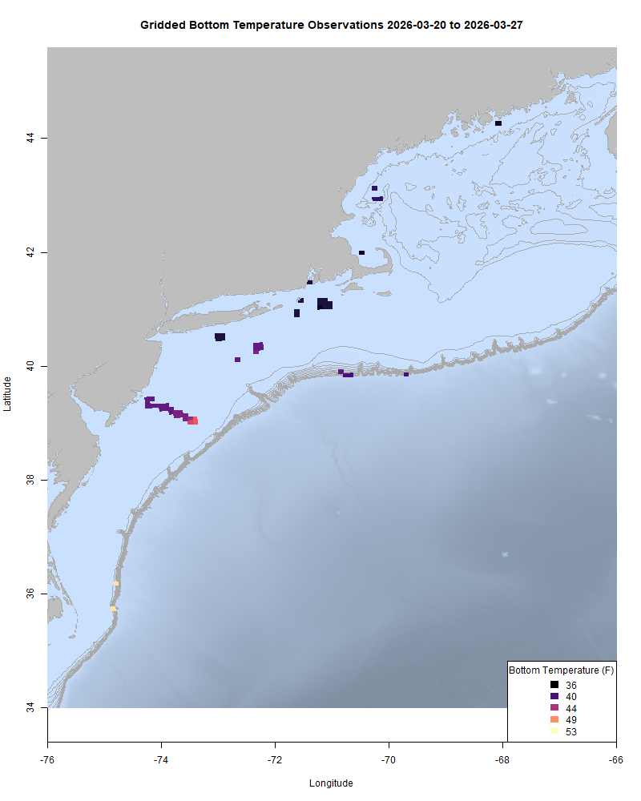
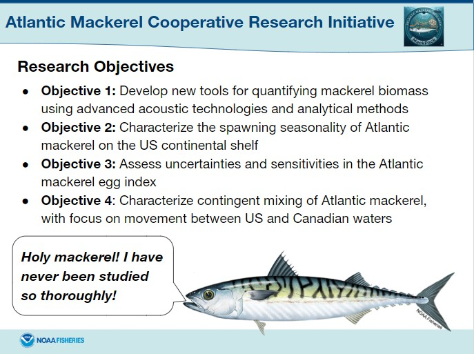

  
```{r setup, include=FALSE}
knitr::opts_chunk$set(echo = TRUE)
options(scipen = 999)
library(marmap)
library(rstudioapi)
if(Sys.info()["sysname"]=="Windows"){
  source("C:/Users/george.maynard/Documents/GitHubRepos/emolt_project_management/WeeklyUpdates/forecast_check/R/emolt_download.R")
} else {
  source("/home/george/Documents/emolt_project_management/WeeklyUpdates/forecast_check/R/emolt_download.R")
}
# if(file.exists(paste0("C:/Users/george.maynard/Documents/emolt_project_management/WeeklyUpdates/",lubridate::year(Sys.time()),"/",lubridate::year(Sys.time()),"-",lubridate::month(Sys.time()),"-",lubridate::day(Sys.time()),"/Doppio_comparison_",format(Sys.time(), "%Y%m%d"),".csv")
# )==FALSE){
#   source("C:/Users/george.maynard/Documents/emolt_project_management/WeeklyUpdates/forecast_check/R/doppio_all_R_compare_and_plot.R")
# }
# if(file.exists(paste0("C:/Users/george.maynard/Documents/emolt_project_management/WeeklyUpdates/",lubridate::year(Sys.time()),"/",lubridate::year(Sys.time()),"-",lubridate::month(Sys.time()),"-",lubridate::day(Sys.time()),"/GOM7_comparison_",format(Sys.time(), "%Y%m%d"),".csv")
# )==FALSE){
#   reticulate::source_python("C:/Users/george.maynard/Documents/emolt_project_management/WeeklyUpdates/Plotting/Windows/GOM7.py")
#   source("C:/Users/george.maynard/Documents/emolt_project_management/WeeklyUpdates/forecast_check/R/plot_comparisons.R")
# }
data=emolt_download(days=7)
start_date=Sys.Date()-lubridate::days(7)
## Use the dates from above to create a URL for grabbing the data
full_data=read.csv(
  paste0(
    "https://erddap.emolt.net/erddap/tabledap/eMOLT_RT.csvp?tow_id%2Csegment_type%2Ctime%2Clatitude%2Clongitude%2Cdepth%2Ctemperature%2Csensor_type&segment_type=3&time%3E=",
    lubridate::year(start_date),
    "-",
    lubridate::month(start_date),
    "-",
    lubridate::day(start_date),
    "T00%3A00%3A00Z&time%3C=",
    lubridate::year(Sys.Date()),
    "-",
    lubridate::month(Sys.Date()),
    "-",
    lubridate::day(Sys.Date()),
    "T23%3A59%3A59Z"
  )
)
sensor_time=0
for(tow in unique(full_data$tow_id)){
  x=subset(full_data,full_data$tow_id==tow)
  sensor_time=sensor_time+difftime(max(x$time..UTC.),units='hours',min(x$time..UTC.))
}
```

<center> 

<font size="5"> *eMOLT Update `r Sys.Date()` * </font>
  
</center>

This week, Jack from Ocean Data Network spent some time up in Gloucester working on a few different boats with remote support from George and the team at Lowell Instruments. Thanks to the captains of the F/Vs Alice and Annie, Grace, Salted, and Kathryn Leigh for their patience with our troubleshooting work. The F/V Grace lost a logger to a rock that went through the dredge, the F/V Kathryn Leigh had a hard drive go bad, and the F/V Salted and F/V Alice and Annie were both transfers of existing systems to new boats. Three out of four are up and running -- Brady we'll get back with you soon!

Cassie from the Coonamessett Farm Foundation and Huanxin from the Gulf of Maine Lobster Foundation were also at the docks recently down in New Bedford, and got the eMOLT systems aboard the F/Vs Sea Watcher I and Kathy Marie in working order. The F/V Sea Watcher I was the last vessel that we installed with the software and hardware predecessors of the Deck Data Hub a few years ago, so its system was overdue for a complete overhaul and upgrade, and the F/V Kathy Marie needed a new logger.

Sarah from the Northeast Fisheries Science Center presented FIShBOT to the Squid Squad last week, and and Linus from the Commercial Fisheries Research Foundation gave a talk on FIShBOT as part of the NOAA Science Seminar Series yesterday. Thanks to everyone who's given feedback as a result of those talks. We appreciate the suggestions on how to improve what we're doing. 
  
This week, the eMOLT fleet recorded `r length(unique(full_data$tow_id))` tows of sensorized fishing gear totaling `r as.numeric(sensor_time)` sensor hours underwater.

```{r FISHBOT_Plot, echo=FALSE, fig.width=8, fig.height=10,warning=FALSE,message=FALSE,error=FALSE}
source("C:/Users/george.maynard/Documents/emolt_project_management/WeeklyUpdates/Plotting/FISHBOT_Weekly.R")
```



> *FISHBOT bottom temperature records from the past week. The data are available on the [Commercial Fisheries Research Foundation ERDDAP](https://erddap.ondeckdata.com/erddap/tabledap/fishbot_realtime.html) and an interactive visualization is available at the [Cape Cod Ocean Watch](https://ccocean.whoi.edu/index.html) dashboard hosted by Woods Hole Oceanographic Institution. FISHBOT aggregates data provided by participants in eMOLT, the CFRF Lobster and Jonah Crab Research Fleet, the CFRF Shelf Research Fleet, the Cape Cod Commercial Fishermen's Alliance Cape Cod Oceanographic Research Fleet, the Maine Coast Fishermen's Association Fisheries Ocean Data Program, MassDMF Cape Cod Bay Study Fleet, the Northeast Fisheries Science Center Study Fleet, and the Northeast Fisheries Science Center Ecosystem Monitoring Surveys*

### New Cooperative Reasearch Opportunity: SPAM


Not the gelatinous canned meat or the unwanted emails, in this case SPAM stands for the Sampling Program for Atlantic Mackerel. If you land mackerel and are interested in participating in a new cooperative research program to improve mackerel science please fill out [this form](https://docs.google.com/forms/d/e/1FAIpQLSdLKWfYU3CkD3_ntFv4oSEFSUcv6jY1mWjxhaUn_nVVhy0WjQ/viewform). We're looking for boats that would be willing to ship coolers full of mackerel to the Narragansett Lab (shipping labels, coolers, and compensation provided) for dissection, with a goal of better understanding the timing of mackerel spawning. If you'd like to engage with the MackPack industry/science discussion group, please contact Dr. Anna Mercer anna.mercer@noaa.gov



### Other news from the region

- Our collaborative tilefish length monitoring project is currently midway through a two-year data collection phase. Using onboard camera systems, this project generates length estimates for individual golden tilefish. This work explores if and how this technology can support broader data collection and would help make stock assessments more resilient to fluctuations in traditional portside sampling. To date, the project has recorded over ten trips, generating more than 7,000 length estimates. While scientifically promising, industry interest remains mixed as camera systems on vessels are not universally welcomed. This feedback remains critical as the project evaluates future technological integration. For more info on the tilefish length monitoring project, please contact Andy Jones (andrew.jones@noaa.gov)

- NOAA Fisheries is seeking public comment on 2026 regulations for Squid, Mackerel, and Butterfish. To learn more, [click here](https://content.govdelivery.com/accounts/USNOAAFISHERIES/bulletins/40e8680)

### Disclaimer
  
The eMOLT Update is NOT an official NOAA document. Mention of products or manufacturers does not constitute an endorsement by NOAA or Department of Commerce. The content of this update reflects only the personal views of the authors and does not necessarily represent the views of NOAA Fisheries, the Department of Commerce, or the United States.


All the best,

-George
