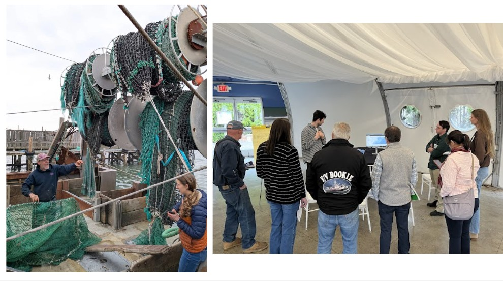
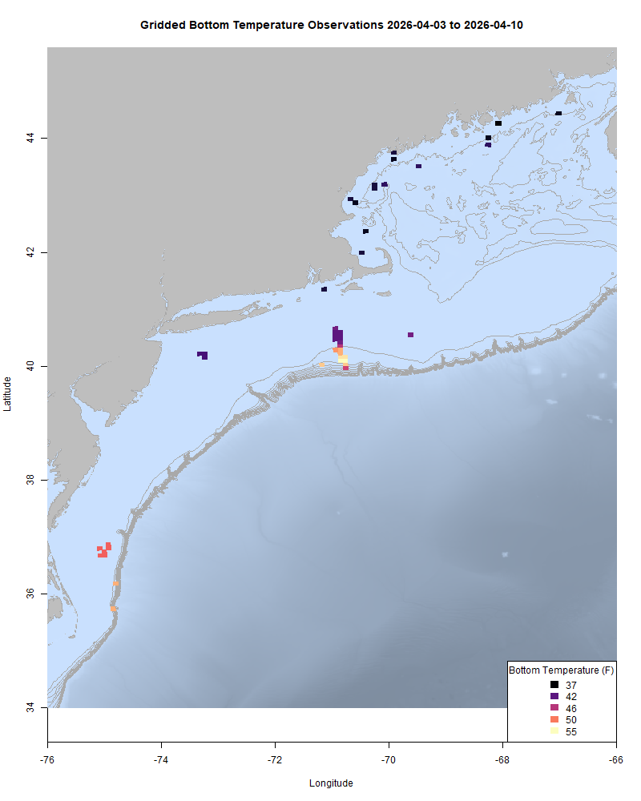
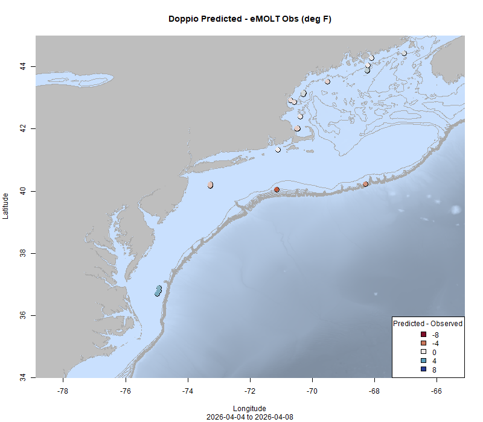

  
```{r setup, include=FALSE}
knitr::opts_chunk$set(echo = TRUE)
options(scipen = 999)
library(marmap)
library(rstudioapi)
if(Sys.info()["sysname"]=="Windows"){
  source("C:/Users/george.maynard/Documents/GitHubRepos/emolt_project_management/WeeklyUpdates/forecast_check/R/emolt_download.R")
} else {
  source("/home/george/Documents/emolt_project_management/WeeklyUpdates/forecast_check/R/emolt_download.R")
}
if(file.exists(paste0("C:/Users/george.maynard/Documents/emolt_project_management/WeeklyUpdates/",lubridate::year(Sys.time()),"/",lubridate::year(Sys.time()),"-",lubridate::month(Sys.time()),"-",lubridate::day(Sys.time()),"/Doppio_comparison_",format(Sys.time(), "%Y%m%d"),".csv")
)==FALSE){
  source("C:/Users/george.maynard/Documents/emolt_project_management/WeeklyUpdates/forecast_check/R/doppio_all_R_compare_and_plot.R")
}
if(file.exists(paste0("C:/Users/george.maynard/Documents/emolt_project_management/WeeklyUpdates/",lubridate::year(Sys.time()),"/",lubridate::year(Sys.time()),"-",lubridate::month(Sys.time()),"-",lubridate::day(Sys.time()),"/GOM7_comparison_",format(Sys.time(), "%Y%m%d"),".csv")
)==FALSE){
  reticulate::source_python("C:/Users/george.maynard/Documents/emolt_project_management/WeeklyUpdates/Plotting/Windows/GOM7.py")
  source("C:/Users/george.maynard/Documents/emolt_project_management/WeeklyUpdates/forecast_check/R/plot_comparisons.R")
}
data=emolt_download(days=7)
start_date=Sys.Date()-lubridate::days(7)
## Use the dates from above to create a URL for grabbing the data
full_data=read.csv(
  paste0(
    "https://erddap.emolt.net/erddap/tabledap/eMOLT_RT.csvp?tow_id%2Csegment_type%2Ctime%2Clatitude%2Clongitude%2Cdepth%2Ctemperature%2Csensor_type&segment_type=3&time%3E=",
    lubridate::year(start_date),
    "-",
    lubridate::month(start_date),
    "-",
    lubridate::day(start_date),
    "T00%3A00%3A00Z&time%3C=",
    lubridate::year(Sys.Date()),
    "-",
    lubridate::month(Sys.Date()),
    "-",
    lubridate::day(Sys.Date()),
    "T23%3A59%3A59Z"
  )
)
sensor_time=0
for(tow in unique(full_data$tow_id)){
  x=subset(full_data,full_data$tow_id==tow)
  sensor_time=sensor_time+difftime(max(x$time..UTC.),units='hours',min(x$time..UTC.))
}
```

<center> 

<font size="5"> *eMOLT Update `r Sys.Date()` * </font>
  
</center>

It's been a wild few weeks for the eMOLT Program. Last week, we had the pleasure of heading down to Long Island for the annual Northeast Cooperative Research Summit. The Cornell Cooperative Extension team and the fishermen from Shinnecock and nearby ports were great hosts. As part of the Summit, I worked with some of our collaborators to host a breakout session to provide fishermen with an opportunity to check out and offer feedback on two online data portals -- [Cape Cod Ocean Watch](https://ccocean.whoi.edu/index.html), which provides a bunch of data on water temps, dissolved oxygen, and salinity, and the [Mariner's Dashboard](https://mariners.neracoos.org/), which provides information about sea state and surface conditions. Thanks to everyone who attended and to Katy Bland (Northeastern Regional Association of Coastal Ocean Observing Systems), Sarah Salois (NOAA Fisheries), Mel Sanderson (Cape Cod Commercial Fishermen's Alliance), and Finn Wimberly (Woods Hole Oceanographic Institution) who helped guide participants through the different portals. Sarah and I will be working on compiling the feedback we got over the next few weeks and look forward to using that information to improve our data delivery back to all of you. 



*(L) Captain Bill Reed and Dr. Anna Mercer talk turtle excluders aboard the F/V Providence during our tour of the Shinnecock docks before the Summit. (R) A small group of fishermen and scientists get an overview of the Cape Cod Ocean Watch dashboard from Finn Wimberly of the Woods Hole Oceanographic Institution during a breakout session at the Summit.*

eMOLT was also recently [featured in the New York Times](https://www.nytimes.com/2026/04/01/climate/new-england-fishermen-ocean-data.html?unlocked_article_code=1.XlA.JJA5.XDF3c2faLZBm&smid=url-share). The online version of the article came out last week just before the summit, and the print version of the article came out today. I want to extend a huge thanks to Captain Bob on the F/V High Hopes for taking a Times photographer out with him and representing the program so well. Thanks also to the fishermen and other collaborators who took the time to speak with the Times reporter at the Maine Fishermen's Forum. 

Between the New York Times article, the Cooperative Research Summit, and just general dock talk, there's been another surge of interest in the program from commercial fishermen. If you're a fisherman who has friends or colleagues who are interested in participating, please don't hesitate to send them our way, but just understand that there will be a bit of a wait on new systems. We currently have a confirmed list of 20 vessels that technicians from CFRF and the GOMLF will be rigging up in the coming month (thanks to The Nature Conservancy for providing the funding to make that happen). Beyond that, there is limited funding for additional hardware, so we expect the pace of new installs to slow down dramatically. 

For much of this week, we've been working on the administrative paperwork that keeps the lights on for the eMOLT Program -- not exciting, but unfortunately necessary. There have also been some changes in that process over the last year, so we've got a bit of a learning curve about which forms need to be filled out and what the due dates are. Big thanks to Katie Burchard down at the Narragansett Lab for all of her help navigating that process. Huanxin and I have also been working on maintenance and calibration checks on some of the TDO loggers. We've got 21 loggers done, and another 10 or so cleaned but not serviced yet. One of the exciting parts of this process is finding sensors that still have some data on them that just never offloaded. We'll be doing some detective work to match those up with the appropriate vessels and locations over the next few weeks as well.
  
This week, the eMOLT fleet recorded `r length(unique(full_data$tow_id))` tows of sensorized fishing gear totaling `r as.numeric(sensor_time)` sensor hours underwater.

```{r FISHBOT_Plot, echo=FALSE, fig.width=8, fig.height=10,warning=FALSE,message=FALSE,error=FALSE}
source("C:/Users/george.maynard/Documents/emolt_project_management/WeeklyUpdates/Plotting/FISHBOT_Weekly.R")
```



> *FISHBOT bottom temperature records from the past week. The data are available on the [Commercial Fisheries Research Foundation ERDDAP](https://erddap.ondeckdata.com/erddap/tabledap/fishbot_realtime.html) and an interactive visualization is available at the [Cape Cod Ocean Watch](https://ccocean.whoi.edu/index.html) dashboard hosted by Woods Hole Oceanographic Institution. FISHBOT aggregates data provided by participants in eMOLT, the CFRF Lobster and Jonah Crab Research Fleet, the CFRF Shelf Research Fleet, the Cape Cod Commercial Fishermen's Alliance Cape Cod Oceanographic Research Fleet, the Maine Coast Fishermen's Association Fisheries Ocean Data Program, MassDMF Cape Cod Bay Study Fleet, the Northeast Fisheries Science Center Study Fleet, and the Northeast Fisheries Science Center Ecosystem Monitoring Surveys*

### Bottom Temperature Forecast Performance

This week, both models did well forecasting bottom temps in the Gulf of Maine and Massachusetts Bay. South of Long Island, there was some disagreement, with observations being warmer than the Doppio forecast but cooler than the NECOFS forecast. Observed temps were warmer than Doppio predictions along the shelf break east of Hudson Canyon, but cooler than Doppio predictions south of Hudson Canyon.

{width=45%} {width=45%}
<p class="caption-text">Comparisons between forecast models and observations from the last week</p>

### Disclaimer
  
The eMOLT Update is NOT an official NOAA document. Mention of products or manufacturers does not constitute an endorsement by NOAA or Department of Commerce. The content of this update reflects only the personal views of the authors and does not necessarily represent the views of NOAA Fisheries, the Department of Commerce, or the United States.


All the best,

-George
