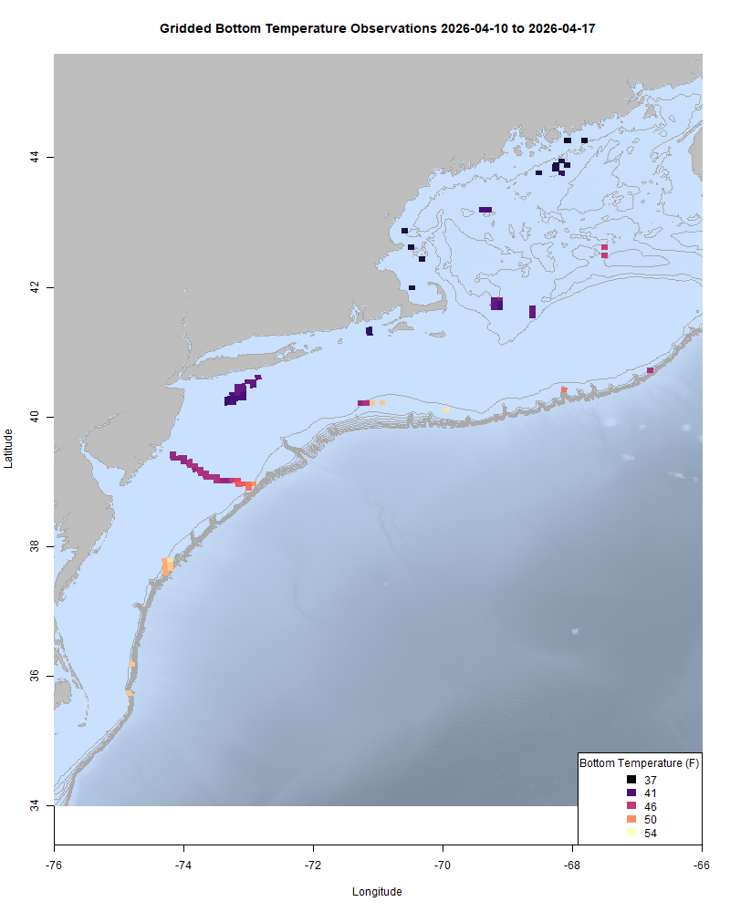
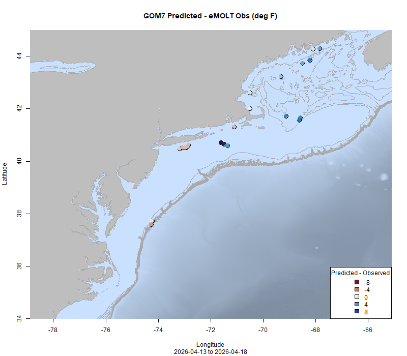

  
```{r setup, include=FALSE}
knitr::opts_chunk$set(echo = TRUE)
options(scipen = 999)
library(marmap)
library(rstudioapi)
if(Sys.info()["sysname"]=="Windows"){
  source("C:/Users/george.maynard/Documents/GitHubRepos/emolt_project_management/WeeklyUpdates/forecast_check/R/emolt_download.R")
} else {
  source("/home/george/Documents/emolt_project_management/WeeklyUpdates/forecast_check/R/emolt_download.R")
}
if(file.exists(paste0("C:/Users/george.maynard/Documents/emolt_project_management/WeeklyUpdates/",lubridate::year(Sys.time()),"/",lubridate::year(Sys.time()),"-",lubridate::month(Sys.time()),"-",lubridate::day(Sys.time()),"/Doppio_comparison_",format(Sys.time(), "%Y%m%d"),".csv")
)==FALSE){
  source("C:/Users/george.maynard/Documents/emolt_project_management/WeeklyUpdates/forecast_check/R/doppio_all_R_compare_and_plot.R")
}
if(file.exists(paste0("C:/Users/george.maynard/Documents/emolt_project_management/WeeklyUpdates/",lubridate::year(Sys.time()),"/",lubridate::year(Sys.time()),"-",lubridate::month(Sys.time()),"-",lubridate::day(Sys.time()),"/GOM7_comparison_",format(Sys.time(), "%Y%m%d"),".csv")
)==FALSE){
  reticulate::source_python("C:/Users/george.maynard/Documents/emolt_project_management/WeeklyUpdates/Plotting/Windows/GOM7.py")
  source("C:/Users/george.maynard/Documents/emolt_project_management/WeeklyUpdates/forecast_check/R/plot_comparisons.R")
}
data=emolt_download(days=7)
start_date=Sys.Date()-lubridate::days(7)
## Use the dates from above to create a URL for grabbing the data
full_data=read.csv(
  paste0(
    "https://erddap.emolt.net/erddap/tabledap/eMOLT_RT.csvp?tow_id%2Csegment_type%2Ctime%2Clatitude%2Clongitude%2Cdepth%2Ctemperature%2Csensor_type&segment_type=3&time%3E=",
    lubridate::year(start_date),
    "-",
    lubridate::month(start_date),
    "-",
    lubridate::day(start_date),
    "T00%3A00%3A00Z&time%3C=",
    lubridate::year(Sys.Date()),
    "-",
    lubridate::month(Sys.Date()),
    "-",
    lubridate::day(Sys.Date()),
    "T23%3A59%3A59Z"
  )
)
sensor_time=0
for(tow in unique(full_data$tow_id)){
  x=subset(full_data,full_data$tow_id==tow)
  sensor_time=sensor_time+difftime(max(x$time..UTC.),units='hours',min(x$time..UTC.))
}
```

<center> 

<font size="5"> *eMOLT Update `r Sys.Date()` * </font>
  
</center>
  
It is stubbornly cold out there. From Downeast Maine to Block Island, nearshore bottom temps remain in the mid to high 30s. Things are a little warmer South of Long Island and out by the Great South Channel with temps in the low 40s. We're still working on getting things ready for the coming year, scrubbing barnacles off of sensors and replacing batteries while the team up at Lowell Instruments is updating firmware. A shipment of the Zebra Tech Moana TD loggers just came back from New Zealand as well, ready to go back out. A big thanks to all of our fishing industry partners for their patience as we work through some of the growing pains that are coming with the rapid expansion of this program. Responses to calls, texts, and emails are a little slower than we'd like at this point, but we'll be making some changes in the coming months to hopefully make operations a little more efficient. This week, the eMOLT fleet recorded `r length(unique(full_data$tow_id))` tows of sensorized fishing gear totaling `r as.numeric(sensor_time)` sensor hours underwater.

```{r FISHBOT_Plot, echo=FALSE, fig.width=8, fig.height=10,warning=FALSE,message=FALSE,error=FALSE}
source("C:/Users/george.maynard/Documents/emolt_project_management/WeeklyUpdates/Plotting/FISHBOT_Weekly.R")
```



> *FISHBOT bottom temperature records from the past week. The data are available on the [Commercial Fisheries Research Foundation ERDDAP](https://erddap.ondeckdata.com/erddap/tabledap/fishbot_realtime.html) and an interactive visualization is available at the [Cape Cod Ocean Watch](https://ccocean.whoi.edu/index.html) dashboard hosted by Woods Hole Oceanographic Institution. FISHBOT aggregates data provided by participants in eMOLT, the CFRF Lobster and Jonah Crab Research Fleet, the CFRF Shelf Research Fleet, the Cape Cod Commercial Fishermen's Alliance Cape Cod Oceanographic Research Fleet, the Maine Coast Fishermen's Association Fisheries Ocean Data Program, MassDMF Cape Cod Bay Study Fleet, the Northeast Fisheries Science Center Study Fleet, and the Northeast Fisheries Science Center Ecosystem Monitoring Surveys*

### Bottom Temperature Forecast Performance
The Doppio bottom temperature forecast performed reasonably well across much of the region last week, although bottom temperatures along the shelf break were warmer than forecasted. Bottom temperature observations were generally colder than NECOFS forecasted, especially southeast of Long Island, in the Gulf of Maine, and near the Great South Channel. 

{width=45%} {width=45%}
<p class="caption-text">Comparisons between bottom temperatures predicted by two ocean forecasting models and observations from the eMOLT fleet. Blue dots show where the observations were cooler than the forecast and red dots show where the observations were warmer than the forecast. White dots show areas where the observations and forecasts agreed. On the left is the comparison with the Doppio model and on the right is the comparison with the NECOFS model (GOM7).</p>

### Other happenings

- The Northeast Fisheries Science Center's Cooperative Research team was featured in two articles in NOAA's "FishNews" newsletter this week. [The first article](https://www.fisheries.noaa.gov/feature-story/scientists-and-fishing-industry-join-forces-better-data-and-management-part-1) highlighted eMOLT and the Squid Squad, and [the second article](https://www.fisheries.noaa.gov/feature-story/scientists-and-fishing-industry-join-forces-better-data-and-management-part-2) covered a range of projects including industry-based biological sampling, cooperative tilefish research, and a new partnership with recreational fishermen. You can sign up to receive NOAA's "FishNews" newsletter each week [here](https://public.govdelivery.com/accounts/USNOAAFISHERIES/subscriber/new).  

- The Massachusetts Lobstermen's Association and Hiltz Waste Disposal are sponsoring a North Shore Lobster Gear Cleanup on April 27-29th from 0800-1400 at the [Gloucester Department of Public Works](https://maps.app.goo.gl/CmjFRiCYi39G2pUa6). There will be a designated dumpster for lobster gear. 

- A research team from Maine recently published an article titled ["A natural experiment in thermal stratification reveals heterogeneous American Lobster settlement dynamics in the Gulf of Maine"](https://www.int-res.com/journals/meps/articles/meps15076) in the peer-reviewed journal Marine Ecology Progress Series. The team of authors behind this work includes eMOLT collaborators Dr. Andrew Goode (UMaine), Capt. Curt Brown (F/V Lil' More Tail) and Capt. Jordan Drouin (F/V Devocean) as well as other scientists from the University of Maine and the Maine Department of Marine Resources. The authors found that *"While temperature is clearly a controlling factor in species distributions in a changing climate, results also suggest that other factors, such as species-specific behavioral constraints, limit the capacity of lobsters to exploit deeper habitat...even if temperatures are suitable."*

- [Secretary Rollins Announces the Creation of the USDA Office of Seafood](https://www.usda.gov/about-usda/news/press-releases/2026/04/15/secretary-rollins-announces-creation-usda-office-seafood)

### Disclaimer
  
The eMOLT Update is NOT an official NOAA document. Mention of products or manufacturers does not constitute an endorsement by NOAA or Department of Commerce. The content of this update reflects only the personal views of the authors and does not necessarily represent the views of NOAA Fisheries, the Department of Commerce, or the United States.


All the best,

-George
