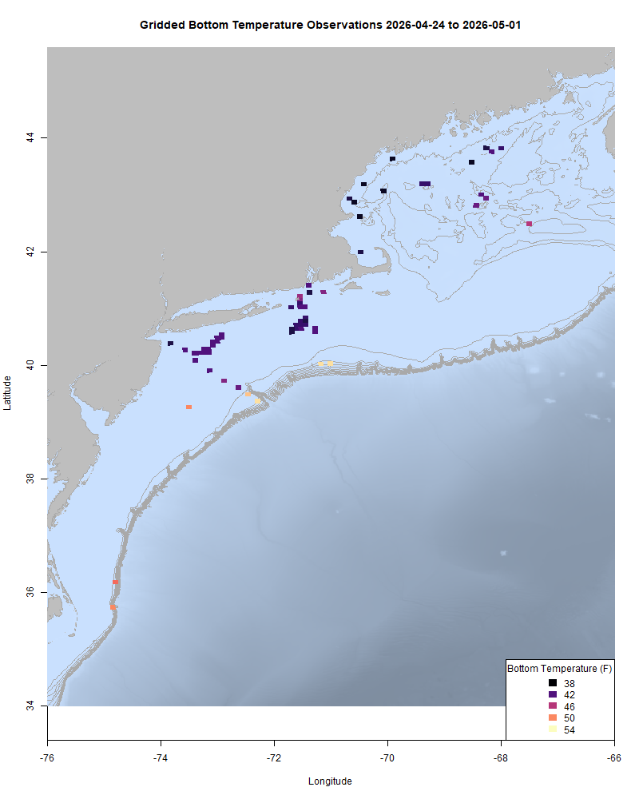
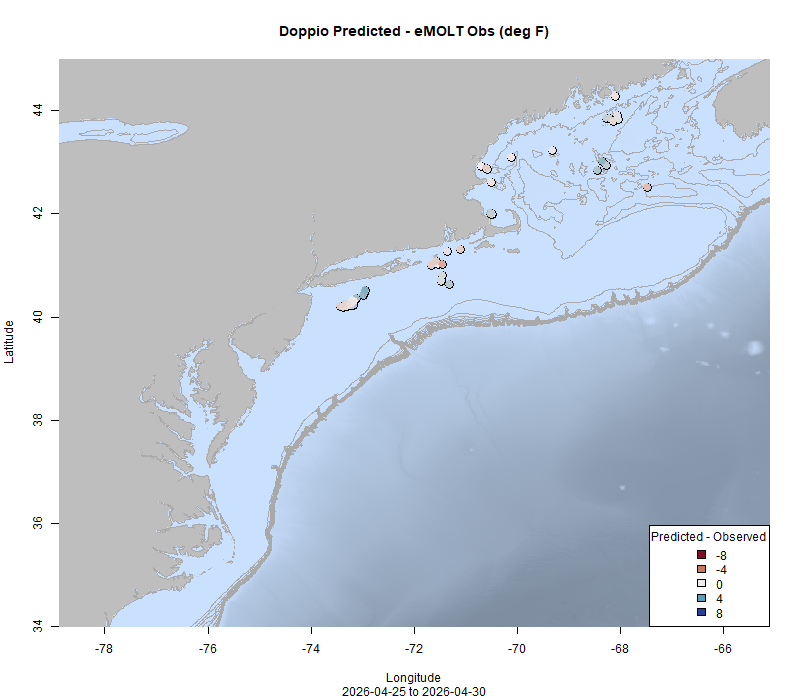

  
```{r setup, include=FALSE}
knitr::opts_chunk$set(echo = TRUE)
options(scipen = 999)
library(marmap)
library(rstudioapi)
if(Sys.info()["sysname"]=="Windows"){
  source("C:/Users/george.maynard/Documents/GitHubRepos/emolt_project_management/WeeklyUpdates/forecast_check/R/emolt_download.R")
} else {
  source("/home/george/Documents/emolt_project_management/WeeklyUpdates/forecast_check/R/emolt_download.R")
}
if(file.exists(paste0("C:/Users/george.maynard/Documents/emolt_project_management/WeeklyUpdates/",lubridate::year(Sys.time()),"/",lubridate::year(Sys.time()),"-",lubridate::month(Sys.time()),"-",lubridate::day(Sys.time()),"/Doppio_comparison_",format(Sys.time(), "%Y%m%d"),".csv")
)==FALSE){
  source("C:/Users/george.maynard/Documents/emolt_project_management/WeeklyUpdates/forecast_check/R/doppio_all_R_compare_and_plot.R")
}
if(file.exists(paste0("C:/Users/george.maynard/Documents/emolt_project_management/WeeklyUpdates/",lubridate::year(Sys.time()),"/",lubridate::year(Sys.time()),"-",lubridate::month(Sys.time()),"-",lubridate::day(Sys.time()),"/GOM7_comparison_",format(Sys.time(), "%Y%m%d"),".csv")
)==FALSE){
  reticulate::source_python("C:/Users/george.maynard/Documents/emolt_project_management/WeeklyUpdates/Plotting/Windows/GOM7.py")
  source("C:/Users/george.maynard/Documents/emolt_project_management/WeeklyUpdates/forecast_check/R/plot_comparisons.R")
}
data=emolt_download(days=7)
start_date=Sys.Date()-lubridate::days(7)
## Use the dates from above to create a URL for grabbing the data
full_data=read.csv(
  paste0(
    "https://erddap.emolt.net/erddap/tabledap/eMOLT_RT.csvp?tow_id%2Csegment_type%2Ctime%2Clatitude%2Clongitude%2Cdepth%2Ctemperature%2Csensor_type&segment_type=3&time%3E=",
    lubridate::year(start_date),
    "-",
    lubridate::month(start_date),
    "-",
    lubridate::day(start_date),
    "T00%3A00%3A00Z&time%3C=",
    lubridate::year(Sys.Date()),
    "-",
    lubridate::month(Sys.Date()),
    "-",
    lubridate::day(Sys.Date()),
    "T23%3A59%3A59Z"
  )
)
sensor_time=0
for(tow in unique(full_data$tow_id)){
  x=subset(full_data,full_data$tow_id==tow)
  sensor_time=sensor_time+difftime(max(x$time..UTC.),units='hours',min(x$time..UTC.))
}
```

<center> 

<font size="5"> *eMOLT Update `r Sys.Date()` * </font>
  
</center>

Today's update is coming a little later in the day, because Huanxin, Erin, and I spent much of the day on the South Shore, repairing eMOLT systems aboard the F/Vs Ryan Joseph, Phyliss P, and Mary Elizabeth, and installing new systems aboard the F/Vs Gabrielle Rose, Cheryl Ann, Miss Emily, and Michael Brandon. Thanks to all the captains in Cohasset and Scituate who had us aboard and took the time to work with us today. Luca from CFRF has also been busy down in Rhode Island, completing eMOLT's first foray into the charter/for-hire fleet aboard the F/V Priority Too. All the hardware for these installs was generously funded through [The Nature Conservancy's office in Massachusetts](https://www.nature.org/en-us/about-us/where-we-work/united-states/massachusetts/). We have a lot more installs in the works with various funders, each targeting different geographic areas or segments of the fleet. If you know a vessel owner or operator who would like to get involved, please send them over to the new [online eMOLT System Request form](https://docs.google.com/forms/d/e/1FAIpQLSdRYtqgxrNmraclFQn_EfIVydPOSyMhsmCNKaRgej2F3n6Xzw/viewform) that Emma just added to the Gulf of Maine Lobster Foundation website to get on the wait list. Being able to break this list down by gear type and geographic area is helpful when we apply for funding to expand the program. 
  
Bottom temperatures are still chilly around the region although coastal waters are finally starting to break 40 F around New England. This week, the eMOLT fleet recorded `r length(unique(full_data$tow_id))` tows of sensorized fishing gear totaling `r as.numeric(sensor_time)` sensor hours underwater.

```{r FISHBOT_Plot, echo=FALSE, fig.width=8, fig.height=10,warning=FALSE,message=FALSE,error=FALSE}
source("C:/Users/george.maynard/Documents/emolt_project_management/WeeklyUpdates/Plotting/FISHBOT_Weekly.R")
```



> *FISHBOT bottom temperature records from the past week. The data are available on the [Commercial Fisheries Research Foundation ERDDAP](https://erddap.ondeckdata.com/erddap/tabledap/fishbot_realtime.html) and an interactive visualization is available at the [Cape Cod Ocean Watch](https://ccocean.whoi.edu/index.html) dashboard hosted by Woods Hole Oceanographic Institution. FISHBOT aggregates data provided by participants in eMOLT, the CFRF Lobster and Jonah Crab Research Fleet, the CFRF Shelf Research Fleet, the Cape Cod Commercial Fishermen's Alliance Cape Cod Oceanographic Research Fleet, the Maine Coast Fishermen's Association Fisheries Ocean Data Program, MassDMF Cape Cod Bay Study Fleet, the Northeast Fisheries Science Center Study Fleet, and the Northeast Fisheries Science Center Ecosystem Monitoring Surveys*

### Bottom Temperature Forecast Performance

The Doppio forecast performed well this week in the western Gulf of Maine. Observations were colder than expected in the deeper part of the GOM. Both Doppio and NECOFS predicted water temps cooler than what was observed south of Rhode Island, and both models performed pretty well south of Long Island.

{width=45%} {width=45%}
<p class="caption-text">Comparisons between bottom temperatures predicted by two ocean forecasting models and observations from the eMOLT fleet. Blue dots show where the observations were cooler than the forecast and red dots show where the observations were warmer than the forecast. White dots show areas where the observations and forecasts agreed. On the left is the comparison with the Doppio model and on the right is the comparison with the NECOFS model (GOM7).</p>

### Other happenings

- As much as I hate listening to myself talk, a big thanks this week goes out to Theresa Martin at [Cape Cod News](www.capecodnews.org) for the [mini documentary](https://capecodnews.org/connecting-data-dots-between-fishermen-and-scientists/) she put together about the eMOLT Program and our partnership with Cape Cod's own Lowell Instruments. 

- The Gulf of Maine Lobster Foundation partners with several organizations on fishing gear cleanup and recycling initiatives. One of those organizations, Net Your Problem, is now shipping used fishing gear to the front lines in Ukraine to protect soldiers and civilians from Russian drone attacks. Learn more about this novel recycling effort [here](https://alaskabeacon.com/2026/04/29/commercial-fishing-nets-have-new-life-in-ukrainian-war-zones/)

- Are you a commercial or recreational fisherman in our region? Have you recently seen any notable or unusual things like:

> - Odd ocean conditions 
> - Unusually high or low fishing
> - New or different species
> - Shifts in migration timing
> If so, our State of the Ecosystem team wants to hear from you! When you see these and other kinds of unusual conditions, please email the team at northeast.ecosystem.highlights@noaa.gov. Reported observations will be synthesized into annual, publicly available reports for the New England and Mid-Atlantic Fisheries Management Councils.

- Elizabeth Conley, a social scientist here at the NEFSC and a team of co-authors recently published a new [peer-reviewed article](https://onlinelibrary.wiley.com/doi/10.1111/fme.70048) outlining the need to incorporate industry perspectives into management, not just in terms of cooperative biological, ecological, and oceanographic research, but also with regards to the economics of fisheries and the trustworthiness of NMFS. This article was highlighted by our [Research Communications team here at the NEFSC](https://www.fisheries.noaa.gov/feature-story/righting-course-distrust-through-collaboration?utm_medium=email&utm_source=govdelivery) as well as [National Fisherman magazine](https://www.nationalfisherman.com/study-links-low-profits-high-costs-to-fishermens-distrust-of-fisheries-managers). 

- We are still looking for research partners (commercial fishermen or fish dealers) for our mackerel biological sampling program. If you catch and land mackerel in the Gulf of Maine, or if you process mackerel shoreside and are interested in participating, please contact katherine.viducic@noaa.gov for more information. Compensation is available. 

### Disclaimer
  
The eMOLT Update is NOT an official NOAA document. Mention of products or manufacturers does not constitute an endorsement by NOAA or Department of Commerce. The content of this update reflects only the personal views of the authors and does not necessarily represent the views of NOAA Fisheries, the Department of Commerce, or the United States.


All the best,

-George
