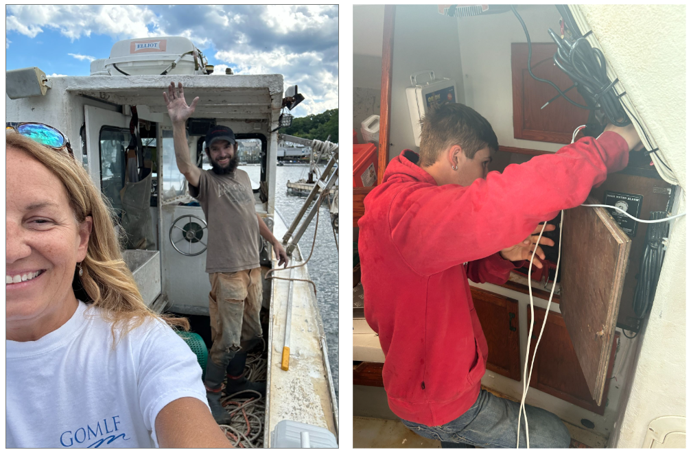
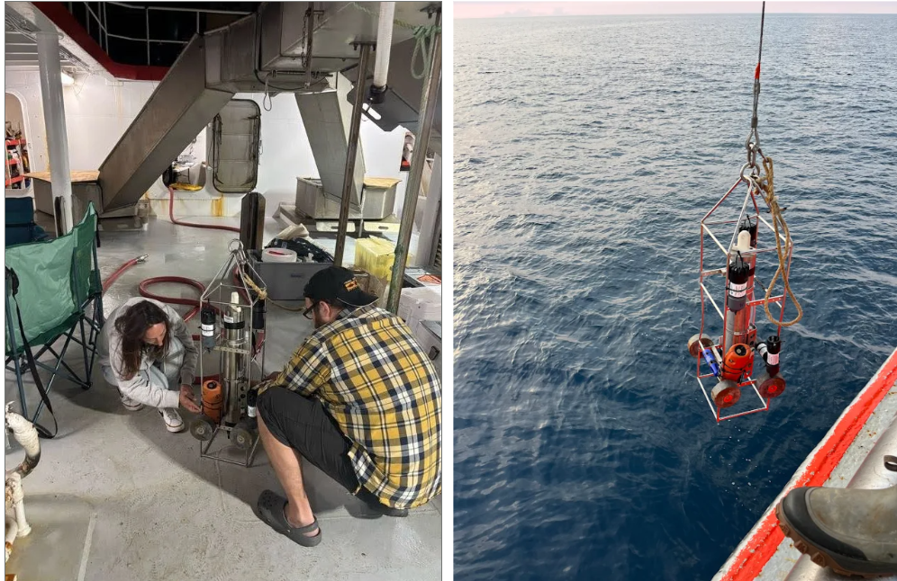
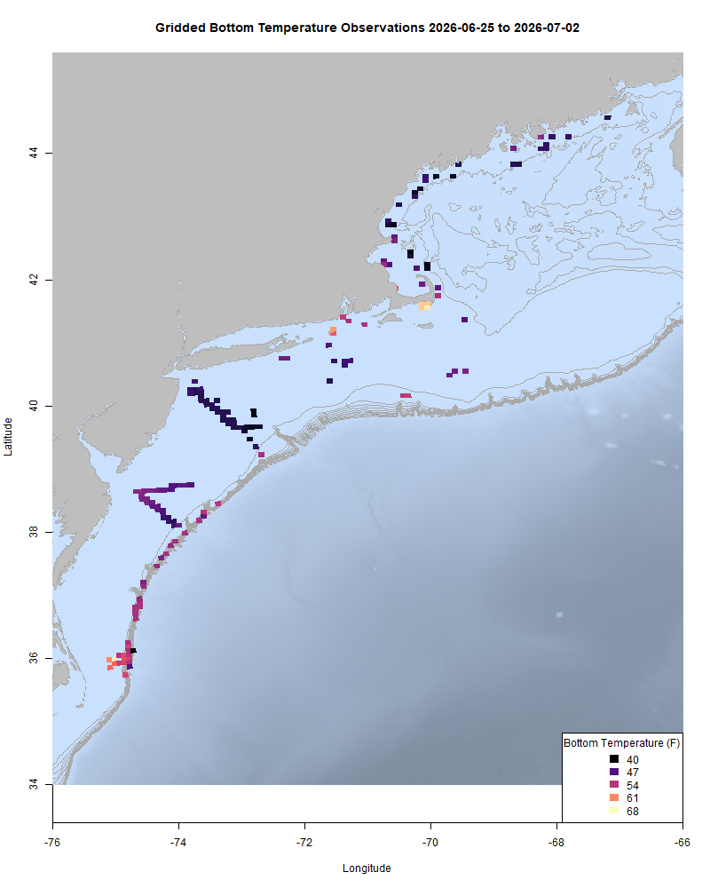
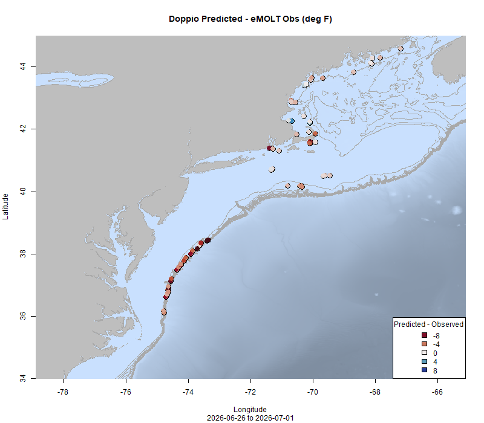

  
```{r setup, include=FALSE}
knitr::opts_chunk$set(echo = TRUE)
options(scipen = 999)
library(marmap)
library(rstudioapi)
if(Sys.info()["sysname"]=="Windows"){
  source("C:/Users/george.maynard/Documents/emolt_project_management/WeeklyUpdates/forecast_check/R/emolt_download.R")
} else {
  source("/home/george/Documents/emolt_project_management/WeeklyUpdates/forecast_check/R/emolt_download.R")
}
if(file.exists(paste0("C:/Users/george.maynard/Documents/emolt_project_management/WeeklyUpdates/",lubridate::year(Sys.time()),"/",lubridate::year(Sys.time()),"-",lubridate::month(Sys.time()),"-",lubridate::day(Sys.time()),"/Doppio_comparison_",format(Sys.time(), "%Y%m%d"),".csv")
)==FALSE){
  source("C:/Users/george.maynard/Documents/emolt_project_management/WeeklyUpdates/forecast_check/R/doppio_all_R_compare_and_plot.R")
}
# if(file.exists(paste0("C:/Users/george.maynard/Documents/emolt_project_management/WeeklyUpdates/",lubridate::year(Sys.time()),"/",lubridate::year(Sys.time()),"-",lubridate::month(Sys.time()),"-",lubridate::day(Sys.time()),"/GOM7_comparison_",format(Sys.time(), "%Y%m%d"),".csv")
# )==FALSE){
#   # reticulate::source_python("C:/Users/george.maynard/Documents/emolt_project_management/WeeklyUpdates/Plotting/Windows/GOM7.py")
#   source("C:/Users/george.maynard/Documents/emolt_project_management/WeeklyUpdates/forecast_check/R/plot_comparisons.R")
# }
data=emolt_download(days=7)
start_date=Sys.Date()-lubridate::days(7)
## Use the dates from above to create a URL for grabbing the data
full_data=read.csv(
  paste0(
    "https://erddap.emolt.net/erddap/tabledap/eMOLT_RT.csvp?tow_id%2Csegment_type%2Ctime%2Clatitude%2Clongitude%2Cdepth%2Ctemperature%2Csensor_type&segment_type=3&time%3E=",
    lubridate::year(start_date),
    "-",
    lubridate::month(start_date),
    "-",
    lubridate::day(start_date),
    "T00%3A00%3A00Z&time%3C=",
    lubridate::year(Sys.Date()),
    "-",
    lubridate::month(Sys.Date()),
    "-",
    lubridate::day(Sys.Date()),
    "T23%3A59%3A59Z"
  )
)
sensor_time=0
for(tow in unique(full_data$tow_id)){
  x=subset(full_data,full_data$tow_id==tow)
  sensor_time=sensor_time+difftime(max(x$time..UTC.),units='hours',min(x$time..UTC.))
}
```

<center> 

<font size="5"> *eMOLT Update `r Sys.Date()` * </font>
  
</center>

Last week, Erin headed Downeast to install several new systems. A big thanks to captains Chris (F/V Poozie), Matt (F/V Catherine G), John (F/V SkyAnnIra), Richard (F/V Victoria), and Xander (F/V Amped) for taking the time to get set up. We look forward to continuing to improve our coverage off the Maine Coast. 


*(L) Erin and Captain Matt aboard the F/V Catherine G and (R) Captain Xander assisting with some wiring aboard the F/V Amped. 

Huanxin has been working through calibration checks and maintenance on the hundreds of sensors you all deployed last year, and he's just about done with another large batch from the Outer Cape. If you are missing a sensor, please reach out and we will get them to you. 

I was at sea aboard the F/V Dyrsten with several other staff from the Cooperative Research Branch and the Ecosystem Dynamics and Assessment Branch from last Thursday until this Monday. We were collecting information about shortfin squid and oceanographic conditions between Norfolk Canyon and Lindenkohl Canyon. Thanks to all of my NEFSC colleagues (Hayley Synan, Jeff Pessutti, Katie Viducic, Mary Kate Munley, and Sarah Salois) as well as the captain and crew of the F/V Dyrsten (David, Leif, Matt, and Steve) for taking the time to let us test drive some of the sensors used in the eMOLT Program and similar programs around the world and comparing those to the industry standard SeaBird SBE 19plus V2 CTD. 



*(L) Sarah and George rig up the CTD cage for the first round of testing on Thursday night. (R) The CTD cage with a range of different sensors deployed from the stern of the F/V Dyrsten*

The trip was not without its difficulties, however. One of the sensors (a ZebraTech Moana TD-200) was lost through a scupper when the vessel made an unexpected, sharp turn, and my backpack and laptop fell ~15 feet from a crane onto a concrete pier when we were loading up for the trip. Needless to say, that laptop is out of commission for the moment, so I am operating with limited access to the back end of the eMOLT system for the time being while the laptop gets repaired. 

This week, the eMOLT fleet recorded `r length(unique(full_data$tow_id))` tows of sensorized fishing gear totaling `r as.numeric(sensor_time)` sensor hours underwater. There was still one haulback with a bottom temperature below 40 F just off Cape Elizabeth. No consistent thermocline is present off the Maine Coast. A seasonal thermocline is present in Massachusetts Bay between 5-10 fathoms, with surface temps around 60 F and bottom temps in the low 40s. In around the Cape and Islands the water is well mixed with temps ranging from the low 60s south of Nantucket to the low 70s off Monomoy. South of Rhode Island, a seasonal thermocline is forming between 5 and 15 fathoms with surface temps around 60 near Block Island and closer to 65 further offshore dropping down to the mid 40s at the bottom. South of Long Island and east of New Jersey, the thermocline seems to have set up between 15 and 20 fathoms with surface temps around 65 and bottom temps closer to 42. Along the Mid-Atlantic Canyons where we were sampling squid last week, surface temps are pushing 70 and cool down to between 45 and 50 F around 30 fathoms (potentially due to the influence of the shelf break jet) before warming back up into the mid-50s at the bottom (100-120 fathoms).

```{r FISHBOT_Plot, echo=FALSE, fig.width=8, fig.height=10,warning=FALSE,message=FALSE,error=FALSE}
source("C:/Users/george.maynard/Documents/emolt_project_management/WeeklyUpdates/Plotting/FISHBOT_Weekly.R")
```



> *FISHBOT bottom temperature records from the past week. The data are available on the [Commercial Fisheries Research Foundation ERDDAP](https://erddap.ondeckdata.com/erddap/tabledap/fishbot_realtime.html) and an interactive visualization is available at the [Cape Cod Ocean Watch](https://ccocean.whoi.edu/index.html) dashboard hosted by Woods Hole Oceanographic Institution. FISHBOT aggregates data provided by participants in eMOLT, the CFRF Lobster and Jonah Crab Research Fleet, the CFRF Shelf Research Fleet, the Cape Cod Commercial Fishermen's Alliance Cape Cod Oceanographic Research Fleet, the Maine Coast Fishermen's Association Fisheries Ocean Data Program, MassDMF Cape Cod Bay Study Fleet, the Northeast Fisheries Science Center Study Fleet, and the Northeast Fisheries Science Center Ecosystem Monitoring Surveys*

### Bottom Temperature Forecast Performance

This week, because of the broken computer, I was only able to produce a map for Doppio. Generally, observations were warmer than expected by a degree or two in the Gulf of Maine and off Southern New England, but by several degrees along the Mid-Atlantic Canyons. 

{width=45%} 

### Other happenings

- Are you a commercial or recreational fisherman in our region? Have you recently seen any notable or unusual things like:

> - Odd ocean conditions 
> - Unusually high or low fishing
> - New or different species
> - Shifts in migration timing

> If so, our State of the Ecosystem team wants to hear from you! When you see these and other kinds of unusual conditions, please email the team at northeast.ecosystem.highlights@noaa.gov. Reported observations will be synthesized into annual, publicly available reports for the New England and Mid-Atlantic Fisheries Management Councils.

- We are still looking for research partners (commercial fishermen or fish dealers) for our mackerel biological sampling program. If you catch and land mackerel in the Gulf of Maine, or if you process mackerel shoreside and are interested in participating, please contact katherine.viducic@noaa.gov for more information. Compensation is available. 

- If you know a vessel owner or operator who would like to get involved, please send them over to the new [online eMOLT System Request form](https://docs.google.com/forms/d/e/1FAIpQLSdRYtqgxrNmraclFQn_EfIVydPOSyMhsmCNKaRgej2F3n6Xzw/viewform) that Emma just added to the Gulf of Maine Lobster Foundation website to get on the wait list. Being able to break this list down by gear type and geographic area is helpful when we apply for funding to expand the program. 

### Disclaimer
  
The eMOLT Update is NOT an official NOAA document. Mention of products or manufacturers does not constitute an endorsement by NOAA or Department of Commerce. The content of this update reflects only the personal views of the authors and does not necessarily represent the views of NOAA Fisheries, the Department of Commerce, or the United States.


All the best,

-George
